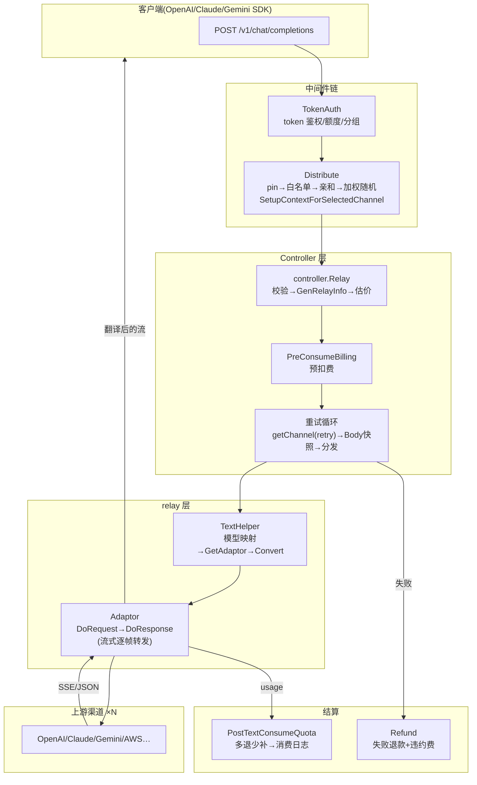
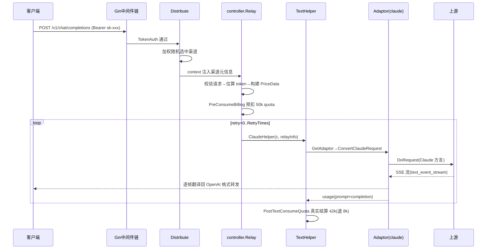

# 灵魂篇:一次聊天请求的完整旅程

> 一句话定位:本篇是整套文档的地图心脏——跟着一次 `POST /v1/chat/completions` 从 TCP 进入到结算落库走完全程,建立 new-api 的核心心智模型。读完本篇,你再看其他任何一篇都知道「它挂在旅程的哪一站」。

## 🎯 本篇你将学到

- new-api 作为 AI 网关的分层架构与四个「路由平面」
- 一次请求的完整生命周期:中间件链 → 鉴权 → 渠道分发 → 预扣费 → 重试循环 → 协议转换 → 上游调用 → 流式回传 → 结算落库
- 五个灵魂抽象:`RelayInfo`、`Adaptor`、`Channel`/`Ability`、`PriceData`/三段式计费、`RelayFormat`/`RelayMode`
- 三个关键取舍的作者视角复盘(内存快照选路、预扣费三段式、大接口适配器)

## 🧠 核心概念

**new-api 是什么?** 一个把 40+ 上游 AI 提供商(OpenAI、Claude、Gemini、Azure、AWS Bedrock、阿里、智谱……)聚合到统一 API 的网关。客户端用 OpenAI(或 Claude/Gemini)的协议打过来,网关负责:鉴权 → 选一条上游渠道 → 把请求**翻译**成该上游的方言 → 转发 → 把响应(包括 SSE 流)**翻译**回客户端的协议 → 按用量**扣费**。它 ≈ 一个「协议翻译 + 计量计费 + 负载均衡」三合一的反向代理,类似 Java 世界里 Spring Cloud Gateway 加上了按 token 计费的计费中心。

**分层**:`Router → Controller → Service → Model`(`AGENTS.md` 约定),旁路有两大领域包——`relay/`(中继执行)与 `relaykit/`(独立 Go 模块,协议转换)。对 Java 工程师:`Router` ≈ `@RequestMapping` 清单,`Controller` ≈ Controller 层,`Service` ≈ Service 层,`Model` ≈ Repository + Entity(GORM ≈ JPA/MyBatis-Plus)。

**两个正交维度**是读懂 `relay/` 的钥匙:

| 维度 | 含义 | 例子 | 定义处 |
|---|---|---|---|
| `RelayFormat` | 客户端说什么协议 | OpenAI / Claude / Gemini / OpenAIResponses | `types/` |
| `RelayMode` | 这次调用干什么 | chat / embedding / image / audio / rerank / task | `relay/constant/` |

同一个 `RelayMode`(chat)可以被任意 `RelayFormat`(客户端协议)表达,再被转换成任意上游渠道的方言。这构成一个「转换矩阵」,由 `relaykit` 模块实现(详见 04-relaykit-conversion.md)。

## 🔍 源码剖析

### 🗺️ 全景:进程启动与四个平面

`main.go:49` 的 `main()` 分两段:`InitResources()`(`main.go:296`)按依赖顺序初始化资源(环境变量 → 日志 → DB → casbin 授权 → 密码加密 → option 配置表 → 日志库 → Redis → i18n → OAuth),然后挂载后台任务群(配置热更新、看板聚合、定时渠道测试、任务轮询……)。HTTP 侧只做四件事:`gin.New()` + panic 恢复 + 全局中间件(`RequestId`/`Version`/`I18n`/日志)+ `router.SetRouter()`(`main.go:186-213`)。

`router.SetRouter` 划出四个平面:

- **relay 平面**(`/v1/*`、`/claude`、Gemini 原生路径等):面向程序客户端,挂 `TokenAuth + Distribute`,走 `controller.Relay`
- **dashboard 平面**(`/api/*`):面向管理台,挂 session/2FA 鉴权(详见 09-auth-user.md)
- **web 平面**:静态资源,前端构建产物由 `go:embed web/dist` 嵌进二进制(`main.go:43-47`)——**单二进制交付**,这是 Go 网关对 Java「fat jar」的直接回应
- **task/video/plugin 平面**:异步任务协议端点(详见 14-task-system.md、15-plugins.md)

### 🎬 第一幕:中间件链——鉴权与分发

请求进入 relay 平面后穿越(顺序即注册顺序,≈ Servlet Filter 链):

1. **`TokenAuth`**(`middleware/auth.go`):校验 `Authorization: Bearer sk-xxx`,查 token 的额度上限、模型白名单、分组,写入 `gin.Context`。`gin.Context.Set/Get` ≈ request attribute;但本项目强制走 `constant.ContextKey*` 常量键(`common/gin.go:157` 的 `SetContextKey`),杜绝裸字符串拼写错误。
2. **`Distribute()`**(`middleware/distributor.go:34`)——**渠道路由决策中枢**,逻辑按优先级:
   - **渠道 pin**:任务类请求(如视频 remix)锁死原渠道(`PinSourceOriginTask`),锁定的渠道连禁用状态都直接拒绝;
   - **token 模型白名单**:`ContextKeyTokenModelLimit` 不含请求模型 → 403(`distributor.go:82-100`);
   - **渠道亲和(affinity)**:同用户同模型近期用过的渠道优先复用(`distributor.go:127-158`),提升上游 prompt 缓存命中率;
   - **加权随机**:`service.CacheGetRandomSatisfiedChannel` 从内存快照选渠道(算法拆解见 08-channel-ability.md);
   - **`SetupContextForSelectedChannel`**(`distributor.go:594`):把渠道的 id/type/key/模型映射/参数覆盖/状态码映射等二十余项注入 context,其中 `channel.GetNextEnabledKey()` 完成**多 key 轮询**——一个渠道可以配几十个上游 key 轮着用。

注意:Distribute **只在中间件选一次渠道**,而真正失败重试时的换渠道发生在 Controller 层的重试循环里(下一幕)。两个地方共享同一套选择函数,只是重试参数不同。

### 🎬 第二幕:校验、估价与预扣费

`controller.Relay`(`controller/relay.go:73`)是 relay 平面的总入口,前半程是「下单前准备」:

```go
request, err := helper.GetAndValidateRequest(c, relayFormat) // 解析+校验客户端请求
relayInfo, err := relaycommon.GenRelayInfo(c, relayFormat, request, ws) // 请求级上下文
tokens, err := service.EstimateRequestToken(c, meta, relayInfo) // 估算 prompt token
priceData, err := helper.ModelPriceHelper(c, relayInfo, tokens, meta) // 构建价格数据
if priceData.FreeModel { /* 免费,跳过预扣 */ } else {
    newAPIError = service.PreConsumeBilling(c, priceData.QuotaToPreConsume, relayInfo) // 预扣费
}
```

(`controller/relay.go:114-173`,有删节)

**`RelayInfo`**(`relay/common/relay_info.go:84`)是全项目被引用最多的类型(700+ 处)——它把「这一次中继」需要的一切聚合在一个结构体:原始模型/计费模型/上游模型三个名字、渠道元信息、流式标记、估算 token、计费句柄 `Billing`……对 Java 工程师,它 ≈ 把 `RequestContextHolder` 里的散装 attribute 收敛成一个**强类型请求上下文 DTO**,随调用链显式传递而不是隐式取 thread-local——代价是几乎每个函数签名里都有它,收益是依赖可见、可测试。

**预扣费**:按「估算 prompt token + 客户端声明的 `max_tokens`」算出可能的最大花费,先从用户余额划走。没有它,用户可以拿 1 块钱并发 1000 个长请求白嫖——上游可是真金白银地计费(详见 06-billing-overview.md)。

### 🎬 第三幕:重试循环——new-api 的主循环

`controller/relay.go:196-246` 是整个系统的心脏,值得逐行看:

```go
for ; retryParam.GetRetry() <= common.RetryTimes; retryParam.IncreaseRetry() {
    relayInfo.RetryIndex = retryParam.GetRetry()
    channel, channelErr := getChannel(c, relayInfo, retryParam) // ① 按重试次数选渠道
    addUsedChannel(c, channel.Id)
    service.PrepareTieredBillingForSelectedGroup(c, relayInfo)  // ② 渠道分组影响计费
    bodyStorage, _ := common.GetBodyStorage(c)                  // ③ body 快照(重试可重放)
    c.Request.Body = io.NopCloser(bodyStorage)

    switch relayFormat {                                        // ④ 分发到格式 helper
    case types.RelayFormatClaude:  newAPIError = relay.ClaudeHelper(c, relayInfo)
    case types.RelayFormatGemini:  newAPIError = geminiRelayHandler(c, relayInfo)
    default:                       newAPIError = relayHandler(c, relayInfo) // 按 RelayMode 再分发
    }
    if newAPIError == nil { return }                            // 成功即返回
    processChannelError(...)                                    // ⑤ 记录渠道错误,可能自动禁用
    if !shouldRetry(c, newAPIError, common.RetryTimes-retryParam.GetRetry()) { break }
}
```

四个细节藏着设计功力:

- **① `getChannel` 带 `retry` 参数**:`model.GetChannel`(`model/ability.go:108`)把可用渠道按 `priority` 分档,第 N 次重试自动**降到第 N 高的档位**——优先用高质量贵渠道,失败再退化到便宜渠道,而不是无脑重试同档。
- **③ body 快照**:`c.Request.Body` 是一次性流,重试会二次消费。`common.GetBodyStorage` 把请求体读进可重放存储,每轮循环重新挂回 `c.Request.Body`——Go 版的「`ContentCachingRequestWrapper`」。
- **④ `relayHandler`**(`controller/relay.go:38`)按 `RelayMode` 分发到 `TextHelper`/`ImageHelper`/`AudioHelper`/`EmbeddingHelper`/`ResponsesHelper` 等;格式差异(Claude/Gemini 原生协议)则由更外层的 switch 处理。
- **⑤ 错误归一**:上游返回的五花八门的错误被 `types.NewAPIError` 统一,`processChannelError` 决定是否计入渠道失败、触发 `auto_ban` 自动禁用(详见 08-channel-ability.md)。

失败退出循环后,`defer` 链(`controller/relay.go:175-184`)退款:`relayInfo.Billing.Refund(c)` 把预扣未消费的配额还回去,若错误类型属于违规用法还会追缴违约费。

### 🎬 第四幕:TextHelper——一次中继的微观全景

以最常用的 `relay.TextHelper`(`relay/compatible_handler.go:25`)为例,单渠道内的一次尝试:

```go
info.InitChannelMeta(c)                          // 从 context 装载渠道元信息
request := common.DeepCopy(textReq)              // 深拷贝,防篡改原始请求
helper.ModelMappedHelper(c, info, request)       // 渠道级模型映射 gpt-4o → my-alias
adaptor := GetAdaptor(info.ApiType)              // 工厂:渠道类型 → 适配器
adaptor.Init(info)

// 三条出口之一:
// A. 渠道不支持 chat completions → 转 Responses 协议走 textRequestViaResponses
// B. PassThroughBody 渠道 → 原样透传客户端 body
// C. 常规:协议转换
convertedRequest, err := adaptor.ConvertOpenAIRequest(c, info, request) // 翻译成上游方言
jsonData, _ := common.Marshal(convertedRequest)
jsonData = relaycommon.RemoveDisabledFields(...) // 渠道配置的「禁发字段」
jsonData = relaycommon.ApplyParamOverrideWithRelayInfo(...) // 渠道级参数覆盖(JSON 补丁)
resp, err := adaptor.DoRequest(c, info, body)    // 真正发出 HTTP(含 header 组装/超时/代理)
info.IsStream = info.IsStream || strings.HasPrefix(resp.Header.Get("Content-Type"), "text/event-stream")
usage, err := adaptor.DoResponse(c, resp, info)  // 处理响应:流式逐帧转发 / 非流式整体回写
service.PostTextConsumeQuota(c, info, usage, nil) // 结算:按真实 usage 多退少补 + 写消费日志
```

(有删节;完整流程含系统提示注入、状态码映射 `ResetStatusCode` 等)

**`Adaptor`**(`relay/channel/adapter.go:17-34`)是 15 个方法的接口:`GetRequestURL`(拼上游端点)、`SetupRequestHeader`(认证头)、8 个 `ConvertXxxRequest`(按客户端协议选择转换入口,覆盖 OpenAI/Claude/Gemini/Responses/Embedding/Rerank/Image/Audio)、`DoRequest`(执行)、`DoResponse`(响应处理)、`GetModelList`/`GetChannelName`。40+ 渠道各实现一次,常见**嵌套委托**:AWS Bedrock 适配器内部 new 一个 `claude.Adaptor` 转发 `ConvertClaudeRequest` 和 `DoResponse`(`relay/channel/aws/adaptor.go:41-79`)——因为 Bedrock 说的就是 Claude 方言,只是传输层不同。这是 Go 里「组合优于继承」的教科书落地(≈ Java 里适配器内部持有被适配对象)。

流式响应在 `DoResponse` 内由 `OaiStreamHandler`(`relay/channel/openai/relay-openai.go:103`)处理:扫描 SSE 帧 → 逐帧转发客户端 → 提取 usage(三级兜底,见 05-streaming.md)→ 返回 `*dto.Usage`。

### 🎬 第五幕:结算与落库

`PostTextConsumeQuota` → `service.PostConsumeQuota`(`service/quota.go:419`):按真实 usage 重算配额,与预扣差额「多退少补」,更新用户/渠道的已用配额,写消费日志(带 `other.admin_info` 审计信息,非管理员视图自动剥离)。看板侧由内存聚合 + 定时落库支撑(详见 12-logging-dashboard.md)。至此,一次请求闭环。

## 📐 图解

**架构分层与请求旅程:**



**一次成功请求的时序(流式):**



## 🎓 设计精妙之处与可借鉴点

1. **「估算-预扣-结算」三段式计费**。流式响应完成前没人知道真实花费,项目用「最大可能花费预扣 + 真实用量结算 + 失败退款」把不确定性变成确定性。可借鉴:任何「先消费后知道价格」的计量系统(短信网关、云函数计费)都适用这个骨架。
2. **重试循环把「渠道降级」建模为优先级分档**,而不是平铺重试。`getChannel(c, relayInfo, retryParam)` 每多重试一次就降一档 priority,让「贵而稳」与「便宜而抖」的渠道自然分层。可借鉴:比「同节点重试 3 次」聪明得多,值得搬进任何多供应商 client。
3. **渠道元信息一次性注入 context,下游只读不查库**。`SetupContextForSelectedChannel`(`middleware/distributor.go:594`)集中装配,`TextHelper` 的 `InitChannelMeta` 一次装载——下游全部逻辑零 DB 查询。可借鉴:网关类系统的「路由决策点收敛」,决策只在中间件做一次,执行层纯函数化。
4. **嵌套委托的适配器复用**。Bedrock 复用 claude 适配器、阿里复用 openai 适配器(`relay/channel/ali/adaptor.go:245-269`)。协议方言是少数的,传输是多样的——把两者拆开,新增「换个传输」的渠道几乎零成本。

## ⚠️ 常见坑与注意事项

- **不要在 relay 执行路径里查 DB**。渠道信息、模型映射、倍率都来自 context/内存快照;每请求加一次 DB 查询,重试循环会放大成 N 倍。
- **流式判定有两层**:客户端声明 `stream:true` 不算数,`info.IsStream = info.IsStream || Content-Type 是 text/event-stream`(`relay/compatible_handler.go:200`)——上游可以把非流式请求降级成流式响应(或反之),以实际响应为准。
- **全局 gzip 中间件会杀死 SSE**(`main.go:200` 原注释)——压缩会缓冲整个流。想加压缩必须排除流式路径。
- **重试的每一步都可能产生计费副作用**:预扣按渠道分组重算(`PrepareTieredBillingForSelectedGroup` 在循环内),理解计费时必须意识到「同一请求可能按不同渠道分组计价」。
- **可选标量字段必须是指针 + `omitempty`**(AGENTS.md 硬规则):非指针 `omitempty` 会把显式传的 `0`/`false` 静默丢掉,上游语义就变了。

## 🏋️ 刻意练习:缺陷预演

> 先自己想 2 分钟,再看参考思路。

### 练习 1|body 快照与重试

- 🔴 **反模式预演**:如果第三幕的重试循环**不做** `GetBodyStorage` + `io.NopCloser(bodyStorage)` 重放,而是直接用 `c.Request.Body` 发起每轮请求,第一次失败后的重试会发生什么?客户端什么现象?日志里会看到什么?
- 🟡 **陷阱预判**:透传渠道(PassThroughBody)走的是同一份 body 存储。如果某人在透传分支直接 `c.Request.Body` 读完就交给上游,且恰好发生在重试第 2 轮,哪个环节先崩?
- 💡 **参考思路**:Go 的 `http.Request.Body` 是一次性 reader,第一次消费后重试只能发出空 body,上游返回 400,客户端看到「第一次 500、重试全 400」的诡异组合;正确做法就是把 body 读进可重放存储。陷阱在于空 body 的错误是「重试放大」出来的,表面看是上游问题,实则是网关状态管理问题。

### 练习 2|Distribute 与重试循环的职责分界

- 🔴 **反模式预演**:假设作者偷懒,把「选渠道」只留在 `Distribute` 中间件做一次,重试循环里不再换渠道。哪类故障模式会从「可自愈」变成「必失败」?反过来,如果把选渠道完全搬进 controller、删掉中间件里的选择,又会丢掉什么?
- 💡 **参考思路**:前者,单渠道故障时该请求的重试永远打在同一根杆上(同渠道多 key 只能救 key 级故障,救不了渠道级故障),高可用性消失;后者,丢失的是「未进入 controller 前的上下文装配」——中间件里 pin/亲和/白名单这些决策与 context 注入是绑定的,搬走会让所有非 relay 路由(task/video/plugin)失去统一选路。分界线的本质:**中间件做决策 + 装配,controller 做执行 + 重试**。

### 练习 3|`RelayInfo` 的三个模型名

- 🔴 **反模式预演**:`RelayInfo` 同时维护 `OriginModelName` / `BillingModelName` / `UpstreamModelName`(`relay/common/relay_info.go:770-794`)。如果为了「简单」合并成一个 model 字段,请推演这三个场景各坏在哪:①渠道配置了模型映射(gpt-4o→my-alias);②不同分组对同一模型有不同定价;③客户端日志要展示用户请求的原始模型名。
- 💡 **参考思路**:①上游要发 `my-alias` 但客户端要收到 `gpt-4o`;②计费身份与转发身份可以解耦(`GetBillingModelName` 的注释明确说「不改变客户端可见模型与上游模型」);③合并后永远拿不到原始名。三个名字对应三种身份:客户端身份/计费身份/转发身份,这是领域建模里「同名异义」的经典案例。

## 🎯 决策复盘:复现作者的取舍

### 决策 1|渠道路由:每请求查库 vs 内存快照(岔路口:选路的状态放哪里)

**场景**:渠道和模型能力(`Ability` = group×model×channel)是路由依据,请求路径上每条请求都要「按分组+模型选渠道」。放 DB 里实时查,还是整表加载进内存?

- 方案 A:每请求 `SELECT ... WHERE group=? AND model=? AND enabled=1 ORDER BY priority DESC, weight DESC`,加缓存击穿防护。
- 方案 B:`Ability` 全量加载进内存(`model.InitChannelCache`),定时(`SyncFrequency`)全量刷新,选择算法纯内存计算;渠道变更主动失效 + 定时兜底。
- 方案 C:Redis 存路由表,每请求一次 Redis 查询。

**你来权衡**:三种方案的延迟、一致性窗口、内存成本?什么规模/什么业务 SLA 下选择会反转?

- 💡 **参考思路**:① 作者选 **B**。换来的是选择路径零 IO(priority 分档 + 加权随机纯内存计算,`model/ability.go:108-164`),且重试降档、亲和校验(`IsChannelEnabledForGroupModel`)这些高频小查询全部免费;代价是**多节点最终一致窗口**(节点 B 禁用了渠道,节点 A 要等下一轮同步)与全量内存(渠道数万级才需要担心)。② Redis 版(C)把一致性窗口缩到秒级但每请求多一次网络 IO——对延迟敏感的 LLM 网关(LLM 请求动辄数十秒,网关本省应趋近零开销)不划算,这也是为什么项目开启 Redis 后**反而强制开启内存缓存**(`main.go:82-85`)。③ 反转条件:如果你的渠道规模大到全量加载不可行(数十万),或渠道状态变更必须秒级全局生效(比如风控熔断),就要向 A/C 妥协,或改成增量推送。

### 决策 2|计费:预扣三段式 vs 事后结算(岔路口:敢不敢让用户「先用后付」)

**场景**:流式响应结束前,网关只知道估算值。是先预扣再结算,还是响应完直接按 usage 扣?

- 方案 A:事后结算——响应完按真实 usage 一次性扣,余额不足就扣成负数或记欠费。
- 方案 B:预扣三段式——请求前按「估算 prompt + max_tokens 上限」预扣,结算时多退少补,失败全额退款(`controller/relay.go:166-184`)。
- 方案 C:混合——预扣一个较小的「最低保证」(如仅 prompt 部分),结算补尾款。

**你来权衡**:A 的透支风险敞口有多大?B 的用户体验与实现复杂度成本在哪?C 什么时候最优?

- 💡 **参考思路**:① 作者选 **B**。免费模型显式跳过预扣(`controller/relay.go:166`),其余一律先扣后结——因为上游计费是真金白银,A 的敞口 = 单用户最大 `max_tokens` × 并发数,恶意用户拿 1 元余额并发打满即可套利;B 把敞口压到「预扣到结算之间的增量」。② B 的代价:预扣按 `max_tokens` 上限算,真实输出通常远小,用户会看到「余额先降后回」的体感跳动,且结算/退款路径复杂化(差额结算、退款、违约费三个分支);C 能缓解体感但重新打开一小截透支敞口——项目选择不引入 C,宁可实现复杂也不留敞口。③ 反转条件:封闭内部企业(用户可信、无套利动机)或请求粒度极小、单价极低的场景,A 的简单性压倒一切;充值制对外运营则 B 几乎是唯一正解。

### 决策 3|适配器接口:14 方法大接口 vs 按格式拆小接口(岔路口:接口的粒度)

**场景**:每个上游渠道要支持 6 种客户端格式(chat/embedding/image/audio/rerank/responses)× 2 种传输(JSON/form/WSS)× 若干响应形态。接口怎么切?

- 方案 A:一个大接口 `Adaptor` 把所有 `ConvertXxxRequest` + `DoRequest` + `DoResponse` 打包(`relay/channel/adapter.go:17`),不支持的方法返回 `not implemented`。
- 方案 B:按能力拆小接口(`ChatConvertor`/`ImageConvertor`/`EmbeddingConvertor`……),渠道按需实现,调用方类型断言取能力。
- 方案 C:不定义统一接口,每种渠道一个独立 handler,switch 分发。

**你来权衡**:A 的「not implemented 方法」税收多少?B 的类型断言把错误移到运行时,值不值?C 在 40+ 渠道规模下会怎样?

- 💡 **参考思路**:① 作者选 **A**。换来的是**一个工厂函数走天下**(`GetAdaptor(info.ApiType)`,`relay/compatible_handler.go:70`),调用侧永远不需要知道渠道支持什么——不支持就在转换层报清晰的 4xx;40+ 实现类的「接口全览」也是文档:打开一个 adaptor.go 就知道这个渠道能干什么。② 代价:新渠道要写一堆 `return nil, errors.New("not implemented")` 占位(`relay/channel/aws/adaptor.go` 里散布 5 个:36/82/87/146/151 行的 Gemini/Audio/Image/Embedding/Responses 转换全部不支持),接口加方法要动 40+ 文件;B 把占位税换成了断言税和「能力矩阵不透明」。③ C 在渠道少时最直观,但 40+ 渠道 × 6 格式的 switch 组合会爆炸——作者在大接口上叠加了**嵌套委托**(Bedrock 复用 claude)来摊薄 A 的税。④ 反转条件:如果某类渠道能力极度单一(比如只做 embedding),或渠道数增长到上百,拆分小接口 + 能力注册表的收益会反超。

## 🔗 与其他模块的关系

- 中间件链细节与鉴权:02-routing-middleware.md、09-auth-user.md
- 渠道选择算法与自动禁用:08-channel-ability.md
- 协议转换矩阵:04-relaykit-conversion.md
- 流式处理细节:05-streaming.md
- 计费三段式的完整链路与防溢出:06-billing-overview.md、07-billingexpr.md
- 适配器实现与新增渠道:03-adaptor-system.md
- 启动与后台任务群:01-startup-lifecycle.md
- 异步任务(另一条入口路径):14-task-system.md

## 📚 小结

new-api 的主循环是「**决策收敛 → 预扣 → 降档重试 → 协议翻译 → 流式回传 → 结算**」:中间件把路由决策收敛成 context 里的渠道元信息,Controller 用带优先级降档的重试循环调度执行,Adaptor 层把 40+ 上游方言统一进 14 方法接口,计费层用三段式兜住资金安全。五个灵魂抽象(`RelayInfo`/`Adaptor`/`Channel`+`Ability`/`PriceData`/`RelayFormat`×`RelayMode`)各管一段,组合起来就是一张 AI 网关的标准蓝图——后面每一篇文档,都是把这张蓝图的某一块放大给你看。
