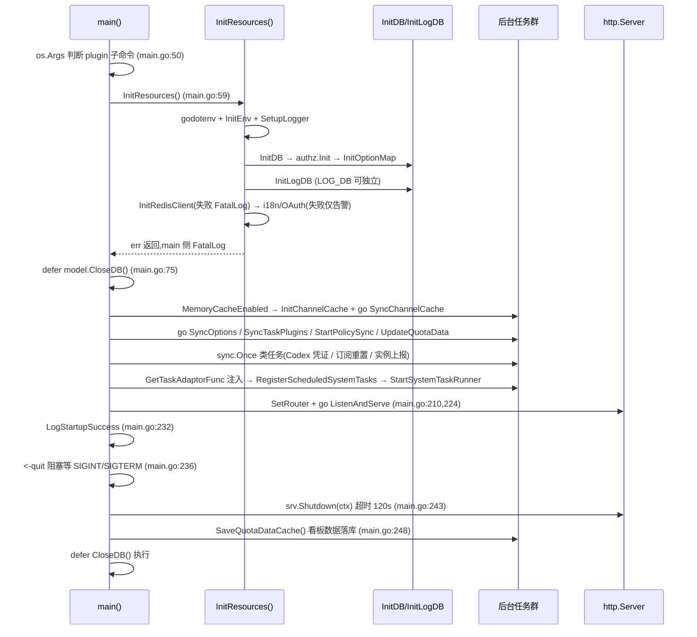

# 01 · 启动与生命周期:从 `main()` 到优雅关停

> 一句话定位:本篇拆解 new-api 进程「怎么起来的、依赖按什么顺序初始化、后台有哪些常驻任务、怎么体面地退出」。读完你应能独立画出启动时序,并能解释每一处初始化为什么放在那个位置。

## 🎯 本篇你将学到

- `main()` 的四大阶段:资源初始化 → 缓存与后台任务 → HTTP 服务 → 信号驱动的优雅关停
- `InitResources()` 的初始化次序,以及「哪些失败必须退出、哪些只告警」的分级逻辑
- 主节点(master)与从节点(slave)的分工:`IsMasterNode` 如何用一行环境变量解决迁移与调度去重
- 后台任务群的三种启动形态:裸 goroutine、`sync.Once` 包装、数据库租约调度
- `GetTaskAdaptorFunc` 工厂注入如何打破 `service → relay` 的 import 环
- 优雅关停为什么默认等 120 秒、为什么关停时还要落一次库

## 🧠 核心概念

🎓 先做一个总体类比:new-api 是 Go 单二进制,相当于一个自带内嵌前端的 Spring Boot fat-jar。区别在于,Spring Boot 有 `ApplicationContext` 替你按依赖关系排布 Bean 的创建顺序,而 **Go 没有 IoC 容器——初始化顺序全部显式写在 `main()` 里**,所以 `main.go` 就是这个项目的「`ApplicationContext` + 组装根(Composition Root)」。想理解这个系统,先读懂 `main()` 是最短路径。

几个关键机制的可类比映射:

- **`//go:embed`** ≈ 打进 jar 包的 `static/` 资源;前端构建产物在编译期被塞进二进制,部署时只有一个可执行文件。
- **`func init()`** ≈ Java 的静态初始化块,包被导入时执行,早于 `main()`。
- **`goroutine + for{sleep}` 循环** ≈ `@Scheduled` 单线程任务;但这里没有调度器框架,每个任务自己写死循环。
- **主节点判断** ≈ Quartz 集群模式 / ShedLock 的 `@SchedulerLock`:集群里只让一个实例执行迁移与调度,其他实例只对外提供 API。
- **周期轮询同步** ≈ 本地缓存的定时刷新(如 Guava `LoadingCache.refreshAfterWrite`),用「读库 + 整体替换」换取最终一致,省掉配置中心与消息总线。

## 🔍 源码剖析

### 一、`main()` 全景:四个阶段

`main.go:49-251` 是整个进程的骨架,去掉细节后只剩四步:

```go
func main() {
	// 0) 子命令分发:newapi plugin ... 走 js 插件 CLI,不启动网关 (main.go:50-52)
	err := InitResources()          // ① 全部资源初始化,失败即 FatalLog (main.go:59)
	defer func() { model.CloseDB() }() // ② 注册在 InitResources 之后 (main.go:75-80)
	// ... 缓存预热 + 一群 go func() 后台任务 (main.go:82-183)
	router.SetRouter(server, router.WebAssets{BuildFS: buildFS, IndexPage: indexPage}) // ③ 路由 (main.go:210)
	go srv.ListenAndServe()          // ③ HTTP 服务
	sig := <-quit                    // ④ 阻塞等 SIGINT/SIGTERM (main.go:234-236)
	srv.Shutdown(ctx)                // ④ 排空连接 (main.go:243)
	model.SaveQuotaDataCache()       // ④ 内存看板数据落库 (main.go:246-249)
}
```

一个有意思的细节:`main.go:50-52` 先判断 `os.Args[1] == "plugin"`,让同一个二进制兼任 JS 插件的命令行工具——类似 Spring Boot 应用的 `jar --xxx` 子命令模式。

### 二、`InitResources()`:次序即依赖,失败即分级

`main.go:296-386` 把初始化集中在一个函数里,顺序是**严格按依赖排列**的:

```
.env → InitEnv → SetupLogger → 比率配置/HTTP客户端/token编码器
    → InitDB → authz.Init → 密码加密 → CheckSetup
    → (master) 迁移废弃前端配置 → InitOptionMap
    → InitLogDB → InitRedisClient → 性能指标 → 系统监控
    → i18n → 自定义 OAuth → 认证产物清理
```

**为什么是这个顺序?** 逐条看依赖关系:

- `.env` 与 `InitEnv`(`common/init.go:32`)必须最先:`IsMasterNode`、`SyncFrequency`、`MemoryCacheEnabled` 等几乎所有后续判断都来自这里(`common/init.go:89` `IsMasterNode = os.Getenv("NODE_TYPE") != "slave"`,`common/init.go:112` `SyncFrequency` 默认 60 秒)。
- `logger.SetupLogger`(`logger/logger.go:42`)第二:它把 `gin.DefaultWriter` 换成「标准输出 + 日志文件」的 `MultiWriter`,之后的每条日志才落盘。初始化日志要先于一切会打日志的初始化。
- `InitTokenEncoders`(`main.go:316`)要在接流量前就绪:token 计数依赖编码器,而计费依赖计数。
- `InitDB` 严格先于 `InitOptionMap`:`InitOptionMap`(`model/option.go:32`)先写入代码内默认值,再由 `loadOptionsFromDatabase`(`model/option.go:201`)读 `options` 表覆盖——**数据库是配置的唯一事实源,所以必须等库就绪**。源码注释原话:`// Initialize options, should after model.InitDB()`(`main.go:337`)。
- `authz.Init(model.DB)`(`service/authz/enforcer.go:33`)在 `InitDB` 之后,因为它直接接收 `model.DB` 这个连接句柄给 Casbin 用。

**失败分级**是这个函数最值得学的地方,分三档:

| 档位 | 处理 | 例子 | 为什么 |
|---|---|---|---|
| 致命 | `common.FatalLog`(打印后 `os.Exit(1)`,见 `common/sys_log.go:31-37`) | `InitDB`、`authz.Init`、密码加密初始化(`main.go:319-333`) | 数据面/权限面起不来,网关存在无意义,fail-fast |
| 致命(函数内自行退出) | 直接 `FatalLog` | `InitRedisClient` 内部:连接串解析失败与 `Ping` 失败都会 `FatalLog`(`common/redis.go:37,47`) | 配置了 Redis 却连不上,宁可显式失败也不静默降级成单机缓存 |
| 降级 | `common.SysError` 后继续 | `i18n.Init`(`main.go:366-372`,注释写明 "Don't return error, i18n is not critical")、`oauth.LoadCustomProviders`(`main.go:377-381`)、`.env` 缺失(`main.go:299-304`) | 只影响展示层或可后补的功能,不应阻断 API 转发 |

🔑 这套分级本质上是在回答一个问题:**「这个依赖坏了,系统的核心职责(AI 请求转发与计费)还能不能履行?」** 能 → 降级;不能 → 退出。把它套到 Java 项目:数据库连接池初始化失败应当拒绝启动,而验证码服务挂了只该告警。

### 三、双库与主从:`IsMasterNode` 的三处把守

`model/main.go:187 InitDB` 有两个关键设计:

```go
sqlDB.SetMaxIdleConns(common.GetEnvOrDefault("SQL_MAX_IDLE_CONNS", 100))   // main.go:212-214
sqlDB.SetMaxOpenConns(common.GetEnvOrDefault("SQL_MAX_OPEN_CONNS", 1000))
// ...
if !common.IsMasterNode {
	return nil              // 从节点不执行迁移 (model/main.go:216-218)
}
err = migrateDB()           // 只有 master 跑 AutoMigrate
```

同样的把守出现在三处:`InitDB`(`model/main.go:216`)、`InitLogDB`(`model/main.go:260`)、`authz.Init` 里的内置角色/策略播种(`service/authz/enforcer.go:34-41`)。**为什么?** 多副本同时跑 `AutoMigrate` 会互相竞争表锁,可能产生重复索引或死锁;这是用「角色划分」替代分布式锁的典型做法。

日志库则是可选分离:`LOG_SQL_DSN` 未配置时,`LOG_DB = DB` 直接复用主库连接(`model/main.go:233`);配置了才单独打开——日志写入量大,分离后主库不受影响,甚至可以用 ClickHouse 当日志库(`model/main.go:144-151`,主库明确拒绝 ClickHouse)。

### 四、多节点一致性:轮询同步代替配置中心

从节点如何感知主节点上改的配置?答案朴素但有效:**每个节点自己周期性全量拉库**。

- `SyncOptions`(`model/option.go:211-217`):死循环,每 `SYNC_FREQUENCY` 秒重读 `options` 表并覆盖内存 `OptionMap`。
- `SyncChannelCache`(`model/channel_cache.go:109-115`):同样节奏重建渠道路由缓存。`InitChannelCache`(`model/channel_cache.go:27-107`)先构建全新的三层映射 `group → model → []channelId`(按优先级排序),最后在锁内一次性整体替换——读侧永远看到完整一致的快照,没有「改到一半」的中间态。
- `authz.StartPolicySync`(`service/authz/enforcer.go:84-94`):周期 `ReloadPolicy`,注释直接点明动机——权限变更只写库+刷本节点内存,「Without this loop other instances would keep serving stale permissions (including not honoring a revoked grant) until restart」。

⚠️ 一致性延迟上限就是 `SYNC_FREQUENCY`(默认 60 秒)。用一致性换架构简洁,是单二进制可私有化部署产品的合理取舍。

### 五、后台任务群盘点(`main.go:105-178`)

| 任务 | 启动方式 | 周期 | 节点 | 职责 |
|---|---|---|---|---|
| `SyncChannelCache` | 裸 `go`(`main.go:105`) | `SYNC_FREQUENCY` | 全部 | 渠道路由缓存重建 |
| `SyncOptions` | 裸 `go`(`main.go:113`) | `SYNC_FREQUENCY` | 全部 | 配置热更新 |
| `SyncTaskPlugins` | 裸 `go`(`main.go:114`、`controller/task_plugin.go:756-761`) | 30 秒 | 全部 | 从库同步并重编译 JS 插件 |
| `StartPolicySync` | 裸 `go`(`main.go:117`) | `SYNC_FREQUENCY` | 全部 | Casbin 策略重载 |
| `UpdateQuotaData` | 裸 `go`(`main.go:120`、`model/usedata.go:41-49`) | `DataExportInterval` 分钟 | 全部 | 看板聚合数据落库 |
| `AutomaticallyUpdateChannels` | 裸 `go`,需 `CHANNEL_UPDATE_FREQUENCY`(`main.go:122-128`) | 配置分钟数 | 全部 | 轮询上游余额 |
| `StartCodexCredentialAutoRefreshTask` | `sync.Once` + `gopool`(`main.go:131`、`service/codex_credential_refresh_task.go:35-53`) | 10 分钟 | 仅 master | OAuth 凭证临期(24 小时内)自动刷新 |
| `StartSubscriptionQuotaResetTask` | `sync.Once` + `gopool`(`main.go:134`、`service/subscription_reset_task.go:29-45`) | 1 分钟 | 仅 master | 订阅配额日/周/月重置与过期 |
| `StartSystemInstanceReporter` | `sync.Once` + `gopool`(`main.go:138`、`service/system_instance.go:65-77`) | 30 秒 | **全部节点** | 心跳上报存活实例(注意:无 master 判断,否则系统信息页就看不到从节点了) |
| 系统任务框架 | `RegisterScheduledSystemTasks` + `StartSystemTaskRunner`(`main.go:156-157`) | 见下 | 仅 master | 渠道测试/模型更新/异步任务轮询 |
| `InitBatchUpdater` | 需 `BATCH_UPDATE_ENABLED=true`(`main.go:159-163`) | — | 全部 | 配额等高频写批量合并 |

两种形态的差异值得注意:裸 `go` 没有防重入与去重(靠任务自身幂等);`sync.Once` 包装保证了重复调用安全,并且显式判断 `common.IsMasterNode`(`service/subscription_reset_task.go:31-33`)。而最复杂的一类,交给了一个专门的调度框架。

### 六、系统任务框架:用数据库租约替代分布式锁

`service/system_task.go` 定义了两个接口:`SystemTaskHandler`(`:34-37`,提供 `Type()` 与 `Run()`)和 `ScheduledSystemTaskHandler`(`:42-47`,额外提供 `Enabled()`、`Interval()`、`NewPayload()`)。注册进一个 map(`RegisterSystemTaskHandler`,`:57-64`),`service/system_task.go:86-88` 的 `init()` 就已注册了日志清理 handler——这正对应 Java 里「框架回调接口 + 注册表」的常见模式。

运行机制分三步:

1. **排程**:`runSystemTaskScheduler`(`:263-303`)对每个启用的定时 handler 检查「上次运行距今是否超过 `Interval()` 且无活跃任务行」,满足就 `CreateSystemTask` 插一行待办任务。唯一索引保证并发创建去重。
2. **抢占**:`runSystemTaskClaimPass`(`:225-257`)对每类任务取最早的 pending 行,`model.ClaimSystemTask` 做条件更新抢锁——多实例只有一个能抢到。
3. **续租**:抢到的任务在独立 goroutine 里执行,外层 `runWithLeaseHeartbeat`(`:308-336`)以 `TTL/3` 的节奏刷新租约,租约丢失即通过 `context` 取消执行。

`StartSystemTaskRunner`(`:123-166`)用 `sync.Once` 保证只启动一次,非 master 直接 `return`(`:125-127`)。当前注册了四个定时任务(`controller/system_task_handlers.go:20-25`):

| Handler | 启用条件 | 间隔 |
|---|---|---|
| `channelTestHandler` | 监控设置 `AutoTestChannelEnabled` | 默认 10 分钟(`:34-44`) |
| `modelUpdateHandler` | `CHANNEL_UPSTREAM_MODEL_UPDATE_TASK_ENABLED`,默认 true | 环境变量可配分钟数(`:77-90`) |
| `midjourneyPollHandler` | `UpdateTask` 且存在未完成 Midjourney 任务 | 15 秒(`:122-126`) |
| `asyncTaskPollHandler` | `UpdateTask` 且存在未完成异步任务 | 15 秒(`:142-146`) |

✨ 后两个的 `Enabled()` 把「有没有活儿」折叠进启用判断:系统空闲时**连任务行都不创建**,避免每 15 秒产生一条空跑记录。每次执行都是一条可查历史、有进度、有结果的 `SystemTask` 行——这就是「把调度状态外置到数据库」的红利:重启不丢、跨节点去重、管理后台可见(详见 14-task-system.md)。

### 七、`GetTaskAdaptorFunc`:main 作为组装根打破 import 环

Go 的包间禁止循环导入,而异步任务轮询遇到了一个真实的环:轮询逻辑在 `service` 包,但它需要调用各平台的适配器,适配器在 `relay` 包;而 `relay` 的实现又反过来依赖 `service`(结算、退款)。解法是把依赖方向反转,由 `main` 注入:

```go
// service/task_polling.go:26-65(节选)
// TaskPollingAdaptor 定义轮询所需的最小适配器接口,避免 service -> relay 的循环依赖
type TaskPollingAdaptor interface {
	FetchTask(...) (*http.Response, error)
	ParseTaskResult(...) (*relaycommon.TaskInfo, error)
	AdjustBillingOnComplete(task *model.Task, taskResult *relaycommon.TaskInfo) int
}

// GetTaskAdaptorFunc 由 main 包注入,用于获取指定平台的任务适配器。
// 打破 service -> relay -> relay/channel -> service 的循环依赖。
var GetTaskAdaptorFunc func(platform constant.TaskPlatform) TaskPollingAdaptor
```

```go
// main.go:143-149
service.GetTaskAdaptorFunc = func(platform constant.TaskPlatform) service.TaskPollingAdaptor {
	a := relay.GetTaskAdaptor(platform)   // relay/relay_adaptor.go:188
	if a == nil { return nil }
	return a
}
```

这就是 Java 开发者熟悉的**构造器注入 / `ObjectProvider` 的手工版**:`service` 只定义接口,实现的选择权交给组装根。源码注释特别强调注入必须发生在 `StartSystemTaskRunner` 之前(`main.go:140-142`),否则 `async_task_poll` 一执行就会拿到 `nil`——启动顺序与运行时正确性的耦合点,值得在代码评审里盯住。

### 八、优雅关停:先排空连接,再落库兜底

```go
quit := make(chan os.Signal, 1)
signal.Notify(quit, syscall.SIGINT, syscall.SIGTERM)   // main.go:234-235
sig := <-quit

// SSE streams may run for minutes; give them time to finish before forced exit
shutdownTimeout := time.Duration(common.GetEnvOrDefault("SHUTDOWN_TIMEOUT_SECONDS", 120)) * time.Second
ctx, cancel := context.WithTimeout(context.Background(), shutdownTimeout)  // main.go:240-242
srv.Shutdown(ctx)                                      // main.go:243
if common.DataExportEnabled {
	model.SaveQuotaDataCache()                         // main.go:246-249 (issue #5679)
}
```

两个设计考量:

**为什么默认 120 秒?** AI 网关与普通 Web 服务最大的不同是连接存活时间:一次流式对话(服务器发送事件,SSE)动辄数分钟。`http.Server.Shutdown` 的语义是「停止接收新连接,等待存量连接处理完」,超时参数就是给这些长连接的宽限窗口。普通 API 项目给 30 秒足够,这里必须给到分钟级。与之一致的是 `main.go:200-201` 那行醒目注释:`// This will cause SSE not to work!!!`——全局 gzip 中间件被注释掉,因为 gzip 需要缓冲完整响应块,会破坏流式输出。

**为什么关停时还要 `SaveQuotaDataCache()`?** 看板数据走「内存聚合 + 定时落库」:`LogQuotaData`(`model/usedata.go:78-98`)在每次计费时只把数据累加进进程内的 `CacheQuotaData` map,`UpdateQuotaData` 每 `DataExportInterval` 分钟才写一次库。若不做关停兜底,重启会丢掉最多一个周期(默认 5 分钟)的看板数据——这正是 issue #5679 修复的问题。兜底函数本身(`model/usedata.go:100-125`)是「先查再决定插入或增量更新」,增量用 `gorm.Expr("count + ?")` 在数据库侧完成,规避读改写竞态。

最后 `defer model.CloseDB()`(`main.go:75-80`)执行:若配置了独立日志库,先关 `LOG_DB` 再关 `DB`(`model/main.go:716-724`)。

### 九、`go:embed` 与分析脚本注入

```go
//go:embed web/dist
var buildFS embed.FS               // main.go:43-44

//go:embed web/dist/index.html
var indexPage []byte               // main.go:46-47
```

前端构建产物在**编译期**进入二进制。运行时 `InjectUmamiAnalytics()`(`main.go:253-271`)与 `InjectGoogleAnalytics()`(`main.go:273-294`)在启动早期对 `indexPage` 做占位符替换:读 `UMAMI_WEBSITE_ID` 等环境变量拼出 `<script>` 标签,然后 `bytes.ReplaceAll(indexPage, []byte("<!--umami-->\n"), analyticsInject)`(若环境变量未配置则只注入一行 HTML 注释占位)。替换后的 `indexPage` 随 `router.WebAssets{BuildFS, IndexPage}`(`router/web-router.go:17-20`)传入 `router.SetRouter`(`router/main.go:15`),由前端路由用 `EmbedFolder` 挂载,并**只在这个静态资源路由上**启用 gzip(`router/web-router.go` 中 `SetWebRouter` 内的 `gzip.Gzip`)——API 路由全程无 gzip,保住 SSE。

## 📐 图解

**图一:进程启动与关停时序**(函数名均来自 `main.go`)



**图二:多 master 部署下的系统任务租约调度**

```mermaid
flowchart TB
    subgraph NodeA["master 节点 A(StartSystemTaskRunner,main.go:157)"]
        S1["runSystemTaskScheduler<br/>按 Interval 创建任务行<br/>(system_task.go:263)"]
        C1["runSystemTaskClaimPass<br/>ClaimSystemTask 条件更新抢锁<br/>(system_task.go:225)"]
        H1["goroutine: handler.Run<br/>+ runWithLeaseHeartbeat TTL/3 续租<br/>(system_task.go:308)"]
    end
    subgraph NodeB["master 节点 B(同样逻辑)"]
        S2["runSystemTaskScheduler"]
        C2["runSystemTaskClaimPass"]
        H2["goroutine: 执行或抢不到直接跳过"]
    end
    DBT[("system_task 表<br/>status=pending/running/succeeded/failed<br/>active_key 唯一索引去重 + per-type 租约锁")]

    S1 -->|CreateSystemTask| DBT
    S2 -->|CreateSystemTask(唯一索引拦截重复)| DBT
    C1 -->|抢到 pending 行| DBT
    C2 -->|已被 A 抢走,claimed=false| DBT
    C1 --> H1
    C2 -.->|跳过| S2
    H1 -->|RenewSystemTaskLock 周期续租| DBT
    H1 -->|FinishSystemTask 终态| DBT
```

## 🎓 设计精妙之处与可借鉴点

**1. `main()` 即组装根,初始化顺序即架构文档。**
为什么这么设计:Go 没有 IoC 容器,依赖关系只能靠显式排列表达;new-api 把所有初始化集中在 `InitResources()`,每个「谁必须在谁之前」都有据可查(如 `InitOptionMap` 依赖 `InitDB`)。
可借鉴:即使在做 Spring 项目,也建议把「启动必须成功的资源清单」收敛到一个配置类或启动检查器(`ApplicationRunner`)里,并按依赖顺序写清注释——分散在各处的 `@PostConstruct` 是排查启动问题时的噩梦。

**2. 失败分级:核心 fail-fast,外围降级。**
为什么:数据库、鉴权坏 → 系统核心职责无法履行,必须退出;国际化、自定义 OAuth 坏 → 降级仍可服务。
可借鉴:给每个外部依赖标注「致命 / 可降级」等级,致命依赖用健康检查在启动期显式失败,可降级依赖用熔断 + 告警兜底。

**3. 用「角色 + 轮询」替代分布式协调组件。**
为什么:私有化部署场景往往只有 MySQL 可用,引入 etcd 或独立调度器会抬高部署门槛。master 只做迁移与调度、全员轮询拉配置,把分布式问题压回数据库的原子性。
可借鉴:Quartz 集群模式、ShedLock、或数据库乐观锁版本号,本质都是这个思路——**能用单条 SQL 原子性解决的协调问题,就不要引入新组件**。

**4. 数据库租约 + 心跳续租的调度框架。**
为什么:`TTL/3` 续租把「崩溃检测」与「任务时限」解耦——长任务不会被超时误杀,崩溃后其他节点在 TTL 到期后接管;任务行留痕让执行历史可审计。
可借鉴:自研定时任务时,「任务行 + 条件更新抢占 + 租约续期」是一个 50 行代码就能落地的方案,比「每台机器都跑一遍再靠幂等兜底」可控得多。

**5. 接口下沉 + main 注入,解 Go 的 import 环。**
为什么:`service` 依赖 `relay` 的实现、`relay` 又依赖 `service` 的结算,环无法在包级别打破,只能在**依赖图的顶端**(`main`)完成绑定。
可借鉴:Spring 项目里这一步由容器代劳,但同样的手法适用于任何手工装配的场景;更重要的是「由调用方定义最小接口」(此处 `TaskPollingAdaptor` 只含 4 个方法,远小于完整适配器接口)是值得遵守的依赖倒置实践。

**6. 关停路径上的数据兜底。**
为什么:内存聚合 + 批量落库的性能收益,必须用一个「退出前 flush」来对冲,否则重启一次丢一窗数据(issue #5679)。
可借鉴:任何「内存攒批」结构(如本地计数器、批量写缓冲)都应配套三个钩子:定时 flush、容量阈值 flush、关停钩子(`@PreDestroy` / `DisposableBean`)。

## ⚠️ 常见坑与注意事项

- **`FatalLog` 会跳过 `defer`**:`common/sys_log.go:31-37` 打印后直接 `os.Exit(1)`,`main.go:75-80` 注册的 `model.CloseDB()` 不会执行。另外 `InitDB` 内部失败路径先 `FatalLog` 再 `return err`(`model/main.go:226-228`),那个 `return` 实际是死代码——不要指望靠它做清理。
- **从节点不迁移,升级顺序有讲究**:`NODE_TYPE=slave` 的实例跳过 `migrateDB()`(`model/main.go:216-218`)。滚动升级时应先重启默认角色(master)完成迁移,再升级从节点,否则从节点可能以旧 schema 视角读新表。
- **配置生效有延迟**:任何在管理后台改的配置,其他节点最迟 `SYNC_FREQUENCY` 秒(默认 60)后生效;对生效时间敏感的逻辑不要依赖内存配置的即时性。
- **Redis 是硬依赖**:一旦配置了 `REDIS_CONN_STRING`,`Ping` 失败直接 `FatalLog`(`common/redis.go:47`),不会降级运行。
- **租约 TTL 不是任务时限**:`runWithLeaseHeartbeat` 的注释明确写道「The TTL is a crash-detection window, not a task time limit」(`service/system_task.go:305-307`)。任务本身多长都行,只要心跳能续上;反过来,若把进程挂起到失联超过 TTL,任务会被别的节点接管,需要 handler 正确处理 `ctx` 取消。
- **锁顺序约束**:`InitChannelCache` 必须在释放 `channelSyncLock` 之后再调用 `InvalidatePricingCache`,源码注释(`model/channel_cache.go:100-103`)点明反序会死锁——改造缓存相关代码时先读这段注释。
- **勿开全局 gzip**:会直接破坏 SSE(`main.go:200-201`);需要压缩只加在前端静态资源路由上。
- **32 位钱包旧库拒绝启动**:`ensureUserQuotaColumns` 在启动期检查 `users` 表额度列类型,非 64 位整型直接报错退出(`model/main.go:277-304`),须显式迁移或用 `SKIP_64BIT_QUOTA_SCHEMA_CHECK` 跳过( AGENTS.md 中「三库兼容」约束的一个实例)。
- **`SHUTDOWN_TIMEOUT_SECONDS` 过短会掐断流式请求**:SSE 一旦分钟级,设成 10 秒意味着每次发版都造成大量客户端流中断;反之过长会拖慢发布,需按真实流量分布权衡。

## 🏋️ 刻意练习:缺陷预演

> 先自己想 2 分钟,再看参考思路。

### 练习 1|路由缓存快照:整体替换对比原地更新

- 🔴 **反模式预演**:现在 `InitChannelCache` 把慢活(两次全表扫描)放在锁外(`model/channel_cache.go:36`、`model/channel_cache.go:46`),锁内只做三次整体赋值(`model/channel_cache.go:81-99`)。有人嫌整表拷贝浪费内存,改成**原地逐条更新** `group2model2channels`,于是只剩两个选择:持写锁搬完 3 秒,或者干脆不持锁裸改。请分别推演这两种结局下,读侧(`model/channel_cache.go:128-129` 的 RLock)各会经历什么,监控曲线上各是什么形状?
- 🟡 **陷阱预判**:同文件的 `CacheUpdateChannelStatus`(`model/channel_cache.go:251-274`)就是持写锁原地改的。同样是改缓存,为什么它不会暴露中间态,而重建循环一定会?
- 💡 **参考思路**:持锁搬,所有读请求在 RLock 上排队 3 秒,吞吐归零、goroutine 堆积成雪崩;裸改,读者读到「候选列表已清空、渠道字典还没填」的中间态,`Distribute` 对着空候选直接 503,故障波形是**每 60 秒一次、精确对齐同步周期**的全站尖刺,极难联想到缓存重建。本质是临界区最小化:构建成本在锁外付,发布成本压到指针赋值级;`CacheUpdateChannelStatus` 只改一个字段、一次锁内完成,读者只会看到改前或改后,不存在第三种状态。

### 练习 2|`GetTaskAdaptorFunc` 注入缺失:一场无报错的资损

- 🔴 **反模式预演**:`main.go:140-142` 的注释警告注入必须先于 `StartSystemTaskRunner` 执行。假设一次重构把这段赋值挪到了 `StartSystemTaskRunner()` 之后、甚至删掉了,而 `service/task_polling.go:136-138` 的判空兜底还在。进程会崩吗?日志会报错吗?用户提交的视频任务和它预扣掉的配额,最终各是什么下场?(提示:超时清扫 `sweepTimedOutTasks` 只在 `service/task_polling.go:144` 被 `RunTaskPollingOnce` 调用,而且排在判空之后。)
- 🟡 **陷阱预判**:有人提议「别在 `main` 里赋值了,让 `service` 直接 import `relay`,或者加个 `init()` 自注册」。这条路卡在哪一层?为什么这个环只能在 `main` 打破?
- 💡 **参考思路**:什么都不崩——`async_task_poll` 系统任务每 15 秒照常建行、照常抢占、照常以「成功」终态收尾(`controller/system_task_handlers.go:150-152`),只是 `RunTaskPollingOnce` 进门就返回空结果;于是真正的 `model.Task` 永远停在未完成,连超时兜底也被同一个判空挡住,**预扣配额无限期冻结,且任务历史一片绿色**。`relay` 的实现反向依赖 `service` 的结算,而 Go 禁止循环导入,所以这个绑定只能上移到依赖图顶端的组装根——这正是「注入顺序是启动期契约、必须在代码评审里盯住」的原因。

### 练习 3|优雅关停:`Shutdown` 超时的真实语义

- 🔴 **反模式预演**:运维嫌发版慢,把 `SHUTDOWN_TIMEOUT_SECONDS` 调成 10(`main.go:240`)。一次流式对话进行到第 3 分钟,`srv.Shutdown(ctx)` 超时返回。请顺着 `main.go:243-250` 推演:main 接下来做什么?那个还在向客户端转发流的 goroutine,以及它后面还没执行的结算、落库收尾,还有机会跑完吗?客户端看到的是什么?
- 🟡 **陷阱预判**:同一套机制搬进 Kubernetes 会再坏一次——`terminationGracePeriodSeconds` 默认 30 秒,小于 120 秒的排空窗口。SIGTERM 之后 30 秒到来的是什么信号?排在 `srv.Shutdown` **之后**的 `SaveQuotaDataCache()`(`main.go:247-249`)还有机会执行吗?issue #5679 修掉的「重启丢看板数据」是否原样复发?
- 💡 **参考思路**:`Shutdown` 超时只是「放弃等待」,main 打一条 `SysError` 就继续往下走、正常退出,遗留 goroutine 被进程退出硬杀,收尾代码一行不再执行,客户端的流被拦腰截断;SIGKILL 更彻底,连 `defer model.CloseDB()`(`main.go:75-80`)都蒸发。兜底落库排在排空之后,意味着「排空被外部掐断」会连带废掉兜底——把落库提前到 `Shutdown` 之前独立执行、并把容器宽限期调到大于排空窗口,兜底才真正兜得住。

## 🔗 与其他模块的关系

- 启动期建立的缓存与轮询机制,详见 08-channel-ability.md(渠道与能力表)、10-cache-system.md(缓存体系)、13-settings.md(动态配置体系)。
- `RegisterScheduledSystemTasks` 注册的异步任务轮询与 `SystemTask` 表,详见 14-task-system.md。
- `GetTaskAdaptorFunc` 所指向的适配器体系,详见 03-adaptor-system.md;其转换依赖的独立模块见 04-relaykit-conversion.md。
- `InitLogDB` 的双库设计与三库兼容约束,详见 11-gorm-compat.md。
- `UpdateQuotaData`/`SaveQuotaDataCache` 聚合的数据如何被消费,详见 12-logging-dashboard.md。
- 初始化中 `InitOptionMap` 覆盖的费率体系,详见 06-billing-overview.md 与 07-billingexpr.md。
- `main()` 里挂载的中间件链(`RequestId`/`I18n` 等)的执行细节,详见 02-routing-middleware.md。

## 📚 小结

new-api 的启动生命周期可以浓缩成四句话:**初始化按依赖排列、失败按重要程度分级**;**主从分工用一行环境变量解决迁移与调度的去重**;**多节点一致性靠周期轮询换架构简洁**;**关停先排空长连接、再把内存里的钱和账落进数据库**。对 Java 学习者来说,这里没有魔法框架——没有 Spring,意味着每一个 `@Scheduled`、`@PostConstruct`、`@PreDestroy`、`ObjectProvider` 都被还原成了裸代码,反而更容易看清这些框架机制究竟在替你做什么。下一篇 02-routing-middleware.md 将进入 HTTP 请求的入口:路由表与中间件链。
