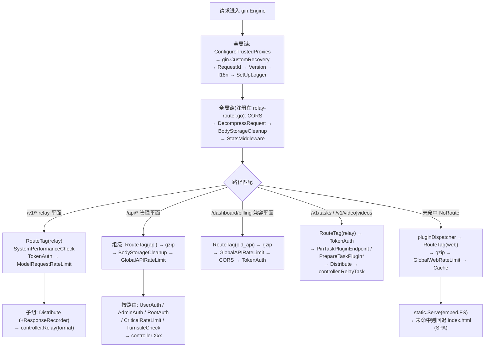
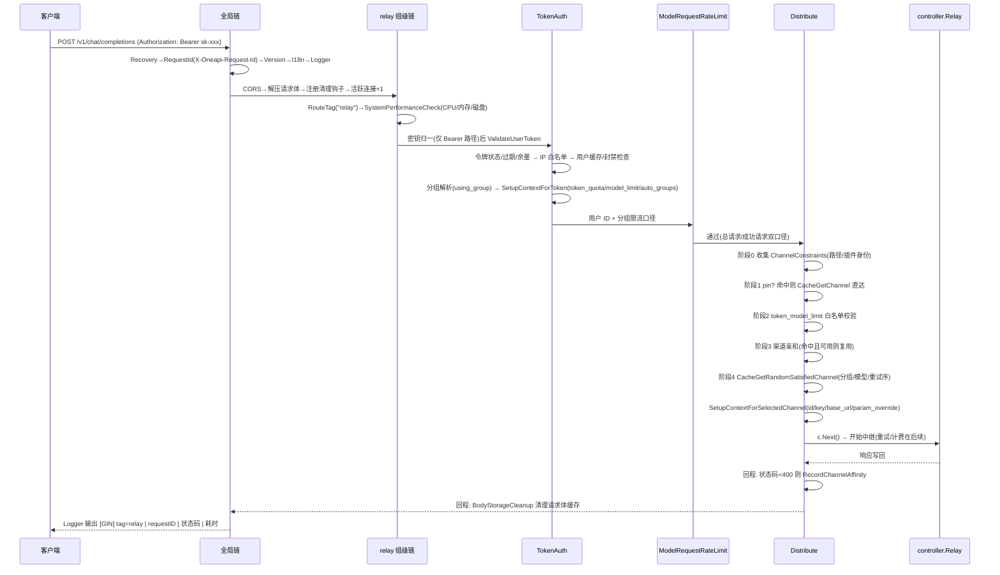

# 02 路由平面与中间件链：一次请求的「安检通道」

> 一句话定位：本篇拆解 new-api 把「协议代理端点」与「管理后台」装进同一个 Gin 进程的多路由平面设计，讲清全局中间件与各路由组中间件的组装顺序，并沿着一条 `POST /v1/chat/completions` 请求走完从进入到 `controller.Relay` 的完整中间件穿越路径。读完你应能自己画出这张请求穿越图，并知道每一层在做什么、为什么排在那个位置。

## 🎯 本篇你将学到

- 🔎 四类路由平面（relay 协议端点、dashboard/api 管理接口、web 静态资源、task/video/plugin 专属路由）各自挂了哪些中间件、为什么这么分。
- 🔎 Gin 中间件与 Java 过滤器链的对应关系，以及「引擎级（全局）」与「组级」中间件的本质区别——一个容易踩的大坑。
- 🔎 `TokenAuth` 如何把 WebSocket、Anthropic `x-api-key`、Gemini `?key=`、Midjourney `mj-api-secret` 等异构密钥归一成一条 `sk-xxx` 鉴权路径，并把令牌的分组 / 模型限制 / 额度写进 context。
- 🔎 `Distribute()` 中间件的五阶段选路逻辑：约束收集 → pin 定向 → 令牌模型限制 → 渠道亲和 → 随机负载均衡。
- 🔎 管理面 session/JWT 鉴权与 API 令牌鉴权的双轨设计（深入见 09-auth-user.md）。
- 🔎 固定窗口限流的 Redis/内存双实现，以及可信代理（trusted proxy）配置对 `c.ClientIP()` 的影响。

## 🧠 核心概念

**🌉 Gin ≈ Spring MVC。** `gin.Engine` ≈ `DispatcherServlet`，路由注册 ≈ `@RequestMapping`。但 Gin 的中间件模型更接近 Servlet 过滤器（Filter）而非 Spring 拦截器（HandlerInterceptor）：中间件就是普通函数，通过显式调用 `c.Next()` 进入链条的下一环，`c.Next()` 返回后的代码相当于响应阶段的「回程」逻辑——完全等价于 Java 里 `chain.doFilter(request, response)` 前后的两段代码。`c.Abort()` 则相当于「不再往下调用过滤器链」，请求就此终结。

**🚪 为什么要分平面？** new-api 一个进程同时服务两类性质完全不同的流量：一是面向开发者客户端的**协议代理端点**（`/v1/*`、`/v1beta/*` 等，鉴权用 `sk-xxx` 令牌，响应多为长连接 SSE，错误格式必须是 OpenAI/Claude 风格的 `error` 对象）；二是面向浏览器的**管理后台**（`/api/*`，鉴权用登录 session/JWT，响应是 `{success, message, data}` 格式）。两者的鉴权方式、错误格式、限流策略、缓存策略都不一样。把它们拆成不同路由组、各自挂不同中间件链，就像 Java 项目里把 `/**/api/**` 和 `/**/admin/**` 分别配一组 `Filter`——否则每条路由的处理器都得自己判断「我该用哪种鉴权」。

**🏷️ 引擎级 vs 组级。** `engine.Use()` 是全局的，作用于**所有**请求，≈ 在 `web.xml` 里对 `/*` 注册的 Filter；`group.Use()` 只作用于该组前缀下的路由，≈ Spring Security 里 `antMatchers("/v1/**").addFilterBefore(...)` 的按路径装配。⚠️ 关键陷阱：在 Gin 中，**`router.Use()` 写在哪个文件里不重要，只要传的是引擎本身，它就是全局的**——本项目中 relay 平面就是这么干的，后面细说。

## 🔍 源码剖析

### 1️⃣ 引擎装配：main.go 的全局中间件底座

`main.go:186-213` 完成了引擎初始化，顺序非常讲究：

```go
server := gin.New()                                        // 不用默认引擎，自己攒中间件
if err := middleware.ConfigureTrustedProxies(server); ...  // 先定「客户端 IP 怎么算」
server.Use(gin.CustomRecovery(...))                        // panic 兜底 → 500 + error JSON
// server.Use(gzip.Gzip(...))  ← main.go:200 赫然写着:
// "This will cause SSE not to work!!!"  全局 gzip 会破坏 SSE 流式输出
server.Use(middleware.RequestId())                         // 生成 X-Oneapi-Request-Id
server.Use(middleware.Version())                           // 写 X-New-Api-Version 响应头
server.Use(middleware.I18n())                              // 语言探测
middleware.SetUpLogger(server)                             // 访问日志（带路由标签）
```

几个值得注意的细节：

- **可信代理最先配置**（`middleware/trusted_proxies.go:11-20`）：它读取 `TRUSTED_PROXIES` 环境变量并调用 `engine.SetTrustedProxies`。后续所有 `c.ClientIP()` 的取值都取决于这一步——等于在整条链的最上游决定了「客户端是谁」。默认值在 `common/trusted_proxies.go:11-18`：回环地址 + RFC1918 私网 + IPv6 ULA；设为 `none` 则完全不信任代理头。
- **`RequestId()`**（`middleware/request-id.go:10-19`）一次性做了三件事：写入 gin context（`c.Set`）、写入 `request.Context()`（≈ Java 里把 traceId 放进 `RequestContextHolder` / MDC）、写入响应头 `X-Oneapi-Request-Id`（`common/constants.go:188`）。三处都写是因为下游有人从 gin context 取，有人（如插件引擎）从标准 `context.Context` 取。
- **日志自带路由标签**（`middleware/logger.go:19-41`）：`SetUpLogger` 用自定义 formatter 输出 `[GIN] 时间 | tag | requestID | 状态码 | 耗时 | IP | 方法 路径`，其中 `tag` 来自 `RouteTag` 中间件写入的 `route_tag` 键，缺省为 `web`。这就是 MDC + 访问日志的组合拳。

### 2️⃣ 七个装配入口：SetRouter 总览

`router/main.go:15-40` 是所有平面的装配总入口：

```go
func SetRouter(router *gin.Engine, assets WebAssets) {
    SetApiRouter(router)            // /api/*        管理后台接口
    SetDashboardRouter(router)      // /dashboard/billing 等 兼容 OpenAI 计费查询
    SetRelayRouter(router)          // /v1/* /v1beta/* /mj/*  协议代理端点
    SetTaskPluginProtocolRouter(router)  // 插件协议端点（responses/video）
    SetVideoRouter(router)          // /v1/video|videos/*
    SetTaskRouter(router)           // /v1/tasks/*
    pluginDispatcher := SetPluginRouter(router)  // 返回插件分发器（NoRoute 用）
    ...
    if frontendBaseUrl == "" {
        SetWebRouter(router, assets, pluginDispatcher)  // NoRoute 兜底 → 静态资源
    } else { /* NoRoute → 301 重定向到独立前端域名 */ }
}
```

注意 `SetWebRouter` 不是「注册一批路径」，而是注册 **`NoRoute` 兜底链**（`router/web-router.go:25-40`）：

```go
router.NoRoute(
    pluginDispatcher,               // 先给插件路由一次命中机会
    middleware.RouteTag("web"),
    gzip.Gzip(gzip.DefaultCompression),
    middleware.GlobalWebRateLimit(),
    middleware.Cache(),
    static.Serve("/", frontendFS),  // embed.FS 里的前端构建产物
    func(c *gin.Context) {          // 仍未命中 → SPA 回退
        if 前缀是 /v1 /api /assets { controller.RelayNotFound(c); return }
        c.Data(http.StatusOK, "text/html; charset=utf-8", assets.IndexPage)
    })
```

这里体现了「未匹配路由 = 单页应用路由」的经典处理，≈ Java 里把所有未知路径 forward 到 `index.html` 的 `ErrorPage` 配置，但前面还串了限流、缓存与插件分发。

### 3️⃣ relay 平面：全局副作用与组级鉴权

`router/relay-router.go:14-18` 是本篇最重要的一个「坑 + 设计」：

```go
func SetRelayRouter(router *gin.Engine) {
    router.Use(middleware.CORS())                        // 注意：传的是引擎 → 全局生效
    router.Use(middleware.DecompressRequestMiddleware()) // 解压 gzip/br/zstd 请求体 + 限长
    router.Use(middleware.BodyStorageCleanup())          // 请求结束后清理请求体缓存
    router.Use(middleware.StatsMiddleware())             // 活跃连接计数（原子计数器）
```

这四行写在 relay 文件里，却作用于**所有**路由（包括 `/api` 与前端页面）。设计者的意图是「解压、请求体缓存清理、统计」这些横切能力全站都需要，只是恰好在 relay 文件里注册；代价是读者必须知道 Gin 的这个语义。对比之下，`api-router.go:16-20` 里的 `gzip.Gzip`、`GlobalAPIRateLimit` 挂在 `/api` 组上，只影响管理接口。

随后是 relay 组自身的链（`relay-router.go:71-75`）：

```go
relayV1Router := router.Group("/v1")
relayV1Router.Use(middleware.RouteTag("relay"))
relayV1Router.Use(middleware.SystemPerformanceCheck())  // CPU/内存/磁盘超阈值 → 503
relayV1Router.Use(middleware.TokenAuth())               // sk-xxx 鉴权
relayV1Router.Use(middleware.ModelRequestRateLimit())   // 按用户/分组的模型请求限流
```

再往里，`/v1` 下分出 WebSocket 与 HTTP 两个子组（`relay-router.go:78-88`），都挂 `Distribute()`，HTTP 组额外挂 `ResponseRecorderMiddleware(model.SaveRequestResponseLog)` 记录请求/响应内容。最后每个端点用闭包把「中继格式」固化下来：

```go
httpRouter.POST("/chat/completions", func(c *gin.Context) {
    controller.Relay(c, types.RelayFormatOpenAI)   // 格式作为路由闭包常量传入
})
```

**为什么这么设计**：同一个 `controller.Relay` 服务几十个端点，路由层只负责声明「这条路径是什么协议格式」，格式本身成了路由配置的一部分，后续所有转换逻辑（见 04-relaykit-conversion.md）据此分派。这比在 handler 里写一长串 `if path == ...` 的 switch 干净得多。

### 4️⃣ TokenAuth：异构密钥归一 + 令牌约束落盘

`middleware/auth.go:354-486` 的 `TokenAuth()` 前半段是纯粹的「密钥归一」，非常值得学习：

```go
// ① WebSocket：OpenAI Realtime 把 key 塞在 Sec-WebSocket-Protocol 里
if c.Request.Header.Get("Sec-WebSocket-Protocol") != "" { ...重写到 Authorization... }
// ② Anthropic 风格：/v1/messages、/v1/models 用 x-api-key
// ③ Gemini 风格：/v1beta/models 用 ?key= 或 x-goog-api-key
// ④ Midjourney 风格：Authorization 缺失时回退 mj-api-secret
key = strings.TrimPrefix(key, "sk-")
parts = strings.Split(key, "-")     // sk-xxx-123 → key=xxx, parts[1]=123（指定渠道）
token, err := model.ValidateUserToken(key)   // auth.go:411
```

归一之后，四类客户端共用同一条校验路径。`ValidateUserToken`（`model/token.go:220-258`）检查状态、过期时间、剩余额度，并把「过期 / 耗尽」落库固化（仅未启用 Redis 时）。接着依次：

1. **令牌 IP 白名单**（`auth.go:430-444`）：`token.GetIpLimits()` 非空则用 `c.ClientIP()` 做 CIDR 匹配——这就是为什么可信代理必须先配置好。
2. **用户状态**（`auth.go:446-457`）：`model.GetUserCache` 走缓存（见 10-cache-system.md），被封禁用户直接 403。
3. **分组解析**（`auth.go:461-478`）：令牌可指定分组，但必须在用户可用分组集合内，且是已知倍率分组；最终 `common.SetContextKey(c, constant.ContextKeyUsingGroup, userGroup)`。
4. **`SetupContextForToken`**（`auth.go:488-538`）：把令牌约束整体写入 context——`token_quota`、`token_model_limit_enabled` + `token_model_limit`（模型白名单 map）、`ContextKeyTokenGroup`、`ContextKeyTokenCrossGroupRetry`、`ContextKeyTokenAutoGroups`；末尾还有一个彩蛋：管理员可用 `sk-xxx-<渠道ID>` 语法把请求**钉在指定渠道**上，普通用户则得到 403「普通用户不支持指定渠道」（`auth.go:518-536`）。

这里没有用任何结构体传递，而是全部塞进 gin context（键名集中在 `constant` 包）。≈ Java 里用一个 `ThreadLocal<RequestScope>` 承载请求级属性，好处是中间件与处理器解耦，代价是键名靠约定、无编译期检查——所以项目统一通过 `common.SetContextKey/GetContextKey*`（`common/gin.go:157-197`）带类型地读写。

### 5️⃣ Distribute：五阶段选路

`middleware/distributor.go:34` 起的 `Distribute()` 是 new-api 的「流量调度器」，≈ Nginx 的 upstream 选择逻辑搬进了应用层。主体流程分五阶段：

**阶段 0 · 约束收集**（`distributor.go:37-42`）：从 context 取（或惰性创建）`ChannelConstraints`，追加两条过滤器——请求路径过滤器与任务插件身份过滤器。约束对象挂在 context 上，后续重试逻辑（`controller/relay.go`）还能继续往里追加条件，是典型的「链上共享可变决策上下文」。

**阶段 1 · pin 定向优先**（`distributor.go:48-78`）：`constraints.ResolvedPin()` 命中（来源可以是管理员令牌语法、任务重试的源渠道、插件端点钉定）则直接 `model.CacheGetChannel(pin.ChannelId)`，渠道被禁用或不过滤器就立即报错，完全跳过负载均衡。这保证了「指定渠道」「任务结果回原渠道」这类强语义。

**阶段 2 · 令牌模型限制**（`distributor.go:82-100`）：读阶段 4 之外的前置条件——`ContextKeyTokenModelLimitEnabled` 为真时，`token_model_limit` map 里必须有 `ratio_setting.FormatMatchingModelName(model)` 这个键，否则 403。⚠️ 注意 `distributor.go:84-89`：开启限制但映射为空 = **全部模型拒绝**，而不是全部放行。

**阶段 3 · 渠道亲和**（`distributor.go:127-158`）：`service.GetPreferredChannelByAffinity`（`service/channel_affinity.go:551`）按可配置规则（模型正则、路径正则、`gjson` 路径取请求体字段，如 Codex 的 `prompt_cache_key`）算出缓存键，命中则尝试复用上次成功的渠道；渠道仍启用、仍满足过滤器、且在分组内可用时才复用，否则清掉亲和缓存。

**阶段 4 · 随机负载均衡**（`distributor.go:160-186`）：亲和未命中就走 `service.CacheGetRandomSatisfiedChannel`（`service/channel_select.go:108`）——内部按分组（`auto` 分组会遍历多个候选分组）、模型、重试序号从渠道能力表中选渠道（详见 08-channel-ability.md）；失败返回 503。

**收尾**（`distributor.go:189-203`）：对最终渠道再做一次过滤器校验 → 记录请求开始时间 → `SetupContextForSelectedChannel(c, channel, modelRequest.Model)` 把渠道的全部元数据写进 context → `c.Next()` → **响应回程时**若状态码 < 400 则 `service.RecordChannelAffinity`（`service/channel_affinity.go:714`）记录亲和。`c.Next()` 之后做收尾，正是过滤器回程逻辑的标准用法。

`SetupContextForSelectedChannel`（`distributor.go:594-695`）是「把一行渠道记录变成一次可执行调用」的地方：写入 `channel_id/name/type/setting/model_mapping/status_code_mapping/param_override`，调 `channel.GetNextEnabledKey()` 取出一个可用密钥（多 key 渠道还带索引），再按渠道类型把 `Other` 字段翻译成 `api_version`、`region`、`bot_id` 等语义键。

另外 `getModelRequest`（`distributor.go:419-571`）单独值得读：它按路径与 `Content-Type` 决定从哪取 `model`（JSON 体、表单、multipart、Gemini 的 `/v1beta/models/{model}:action` 路径、Realtime 的 query 参数），并对 `tts-1`、`whisper-1`、`dall-e`、`text-moderation-stable` 等做默认值补齐。所有实现走 `common.UnmarshalBodyReusable` / `common.GetBodyStorage`——请求体被缓存起来可重复读，这是「中间件要读请求体、handler 还要再读」这一经典矛盾（Java 里 `HttpServletRequest` 的 body 只能读一次）的解法。

### 6️⃣ 管理面鉴权：双轨中的另一轨（概述）

`/api/*` 的各路由分别挂 `UserAuth` / `AdminAuth` / `RootAuth`（`api-router.go:27,28,134-135,194` 等），它们都是 `authHelper(c, minRole)` 的包装（`middleware/auth.go:47-78`）。核心是 `classifyDashboardCredential`（`auth.go:152-180`）：解析 `Authorization` 头后区分两种凭据——

- **内部访问令牌**（短生命周期 JWT）：`service.ValidateLoginSession`（`service/auth_session.go:121-141`）校验服务端 `user_sessions` 表中的会话状态、版本号与有效期，支持撤销；
- **个人访问令牌（PAT）**：`model.ValidateAccessToken` 直接对应用户，无法管理浏览器会话。

角色不满足时 403；`minRole >= RoleAdminUser` 的写操作还会自动开启审计（`auth.go:71-77`），把审计埋进鉴权链路，避免每条路由漏挂。登录侧由 `setupLogin`（`controller/user.go:184-186`）统一创建会话并签发 `AuthBundle`（访问令牌 + 刷新令牌），密码、OAuth、Passkey、Telegram 等所有登录方式都收敛到这一个出口。此轨细节见 09-auth-user.md。

### 7️⃣ 限流与性能保护

**全站/关键操作限流**（`middleware/rate-limit.go`）：`rateLimitFactory`（147-158）按是否启用 Redis 选择实现——Redis 用一段 Lua 脚本把「自增、过期、判定」做成原子操作（22-36），是**固定窗口**算法（窗口边界可能突刺到两倍限额，注释里明确说明这是有意为之）；无 Redis 则退化为进程内 `InMemoryRateLimiter`。限流键按 IP（`rateLimit:v2:ip:GA:<ip>`）。`GlobalAPIRateLimit`/`GlobalWebRateLimit`/`CriticalRateLimit`（167-179）只是不同 `mark` 前缀与阈值的实例，关闭时返回 `defNext`（空操作），即**开关在启动期决定中间件实例，阈值等动态配置每请求可变**。`userRateLimitFactory`（203-230）则按用户 ID 限流，注释强调「必须放在鉴权中间件之后」——因为它要从 context 读 `id`。

**模型请求限流**（`middleware/model-rate-limit.go:169-202`）：`ModelRequestRateLimit` 只挂在 relay 平面，按用户（而非 IP）区分总请求数与**成功请求数**两个口径，且支持按分组覆盖阈值（189-193）。它在 `c.Next()` 之后统计「状态码 < 400 才计入成功」，给失败重试留了空间。

**过载熔断**（`middleware/performance.go:14-71`）：`SystemPerformanceCheck` 读取实时 CPU/内存/磁盘使用率，超过配置阈值直接 503（`/v1/messages` 返回 Claude 错误格式，其余返回 OpenAI 格式）——网关自我保护，优先于转发。

## 📐 图解

### 图 1 · 多路由平面与中间件装配全景



### 图 2 · `POST /v1/chat/completions` 的完整中间件穿越时序



## 🎓 设计精妙之处与可借鉴点

**1. 平面即信任边界。** 「为什么这么设计」：relay 平面面向匿名持令牌的公网客户端，管理面面向登录用户，两者的错误格式、限流维度、鉴权凭据完全不同；平面划分让这些差异落在装配期而非运行期 if 判断。**可借鉴**：Java 项目里用 `SecurityFilterChain` 的多条链按路径分流是同一思想——让「哪类流量走哪套规则」成为配置事实，而不是散落在 controller 里的分支。

**2. 标签中间件 + 统一日志消费。** `RouteTag` 本身不处理任何业务，只往 context 写一个字符串；`SetUpLogger` 统一读取它来打标。**可借鉴**：避免在每条日志里手写「业务线名」，用一个打标中间件 + 一个日志 formatter ≈ MDC 方案，全站日志自动带上流量类型与请求 ID。

**3. 异构输入在链的最前端归一。** `TokenAuth` 把 WebSocket 协议字段、Anthropic 头、Gemini query 参数全部重写成 `Authorization: Bearer sk-xxx`，后续逻辑只面对一种形态。**可借鉴**：Java 里对外接口往往要兼容多家客户端的传参习惯，与其在业务代码里到处兼容，不如用一个过滤器先把参数搬进标准位置。

**4. 选路决策分层降级。** pin → 令牌限制 → 亲和 → 随机，四层语义从「强约束」到「尽力而为」逐级放宽；决策结果全部写 context，处理器与重试逻辑无需重新推导。**可借鉴**：任何「多策略选择」场景（如路由到不同服务实例、选择数据源）都可以用这种「显式指定优先，缓存次之，最后才是负载均衡」的梯子，且把每层决策作为请求属性传递，便于排障。

**5. 开关在装配期、阈值在运行期。** `GlobalAPIRateLimit()` 在启动时决定「要不要装这个限流器」，而 `ModelRequestRateLimit` 在每次请求时读取 `setting.ModelRequestRateLimitEnabled` 与分组覆盖值。**可借鉴**：Java 项目区分「结构性开关」与「参数类配置」——前者重启生效，后者热更，避免把两者混在一个刷新机制里。

**6. 过滤器回程逻辑承担收尾。** 亲和记录、成功计数、请求体清理、审计落库全部放在 `c.Next()` 之后，依据的是「响应已写完、状态码已确定」这一事实。**可借鉴**：Java 过滤器的 `doFilter` 后半段正是干这个的地方，不要把收尾逻辑硬塞进 handler 或 `finally` 里重复写。

## ⚠️ 常见坑与注意事项

- **`router.Use` 写在 relay 文件里却是全局的**（`relay-router.go:15-18`）：`/api` 与前端页面同样吃到了请求体解压、`BodyStorageCleanup`、连接统计。阅读代码时不要按文件归属推断中间件作用域。
- **全局 gzip 会杀死 SSE**：`main.go:200-201` 的注释原文是 `This will cause SSE not to work!!!`。响应 gzip 只能挂在非流式分组上（如 `/api` 组）。
- **中间件顺序有硬依赖**：`ModelRequestRateLimit` 依赖 `TokenAuth` 写入的用户 ID；`Distribute` 依赖 `SetupContextForToken` 写入的分组与模型限制；`userRateLimitFactory` 注释明确要求放在鉴权之后。调整链序前先查这些隐式依赖。
- **令牌模型限制的空集合语义**：开启限制且白名单为空 = 拒绝所有模型（`distributor.go:84-89`），不是「不限制」。
- **`c.Next()` 之后不能再改响应**：此时响应已写出，只能读状态码做记录类操作（亲和记录、成功计数即如此）。
- **可信代理默认信任私网段**：`TRUSTED_PROXIES` 未设置时（`common/trusted_proxies.go:16-17`）会打 WARNING 并信任回环/RFC1918/ULA，意味着内网中的请求可以伪造 `X-Forwarded-For` 影响 `c.ClientIP()`，进而绕过 IP 白名单与按 IP 限流。生产建议显式配置或 `TRUSTED_PROXIES=none`。
- **token 校验不等于扣费**：`ValidateUserToken` 只查额度快照是否非正，真正的预扣费（pre-consume）发生在中继链路中（见 06-billing-overview.md）；两者之间存在并发窗口。
- **修改路由/中间件时的项目硬约束**（来自 AGENTS.md）：业务 JSON 序列化必须走 `common/json.go` 封装函数；`relaykit/` 必须保持独立构建（`cd relaykit && GOWORK=off go build ./...`）；涉及数据库行为的改动必须过 SQLite/MySQL/PostgreSQL 三库验证。

## 🏋️ 刻意练习:缺陷预演

> 先自己想 2 分钟,再看参考思路。

### 练习 1|可信代理默认值与 `c.ClientIP()` 的可信度

- 🔴 **反模式预演**:如果作者反过来选「安全默认」——`TRUSTED_PROXIES` 未设置就等价于 `none`(不信任任何代理),在标准部署(网关前面挂一台 nginx/LB)下会发生什么?提示:`GlobalAPIRateLimit` 的键是 `rateLimit:v2:ip:GA:<ClientIP>`(`middleware/rate-limit.go:44-46`),令牌 IP 白名单比对的也是 `c.ClientIP()`(`middleware/auth.go:430-444`)——此时这个值恒等于谁?全体用户会共用几个限流桶?
- 🟡 **陷阱预判**:保持现状(默认信任回环 + RFC1918/ULA,`common/trusted_proxies.go:11-18`)时,一个能从内网直达网关端口的调用方(SSRF 打进来的、被攻陷的旁路服务、同网段的 pod)可以随请求改写 `X-Forwarded-For`。推演两个后果:①他的请求在限流器里落到哪个键上,连打一万次会在第几次被拦?②他把 ClientIP 伪造成某个令牌 IP 白名单内的地址,`common.IsIpInCIDRList` 那一步还拦得住吗?
- 💡 **参考思路**:反模式里 ClientIP 恒为代理地址,所有用户共享同一个桶,一个 NAT 办公室就能把 /api 配额打成全员 429,IP 白名单则把合法用户全部 403——「安全默认」在这里制造的是可用性事故,这正是作者选「信任私网段 + 打 WARNING」(`middleware/trusted_proxies.go:16-18`)的原因。陷阱里,①键随 XFF 每次轮换,永远拦不住;②白名单校验的是攻击者自己声明的地址,照样通过。`userRateLimitFactory` 的注释自己承认按 IP 限流扛不住代理轮换攻击(proxy rotation attacks,`middleware/rate-limit.go:200-202`),所以按用户限流必须排在鉴权之后——`ClientIP()` 不是事实,而是一个「可信度取决于配置」的输入。

### 练习 2|限流器在 Redis 故障时的失效模式

- 🔴 **反模式预演**:如果把 `redisRateLimiter` 的错误分支写成失效放行(fail-open,`Eval` 出错就放行、只打条日志),攻击者根本不用打网关,只要让 Redis 变慢或不可用(大 key、主从切换、网络抖动)。哪些防线会在同一时刻一起消失?攻击成本从「打爆上游」降到了什么量级?
- 🟡 **陷阱预判**:作者实际选的是失效拒绝(fail-closed,`middleware/rate-limit.go:116-121`:任何错误 → 500 + Abort)。Redis 抖 30 秒,站点的哪些部分会一起挂?监控上第一现象是什么?日志里能找到的唯一线索大概长什么样?
- 💡 **参考思路**:失效放行的问题是「防线与攻击面同源」——`GlobalAPIRateLimit`/`GlobalWebRateLimit`/`CriticalRateLimit` 共用同一条 `redisFixedWindowTake` 路径,拖慢一个 Redis 等于同时关掉全部按 IP 限流(登录防爆破 `api-router.go:75` 也在内),攻击成本降到「拖慢一个中间件」;作者选失效拒绝,换来「限流器失效时不放行」,代价是 Redis 升格为可用性依赖——三个开关默认全开(`common/init.go:125-133`),抖动期间登录、注册、管理后台、前端静态页一起 500(`api-router.go:20`、`web-router.go:29`),日志里只有 `rate limit check failed (mark=GA)` 一行。本质:**限流器的失效模式必须与它保护对象的失效模式对齐**——它保护的是「上游与自身不被打爆」,所以宁可自己报错也不能放行。

### 练习 3|把 `ModelRequestRateLimit` 挪到 `TokenAuth` 之前

- 🔴 **反模式预演**:有人想「在鉴权前就把垃圾流量挡掉」,把 `ModelRequestRateLimit` 挪到 `TokenAuth` 之前。推演:此时 `c.GetInt("id")` 取到什么?Redis 成功口径键(`middleware/model-rate-limit.go:87`)与总口径键(`middleware/model-rate-limit.go:101`)分别长成什么样?全站 relay 流量会是什么下场?注意 `userRateLimitFactory` 在 `middleware/rate-limit.go:206-210` 对 `id == 0` 有显式 401 挡板,而这两个 handler 没有。
- 🟡 **陷阱预判**:顺带看两个口径的语义:`totalMaxCount == 0` 时总口径检查整体跳过(`middleware/model-rate-limit.go:100`),而成功口径只在 `c.Writer.Status() < 400` 时记账(`middleware/model-rate-limit.go:127-129`)。如果管理员只配成功阈值、把总阈值设成 0,攻击者怎么打?
- 💡 **参考思路**:挪动后 `id` 恒为 0,所有请求共享 `rateLimit:MRRLS:0` 与 `rateLimit:0` 两个桶,第一个高频用户把桶打满,全站 relay 一律 429;分组覆盖也因 `ContextKeyTokenGroup` 尚未写入而失效。中间件链不只是执行顺序,它是一张「context 键谁写谁读」的隐式数据流图,链序本身就是依赖声明。只留成功口径时,全部发 4xx(畸形 JSON、不存在的模型)就能让成功桶永不增长,无限打网关与上游——双口径不是冗余,是互补。

## 🎯 决策复盘:复现作者的取舍

### 决策 1|横切中间件注册在 relay 文件里却全局生效(岔路口:装配代码的文件归属 vs 作用域)

**场景**:`CORS`、`DecompressRequestMiddleware`、`BodyStorageCleanup`、`StatsMiddleware` 是全站都要的横切能力,又恰好与 relay 平面关系最密切。这四行注册代码放哪?

- 方案 A:写进 `main.go` 的全局底座,与其他全局中间件排在一起,作用域与文件归属一致。
- 方案 B:写在 `SetRelayRouter` 里、但对 `gin.Engine` 调 `Use`(`router/relay-router.go:15-18`),relay 的前置链在一个文件里自洽。
- 方案 C:每个路由组各自 `group.Use`,作用域精确到平面。

**你来权衡**:B 的「自洽」值多少阅读与排查成本?A 会不会把启动文件变成垃圾抽屉?C 的重复注册最可能漏在哪个新平面?什么条件下选择会互换?

- 💡 **参考思路**:① 作者选 **B**。② 换来的是「relay 需要哪些前置中间件,打开 relay-router.go 一目了然」,且这四个能力对任何请求都无害(解压、清理、计数),全局挂上就不必每个平面复制一份;代价是**作用域无法再从文件归属推断**——本篇坑区第一条就是它,而且成本已经显形:全局已有 `BodyStorageCleanup`,/api 组又在 `router/api-router.go:19` 注册了一次,这种防御性重复正是「没人敢确定上一次注册覆盖到哪」的直接后果。③ 反转条件:一旦某个横切能力对某些平面**有害**或昂贵(全局 gzip 杀死 SSE,`main.go:200-201`;大请求体解压的内存开销),B 就不可用,必须降级成 C——这正是 `gzip.Gzip` 只挂在 /api 组(`api-router.go:18`)与 NoRoute 链(`web-router.go:28`)的原因。

### 决策 2|模型请求限流:只数总量 vs 只数成功 vs 双口径(岔路口:「一次请求」算不算失败的)

**场景**:relay 平面按用户限流,但「一次请求」语义不清——渠道故障时客户端会疯狂重试(全是失败),攻击者会故意发畸形请求(也全是失败)。计数器数哪一种?

- 方案 A:只数总请求数,进入即计。
- 方案 B:只数成功请求数,失败不计。
- 方案 C:双口径:总请求数走令牌桶(`middleware/model-rate-limit.go:100-110`),成功请求数在 `c.Next()` 之后按「状态码 < 400」记账(`middleware/model-rate-limit.go:127-129`),阈值支持按分组覆盖(`middleware/model-rate-limit.go:189-193`)。

**你来权衡**:A 在渠道抖动期对正常用户做了什么?B 给攻击者留了什么口子?C 的两个阈值怎么配才不会互相抵消?什么情况下 C 会退化成 A 或 B?

- 💡 **参考思路**:① 作者选 **C**(Redis 与内存两套实现都按总/成功拆开)。② 换来「故障期不惩罚受害者 + 正常期不放纵攻击者」:A 会让客户端的自动重试在渠道抖动时迅速吃光配额,把受害用户也 429 掉;B 等于宣布 4xx 免费,攻击成本归零(见练习 3 的陷阱预判)。③ 代价是两个阈值必须成对配置——总口径设 0 就只剩成功口径(退化成 B),只盯总口径又会误伤「正常但成功率低」的场景;且成功记账发生在响应之后,失败那一轮的记账是白做的。反转条件:上游稳定、请求廉价时,A 的简单性足够;只有「失败重试频繁」与「恶意 4xx 可行」同时成立,C 才值得这套复杂度。

## 🔗 与其他模块的关系

- 00-soul.md：把本篇的中间件穿越图串上「计费、中继、流式回包」的完整生命周期。
- 01-startup-lifecycle.md：本篇的中间件装配发生在启动流程的哪一步。
- 03-adaptor-system.md 与 04-relaykit-conversion.md：`controller.Relay(c, RelayFormat...)` 之后的格式转换与上游适配。
- 05-streaming.md：为什么全局 gzip 被禁用、SSE 如何穿过这条链。
- 06-billing-overview.md / 07-billingexpr.md：`token_quota` 之外真正的预扣费与结算。
- 08-channel-ability.md：`CacheGetRandomSatisfiedChannel` 背后的渠道-能力表与优先级重试。
- 09-auth-user.md：管理面 session/JWT 双轨鉴权与 `setupLogin` 全景。
- 10-cache-system.md：`GetUserCache`、令牌缓存、渠道缓存如何支撑高频中间件读。
- 13-settings.md：限流开关、过载阈值、亲和规则的动态配置来源。
- 14-task-system.md / 15-plugins.md：task/video/plugin 平面与 `PinTaskPluginEndpoint`、插件内嵌引擎。
- 16-frontend.md：`NoRoute` 兜底链服务的 React 单页应用。

## 📚 小结

new-api 用「平面划分 + 分层中间件链」把一个进程里两类迥异的流量管理得井井有条：全局链负责与业务无关的横切能力（panic 兜底、请求 ID、版本头、语言、日志），组级链负责该平面的信任与策略（`TokenAuth`/`UserAuth`、限流、过载保护、选路），最终由 `Distribute` 把「哪个渠道、哪个密钥」这一关键决策写进 context，交由 `controller.Relay` 完成中继。对 Java 学习者而言，最值得带走的三点是：过滤器链的「去程/回程」二段式语义被用到了极致；异构输入在最前端归一；选路决策按「强约束 → 缓存 → 负载均衡」分层降级并全程随请求传递。
