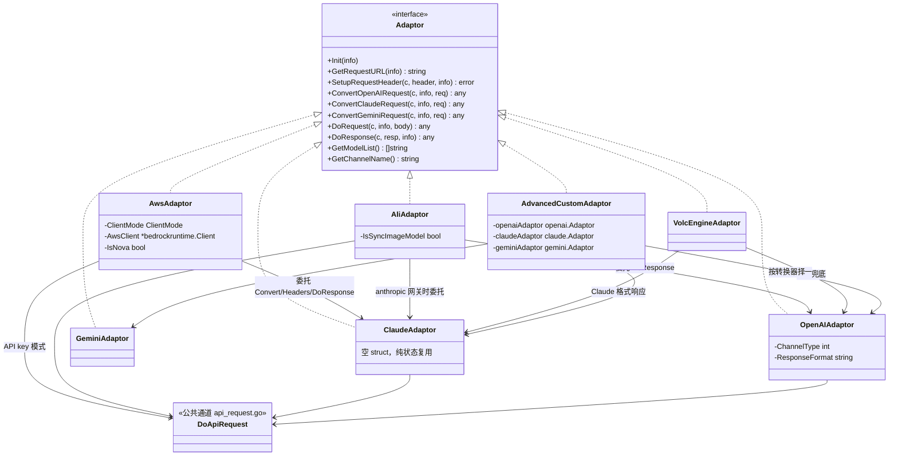
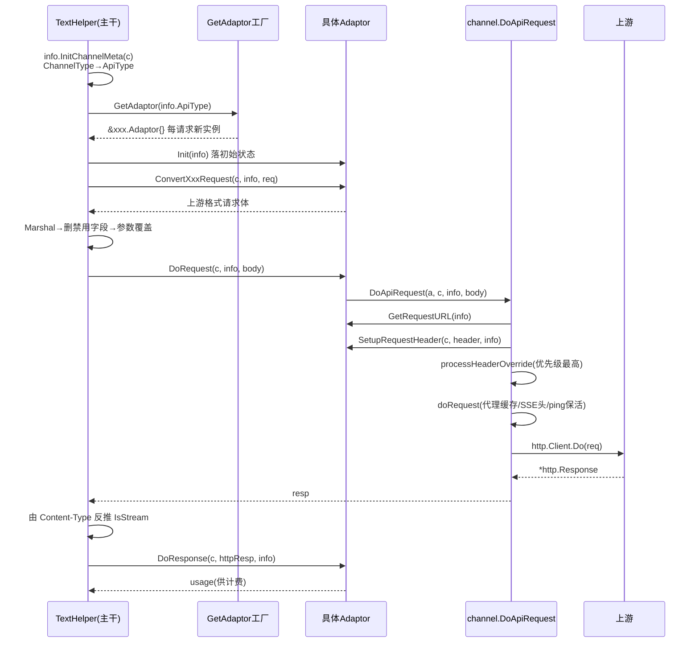

# 03 适配器体系：40+ 上游渠道如何收敛成一个接口

> 一句话定位：本篇拆解 new-api 的适配器（Adaptor）体系——一个 Go 接口如何约束 40 多家上游 AI 提供商、工厂如何按渠道类型产出实现、公共请求通道如何把「差异」压缩到最小。读完你应能独立说清一次中继请求在适配器层的完整路径，并照着清单新增一个上游渠道。

## 🎯 本篇你将学到

- `Adaptor` 接口 15 个方法的职责分组：初始化、定位、认证、转换、发送、回写、元数据
- `GetAdaptor` 简单工厂与「渠道类型 → API 类型 → 适配器实例」的两级映射
- `DoApiRequest` / `DoFormRequest` / `DoWssRequest` 三条公共执行通道的分工
- 「嵌套委托」：`aws` 委托 `claude`、`ali` 委托 `openai`，组合优于继承的 Go 表达
- `RelayInfo` 如何作为唯一上下文对象贯穿适配器全流程
- 新增一个上游渠道的完整改动清单（后端 + 前端）

## 🧠 核心概念

🔎 **是什么**：new-api 是一个 AI API 网关。客户端永远只说一种「方言」（OpenAI 格式、Claude 格式或 Gemini 格式），但网关背后可能接的是 AWS Bedrock、阿里百炼、火山引擎、Azure……每家的路径、鉴权头、请求体字段、响应结构都不一样。适配器体系就是把这批「不一样」全部隔离到一组实现类里，让主干流程对上游无感。

🎓 用 Java 生态类比：这套东西就是**适配器模式 + 简单工厂**的组合，`Adaptor` 接口≈你项目里的 `MessageSender` 接口，`openai.Adaptor`≈`OpenAiMessageSender`，`GetAdaptor`≈工厂里的 `switch`。区别在于：Java 你可能会上 Spring 的 `Map<String, MessageSender>` 依赖注入加自动注册，而 new-api 用的是**编译期写死的 `switch`**——牺牲一点扩展性，换来零反射、零注册开销、IDE 里点一下就能跳转到全部渠道的入口。

⚠️ 一个必须先建立的认知：适配器不负责「选哪个渠道」（那是能力表与负载均衡的事，见 08-channel-ability.md），也不负责「怎么算钱」（见 06-billing-overview.md）。它只回答一个问题：**拿到已选定的渠道后，如何把请求原样或变形后发给这家上游，再把响应还原成客户端期待的格式**。

## 🔍 源码剖析

### 📌 接口契约：15 个方法、7 类职责

`relay/channel/adapter.go:17-34` 定义了整个体系的根：

```go
// relay/channel/adapter.go:17
type Adaptor interface {
    Init(info *relaycommon.RelayInfo)                                        // 1 生命周期
    GetRequestURL(info *relaycommon.RelayInfo) (string, error)               // 2 出口定位
    SetupRequestHeader(c *gin.Context, req *http.Header, info *relaycommon.RelayInfo) error // 3 认证与头
    ConvertOpenAIRequest(...)          // 4 协议转换族，共 8 个
    ConvertClaudeRequest(...)
    ConvertGeminiRequest(...)
    ConvertOpenAIResponsesRequest(...)
    ConvertEmbeddingRequest(...)
    ConvertAudioRequest(...)
    ConvertImageRequest(...)
    ConvertRerankRequest(...)
    DoRequest(c *gin.Context, info *relaycommon.RelayInfo, requestBody io.Reader) (any, error) // 5 发送
    DoResponse(c *gin.Context, resp *http.Response, info *relaycommon.RelayInfo) (usage any, err *types.NewAPIError) // 6 回写
    GetModelList() []string                                                  // 7 元数据
    GetChannelName() string
}
```

职责划分有三个值得咀嚼的点：

**🔑 其一，转换方法按「客户端格式」而非「上游格式」命名。** `ConvertOpenAIRequest` 的语义是「客户端发来的是 OpenAI 格式，请转成你这家上游能吃的东西」。这样主干代码只需根据入口格式调用对应方法，不必知道下游是什么——方向反转是整个接口设计的轴心。

**🔑 其二，`DoRequest` 返回 `any`。** 因为大部分渠道走 HTTP（返回 `*http.Response`），但实时语音走 WebSocket（`DoWssRequest` 返回 `*websocket.Conn`），AWS 的 AK/SK 模式走 AWS SDK 而非裸 HTTP。主干在 `relay/compatible_handler.go:199` 用类型断言 `httpResp = resp.(*http.Response)` 拿回 HTTP 响应。这是接口契约上少见的「弱类型」妥协——见坑位一节。

**🔑 其三，同文件里还藏着第二个接口 `TaskAdaptor`**（`relay/channel/adapter.go:36-81`），服务于异步任务（视频/音乐生成），比 `Adaptor` 多了 `EstimateBilling`、`AdjustBillingOnComplete` 等计费钩子，见 14-task-system.md。

### 📌 工厂与两级映射

工厂本体在 `relay/relay_adaptor.go:50`：

```go
// relay/relay_adaptor.go:50
func GetAdaptor(apiType int) channel.Adaptor {
    switch apiType {
    case constant.APITypeAli:
        return &ali.Adaptor{}
    case constant.APITypeAnthropic:
        return &claude.Adaptor{}
    case constant.APITypeAws:
        return &aws.Adaptor{}
    case constant.APITypeOpenRouter:
        return &openai.Adaptor{}   // 100 行：OpenRouter 直接复用 openai 实现
    case constant.APITypeMoonshot:
        return &moonshot.Adaptor{} // 111 行：注释写明 "Moonshot uses Claude API"
    ...
    }
    return nil
}
```

注意它接收的不是渠道类型，而是 `ApiType`。两者通过**两级映射**衔接：

1. 数据库存的是**渠道类型**（`ChannelType`，如 `constant/channel.go:5` 的 `ChannelTypeOpenAI = 1`、`:18` 的 `ChannelTypeAnthropic = 14`）；
2. 请求进来后 `relay/common/relay_info.go:219` 调 `common.ChannelType2APIType(channelType)`（`common/api_type.go:5`）把渠道类型翻译成**协议类型**（`APIType`，`constant/api_type.go:4` 起的 `iota` 常量）；
3. `GetAdaptor(apiType)` 再产出实例。

为什么多此一举？因为**渠道类型 ≠ 协议**：OpenRouter、Xinference、各种「OpenAI 兼容站」在业务上是不同渠道（有不同名称、图标、默认地址），在协议上却都是 OpenAI 方言。两级映射让「业务渠道」与「协议实现」解耦——一个 `openai.Adaptor` 服务多个渠道类型。未匹配到的渠道类型**默认回退到 `APITypeOpenAI`**（`common/api_type.go:85-92`），这既是宽容也是隐患（见坑位）。

### 📌 编排者：一次调用的完整顺序

适配器从不自己启动，主干 `relay/compatible_handler.go:25` 的 `TextHelper` 是它的总指挥：

```go
// relay/compatible_handler.go:70-74
adaptor := GetAdaptor(info.ApiType)
if adaptor == nil { return types.NewError(...) }
adaptor.Init(info)                       // 实例拿到 RelayInfo，落状态

// relay/compatible_handler.go:112
convertedRequest, err := adaptor.ConvertOpenAIRequest(c, info, request)
...
jsonData, err := common.Marshal(convertedRequest)            // :160
jsonData, err = relaycommon.RemoveDisabledFields(jsonData, ...) // :166 删禁用字段
jsonData, err = relaycommon.ApplyParamOverrideWithRelayInfo(jsonData, info) // :173 参数覆盖

// relay/compatible_handler.go:191
resp, err := adaptor.DoRequest(c, info, requestBody)
...
httpResp = resp.(*http.Response)                             // :199
info.IsStream = info.IsStream || strings.HasPrefix(httpResp.Header.Get("Content-Type"), "text/event-stream") // :200 由响应反推流式

// relay/compatible_handler.go:209
usage, newApiErr := adaptor.DoResponse(c, httpResp, info)
```

看清楚这个顺序：**转换 → 序列化 → 字段清洗 → 参数覆盖 → 发送 → 回写**。适配器的每个方法都只做一小步，主干负责串联与兜底（非 200 状态码在 `:201-206` 统一转成 `NewAPIError` 并按映射重置状态码）。

### 📌 公共请求执行通道：把 HTTP 细节从 40 个实现里抽走

`DoRequest` 的默认实现几乎都是一行委托（`relay/channel/claude/adaptor.go:150-152`、`relay/channel/gemini/adaptor.go:241-243`、`relay/channel/ali/adaptor.go:241-243`）：

```go
func (a *Adaptor) DoRequest(c *gin.Context, info *relaycommon.RelayInfo, requestBody io.Reader) (any, error) {
    return channel.DoApiRequest(a, c, info, requestBody)
}
```

`DoApiRequest`（`relay/channel/api_request.go:313-341`）是全项目真正的「出网关口」：

```go
// relay/channel/api_request.go:313
func DoApiRequest(a Adaptor, c *gin.Context, info *common.RelayInfo, requestBody io.Reader) (*http.Response, error) {
    fullRequestURL, err := a.GetRequestURL(info)          // ① 回调适配器拿 URL
    req, err := http.NewRequest(c.Request.Method, fullRequestURL, requestBody) // ② 复用客户端的 Method
    ApplyUpstreamBodyMetadata(req, requestBody)
    headers := req.Header
    err = a.SetupRequestHeader(c, &headers, info)         // ③ 回调适配器组装头
    headerOverride, err := processHeaderOverride(info, c) // ④ 通道级 Header 覆盖，最后应用、优先级最高
    applyHeaderOverrideToRequest(req, headerOverride)
    resp, err := doRequest(c, req, info)                  // ⑤ 真正出网
    return resp, nil
}
```

这正是一个**模板方法**：公共骨架（建请求、调头、覆盖、发）固定在通道里，变化点（URL、鉴权头）通过接口回调交还给适配器——≈ Java 里 `JdbcTemplate` 把「拿连接、执行、清理」固化，把 SQL 交给你。

`doRequest`（`relay/channel/api_request.go:490`）还解决了两件容易被忽略的事：

- **代理与连接池复用**：`service.GetHttpClientWithProxySettings` 按渠道代理配置从缓存取 `http.Client`（缓存实现见 `service/http_client.go:33` 起、`:230` 的 `getOrCreate`）。因为客户端是跨渠道共享的，改重定向策略时只能浅拷贝——`api_request.go:495-500` 的注释明确写了这一点。
- **流式保活**：`info.IsStream` 时先 `helper.SetEventStreamHeaders(c)` 给下游写 SSE 头，再按全局配置启动 ping 保活 goroutine（`api_request.go:514-530`）。

另外两条分流通道（`openai/adaptor.go:737-747` 是最佳示范）：

```go
// relay/channel/openai/adaptor.go:737
func (a *Adaptor) DoRequest(...) (any, error) {
    if info.RelayMode == relayconstant.RelayModeAudioTranscription ||
        info.RelayMode == relayconstant.RelayModeAudioTranslation ||
        (info.RelayMode == relayconstant.RelayModeImagesEdits && !isJSONRequest(c)) {
        return channel.DoFormRequest(a, c, info, requestBody)   // multipart 表单
    } else if info.RelayMode == relayconstant.RelayModeRealtime {
        return channel.DoWssRequest(a, c, info, requestBody)    // WebSocket
    } else {
        return channel.DoApiRequest(a, c, info, requestBody)    // 默认 JSON
    }
}
```

`DoFormRequest`（`api_request.go:343`）透传 `multipart/form-data` 的 `Content-Type`；`DoWssRequest`（`api_request.go:375`）用 `websocket.DefaultDialer.Dial` 建连后直接返回连接对象，后续由 Realtime 处理器接管。

### 📌 嵌套委托：组合优于继承的 Go 表达

Go 没有继承，但 new-api 用「**适配器内部再 new 一个适配器**」实现了复用。AWS 是最完整的例子——Bedrock 上跑的 Claude 模型，请求/响应协议与 Anthropic 完全一致，唯一差异是鉴权和图片必须转 base64（Bedrock 不收 URL）：

```go
// relay/channel/aws/adaptor.go:41-43  转换：先借 claude 的转换，再补 Bedrock 的 base64 要求
func (a *Adaptor) ConvertClaudeRequest(c *gin.Context, info *relaycommon.RelayInfo, request *dto.ClaudeRequest) (any, error) {
    claudeAdaptor := claude.Adaptor{}
    if _, err := claudeAdaptor.ConvertClaudeRequest(c, info, request); err != nil {
        return nil, err
    }
    // ...遍历消息，把 type:"url" 的图片下载转成 type:"base64"...

// relay/channel/aws/adaptor.go:110-115  头：复用 claude 的 anthropic-beta 逻辑，再按模式补鉴权
func (a *Adaptor) SetupRequestHeader(c *gin.Context, req *http.Header, info *relaycommon.RelayInfo) error {
    claude.CommonClaudeHeadersOperation(c, req, info)
    if a.ClientMode == ClientModeApiKey {
        req.Set("Authorization", "Bearer "+info.ApiKey)
    }

// relay/channel/aws/adaptor.go:164-180  回写：API key 模式整体丢给 claude 适配器
func (a *Adaptor) DoResponse(c *gin.Context, resp *http.Response, info *relaycommon.RelayInfo) (usage any, err *types.NewAPIError) {
    if a.ClientMode == ClientModeApiKey {
        claudeAdaptor := claude.Adaptor{}
        usage, err = claudeAdaptor.DoResponse(c, resp, info)
    } else if a.IsNova {
        err, usage = handleNovaRequest(c, info, a)     // Nova 模型走自家格式
    } else if info.IsStream {
        err, usage = awsStreamHandler(c, info, a)      // AK/SK 模式走 SDK 流式
    } else {
        err, usage = awsHandler(c, info, a)
    }
}
```

同样模式反复出现：

- **`ali` 委托 `openai`**（`relay/channel/ali/adaptor.go:245-269`）：阿里百炼的 `compatible-mode` 本就是 OpenAI 兼容协议，`DoResponse` 的默认分支直接 `adaptor := openai.Adaptor{}; usage, err = adaptor.DoResponse(c, resp, info)`；连 Claude 格式入口也先 `service.ConvertRequest(c, info, types.RelayFormatOpenAI, req)` 转成 OpenAI 格式再走自家管道（`ali/adaptor.go:73-90`）。
- **`volcengine` 同样两头委托**：`relay/channel/volcengine/adaptor.go:351` 起用 `claude.Adaptor{}` 处理 Claude 格式响应，`:391` 起用 `openai.Adaptor{}` 兜底。
- **`advancedcustom` 更彻底**：结构体里同时持有三个适配器实例（`relay/channel/advancedcustom/adaptor.go:30-39`），`Init` 把三个全初始化（`:41-45`），`DoResponse` 按解析出的转换器把响应交给对应那一个（`:304-334`）。

🎓 这个手法在 Java 里≈**组合 + 委托**，或者说 `DefaultXxx` 基类的组合化重写：把「父类」从继承关系降级成「可插拔的内部策略」。好处是复用边界由方法级显式控制（可以只借 `DoResponse` 不借 `SetupRequestHeader`），避免了 Java 继承常见的「被迫接受整棵父类行为」。

### 📌 RelayInfo：贯穿全流程的唯一上下文

`relay/common/relay_info.go:84` 的 `RelayInfo` 是适配器所有方法的第二参数（或第一参数），本质是一个**请求级聚合上下文**（≈ Spring 里把 `HttpServletRequest` + 业务快照打包成的一个 `RequestScope` 对象）。适配器最关心的字段集中在内嵌的 `ChannelMeta`（`relay/common/relay_info.go:60-77`）：

```go
type ChannelMeta struct {
    ChannelType       int    // 渠道类型，决定 openai 适配器内部的 switch 分支
    ChannelId         int
    ChannelBaseUrl    string // 上游基地址
    ApiType           int    // 工厂入参
    ApiKey            string // 鉴权凭证（可能是多 key 轮换中的某一个）
    UpstreamModelName string // 模型映射后的上游真实模型名
    SupportStreamOptions bool
    ...
}
```

`InitChannelMeta`（`relay/common/relay_info.go:207`）从 gin 上下文里把这些值取出并组装——注意它会**清空每次重试的临时状态**（`:211-215`），因为 auto 分组重试会对同一 `RelayInfo` 复用、换渠道重跑一遍适配器流程。`Init` 阶段适配器还会往 `RelayInfo` **回写**状态：`openai/adaptor.go:93-104` 在渠道开启思考内容转发时初始化 `info.ThinkingContentInfo`；`gemini/adaptor.go:155-159` 在流式生成时设置 `info.DisablePing = true`。**信息双向流动**是理解这套体系的关键：`RelayInfo` 既是输入也是输出。

## 📐 图解

图 1：适配器体系静态结构与委托关系（依据真实源码绘制）



图 2：一次聊天请求在适配器层的时序（`relay/compatible_handler.go:70-209`）



## 🎓 设计精妙之处与可借鉴点

✅ **1. 变化点全下沉到实现，主干只认接口**
为什么这么设计：40+ 渠道的差异（URL 规则、鉴权头、字段名、响应结构）全部被接口方法封死在各自包里，主干 `TextHelper` 一行都不 `switch` 渠道类型。可借鉴点：Java 项目里做「多供应商接入」时，把「每家都不一样的部分」列成方法清单先定接口，宁可接口胖一点，也别让主干出现 `if (provider == X)`。

✅ **2. 「业务渠道」与「协议实现」解耦的两级映射**
为什么这么设计：`ChannelType`（几十个，含大量 OpenAI 兼容站）与 `APIType`（协议族）分开，使「新增一个 OpenAI 兼容站」的成本从「写一个适配器」降为「加两个常量 + 一条映射」。可借鉴点：Java 里遇到「渠道很多但协议收敛」的场景，先数协议族的数量，再决定要不要为每个渠道建实现类——常量映射往往比一堆空壳子类更划算。

✅ **3. 模板方法式的公共执行通道**
为什么这么设计：代理选择、连接池缓存、重定向策略、SSE 头、ping 保活这类「一次写对、处处受益」的逻辑只存在于 `doRequest` 一处，40 个实现零重复。可借鉴点：Java 中与其让每个集成类自己 `new RestTemplate/WebClient`，不如收敛到一个按「渠道配置」取客户端的入口，超时与代理策略才有统一演进的可能。

✅ **4. 组合委托替代继承**
为什么这么设计：AWS 对 Claude 的复用精确到「方法级」——转换借、头借、回写借，但发送走 SDK。继承做不到这么细粒度的取舍。可借鉴点：Java 里当你想 `extends` 一个适配器只为了改一个方法时，改用「注入被复用对象 + 显式委托」，能躲开模板方法被父类改动牵连的脆化。

✅ **5. 每请求新建实例 + 有状态字段**
为什么这么设计：`GetAdaptor` 每次 `return &openai.Adaptor{}` 返回新实例，`aws.Adaptor.ClientMode`、`ali.Adaptor.IsSyncImageModel` 这类运行期才确定的字段才敢挂在结构体上。可借鉴点：Spring 单例 Bean 里千万别放请求态字段；new-api 用「工厂即原型」绕开了这个雷区，代价是不能用接口实例做缓存 key。

## ⚠️ 常见坑与注意事项

⚠️ **`DoRequest` 返回 `any`，类型断言可能炸**：主干 `compatible_handler.go:199` 直接 `resp.(*http.Response)`。如果你的渠道实现返回了别的东西（如 `*websocket.Conn`），而走的是文本主干的路径，运行期直接 panic——新渠道务必确认它只在匹配的 RelayFormat/RelayMode 下被选中。

⚠️ **未知渠道类型会静默回退 OpenAI**：`common/api_type.go:85-92` 对未注册的渠道类型默认返回 `APITypeOpenAI`（任务插件渠道例外，返回 `-1, false`）。这样新渠道若忘了加映射，请求不会报「不支持的渠道」，而是被 OpenAI 适配器用错误的协议打出去，表现为上游 404/400——排查时先查 `ChannelType2APIType`。

⚠️ **可选标量字段必须用指针 + `omitempty`**：AGENTS.md 明确要求，从客户端 JSON 解析再转投上游的请求 DTO，`*int`/`*bool`/`*float64` 才能区分「用户没传」与「用户显式传 0/false」；非指针标量加 `omitempty` 会把显式零值静默丢掉（例如 `max_tokens: 0` 的语义就没了）。写转换逻辑时这是最高频的坑。

⚠️ **JSON 序列化必须走 `common.Marshal` / `common.Unmarshal`**：业务代码禁止直接 `import "encoding/json"`（AGENTS.md 强约束）。适配器里已是如此，例如 `openai/adaptor.go:259` 用 `common.Unmarshal(request.THINKING, &thinking)`。

⚠️ **新渠道是否支持 `StreamOptions` 要主动确认**：AGENTS.md 要求实现新渠道时确认上游是否支持流式选项，支持则必须加进 `relay/common/relay_info.go:358` 的 `streamSupportedChannels` 表，否则流式请求拿不到 usage，计费会退化。

⚠️ **适配器实例有状态，不能跨请求复用**：`advancedcustom` 用 `resolved`/`converted` 标志做惰性解析（`advancedcustom/adaptor.go:35-37`），`InitChannelMeta` 会清空重试临时态（`relay_info.go:211-215`）。任何把适配器实例缓存到全局的尝试都会把 A 请求的渠道配置泄给 B 请求。

⚠️ **`relaykit/` 是独立 Go 模块**：转换相关代码若放进 `relaykit/`，绝不能 import 主模块，且必须用 `cd relaykit && GOWORK=off go build ./...` 验证（AGENTS.md 约束）。跨引用详见 04-relaykit-conversion.md。

## 🏋️ 刻意练习:缺陷预演

> 先自己想 2 分钟,再看参考思路。

### 练习 1|有状态适配器实例:被改成单例缓存之后

- 🔴 **反模式预演**:有人嫌「每个请求都 new 一个适配器太浪费」,把 `GetAdaptor`(`relay/relay_adaptor.go:50`)改成按 `apiType` 缓存单例。拿 AWS 适配器推演:它的 `Init` 是空函数(`relay/channel/aws/adaptor.go:92-93`),`ClientMode` 要等主干回调 `GetRequestURL` 时才落盘(`:98`、`:105`),随后 `SetupRequestHeader`(`:112`)与 `DoResponse`(`:165`)都要读它。两个并发请求:A 是 API key 模式(直连 converse 端点 + `Authorization: Bearer`),B 是 AK/SK 模式(SDK 签名),错峰会炸出什么现象?为什么这类故障只在并发下出现、复现率极低、换个请求又好了?
- 🟡 **陷阱预判**:就算保住「每请求新实例」,`advancedcustom` 的 `resolved` 短路(`relay/channel/advancedcustom/adaptor.go:368`,置位在 `:391`)缓存的是从 `info.ChannelOtherSettings.AdvancedCustom` 解析出的 route/converter(`:374`、`:389-390`)。如果有人把「重试时复用上一轮的适配器实例」当优化,而 auto 重试恰好换到另一个 advancedcustom 渠道,第二轮会按谁的路由表转换、发到谁的 URL?
- 💡 **参考思路**:A 的 `SetupRequestHeader` 会读到 B 刚写入的 `ClientModeAKSK`——Bearer 头没加上、AK/SK 分支又被误判,合法凭证换来 AWS 403;交错窗口只有微秒级,所以表现是「偶发 403、重试就好」,几乎不会有人怀疑到实例生命周期头上。`resolved` 一旦置位,A 渠道的 route/converter 就被原样套给 B 渠道的请求。作者用「工厂即原型」(每个 case `return &xxx.Adaptor{}`)把实例生命周期钉死在单次请求,代价只是几个空结构体的分配。

### 练习 2|未知渠道类型的静默回退 OpenAI

- 🔴 **反模式预演**:运营新建了一个渠道类型 X(某厂商的 Anthropic 兼容端点),后端忘了在 `ChannelType2APIType`(`common/api_type.go:5`)加 case。请求会以什么协议、被哪个适配器改写、打到上游什么路径?上游回什么错?为什么在网关日志里它看起来像「上游渠道坏了」,而不是「我漏了一行映射」?排障的人会先去查哪里?
- 🟡 **陷阱预判**:`ChannelType2APIType` 的第二个返回值 `bool` 在 `relay/common/relay_info.go:219` 被直接 `_` 丢弃,那任务插件渠道的 `(-1, false)`(`common/api_type.go:88-90`)是靠什么机制变成干净报错的?如果有人「顺手」让 `GetAdaptor` 对未知 `apiType` 也默认返回 openai 适配器、而不是 `return nil`(`relay/relay_adaptor.go:127`),哪条路径会先出事?
- 💡 **参考思路**:`common/api_type.go:91` 对未注册类型返回 `APITypeOpenAI`,`GetAdaptor` 于是产出 `openai.Adaptor`,把 Claude 方言的请求体按 OpenAI 通道打出去,上游回 404/400,再被主干归一成「渠道错误」——「配置缺失」被搬运成「上游故障」,排查要横跨映射、适配器、错误归一三层。插件渠道那路靠的是「`-1` 不在工厂 switch 里 → 返回 nil → `relay/compatible_handler.go:70-74` 报 `invalid api type` 且跳过重试」;兜底不是零代价,而是被作者限定在「协议大概率是 OpenAI」的场景。

### 练习 3|跨渠道共享的 http.Client 与那次浅拷贝

- 🔴 **反模式预演**:`doRequest` 拿到的 client 是按「代理 URL + 传输策略」全局缓存的(`service/http_client.go:230-257`),随后 `relayClient := *client` 浅拷贝、再改 `CheckRedirect`(`relay/channel/api_request.go:499-500`)。推演两个「顺手优化」各自的下场:① 嫌拷贝多余,直接在缓存返回的 client 上赋值 `client.CheckRedirect = ...`;② 觉得浅拷贝不干净,改成每请求新建 client(连带新建 transport)。
- 🟡 **陷阱预判**:如果把缓存 key 从「代理 URL + 策略」简化成「全局一个 client」,渠道 A 配了 socks5 出口代理、渠道 B 直连公司内网上游,哪些安全边界会一起失效?上游侧的 IP 白名单还能信吗?
- 💡 **参考思路**:① 是并发写共享对象字段,`-race` 直接报 data race,生产上是未定义行为;② 丢的是底层 `Transport` 的连接池与 HTTP/2 流复用(`relay/channel/api_request.go:495-498` 注释明说浅拷贝就是为了共享 transport),高并发下每请求一次 TLS 握手,先耗尽临时端口再耗尽文件描述符,超时与空闲连接调优也集体失效。缓存 key 漏掉代理维度时,A 的出口 IP 会被套到 B 的直连流量上,上游 IP 白名单与内网隔离同时失效。

## 🎯 决策复盘:复现作者的取舍

### 决策 1|传输分流:单 `DoRequest` + `any` 返回 vs 三条通道上提进接口(岔路口:传输方式的选择权放谁手里)

**场景**:同一批适配器要支持 JSON HTTP、multipart 表单、WebSocket 三种出网方式。是把三个执行通道都写进 `Adaptor` 接口、由主干按 RelayMode 显式挑选,还是接口只留一个 `DoRequest` 返回 `any`、让适配器自己分流?

- 方案 A:接口只留 `DoRequest(c, info, body) (any, error)`,适配器内部分流(`relay/channel/openai/adaptor.go:737-747` 的表单/Realtime/JSON 三分支),主干拿到后裸断言 `resp.(*http.Response)`(`relay/compatible_handler.go:199`)。
- 方案 B:接口定义 `DoApiRequest` / `DoFormRequest` / `DoWssRequest` 三个强类型方法,主干按 RelayMode 决定调哪个。

**你来权衡**:A 把多少类型检查推迟到运行期、panic 落在谁身上?B 里「RelayMode → 传输方式」的知识被搬进主干,40 个渠道里只有少数需要 WSS/表单时,主干要背多少不属于自己的知识?什么信号出现时 A 的断言面会失控?

- 💡 **参考思路**:① 作者选 A——「哪种模式走哪种传输」是渠道自己的领域知识,放进适配器主干才能保持零渠道感知:多数渠道一行委托完事(`relay/channel/claude/adaptor.go:150-152`),只有 openai 这种全模式渠道才写三分支。② 代价是 `relay/compatible_handler.go:199` 的裸断言:适配器实现与主干路径不匹配时直接 panic 到 gin recover,客户端拿到 500 而非可重试的 `NewAPIError`(同文件 `:216` 还有 `usage.(*dto.Usage)` 同款);但反过来,把断言改成防御式检查,实现 bug 会变成普通渠道错误流进重试与自动禁用链路,被伪装成「上游问题」。③ 边界:再出现第四种传输(gRPC 之类)时,`any` 的隐式契约会继续放大断言面,那时改成「返回带类型标签的包装结构」比沿用裸断言划算。

### 决策 2|重试复用 `RelayInfo`:复用 + 显式清空 vs 每轮新建(岔路口:请求级状态与单次尝试状态的分界线)

**场景**:auto 分组重试会对同一个 `RelayInfo` 换渠道重跑整套适配器流程。`RelayInfo` 上既有请求级身份(用户/token、计费句柄、已用渠道、body 快照),又有「单次尝试」状态(流式子状态、转换链、发送计数、上游模型名)。是每轮新建一个 `RelayInfo`,还是复用 + 在 `InitChannelMeta` 里显式清空?

- 方案 A:复用同一个 `RelayInfo`,`InitChannelMeta` 每轮重建 `ChannelMeta`(`relay/common/relay_info.go:220`)并手动清空每轮临时态(`:208-215`),注释专门点名哪些不能清(`:211-212`)。
- 方案 B:每轮重试 `GenRelayInfo` 新建一个,从根上杜绝残留。
- 方案 C:拆成两层——不可变的 RequestScope + 每轮新建的 AttemptScope,靠类型系统强制分界。

**你来权衡**:B 会丢掉什么(预扣-结算链、已用渠道、body 快照绑定)?A 的清空清单靠人肉维护,漏清一个字段的故障长什么样?C 的收益什么时候才配得上迁移成本?

- 💡 **参考思路**:① 作者选 A——`InitChannelMeta` 每轮 `new` 一个 `ChannelMeta`(`relay/common/relay_info.go:220`),清掉发送计数与流式子状态、把 `UpstreamModelName`/`IsModelMapped` 归位(`:213-215`、`:233-234`),甚至把上一轮被模型映射改过的请求体模型名重置回 `OriginModelName`(`:272-276`)。② 换来的是跨轮状态天然延续:计费句柄、已用渠道、body 快照都不必重新装配,B 要么打断「预扣 → 结算」的同一句柄链,要么把这些状态外提到别处、装配逻辑翻倍。③ 边界:A 的正确性完全依赖「新增字段时记得归类」,`:211-212` 那句「Do not clear…」就是给后人立的警示牌——漏清一个字段,上一渠道的残留会污染下一渠道,表现为「只有高优先级渠道失败后才复现」的串渠道幽灵故障;等字段多到清不过来,C 才值得。

## 🔗 与其他模块的关系

- 00-soul.md：一次请求从进入网关到适配器被调用的全景入口
- 02-routing-middleware.md：`RelayInfo` 在中间件层如何被填充，渠道如何被选中后写进上下文
- 04-relaykit-conversion.md：`Convert*` 方法背后真正的格式转换引擎（`service.ConvertRequest` 委托到 `relaykit`）
- 05-streaming.md：`DoResponse` 里各 `XxxStreamHandler` 的流式细节与 SSE 协议
- 06-billing-overview.md / 07-billingexpr.md：`DoResponse` 返回的 `usage` 与 `TaskAdaptor.EstimateBilling` 的计费归宿
- 08-channel-ability.md：适配器被调用之前，渠道与能力表如何选出「这一家用哪把钥匙、哪个代理」
- 13-settings.md：`GetRequestURL`/`SetupRequestHeader` 里读到的渠道级配置（`ChannelOtherSettings`、`ChannelSetting`）来源
- 14-task-system.md：`TaskAdaptor` 接口的异步任务落地
- 15-plugins.md：`advancedcustom` 与任务插件这两类「用配置/脚本替代写码」的扩展路径
- 16-frontend.md：前端渠道类型注册表（`web/src/features/channels/constants.ts:28`）与后端常量的同步关系

## 📚 小结

适配器体系是一套教科书式的「接口 + 工厂 + 模板方法 + 组合委托」落地，但它真正的智慧在于**边界划分**：

1. 接口按「客户端格式 → 上游方言」的方向命名转换方法，主干因此完全无渠道感知；
2. 两级映射（渠道类型 → 协议类型 → 实例）让「多渠道少协议」的现实被充分利用，新增 OpenAI 兼容站近乎零成本；
3. `DoApiRequest` 把出网的一切公共关注点（代理、连接池、重定向、保活、Header 覆盖优先级）收拢到一处，40 个实现只负责「URL 与鉴权头」；
4. 委托复用（aws→claude、ali→openai、advancedcustom→三者）证明在没有继承的语言里，组合反而能给出更精细的复用粒度。

记住那条改动清单的骨架：**常量 → 映射 → 实现 → 工厂 → 流式支持表 → 前端注册**。六步走完，一个新上游就从「完全不存在」变成「可在后台点选、可计费、可流式」。
