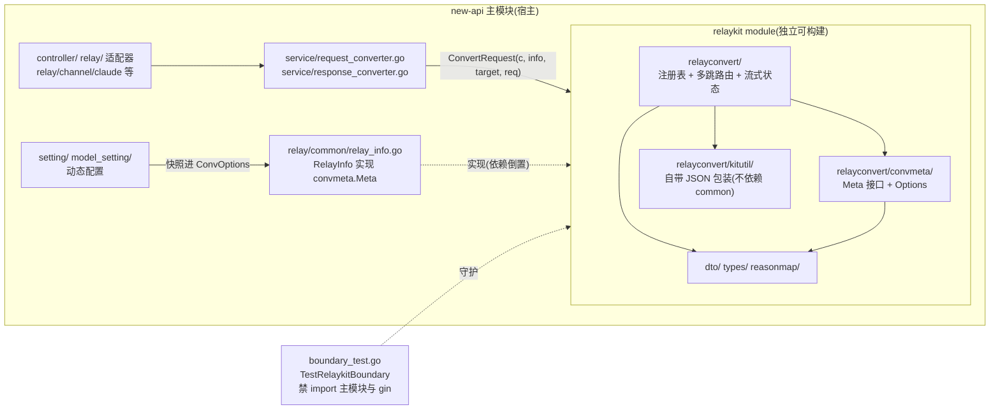
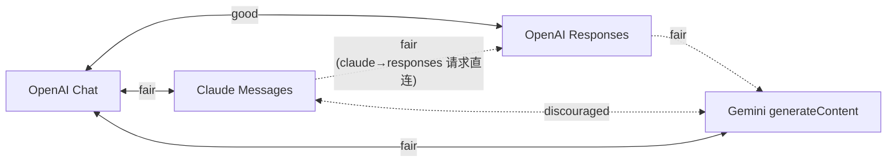
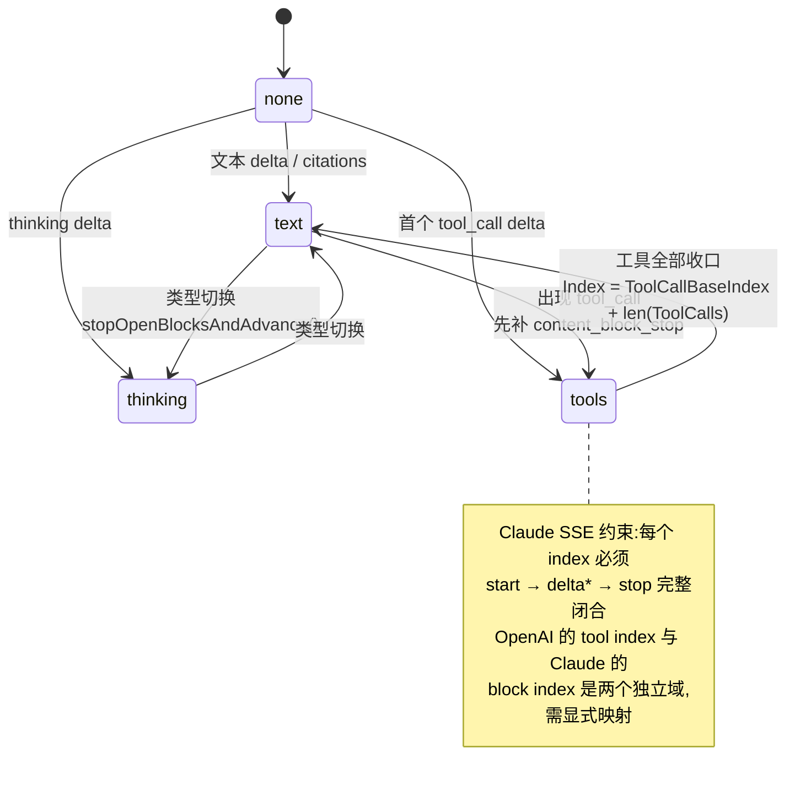

# relaykit:把协议转换拆成独立 Go module

> 一句话定位:本篇讲 new-api 如何把「四种大模型文本协议之间的任意互转」抽成一个零宿主依赖、可独立构建的 Go module(`relaykit/`),你读完能掌握它的模块边界设计、方向矩阵与多跳路由、`convmeta.Meta` 接口隔离、流式转换状态机,以及这套思路如何映射回 Java/Spring 的多模块工程。

## 🎯 本篇你将学到

- 🔑 为什么 `relaykit/` 必须保持独立可构建(`GOWORK=off go build ./...`),代价与收益各是什么(≈ Maven 多 module 的依赖倒置)
- 🔎 `types.RelayFormat`(协议格式)与 `RelayMode`(业务操作)这两个正交维度为什么必须分开
- 🧩 `convmeta.Meta` 接口如何让转换器「只看协议状态、看不到计费字段」(≈ Java 接口隔离原则)
- 🗺️ 4×3=12 条转换方向的注册表组织、注册期校验与多跳(fallback)路径
- ⚙️ 流式转换为什么需要状态机:`finalize`/`flushAllPendingTools` 与 `LastMessagesType` 块状态机
- 🧾 `tool_loss_policy` 损耗策略三档语义,以及 `ConvOptions` 快照缓存的失效时机

## 🧠 核心概念

**🤔 问题是什么?** 作为 AI 网关,new-api 的入口协议和出口协议是两个独立变量:客户端可能用 OpenAI Chat、Claude Messages、Gemini `generateContent` 或 OpenAI Responses 任意一种格式发请求;而某个渠道背后的上游可能只说其中另一种。理论上组合是 4×4=16 种,去掉自身直通还有 12 种「格式对」,每种又分请求、非流式响应、流式响应三个方向。如果按「客户端格式 × 渠道类型」写 if-else,复杂度会随上游数量线性爆炸。

**💡 解法:中枢(hub)注册表 + 中间表示。** `relaykit` 把「转换」建模成一张有向图:每种格式是节点,每条有向边是一个注册好的转换器(`TextConverterSpec`),带质量等级;查不到直达边时走两跳中转(以 OpenAI Chat 为枢纽)。工具调用这种跨协议差异最大的部分,先抽取成统一的中间表示(intermediate representation,≈ Java 里「先反序列化成领域模型、再序列化成目标格式」,绝不字符串替换)。

**🏭 为什么要独立成 module?** 协议转换是整个系统里最稳定、最纯粹的一层:它只吃 DTO、吐 DTO,不碰 HTTP、数据库、计费。把它从主 module 里剥离,主 module 的任何改动(计费重构、渠道调整、前端接口变更)都污染不到这层,反之亦然。类比 Java:这就是把「协议编解码」拆成独立的 Maven module,主工程通过依赖引入,而不是把它塞在 `common` 包里和几千个工具类同床异梦。

## 🔍 源码剖析

### 1️⃣ 独立 module:边界不是约定,而是被测试守住的规矩

`relaykit/go.mod:1-11` 声明 `module github.com/QuantumNous/new-api/relaykit`,直接依赖只有 5 个:`google/uuid`、`samber/lo`、`stretchr/testify`、`tidwall/gjson`、`tidwall/sjson`——没有 Gin、没有 GORM、没有任何宿主包。主模块 `go.mod:172,175` 用 `replace github.com/QuantumNous/new-api/relaykit => ./relaykit` 指向本地目录(仓库里并没有 `go.work`),所以主工程构建时 relaykit 就像被引入的第三方库。

真正有意思的是 AGENTS.md:67-70 的规则:「`relaykit/` 内代码禁止 import 主模块的任何包,任何改动必须用 `cd relaykit && GOWORK=off go build ./...` 验证,主模块构建通过不算数」。而且这条边界不是靠 code review 肉眼看——`relaykit/relayconvert/boundary_test.go:30-33` 写死了两个禁用前缀:

```go
// relaykit/relayconvert/boundary_test.go:30-33
var forbiddenPrefixes = []string{
    modulePrefix,               // github.com/QuantumNous/new-api/ —— 整个宿主模块
    "github.com/gin-gonic/gin", // 以及 gin
}
```

`TestRelaykitBoundary`(44 行)用 `go/parser` 只解析 import 声明,逐文件检查;`allowedViolations` 白名单(42 行)当前为空,注释明确「只能缩小,不能扩大」。≈ Java 里用 ArchUnit 写一条「`..relaykit..` 不得依赖 `..new-api..`」的架构测试。

**代价也真实存在**。宿主侧 AGENTS.md 要求业务代码统一走 `common.Marshal`/`common.Unmarshal` 包装,但 relaykit 不能 import `common`,于是 `relaykit/relayconvert/kitutil/json.go:1-16` 重新实现了一份同签名的 `kitutil.Marshal`/`Unmarshal`。这是独立性的「过路费」:公共工具要么复制一份,要么下沉成第三个 module。规模参考:relaykit 共 124 个 `.go` 文件、非测试代码约 2.56 万行。

### 2️⃣ RelayFormat 与 RelayMode:两个必须分清的正交维度

初学者最容易混淆这两个概念,看它们各自的定义就清楚了。`relaykit/types/relay_format.go:3-20`:

```go
type RelayFormat string
const (
    RelayFormatOpenAI              RelayFormat = "openai"
    RelayFormatClaude              = "claude"
    RelayFormatGemini              = "gemini"
    RelayFormatOpenAIResponses     = "openai_responses"
    RelayFormatOpenAIAudio         = "openai_audio"
    RelayFormatEmbedding           = "embedding"
    RelayFormatTask                = "task"
    // ...共 13 个
)
```

`RelayFormat` 是字符串,回答「**线上协议(wire protocol)是什么**」——数据长什么形状。而 `RelayMode` 定义在宿主侧 `relay/constant/relay_mode.go:7-52`,是 `iota` 自增的 int,回答「**这次请求要做什么业务操作**」——`RelayModeChatCompletions`、`RelayModeAudioSpeech`、`RelayModeResponsesCompact` 等 30 多个。

两者在 `relay/common/relay_info.go:100,126` 里作为同一个 `RelayInfo` 的两个字段并存,说明它们正交:一次 `RelayModeEmbeddings` 请求的 `RelayFormat` 恒为 `RelayFormatEmbedding`(没有第二种说法),但 `RelayModeResponses` 可能对应 `openai_responses` 或压缩专用格式。类比 Spring:`RelayMode` ≈ Controller 方法上的业务路由(`@PostMapping("/embeddings")`),`RelayFormat` ≈ 消息转换器协商出的媒体类型(`application/json` 还是 XML)。**relaykit 只管 Format 维度**;Mode 的分派发生在宿主 Router→Controller 层,这也是为什么 relaykit 里看不到任何「路由」概念。

### 3️⃣ `convmeta.Meta`:接口隔离的教科书实现

`RelayInfo` 是宿主的「上帝对象」:`relay/common/relay_info.go:95-205` 里塞满了 `BillingModelName`、`FinalPreConsumedQuota`、`Billing`、`SubscriptionId`、`PriceData`、`QuotaClamp` 等计费/订阅字段。但转换器一个都不该看见。做法是定义一个窄接口,`relaykit/relayconvert/convmeta/meta.go:12-18`:

```go
// Meta is the only view of the relay session that format converters may use.
// It is satisfied by *relaycommon.RelayInfo on the host side; other embedders
// (tests, external relaykit users) can use *Values.
type Meta interface {
    GetOriginModelName() string
    GetUpstreamModelName() string
    HasChannelMeta() bool
    GetIsStream() bool
    ...
    EnsureClaudeConvertInfo() *ClaudeConvertInfo  // 惰性创建流式转换状态
    ConvOptions() *Options                        // 永不返回 nil
}
```

宿主侧的实现注释写得斩钉截铁(`relay/common/relay_info.go:763-768`):

```go
// convmeta.Meta implementation — the view format converters see. Keep these
// thin: they only expose protocol state, never billing/user fields.
var _ convmeta.Meta = (*RelayInfo)(nil)
```

≈ Java 的接口隔离原则(ISP):`RelayInfo` 相当于一个巨大的实现类,同时实现 `convmeta.Meta`(协议视图)和计费相关接口;转换器作为客户端只依赖前者,依赖倒置在这里落地——**方向是 relaykit 定义接口、宿主去实现**,而不是宿主把类型传进去。

三个细节值得注意:

1. **编译期契约**:`convmeta/meta.go:110` 的 `var _ Meta = (*Values)(nil)` ≈ Java 显式 `implements`,漏实现方法直接编译失败。
2. **typed-nil 陷阱被显式写进接口注释**(`meta.go:15-17`):「指针类型的实现必须保证每个方法对 nil receiver 安全;typed-nil 指针装进 interface 后仍是非 nil interface,relaykit 刻意不用反射去检测这种情况」。所以 `Values` 的每个方法都以 `if v == nil { return 零值 }` 开头(112-216 行),另提供 `convmeta.OptionsOf(m)`/`UpstreamModelName(m)` 等 nil 安全包级函数(221-249 行)。
3. **类型搬家不破坏兼容**:`ClaudeConvertInfo` 从宿主 `relay/common` 搬进 convmeta 后,宿主保留类型别名 `type ClaudeConvertInfo = convmeta.ClaudeConvertInfo`(`relay/common/relay_info.go:42`)与四个 `LastMessageType*` 常量别名(34-37 行),存量调用方零改动。≈ Java 里把类挪包时保留 `@Deprecated` 的门面类。

### 4️⃣ 方向矩阵与多跳路由:注册表 + fail-fast

12 条方向边集中定义在 `relaykit/relayconvert/text_converter_registry.go:49-252` 的 `builtinTextConverters`,每条边是一个 `TextConverterSpec{ID, From, To, Quality, Req, Resp}`。`init()`(254 行)在包加载时全部注册进三张 map(`request_registry.go:61-66`):

```go
requestConverters       = map[string]RequestConverterSpec   // ID → 转换器
requestConverterRoutes  = map[requestConverterRoute]string  // (from,to) → ID
requestConverterDirectRoutes = ...                          // 仅直达边
```

注册函数 `registerBuiltinRequestConverter`(`request_registry.go:88-141`)是一整套 fail-fast 校验:ID/from/to/quality 缺一就 `panic`;`Convert` 与 `StepConverters` 互斥(102-104);同一条路由被注册两次 `panic`(109-111);对多跳转换器,逐个校验每步的 `From` 必须衔接上一步的 `To`,最后必须落在声明的 `To` 上(116-131)。≈ Spring 容器启动期就拒绝坏的 Bean 定义,而不是等到第一次请求才炸。

入口 `ConvertRequest`(`request_registry.go:154-175`)的流程:先用 `convmeta.GuessRelayFormatFromRequest`(`convmeta/format.go:10-31`,类型 switch)从 DTO 具体类型**推断**源格式;`from == target` 时原样返回;否则查路由表执行。还提供 `ConvertRequestVia`(显式指定路径)与 `ConvertRequestByID`(按转换器 ID,供调试与灰度)。

**多跳执行的核心思想:工具先抽取、再回填**。`executeRequestSteps`(`request_registry.go:241-294`)先把源请求里的工具定义整体抽成 `toolconv.Set`(242 行 `toolconv.ExtractRequest`),中间各步只转「文本内容」骨架,最后一步 `toolconv.AttachRequest`(261 行)按目标协议把工具重新编码。这样 Claude→Gemini 这种最难的转换,只需复用 `ClaudeMessagesToOpenAIChat` + `OpenAIChatToGeminiContent` 两步(`text_converter_registry.go:147-165`),不需要为每对组合写两两笛卡尔积的实现——4 种格式只需 8 个直接转换器,而不是 12 个。

### 5️⃣ `tool_loss_policy`:把「有损转换」变成可决策的显式契约

跨协议转换必然有损耗:比如目标协议没有内置 `web_search` 工具、或无法表达 `parallel_tool_calls`。relaykit 不假装这些损耗不存在,而是把它们显式建模为诊断(`relaykit/types/conversion.go:15-22` 的 `ConversionDiagnostic{Code, Path, Message, Severity, From, To}`),再加一个三档策略(`conversion.go:24-37`):

| 策略 | 语义 |
|---|---|
| `allow`(默认) | 转换成功,所有损耗以诊断形式返回 |
| `safe` | 请求阶段拒绝会**改变工具执行语义**的转换(`Severity=error`),仅展示级损耗仍放行 |
| `strict` | 请求阶段拒绝一切有损转换,包括纯元数据丢失 |

裁决点在 `relaykit/relayconvert/internal/toolconv/encode.go:44`:`types.RejectConversionLoss(options.EffectiveToolLossPolicy(), diagnostics)`——**只有请求阶段**会拒绝;响应与流式转换无论什么策略都不因损耗失败(README 明确写了这个不对称,因为流式进行到一半拒绝只会让下游更懵)。策略来源是渠道级配置:`relaykit/dto/channel_settings.go:89-92` 的 `ToolLossPolicy` 字段(JSON 键 `tool_loss_policy`,仅接受 `""`/`allow`/`safe`/`strict`,由 `ValidateToolLossPolicy` 104-114 行校验),经 `relay/common/relay_info.go:893` 注入 `Options`。宿主则把诊断记录进请求上下文:`service/request_converter.go:26-32` 每次转换后调 `info.RecordConversionDiagnostics(...)`(定义在 `relay/common/conversion_diagnostics.go:25`)。

中间表示本身在 `relaykit/relayconvert/internal/toolconv/model.go:57-95`:`Definition{Kind, Execution, Function|WebSearch, Raw, Group}`,`Kind` 覆盖 `function`/`web_search`/`file_search`/`mcp`/`image_generation` 等 10 种(11-22 行),`Execution` 区分 `client`/`server`(26-29 行)。≈ 用一张与协议无关的「工具定义领域模型」承接两端的序列化差异。

### 6️⃣ 流式转换状态机:跨事件状态与 `finalize`

非流式转换是纯函数,流式不是——上游事件流的顺序、粒度与目标协议不一致,必须靠状态机弥合。以 Responses→OpenAI Chat 为例,`ResponsesToChatStreamState`(`relaykit/relayconvert/internal/oai_responses/to_oai_chat_stream_resp.go:50-63`)一口气维护 6 张映射:`toolByKey`、`outputIndexToKey`、`itemIDToKey`、`callIDToKey`、`pendingArgsByOutputIndex`、`pendingArgsByItemID`。为什么?因为 Responses 协议的参数增量事件(`function_call_arguments.delta`)**可能先于** `output_item.added` 到达,找不到归属的工具时只能先暂存(322-337 行 `toolArgumentsDelta`)。

收尾函数最见功力(`to_oai_chat_stream_resp.go:525-608`):

```go
func (s *ResponsesToChatStreamState) finalize(response *dto.OpenAIResponsesResponse) []... {
    if s.finalized { return nil }            // 幂等守卫
    s.finalized = true
    chunks := s.flushAllPendingTools()       // 关键:补发所有悬空的工具调用
    chunks = append(chunks, s.ensureStart()...)
    finishReason := "stop"
    if mappedReason, ok := ResponsesFinishReasonFromStatus(response); ok {
        finishReason = mappedReason
    } else if s.sawToolCall { finishReason = "tool_calls" }
    ...
}
```

`flushAllPendingTools`(554-608 行)把三张 pending 映射的 key 合并、`sort.Strings(keys)` 排序保证输出确定,对「有参数暂存但没有工具条目」的场景合成兜底工具并补齐参数。漏掉这一步,下游就会收到残缺的 `tool_call`。宿主侧的框架函数 `FinalizeStreamResponse`(`response_registry.go:360-403`)保证每个转换器都有机会收尾:多跳时先 `finalizeResponseStreamStep` 产出终值,再把这些值从 `i+1` 步继续往后推。

另一类状态机是 **OpenAI Chat→Claude 的块状态机**。Claude 的 SSE 有严格约束 `content_block_start → delta* → content_block_stop`(每个 index 一条块),而 OpenAI 的 delta 流没有「块」概念,文本、工具、思考可能交错。`relaykit/relayconvert/internal/oai_chat/to_claude_messages_resp.go:111-154` 用 `state.LastMessagesType`(取值 `none`/`text`/`tools`/`thinking`,见 `convmeta/meta.go:83-88`)跟踪「当前打开的块」,类型切换时先 `appendStopOpenBlocks` 补发 stop 事件;工具块还要按 `state.ToolCallBaseIndex + len(state.ToolCalls)` 重算下一个块 index(143-149 行)。`convmeta/meta.go:72-74` 的注释点破要害:「Chat 的 tool index 与 Claude 的 content block index 是两个独立域,映射必须显式」。这份可变状态通过 `info.EnsureClaudeConvertInfo()` 惰性挂在 `RelayInfo` 上(`relay/common/relay_info.go:837-849`),并要求同一流式会话内返回同一实例(`convmeta/meta.go:37-41` 注释)。

### 7️⃣ `ConvOptions` 快照:宿主设置的「降维注入」

relaykit 不能 import 宿主的 `setting` 包,但转换又确实需要渠道/全局配置(比如 Claude 的默认 `max_tokens`、Gemini 的安全阈值)。解法是在 `relay/common/relay_info.go:867-898` 把设置**快照**成纯数据 + 函数值:

```go
// ConvOptions snapshots host settings for the converters. Rebuilt on each
// call site's first use; cached so one relay session sees one snapshot.
func (info *RelayInfo) ConvOptions() *convmeta.Options {
    if info != nil && info.convOptions != nil { return info.convOptions }   // 缓存命中
    claudeSettings := model_setting.GetClaudeSettings()
    options := &convmeta.Options{
        Claude: convmeta.ClaudeOptions{ DefaultMaxTokens: claudeSettings.GetDefaultMaxTokens, ... },
        Gemini: convmeta.GeminiOptions{ SafetySetting: model_setting.GetGeminiSafetySetting, ... },
        OpenRouterDialect: info != nil && info.GetChannelType() == constant.ChannelTypeOpenRouter,
        PreserveThinkingSuffix: model_setting.ShouldPreserveThinkingSuffix,
    }
    if info != nil {
        if info.ChannelMeta != nil {
            options.ToolLossPolicy = types.ConversionLossPolicy(info.ChannelOtherSettings.ToolLossPolicy)
        }
        info.convOptions = options        // 快照缓存
    }
    return options
}
```

≈ Spring 里把 `@ConfigurationProperties` 装配成一个不可变的 Options Bean 传给无状态 Service;`DefaultMaxTokens func(modelName string) int`、`SafetySetting func(category string) string` 这类函数字段 ≈ 策略接口/`Supplier`。`convmeta/options.go:8` 还约定「零值 = 一切适配关闭、不施加任何默认值」,避免隐式行为。缓存有一个必须处理的失效场景:**渠道重试换了渠道**。`InitChannelMeta`(`relay/common/relay_info.go:207-215,263`)不仅清空流式转换器(`info.ClaudeToChatStreamState = nil`,128-132 行注释写明「防止重试续用一个带脏状态的转换器」),还 `info.convOptions = nil` 让快照按新渠道身份重建(比如 `OpenRouterDialect` 就依赖渠道类型)。

## 📐 图解

**图 1:模块边界与依赖方向**(箭头 = import 方向,`boundary_test.go` 守卫实线框)



**图 2:转换方向矩阵**(实线 = 直接转换器,虚线 = 两跳经 OpenAI Chat 枢纽;标签为质量等级)



**图 3:OpenAI Chat→Claude 流式转换的块状态机**(`state.LastMessagesType`)



## 🎓 设计精妙之处与可借鉴点

1. **🔑 把架构边界写成测试,而不是写成文档。** `TestRelaykitBoundary` 用 `go/parser` 逐文件检查 import,让「relaykit 不得依赖宿主」从口头约定变成 CI 上会红的断言。**可借鉴**:Java 项目用 ArchUnit 固化「domain 层不依赖 web 层」「xxx 模块不依赖 yyy」这类规则,比 wiki 上的架构图可靠得多。
2. **🏗️ 依赖倒置的方向要由「稳定方」决定。** `convmeta.Meta` 定义在 relaykit(稳定内核)里,庞大的 `RelayInfo`(易变外壳)去实现它,并用注释钉死「只暴露协议状态、绝不暴露计费字段」。**可借鉴**:Spring 项目里别让核心领域服务依赖 `HttpServletRequest`;定义窄接口,让 Web 层去适配,顺手把上帝对象拆成多个视图。
3. **🗺️ 用「注册表 + 中间表示」替代组合爆炸的 if-else。** 12 条方向边、注册期 panic 校验、工具先抽取再回填,使新增一种格式只需写 N 条直接转换器而非 N² 个。**可借鉴**:做协议/报文转换(对账文件、第三方网关)时,先抽领域模型再编码目标格式,并为「注册不合法」选择 fail-fast。
4. **📉 有损转换要显式化,分级授权。** `ConversionDiagnostic` + 三档 `tool_loss_policy`,默认放行但留痕,`safe`/`strict` 由渠道逐个选择、且只在请求期拒绝。**可借鉴**:数据格式迁移(如协议升级)时,把「丢什么字段」建模成结构化诊断而非静默忽略,让业务方按风险等级选择拒绝策略。
5. **🧊 流式转换的本质是状态机,收尾(finalize)是一等公民。** 乱序事件先暂存、结束统一 `flushAllPendingTools` 补发、finalize 幂等,并且多跳管线保证每一步的 finalize 结果继续向后传播。**可借鉴**:任何流式/分批处理(ETL、SSE 网关、Kafka 流)都要回答「最后一帧之后还欠什么」;把收尾逻辑独立成可测试的函数,而不是散落在消费者回调里。
6. **📸 跨模块传配置用「不可变快照 + 显式失效」。** `ConvOptions` 把动态设置拍成请求级快照并缓存,`InitChannelMeta` 在渠道重试时清缓存。**可借鉴**:Spring 里给无状态服务传配置时,构造一次性的 Options 对象随上下文传递;当请求上下文发生「换路」(重试、降级)时,务必让派生缓存失效。

## ⚠️ 常见坑与注意事项

- **🚫 改了 relaykit 却只跑主模块构建。** AGENTS.md:70 明确要求 `cd relaykit && GOWORK=off go build ./...`(以及 `GOWORK=off go test ./...`);主模块因为有 `replace => ./relaykit`,会掩盖「relaykit 自身已无法独立构建」的问题。
- **🕳️ typed-nil 的 `Meta`。** 把 `(*RelayInfo)(nil)` 传给接受 `convmeta.Meta` 的函数,接口值非 nil 但所有字段访问都要靠方法内的 nil 分支兜底;自己实现 `Meta` 时漏掉任何一处 nil 守卫都会在测试外崩掉(接口注释里写明了这是刻意不用反射检测的)。
- **⏹️ 流式转换不要省略 `FinalizeStreamResponse`。** README:174 明说「部分转换器会在该阶段补发终止事件或最终 usage」;`ResponsesToChatStreamState.finalize` 的幂等守卫意味着多调无害,但少调必然丢尾帧。
- **🔁 重试必须重置流式状态与快照。** `InitChannelMeta` 已帮你清 `ClaudeToChatStreamState`/`ChatToGeminiStreamState`/`convOptions`;若绕开它手工构造 `RelayInfo`,重试可能续用上一个渠道的转换器(工具 index 已推进、已 finalize)或错误的 `OpenRouterDialect`。
- **🎯 OpenAI→Claude 请求缺 `max_tokens` 会显式报错。** Claude Messages API 必须携带 `max_tokens`(`convmeta/options.go:44-52` 注释);未配置 `ClaudeOptions.DefaultMaxTokens` 钩子时,转换宁可返回错误,也不发一个上游必拒的请求。宿主侧由 `relay/channel/claude/adaptor.go:42-45` 兜底填默认值。
- **🧰 混淆两套 JSON 包装。** 宿主业务代码必须用 `common.Marshal` 系;relaykit 内部用 `kitutil.Marshal` 系。二者签名一致但属于两个 module,改 relaykit 时引错包会直接撞上 boundary 测试。
- **🪶 `tool_loss_policy` 只在请求期生效。** 指望 `strict` 拦住响应阶段的损耗是不成立的;而且策略是渠道级(`dto.ChannelOtherSettings`)配置,不是全局开关。
- **📸 更新协议行为要同步 golden 快照。** 转换矩阵由 `relaykit/relayconvert/golden_test.go:290,319,337` 三个矩阵测试覆盖,快照在 `relaykit/relayconvert/testdata/golden/{request:4,response:8,stream:12}`;确认变更符合预期后用 `GOWORK=off go test ./relayconvert -run TestGolden -update` 更新。

## 🏋️ 刻意练习:缺陷预演

> 先自己想 2 分钟,再看参考思路。

### 练习 1|重试续用一个「带脏状态」的转换器

- 🔴 **反模式预演**:`InitChannelMeta` 每轮重试都把 `ClaudeToChatStreamState`/`ChatToGeminiStreamState` 置空(`relay/common/relay_info.go:214-215`)。假设有人为了「省一次解析」把这两行挪进构造函数、或绕开它手工复用 `RelayInfo`,请推演这条故障链:第 1 轮打到 Claude 渠道,流式输出到第 5 个内容块、正开着一个工具块时上游断流;第 2 轮换到另一个 Claude 渠道,客户端 SDK 会报什么错?若第 1 轮恰好把 `state.Done` 置了真(`relaykit/relayconvert/internal/oai_chat/to_claude_messages_resp.go:116-118`),第 2 轮客户端又看到什么?
- 🟡 **陷阱预判**:脏的不只流式状态。`ConvOptions` 快照里的 `OpenRouterDialect` 是按渠道类型拍死的(`relay/common/relay_info.go:887`),重试不清快照的话,第 1 轮命中 OpenRouter、第 2 轮落到一个严格拒绝未知字段的上游,请求体里会多出什么?谁先炸?
- 💡 **参考思路**:状态机以为块还开着,第 2 轮首个文本增量会先补发第 1 轮的 `content_block_stop`,再把新块 `Index` 接在旧计数后面(`relaykit/relayconvert/internal/oai_chat/to_claude_messages_resp.go:144`),客户端拿到 index 跳变、类型错配的块,SDK 报 `Mismatched content block type`(同文件 135-136 行注释点名了这个错误);`Done=true` 更狠,第 2 轮每个分块直接返回空,客户端拿到 200 的空流。脏快照则让请求体带上 OpenRouter 专属的 `reasoning` 字段(`relaykit/relayconvert/internal/claude_messages/to_oai_chat_req.go:48-75`),严格上游直接 4xx。所以清理动作必须钉在 `InitChannelMeta`(`relay/common/relay_info.go:261-263`)——换渠道,连派生缓存一起作废。

### 练习 2|`finalize` 缺席,下游到底丢了什么

- 🔴 **反模式预演**:宿主流式循环若在「客户端断开」或某个错误分支直接返回、跳过 `FinalizeStreamResponse`(`relaykit/relayconvert/response_registry.go:360-403`),对一个 Responses→Chat 的请求,哪三样东西永远到不了客户端?分别砸中哪类调用方?(提示:`relaykit/relayconvert/internal/oai_responses/to_oai_chat_stream_resp.go:525-552`,以及「参数增量可能先于工具条目到达」这个事实)
- 🟡 **陷阱预判**:有人说「宿主计费不走这条链,丢了也无所谓」。这句话对一半、错一半,各在哪?
- 💡 **参考思路**:三样是暂存参数的兜底补发(`flushAllPendingTools`)、`finish_reason` 帧、`usage` 帧。砸中的全是下游:靠 `finish_reason` 等于 `tool_calls` 来决定是否执行工具的框架永不触发,「模型已决定调用工具」在客户端看来等于什么都没发生。对的那一半是宿主计费确实读上游 usage、不受影响——所以这是客户端契约破损而非资损,排障时最容易找错方向。

### 练习 3|`tool_loss_policy: strict` 买来的安全感有多假

- 🔴 **反模式预演**:一个业务上必须「先查库存、再下单」的智能体(agent),请求带 `parallel_tool_calls: false`,客户端用 Claude 格式,渠道是 Gemini 且策略保持默认 `allow`。转换会把这条约束变成什么(`relaykit/relayconvert/internal/toolconv/encode.go:446-449`)?上游真的并行调了两个工具、顺序约束被打穿时,这笔资损算谁的?把策略改成 `safe` 拦得住吗?
- 🟡 **陷阱预判**:运维给渠道配上 `strict` 后宣布「这条链路不再丢任何语义」。响应方向上哪种损耗照样发生、连拒绝都不会?为什么架构上就不能在响应期拒绝?
- 💡 **参考思路**:默认 `allow` 下 `parallel_tool_calls=false` 被静默丢弃、只留诊断,顺序约束从「协议保证」降级成「运气」;`safe` 拦得住,因为裁决只认 `Severity=error` 与 `strict` 两个开关(`relaykit/types/conversion.go:61-75`)。而 `strict` 的承诺只覆盖请求期(`relaykit/relayconvert/convmeta/options.go:13-18` 写明响应与流式永不拒绝)——响应期 200 与首帧已经发出,此刻「拒绝」只能中途断流,比丢一个字段更灾难。所以 `strict` 是请求语义守门员,不是等价转换保证。

## 🎯 决策复盘:复现作者的取舍

### 决策 1|独立 module:为最纯的一层肯付多少复制税(岔路口:公共工具归谁)

**场景**:转换层只吃 DTO、吐 DTO,但它需要一份 JSON 包装;宿主的 `common` 包它不能引(边界测试盯着),`common` 也不能反过来依赖 relaykit。

- 方案 A:不拆,转换器留在主模块直接用 `common.Marshal`(`common/json.go:21-23`),零复制。
- 方案 B:拆成独立 module,在 relaykit 内复制一份同签名包装(`relaykit/relayconvert/kitutil/json.go:14-28`)。
- 方案 C:拆,但把 JSON 包装下沉成第三个 module,两边共同依赖。

**你来权衡**:A 永远失去了什么?B 的两份实现会怎么漂移?C 多出来的第三个 module,成本最终落在谁头上?

- 💡 **参考思路**:① 作者选 B,两边各自直连 `encoding/json`、签名刻意保持一致;② 换来 `relaykit/go.mod:1-11` 只有 5 个直接依赖、可被任意 Go 项目单独引用,主模块改动也编译不进这层;复制面被压到 5 个纯函数,真有人想借宿主包抄近路,`relaykit/relayconvert/boundary_test.go:42` 那份空白名单会让 CI 必红。③ 边界/反转条件:复制税随「被需要的公共工具数量」线性上涨,一旦这层还需要日志、限流、配置,就该走 C 或承认它没这么纯;而 C 的第三个 module 会变成新的「公共工具桶」,边界问题只是换个地方排队。

### 决策 2|方向矩阵:两两直写 vs 以 OpenAI Chat 为枢纽(岔路口:冷门组合的边怎么长)

**场景**:4 种文本格式互转,两两直写要 12 条直接转换器,每条都得独立处理工具、思考块这些最难的语义;再新增一种格式,边数还要继续平方级涨。

- 方案 A:两两直写,任何组合都不经中间格式。
- 方案 B:只维护「与 OpenAI Chat 直连」的边,冷门对(如 Claude→Gemini)声明为两跳。
- 方案 C:全枢纽化,连已有直接边的组合也强制中转。

**你来权衡**:B 的两跳在质量、诊断、排障上各付出什么?什么信号出现时必须为某一对格式补直连边?C 为什么不值得?

- 💡 **参考思路**:① 作者选 B,而且把「这条边有多脏」写进注册表:Claude→Gemini 标 `Quality: Discouraged` 并声明两跳(`relaykit/relayconvert/text_converter_registry.go:147-165`),注册期还要逐跳校验 From/To 衔接(`relaykit/relayconvert/request_registry.go:113-132`);② 换来新增格式只需 2 条直接边,工具定义只在首尾各处理一次(`relaykit/relayconvert/request_registry.go:242,261`),中转步骤完全不碰工具语义;③ 代价与边界:两跳质量是两段质量的下限,诊断是两段叠加、排障要先定位哪一跳,枢纽表达不了的语义(思考块、签名类字段)还会被二次压平——当某对冷门组合长成核心流量、用户开始投诉语义丢失,就是补直连边的信号;C 则让所有请求都付两次转换税与两段损耗,纯为架构对称牺牲运行时,不值得。

## 🔗 与其他模块的关系

- **00-soul.md**:一次聊天请求的完整生命周期里,「请求转换」与「响应转换」两步就是本篇的主角;先读 00 建立整体时序,再回来看转换细节。
- **03-adaptor-system.md**:适配器(`relay/channel/claude/adaptor.go:118-127` 的 `ConvertOpenAIRequest`)是 relaykit 的直接调用方,负责「选目标格式并调用 `service.ConvertRequest`」。
- **05-streaming.md**:本篇讲「流式事件怎么变」(状态机),05 讲「事件怎么发」(SSE 写出、心跳、`stream_options`),两者衔接在宿主的流式循环里。
- **06-billing-overview.md** / **07-billingexpr.md**:`convmeta.Meta` 刻意隐藏的计费字段(`Billing`、`PriceData`、`QuotaClamp`)在计费篇登场,正好对照「接口隔离隐藏了什么」。
- **08-channel-ability.md**:渠道决定「目标格式选什么、`tool_loss_policy` 配多少」,转换结果 `Steps` 又回写到请求日志。
- **13-settings.md**:`ConvOptions` 注入的 `model_setting.GetClaudeSettings()`/`GetGeminiSettings()` 均来自动态配置体系。
- **02-routing-middleware.md**:`RelayMode` 的判定(`Path2RelayMode`)发生在路由/分发中间件层,与 `RelayFormat` 的选择相互独立。

## 📚 小结

relaykit 的价值不在于「转换写得对」,而在于**把最容易腐烂的一层做成了带硬边界的稳定内核**:五方依赖的独立 module(`relaykit/go.mod:1-11`)+ 架构测试守卫(`boundary_test.go:30-44`)+ 依赖倒置的窄接口(`convmeta.Meta`)+ 注册期 fail-fast 的方向矩阵 + 显式建模的有损策略 + 以 finalize 为一等公民的流式状态机。它向我们演示了一件事:当你发现某层代码「只吃数据、吐数据,却因为一把 `common` 包的钥匙被锁死在整个应用里」时,把它拆出去往往比继续住在里面便宜——前提是,你要同时愿意付两笔账:复制公共工具的过路费(`kitutil/json.go`),以及把配置降维成数据与函数值的重构成本(`ConvOptions`)。这两笔账,`GOWORK=off go build ./...` 会一直替你盯着。
