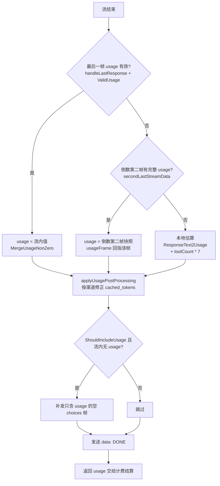
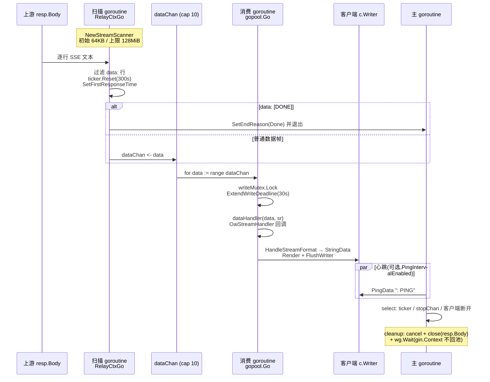
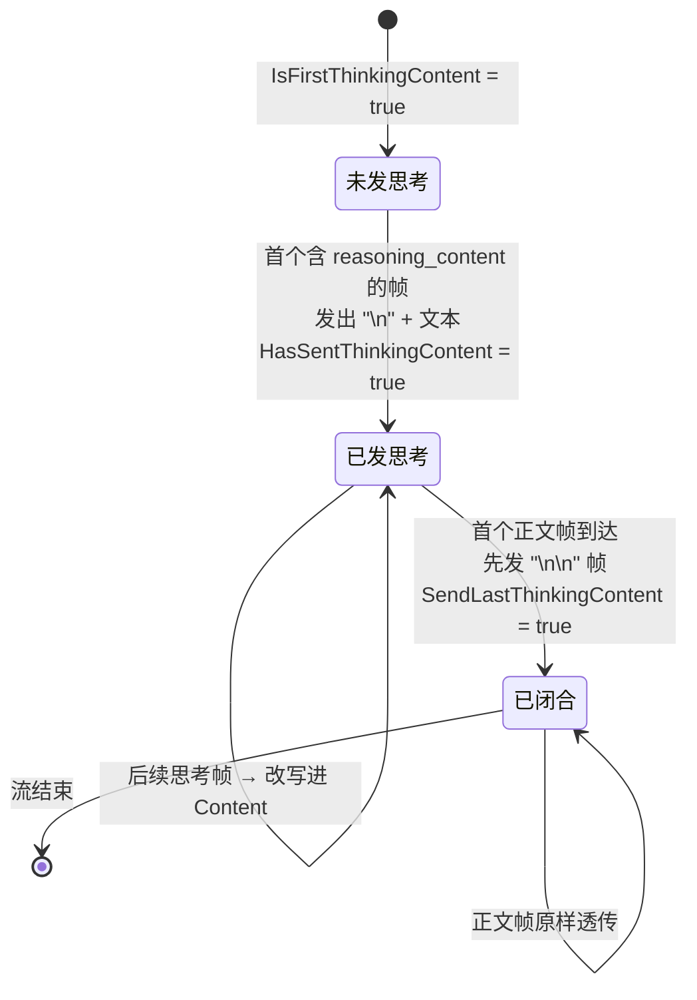

# 05 流式处理与 SSE 中继:逐帧转发的流水线

> 一句话定位:本篇拆解 new-api 把上游 AI 提供商的 SSE 流「边读、边转换、边计费、边转发」给客户端的完整链路——`StreamScannerHandler` 扫描流水线、`OaiStreamHandler` 的双缓冲与 usage 三级兜底、`<think>` 标签状态机,以及流式场景下的超时、断连与错误处理。读完你能独立看懂任何一个渠道的流式 handler,并能把它移植到自己的 Java 网关里。

## 🎯 本篇你将学到

- SSE(Server-Sent Events)帧的写出原语:`StringData` / `ObjectData` / `Done` / `FlushWriter`,以及必须设置的响应头
- `StreamScannerHandler` 的「三 `goroutine` + 一条 `channel`」流水线:扫描、转换、心跳各司其职,`goroutine` + `channel` ≈ Java 的线程池 + `BlockingQueue`
- `OaiStreamHandler` 为什么保留 `lastStreamData` 和 `secondLastStreamData` 两帧缓冲,usage(用量)为什么需要三级兜底
- `ForceFormat` / `ThinkingToContent` 两个渠道开关背后的 `<think>` 标签注入/闭合状态机
- 为什么全局 gzip 中间件会杀死 SSE(`main.go:200`),以及首响应时间 `SetFirstResponseTime` 的并发安全设计
- 流结束原因(`StreamStatus`)如何沉淀进消费日志,供管理后台审计

## 🧠 核心概念

**🔎 SSE 是什么。** SSE 是一种基于 HTTP 的单向服务器推送协议:响应头 `Content-Type: text/event-stream`,响应体由一帧一帧文本构成,每帧形如 `data: <内容>\n\n`,用一个只含 `data: [DONE]` 的帧表示结束。它和 WebSocket 的区别在于:HTTP 单向、纯文本、天然过网关和 CDN。在 Java 世界里,SSE ≈ Spring MVC 的 `SseEmitter` 或 Servlet 异步上下文里手动 `write + flush`;而本篇的「中继」角色 ≈ 一个同时持有上游 `HttpURLConnection` 响应流和下游 `SseEmitter` 的透明代理,只不过它不是字节级透传,而是**逐帧解析后重组**。

**🔎 为什么网关必须逐帧解析而不是透传字节。** 因为 new-api 是「会计网关」:它要从流里读出 `usage` 来扣费,要按客户端请求的格式(OpenAI/Claude/Gemini 三种协议互转)重写每一帧,还要在客户端没要 usage 时补发一个最终 usage 块。字节透传做不到这些。这也解释了本篇的核心矛盾:**流是无限长的、逐帧到达的,而计费结算需要「最终」数据**——所有设计(双缓冲、延迟一帧、三级兜底)都是围绕这个矛盾展开的。

**🔎 为什么需要扫描器。** Go 标准库的 `bufio.Scanner` ≈ Java 的 `BufferedReader.readLine()`,按行切分读取。SSE 帧以行为单位,所以「按行扫 + 过滤 `data:` 前缀」就是最朴素的 SSE 解析器;`[DONE]` 是 OpenAI 系的约定结束标记。

## 🔍 源码剖析

### 一、写出原语:一帧数据的旅程

所有渠道写流都走 `relay/helper/common.go` 里这几个函数:

```go
// relay/helper/common.go:97
func StringData(c *gin.Context, str string) error {
    if c == nil || c.Writer == nil { return errors.New("context or writer is nil") }
    if requestContextDone(c) {                       // 客户端已断开 → 直接报错,不再写
        return fmt.Errorf("request context done: %w", c.Request.Context().Err())
    }
    c.Render(-1, common.CustomEvent{Data: "data: " + str})  // 拼 "data: " 前缀
    return FlushWriter(c)                            // 立刻刷出,不能攒缓冲
}

// relay/helper/common.go:125  对象帧:序列化后复用 StringData
func ObjectData(c *gin.Context, object interface{}) error {
    jsonData, err := common.Marshal(object)          // 统一走 common.Marshal 封装
    ...
    return StringData(c, string(jsonData))
}

// relay/helper/common.go:136  结束帧
func Done(c *gin.Context) { _ = StringData(c, "[DONE]") }
```

三个细节值得注意。其一,`FlushWriter`(`common.go:17`)内部 `recover()` 了写 panic,并先检查 `requestContextDone`——客户端断开后继续写会得到错误而不是崩溃。其二,`common.Marshal` 是项目强制的 JSON 封装(见 `AGENTS.md`),业务代码禁止直接调 `encoding/json`。其三,`SetEventStreamHeaders`(`common.go:45`)用 `c.Set("event_stream_headers_set", true)` 做了幂等保护,反复调用不会重复写头:

```go
// relay/helper/common.go:54-58
c.Writer.Header().Set("Content-Type", "text/event-stream")
c.Writer.Header().Set("Cache-Control", "no-cache")
c.Writer.Header().Set("Connection", "keep-alive")
c.Writer.Header().Set("Transfer-Encoding", "chunked")
c.Writer.Header().Set("X-Accel-Buffering", "no")   // 明确告诉 nginx:别缓冲我
```

**为什么这么设计:** `X-Accel-Buffering: no` 是给反向代理看的——nginx 默认会缓冲上游响应再整块下发,SSE 会被它「攒到结束才吐」,这个头是最轻量的逃生口。

### 二、扫描流水线:三 `goroutine` + 一条 `channel`

`StreamScannerHandler`(`relay/helper/stream_scanner.go:77`)是所有 33 个渠道流式 handler 的公共底座。它把「读上游」「写下游」「发心跳」拆成三个并发单元:

```go
// relay/helper/stream_scanner.go:199-224
dataChan := make(chan string, 10)          // 缓冲 10 帧的队列

gopool.Go(func() {                          // ① 消费者:业务回调
    for data := range dataChan {
        sr.reset()
        writeMutex.Lock(); defer writeMutex.Unlock()
        ExtendWriteDeadline(c)              // 单次写阻塞上限 30s(stream_scanner.go:33)
        dataHandler(data, sr)               // 各渠道自己的转换逻辑
        if sr.IsStopped() { return }        // 回调可要求终止
    }
})

common.RelayCtxGo(ctx, func() {             // ② 生产者:扫描器(跑在带 panic 钩子的池里)
    for scanner.Scan() {                    //   按行读上游
        ticker.Reset(streamingTimeout)      //   每来一行就重置空闲超时
        data := scanner.Text()
        if len(data) < 6 { continue }
        if data[:5] != "data:" && data[:6] != "[DONE]" { continue } // 只认 data: 行
        data = strings.TrimSpace(data[5:])
        if data == "" { continue }
        if !strings.HasPrefix(data, "[DONE]") {
            info.SetFirstResponseTime()     //   首帧时间在这里记录(:266)
            info.ReceivedResponseCount++
            select { case dataChan <- data: case <-ctx.Done(): return }
        } else {
            info.StreamStatus.SetEndReason(relaycommon.StreamEndReasonDone, nil)
            return                          //   [DONE] → 正常结束
        }
    }
})
```

注意扫描器**丢弃了所有非 `data:` 行**——SSE 的 `event:`、`id:`、`retry:` 行一律不透传。这看起来激进,实则自洽:下游帧的 `event:` 行由写出端按 DTO 类型重新生成,例如 Claude 分支的 `ClaudeData`(`common.go:70`)会先 `Render` 一行 `event: <type>` 再写 `data:`。

主 `goroutine` 只做一件事——等待三种结局(`stream_scanner.go:293-302`):

```go
select {
case <-ticker.C:                     // 空闲超时:上游 300s(可由 env STREAMING_TIMEOUT 调)没吐任何帧
    info.StreamStatus.SetEndReason(relaycommon.StreamEndReasonTimeout, nil)
case <-stopChan:                     // 任意 goroutine 主动结束
case <-c.Request.Context().Done():   // 客户端断开
    info.StreamStatus.SetEndReason(relaycommon.StreamEndReasonClientGone, ...)
}
```

客户端断开的处理注释写得很清楚(`stream_scanner.go:299-300`):**立即 `cleanup()` 关闭上游 `resp.Body`**,解除扫描器的阻塞读,让上游停止生成——避免为一个已经放弃的请求继续烧上游 token。`cleanup`(`:124-141`)用 `sync.Once` 保证只跑一次,并且 `defer cleanup()` 挂在函数出口,注释点明了动机:**确保 `gin.Context` 不在还有 `goroutine` 引用它时被归还给 Gin 的对象池**——这是一个经典的池化对象生命周期陷阱,Java 里对应「请求作用域对象被异步线程持有后复用」的隐蔽 `bug`。

**为什么这么设计:** 读与写分离成两个 `goroutine`,是因为上游逐帧到达而下游写可能阻塞(慢客户端),解耦后扫描器不会被下游卡死;`writeMutex` 则保证心跳帧和数据帧不会交错写出。**可借鉴到 Java 项目的点:** 这就是「读线程 + 有界队列 + 写线程」的经典背压结构,用 `SynchronousQueue`/`ArrayBlockingQueue` + 两个线程即可复刻;`ExtendWriteDeadline` 对应给每次 `write` 设置写超时,防止慢客户端把处理线程永久挂住。

### 三、`OaiStreamHandler`:延迟一帧与双缓冲

`relay/channel/openai/relay-openai.go:103` 是最核心的流式 handler,也是全篇最精巧的一段。先看它的两个缓冲变量:

```go
// relay/channel/openai/relay-openai.go:119-120
var lastStreamData string
var secondLastStreamData string // 保留倒数第二个stream data;部分兼容网关把完整usage放在倒数第二个事件
```

回调里体现了「延迟一帧转发」:

```go
// relay/channel/openai/relay-openai.go:124-143
helper.StreamScannerHandler(c, resp, info, func(data string, sr *helper.StreamResult) {
    if lastStreamData != "" {                          // ① 先转发「上一帧」
        if err := HandleStreamFormat(c, info, lastStreamData, ...); err != nil {
            sr.Error(err)                              //    软错误:记一笔,流继续
        }
    }
    if len(data) > 0 {
        if lastStreamData != "" { secondLastStreamData = lastStreamData }  // ② 再挪缓冲
        lastStreamData = data                          // ③ 当前帧暂存,不立即发
        collectStreamFunctionCallNames(data, seenStreamToolCalls, &streamFunctionCallNames)
        processTokenData(info.RelayMode, data, &responseTextBuilder, &toolCount) // ④ 攒文本供本地估算
    }
})
```

也就是说:每一帧都是**在下一帧到达时才被转发**,真正的「最后一帧」被留到了扫描结束后单独处理(`relay-openai.go:175-179`)。为什么?因为最后一帧承载 `finish_reason` 和 `usage`,是否透传需要结合客户端是否要 usage(`info.ShouldIncludeUsage`,来自请求的 `stream_options.include_usage`,在 `relay/compatible_handler.go:68` 落地)才能决定;同时本地估算兜底也必须等流结束才知道用不用得上。

**双缓冲的用途**在扫描结束后揭晓:

```go
// relay/channel/openai/relay-openai.go:152-165
// 部分兼容网关把完整的累计usage附在倒数第二个事件上,随后发送一个空的最后事件。
// 仅当最后一个事件没有有效usage时,回退到倒数第二个事件的完整快照。
usageFrame := lastStreamData
if !containStreamUsage && secondLastStreamData != "" {
    var streamResp struct{ Usage *dto.Usage `json:"usage"` }
    err := common.Unmarshal([]byte(secondLastStreamData), &streamResp)
    if err == nil && streamResp.Usage != nil &&
        streamResp.Usage.PromptTokens > 0 &&
        (streamResp.Usage.CompletionTokens > 0 || streamResp.Usage.TotalTokens > 0) {
        usage = dto.MergeUsageNonZero(usage, streamResp.Usage)
        containStreamUsage = true
        usageFrame = secondLastStreamData
    }
}
```

这段代码是长期对抗第三方「兼容网关」(套壳上游)的经验结晶:它们常把累计 `usage` 挂在**倒数第二帧**,最后再发一个空帧收尾。仅用单帧缓冲就会把真正的 `usage` 冲掉。回退条件写得非常保守——`PromptTokens > 0` 且 `CompletionTokens` 或 `TotalTokens` 大于 0,防止把空壳 `usage` 当真。**可借鉴到 Java 项目的点:** 做多上游聚合时,永远不要假设上游严格符合官方协议;保留最近 N 帧的环形快照 + 保守的合法性校验,是对抗不规范上游的通用武器。

### 四、usage 三级兜底

计费必须有数。`OaiStreamHandler` 按优先级走了三级:

1. **流内 `usage`**:`handleLastResponse`(`relay/channel/openai/helper.go:164`)解析最后一帧,`service.ValidUsage`(`service/usage_helpr.go:31`,非 nil 且 prompt/completion 至少一个非零)通过则用 `dto.MergeUsageNonZero`(`relaykit/dto/usage_merge.go:12`,只覆盖非零字段)合并;
2. **倒数第二帧快照**:上一节的双缓冲回退;
3. **本地估算**(`relay-openai.go:181-184`):

```go
if !containStreamUsage {
    usage = service.ResponseText2Usage(c, responseTextBuilder.String(),
                                       info.UpstreamModelName, info.GetEstimatePromptTokens())
    usage.CompletionTokens += toolCount * 7      // 每个 tool call 按经验值 7 token 计
}
```

`ResponseText2Usage`(`service/usage_helpr.go:22`)按模型 tokenizer 估算输出 token,并用 `common.SetContextKey(c, constant.ContextKeyLocalCountTokens, true)` 在上下文里打标「这是本地估算的」,供日志与计费链路识别。`toolCount * 7` 是对工具调用参数 JSON 的粗估——工具调用的 `arguments` 也要计费,但 tokenizer 逐帧拼 JSON 成本高,经验值是简单而足够安全的折中。

之后还有一道按渠道修正:`applyUsagePostProcessing`(`relay/channel/openai/usage.go:10`)处理 DeepSeek / 智谱 / Moonshot / Llama 的 `cached_tokens` 字段位置不一致问题——例如 Moonshot 把缓存命中数放在非标准位置,需要从响应体里再挖一次。最后 `HandleFinalResponse`(`relay/channel/openai/helper.go:192`)按下游格式收尾:OpenAI 格式下若客户端要 `usage` 但流内没有,补发一个 `choices` 为空、只带 `usage` 的帧,再发 `[DONE]`。



### 五、`ForceFormat` / `ThinkingToContent`:`<think>` 状态机

`HandleStreamFormat`(`relay/channel/openai/helper.go:23`)按下游格式分发:OpenAI 走 `sendStreamData`,Claude 走 `handleClaudeFormat`(`ConvertStreamResponse` 把一帧 OpenAI 增量拆成若干 `ClaudeResponse` 事件),Gemini 走 `handleGeminiFormat`(经 `relayconvert.ResponseStreamState` 有状态转换,详见 04-relaykit-conversion.md)。

`sendStreamData`(`relay/channel/openai/relay-openai.go:22`)有两个开关,均来自渠道配置 `dto.ChannelSettings`(`relaykit/dto/channel_settings.go:15-16`):

- **快速路径**(`:27-29`):两个开关都关时直接 `helper.StringData(c, data)` 原样透传——零解析开销,这是绝大多数流量的路径;
- **`ForceFormat`**:把每帧反序列化成 `dto.ChatCompletionsStreamResponse` 再重新序列化发出(`:36-38`),用于「上游帧格式不规范(字段名错、类型漂移)」的脏渠道,相当于强制过一遍 schema 校验器;
- **`ThinkingToContent`**:把推理模型的 `reasoning_content` 字段降级成正文里的 `<think>...</think>` 标签,服务那些不认识 reasoning 字段的旧客户端。它是一个真正的状态机,状态存在 `info.ThinkingContentInfo`(`relay/common/relay_info.go:27-31`):

```go
// relay/common/relay_info.go:27
type ThinkingContentInfo struct {
    IsFirstThinkingContent  bool   // 还没发过任何思考帧
    SendLastThinkingContent bool   // 闭合标签是否已发
    HasSentThinkingContent  bool   // 是否真的发过思考内容
}
```

三个转移(`relay-openai.go:54-97`):首帧带思考内容时,复制响应、把内容改写为 `"<think>\n" + 思考文本` 并清空 `ReasoningContent`(`:59-65`);当首次出现正文且思考已发过、闭合标签未发时,先单独发一帧内容为 `"\n</think>\n"` 的帧(`:77-86`);此后所有思考帧直接搬进 `Content` 字段(`:89-92`)。**为什么这么设计:** 状态必须跨帧存放在 `RelayInfo` 而不是闭包变量里,因为转换逻辑与扫描器生命周期解耦,且 `RelayInfo` 本来就是单请求上下文载体(≈ Java 里挂在请求作用域的转换器状态对象)。

### 六、Claude 与 Gemini 的流式 handler

`ClaudeStreamHandler`(`relay/channel/claude/relay-claude.go:287`)复用同一个 `StreamScannerHandler`,但错误策略更严:`HandleStreamResponseData` 出错直接 `sr.Stop(err)`(`:296-300`),整个流立即终止——因为 Claude 帧之间有强依赖(`message_start` 携带模型名,`message_delta` 携带 usage),一帧解析失败后续全是垃圾。它还专门给 AWS Bedrock 打了补丁:Bedrock 的 `message_delta` 常缺 `input_tokens`,于是用 `patchClaudeMessageDeltaUsageData`(`:115`)在转发前把完整 usage 补进帧里。

`geminiStreamHandler`(`relay/channel/gemini/relay-gemini.go:167`)则展示另一侧兜底:每帧用 `MergeGeminiUsageMetadataNonZero` 累计 `usageMetadata`;若全程没有拿到可计费的 `usageMetadata`,回退到 `ResponseText2Usage`,而图片输出按 `imageCount * 1400` token 计(`:220-231`)。流结束后还会检查 `info.StreamStatus.IsNormalEnd()`,异常结束只记 `LogWarn` 不报错(`:239-241`)——流已经吐了一半,报错给客户端无意义,但必须留痕。

## 📐 图解

下面两张图严格对应源码结构。



`<think>` 标签状态机(仅 `ThinkingToContent=true` 时启用):



## 🎓 设计精妙之处与可借鉴点

**✅ 软错误与硬错误分离(`StreamResult`)。** `relay/helper/stream_result.go:10` 给每个回调传入一个可复用的 `StreamResult`:`Error()` 记软错误(流继续)、`Stop()` 记致命错误(流终止)、`Done()` 标记正常收尾。`OaiStreamHandler` 对单帧 JSON 解析失败用 `sr.Error`(`relay-openai.go:128`),Claude 则用 `sr.Stop`(`relay-claude.go:299`)——同一底座,不同渠道按协议刚性选择严格度。**可借鉴:** Java 流式管道里别用一个 `Exception` 表达所有失败;把「跳过这一帧」和「终止这条流」显式建模成回调 API 的一部分。

**✅ 结束原因「首因唯一」(`sync.Once`)。** `StreamStatus.SetEndReason`(`relay/common/stream_status.go:45`)用 `endOnce` 保证只有第一次写入生效,`RecordError` 则用互斥锁累积软错误(上限 20 条)。多 `goroutine` 竞争写状态时,「第一个到达的原因才权威」的语义让后续日志不会互相覆盖;`IsNormalEnd`(`:88`)把 `done / eof / handler_stop` 视为正常,其余(`timeout / client_gone / panic / ping_fail / scanner_error`)视为异常,`service/log_info_generate.go:138` 的 `appendStreamStatus` 把这套摘要写进消费日志的公开字段,管理后台可按 `end_reason` 检索。**可借鉴:** 用一次性的「终态写入器」替代散落在各处的布尔标志位,审计信息自然成型。

**✅ 池与 panic 的双保险。** 扫描 `goroutine` 通过 `common.RelayCtxGo`(`common/gopool.go:23`)跑在字节跳动 `gopool` 上,池级 `PanicHandler` 会从 `ctx` 里取出 `stop_chan` 发停止信号(`gopool.go:14-19`);每个 `goroutine` 内部还有一层 `defer recover`(`stream_scanner.go:231-238`)设置 `StreamEndReasonPanic`。两层兜底确保任何一处 panic 都不会泄漏 `goroutine` 或挂死请求。**可借鉴:** Java 里给流式任务套 `try/finally` + 超时包装,并把「取消信号」放进任务上下文,而不是靠线程中断传播。

**✅ 写超时守护清理路径。** `streamWriteTimeout = 30s`(`stream_scanner.go:33`)的注释直白:若无写超时,一个 TCP 缓冲占满但仍连着的慢客户端会让 `cleanup` 里的 `wg.Wait()` 永远等不回来。**可借鉴:** 任何「等待后台任务退出」的关闭逻辑,都必须给每一类阻塞 I/O 设上限,否则优雅关闭形同虚设。

## ⚠️ 常见坑与注意事项

- **全局 gzip 会杀死 SSE。** `main.go:200-201` 的注释原话是 `// This will cause SSE not to work!!!`,`gzip.Gzip(gzip.DefaultCompression)` 被注释掉。原因:gzip 中间件包装了响应写入器并自行攒缓冲压缩,`FlushWriter` 的逐帧刷出会被缓冲层拦下,帧变成「响应结束后一次性到达」。Java 里给 Spring 的 `server.compression.enabled` 或 `Filter` 级 gzip 也要对 `text/event-stream` 做排除。
- **大帧会撑爆扫描器。** `bufio.Scanner` 上限是 `DefaultMaxScannerBufferSize = 128 << 20`(`stream_scanner.go:27`,源码注释写 64MB,实际值是 128 MiB,注释已过时),可用环境变量 `STREAM_SCANNER_MAX_BUFFER_MB`(`common/init.go:184`)调整。超长单帧(例如巨型 base64 图片)会触发 `scanner.Err()` 并以 `scanner_error` 结束。
- **`data:` 行过滤是硬编码五字节。** `data[:5] != "data:"`(`stream_scanner.go:257`)意味着 `event:`/`id:` 行被丢弃、且不支持 SSE 规范里的多行 `data:` 拼接——对接非 OpenAI 风格 SSE 时要意识到这个简化。
- **`gin.Context` 的池化陷阱。** 流式 `goroutine` 在 handler 返回后仍持有 `c`,所以 `cleanup` 必须在函数出口 `defer` 等待(`stream_scanner.go:140-141`)。在 Java 中等价于:请求作用域对象(如 `RequestContextHolder`)被异步线程引用时,务必显式 join。
- **计费输入必须饱和防护。** 本地估算的 `toolCount * 7` 与各处 token 数都是计费乘数,`AGENTS.md` 明确要求一切额度换算走 `common/quota_math.go` 的饱和辅助函数,禁止裸 `int` 强转;新增中继格式必须从第一天就在校验器里限制 `max_tokens` 字段。
- **`lastStreamData` 可能是空串。** 若上游一帧未发即断连,`handleLastResponse` 对空串做 `Unmarshal` 会返回错误,代码靠日志兜住而不是 panic(`relay-openai.go:147-150`)——复用这段逻辑时别删掉空串判断。

## 🏋️ 刻意练习:缺陷预演

> 先自己想 2 分钟,再看参考思路。

### 练习 1|客户端断开后的清理时序

- 🔴 **反模式预演**:删掉主循环里「客户端断开 → 立即 `cleanup()`」这条分支,改成「让扫描器自己读到上游 EOF 再收尾」(`relay/helper/stream_scanner.go:298-302`)。攻击脚本:发起 `max_tokens` 拉满的长输出请求,收到第一帧就断开连接,并发 50 路。请推演:上游此刻在做什么?结算侧按什么数扣用户的钱(`relay/channel/openai/relay-openai.go:181-184`)?这笔账里平台亏的是谁的钱?
- 🟡 **陷阱预判**:有人觉得 `cleanup`(`relay/helper/stream_scanner.go:124-141`)里先关 body 再 `wg.Wait()` 顺序随意,把它反过来了。清理顺序反转后会永久卡在哪一行?泄漏掉的分别是什么?
- 💡 **参考思路**:上游在继续烧 token——不关 `resp.Body`,扫描器一直阻塞在读上,上游把剩余 token 全部生成完,这笔钱网关要真金白银付给上游;结算侧却只有半截文本的本地估算,用户实付远小于上游成本,差额全是平台净亏,50 路并发就是一条稳定的烧钱管道。陷阱那边 `wg.Wait()` 卡死:扫描器仍阻塞在上游读上永不退出,而 `sync.Once` 已进入但永不返回,后续每一次 `cleanup()` 调用都会堵在同一个门上,每个请求泄漏一对 `goroutine` 加一条上游连接,连接池耗尽后整个节点拒绝服务。

### 练习 2|双缓冲被「简化」成单缓冲

- 🔴 **反模式预演**:有人嫌 `secondLastStreamData`(`relay/channel/openai/relay-openai.go:120`)多余,删掉它并把「延迟一帧」改成「收到即转发」。现在对接一个把累计 `usage` 挂在倒数第二帧、最后发空壳帧收尾的兼容网关。推演三步:①`handleLastResponse` 在最后一帧能解析出什么?②计费最终落到哪条兜底?③这条账单与真实用量的偏差出现在哪两处?
- 🟡 **陷阱预判**:回退判定里那三个非零条件(`relay-openai.go:160-162`)看着啰嗦,有人把它们删了。此刻一个倒数第二帧带 `"usage": {}` 空对象的上游会触发什么?顺着 `MergeUsageNonZero`(`relaykit/dto/usage_merge.go:12`)的合并语义想到底。
- 💡 **参考思路**:`ValidUsage` 判零后流内 usage 作废,计费落进本地估算兜底——计费口径从「上游实测」静默退化成「网关预测」,唯一留痕是 `ContextKeyLocalCountTokens` 打标(`service/usage_helpr.go:23`);而且偏差两头挨打:估算的 `CachedTokens` 恒为 0,缓存命中本应按 `CacheRatio` 打折(`service/quota.go:272-276`),高命中渠道用户被按全价多扣,输入侧(`prompt`)用的又是请求前估算值(`relay/common/relay_info.go:756`)而非上游实测。陷阱那边更狠:空对象合并后 `usage` 依旧全零,却把 `containStreamUsage` 置真、跳过本地估算,整条请求按约 0 token 结算——白嫖通道打开,这正是那三个保守校验存在的理由。

### 练习 3|`dataChan` 的有界缓冲

- 🔴 **反模式预演**:把 `make(chan string, 10)`(`relay/helper/stream_scanner.go:199`)改成无界切片加锁,理由是「缓冲越大越不容易丢帧」。现在来一个半死客户端:TCP 缓冲占满但连接未断,每帧写都要耗满 30 秒写超时(`relay/helper/stream_scanner.go:33`)。请画出内存曲线,并说明单帧上限 128MiB(`relay/helper/stream_scanner.go:27`)在这条链路里扮演什么角色。
- 🟡 **陷阱预判**:有人嫌投递处的 `select` 三分支啰嗦(`relay/helper/stream_scanner.go:269-275`),简化成裸 `dataChan <- data`。当消费 `goroutine` 因 `sr.Stop()` 提前退出(Claude 渠道一帧解析失败就会这样)而队列已满时,会发生什么?哪一行永远等不到?
- 💡 **参考思路**:有界 10 的本质是把背压一路传导回上游:队列满 → 生产者阻塞在向 `dataChan` 投递那一步 → 不再读上游 → TCP 接收窗口收缩 → 上游停止生成,内存上界被钉死在 10 帧;无界化后,慢客户端消费期间上游吐出的每一帧全堆在网关内存里,128MiB 的单帧上限反而成了放大器,几十个并发就能把节点打出内存溢出(OOM)、殃及所有租户。陷阱那边,消费方提前退出时靠 `defer` 里的 `stop()` 关闭 `stopChan`,配合投递 `select` 里的 `stopChan` 分支救场(`relay/helper/stream_scanner.go:208`、`:273`);简化成裸投递后这层保护没了,生产者会永久阻塞,`wg.Wait()` 与 `defer cleanup()` 挂死,这条请求永不结束。

## 🎯 决策复盘:复现作者的取舍

### 决策 1|错误分级:软错误续流 vs 硬错误熔断(岔路口:一帧坏,整条流要不要陪葬)

**场景**:同一个 `StreamScannerHandler` 底座,回调里单帧解析失败怎么办由各渠道自定。OpenAI 用 `sr.Error`(`relay/channel/openai/relay-openai.go:128`),Claude 用 `sr.Stop`(`relay/channel/claude/relay-claude.go:299`)——同一底座,两种严格度,这不是风格差异。

- 方案 A:一律软错误——记一笔,丢掉坏帧,流继续。
- 方案 B:一律硬错误——立即终止整条流,错误上抛。
- 方案 C:按帧语义动态分级——元数据帧失败才熔断,内容帧失败跳过。

**你来权衡**:A 遇上「上游协议系统性漂移」会把请求变成什么样?B 在「上游偶发抖动」时浪费了什么?C 的判定成本由谁承担、误判的后果是什么?

- 💡 **参考思路**:① 作者两个都用了,切分依据是帧间耦合度:OpenAI 每帧自带完整增量,坏一帧只缺一段文本,续流价值大;Claude 的 `message_start` 带模型名、`message_delta` 带 `usage`,帧间强依赖,一帧坏后续全是垃圾,硬错误止损更快。② A 的沉重代价在「漂移常态化」时爆发:帧帧失败、帧帧丢弃,客户端拿到「成功但内容残缺」的响应,`usage` 也解析不到 → 回退本地估算照常扣费,用户花钱买了一堆空气,而这些软错误只进 `StreamStatus.Errors`(上限 20 条,`relay/common/stream_status.go:24`),不熟悉这套机制的人根本不会去看。③ B 的代价是把可恢复的部分成功变成硬失败,上游偶发抖动一次就废掉几十秒的输出。④ 反转条件:当某渠道格式漂移从偶发变成常态,应改开 `ForceFormat`(强制过一遍 schema 重写)或切硬错误让失败尽早暴露;反之,只有上游开始提供帧级自描述(每帧带类型与序号)时,C 的动态分级才值得引入。

### 决策 2|计费兜底:本地估算 vs 按 0 结算 vs 拒绝结算(岔路口:流式计费的「最终数」从哪来)

**场景**:流式响应结束,计费必须有一个 `usage`,但上游可能全程不给——流内没有 `usage` 帧,倒数第二帧也没有。账不能不结,也不能乱结。

- 方案 A:按 0 结算——拿不到就不扣,日志标注「`usage` 缺失」。
- 方案 B:本地估算强制结算——`ResponseText2Usage` 加 `toolCount*7`(`relay/channel/openai/relay-openai.go:181-184`),并在上下文打标 `ContextKeyLocalCountTokens`(`service/usage_helpr.go:23`)。
- 方案 C:结算失败即报错,标记欠费,事后人工对账。

**你来权衡**:A 的免费敞口会被什么放大?B 的系统性偏差往哪个方向亏?C 的运维成本在什么规模下爆炸?什么条件下 A/C 反而更优?

- 💡 **参考思路**:① 作者选 **B**,且 Gemini、音频等路径同样打标兜底(`relay/channel/gemini/relay-gemini.go:229`),换来的是「上游 token 永不白送」。② A 的敞口最恶毒的形态是渠道级:管理员接入的上游(或它前面的中间层)只要系统性吞掉 `usage` 帧,该渠道全部流量就 0 计费,变成无限量白嫖通道;C 则在偶发丢 `usage` 的高频路径上制造海量欠费工单,只配当审计告警,不配当主路径。③ B 的代价是口径偏差:估算的 `CachedTokens` 恒为 0,缓存高命中渠道被按全价多扣(`service/quota.go:272-276`),`toolCount*7` 是经验值、超长工具参数会被低估——偏差方向不固定,但都靠 `ContextKeyLocalCountTokens` 写进消费日志留痕(`service/log_info_generate.go:90`)。④ 反转条件:估算精度极差(不认识的 tokenizer、多模态输出)或用户可信、单价极低的内部部署,A 加事后对账更划算;而一旦离开这条日志审计线,B 就等于静默改价,谁也不敢用。

## 🔗 与其他模块的关系

- 00-soul.md:一次聊天请求的完整生命周期中,流式转发处于「上游响应到达」与「计费结算」之间
- 02-routing-middleware.md:中间件链为何不能加全局 gzip、`RequestId` 如何进入 `gin.Context`
- 03-adaptor-system.md:`DoResponse` 如何按渠道把 `*http.Response` 分发给 `OaiStreamHandler` / `ClaudeStreamHandler` 等
- 04-relaykit-conversion.md:`HandleStreamFormat` 里 Claude/Gemini 分支调用的 `relayconvert` 有状态转换器细节
- 06-billing-overview.md / 07-billingexpr.md:本篇的 `usage` 是计费结算的直接输入;预扣费与差额结算在彼处展开
- 08-channel-ability.md:`ChannelSettings` 的 `ForceFormat` / `ThinkingToContent` 来自渠道配置
- 12-logging-dashboard.md:`appendStreamStatus` 与 `ContextKeyLocalCountTokens` 如何体现在消费日志与看板
- 14-task-system.md:异步任务类渠道(视频生成等)有另一套轮询式状态推进,不走 SSE

## 📚 小结

流式中继的本质是「在一条不可回放的、随时可能中断的管道上,同时完成协议转换、计量与审计」。new-api 的答案是四件套:**公共扫描底座**(`StreamScannerHandler` 把并发、超时、断连、心跳、panic 全部收口,渠道只写纯转换回调)、**写出原语**(`StringData`/`ObjectData`/`Done` 统一帧格式与刷新语义)、**状态与终态建模**(`StreamStatus` + `StreamResult` 把错误分级、结束原因一次定型)、**防御性兜底**(usage 三级回退、双缓冲快照、按渠道修正)。理解了这套结构,再看任何一个渠道几十行的流式 handler,都只是在往同一个插槽里插入不同的转换策略——这正是它最值得移植到 Java 网关的骨架。
