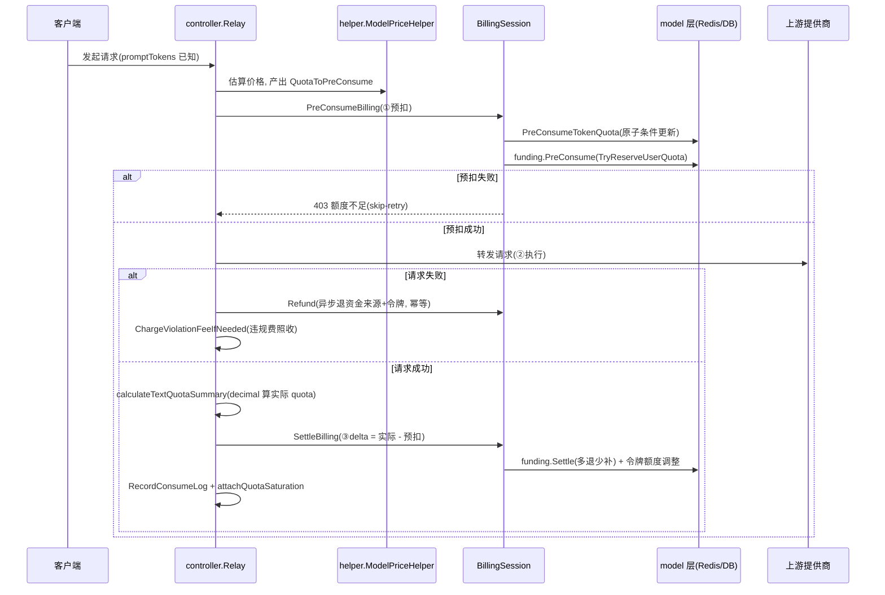
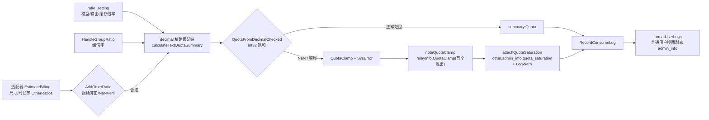

# 计费体系总览:预扣费 → 结算 → 退款的三段式闭环

> 一句话定位:本篇拆解 new-api 如何在「费用事前不可知」的前提下做到既不亏钱也不多收钱——三段式计费生命周期、倍率乘法链、配额量纲换算、int32 饱和防护与管理员审计闭环。读完你应能独立排查一笔「扣错钱」的日志。

## 🎯 本篇你将学到

- 三段式计费(预扣费/结算/退款)的完整调用链,以及为什么必须预扣。
- `PriceData` 如何汇聚模型倍率、组倍率、按次/按 Token 两套计价,以及 `AddOtherRatio` 的输入防护。
- 配额量纲:`quota` 与美元的换算,`QuotaFromFloat`/`QuotaRound`/`QuotaFromDecimal` 三种语义为何不能混用。
- 单次扣费钳制在 int32 边界的理由,以及饱和事件如何写成审计日志。
- 预扣费在 Redis Lua 与数据库条件更新下的并发安全设计。
- 违规费为何在退款之后仍要照收。

## 🧠 核心概念

**🔑 配额量纲(quota)**:系统不存美元浮点,而是存整数点数。`common/constants.go:22` 定义 `QuotaPerUnit = 500 * 1000.0`,注释写明 `$0.002 / 1K tokens`,即 **1 美元 = 500000 quota**。日志展示时再除回去:`logger/logger.go:125` 的 `LogQuota` 用 `q/common.QuotaPerUnit` 换算成美元/人民币/自定义币种。用整数记账规避了浮点累加误差——这一点和任何支付系统的「分为单位」完全一致。

**🔑 为什么要预扣费(pre-consume)**:一次聊天请求的费用取决于**输出**长度,而输出长度在调用上游前未知。如果不预扣,恶意用户可以用 1 美元余额并发发起几百个 `max_tokens` 极大的请求,响应先到手、扣费后爆表,平台倒贴上游成本。预扣费把「未知费用」折算成「预估上限」先冻结,本质就是**电商预授权**:下单冻结额度(预扣)→ 确认收货按实结算(结算)→ 取消订单解冻(退款)。

**🔑 资金来源抽象**:`service/funding_source.go:15` 定义 `FundingSource` 接口(`PreConsume`/`Settle`/`Refund`),钱包 `WalletFunding` 与订阅 `SubscriptionFunding` 两个实现。这 ≈ Java 里的策略接口 + `@Service` 实现,由 `NewBillingSession` 根据用户计费偏好(`wallet_only`/`subscription_first` 等)选择并支持失败回退,≈ Spring 的 `@ConditionalOnProperty` 组合策略。

**🔑 会话对象**:预扣/结算/退款共享状态(预扣了多少、是否已结算),所以必须有一个跨阶段对象。`service/billing_session.go:26` 的 `BillingSession` 挂在 `relayInfo.Billing` 上随请求传递,≈ Java 里放进 `RequestAttribute` 的有状态上下文对象,内部用 `sync.Mutex` 保护 ≈ 方法级 `synchronized`。

## 🔍 源码剖析

### 1️⃣ 三段式主链路:一次请求的计费骨架

入口在 `controller/relay.go:158-184`,主干只有四步:

```go
// controller/relay.go:158
priceData, err := helper.ModelPriceHelper(c, relayInfo, tokens, meta)  // 算价
...
if priceData.FreeModel {           // 免费模型跳过预扣
    logger.LogInfo(c, fmt.Sprintf("模型 %s 免费, 跳过预扣费", ...))
} else {
    newAPIError = service.PreConsumeBilling(c, priceData.QuotaToPreConsume, relayInfo)  // ① 预扣
}
defer func() {
    if newAPIError != nil {        // ③ 失败退款(含违规费)
        newAPIError = service.NormalizeViolationFeeError(newAPIError)
        if relayInfo.Billing != nil {
            relayInfo.Billing.Refund(c)
        }
        service.ChargeViolationFeeIfNeeded(c, relayInfo, newAPIError)
    }
}()
// ……重试循环里执行 relayHandler ② 上游调用,成功后走 PostTextConsumeQuota → SettleBilling
```

成功路径的结算发生在 `service/text_quota.go:451`:`SettleBilling(ctx, relayInfo, summary.Quota)`。注意退款挂在 `defer` 上——无论中途 panic、超时还是重试耗尽,只要 `newAPIError` 非空就退还预扣,这是典型的「资源释放与业务逻辑同处一地」写法,≈ Java 的 `try-with-resources`/`finally`。

**为什么必须预扣,从反面看更清楚**:预扣失败分支会把所有错误统一映射为 `ErrorCodeInsufficientUserQuota` + 403(`service/billing_session.go:223-231`),并带 `ErrOptionWithSkipRetry()` 阻止重试——余额不足换渠道重试毫无意义。

### 2️⃣ 预扣费内部:信任旁路 + 两步扣减 + 原子回滚

`PreConsumeBilling`(`service/billing.go:20-43`)第一步就检查 `relayInfo.QuotaClamp != nil`,价格换算阶段已发生饱和就直接 400 拒绝——**宁可拒单,不收可疑的钱**。随后创建 `BillingSession` 并调用 `preConsume`(`service/billing_session.go:187-241`),顺序是:

1. **信任旁路**(`shouldTrust`,`service/billing_session.go:297-330`):余额高于 `trustQuota` 的钱包用户直接 `effectiveQuota = 0`,省掉两次扣减写。但两个例外很关键:异步任务 `ForcePreConsume=true` 必须全额预扣(任务回调时用户可能已把钱花光);订阅用户永不旁路(订阅预扣依赖 `amount>0` 建记录锁定,旁路会让预扣与实际对不上)。
2. **先扣令牌额度**(`PreConsumeTokenQuota`,`service/quota.go:392-412`),注释明确「检查与扣减在同一操作中完成,并发请求不可能同时通过检查后超扣」。
3. **再扣资金来源**(`funding.PreConsume`),任一步失败则回滚已完成步骤(`service/billing_session.go:208-216` 令牌回滚)。

工厂 `NewBillingSession`(`service/billing_session.go:357-457`)按偏好选择来源:`wallet_first` 时钱包失败可回退订阅,`subscription_first` 时还要再查 `UserActiveSubscriptionsAllowWalletOverflow` 决定能否回退——策略回退链完整落在这一处。

### 3️⃣ 并发安全:条件更新 + Redis Lua,而不是 `FOR UPDATE`

这是最容易讲错的点。扣减**没有**用 `SELECT ... FOR UPDATE`,而是单条**条件 UPDATE**(`model/quota_reserve.go:144-149`):

```go
func reserveUserQuotaDB(id int, quota int) (bool, error) {
    result := DB.Model(&User{}).
        Where("id = ? AND quota >= ?", id, quota).          // 检查内嵌在 UPDATE
        Update("quota", gorm.Expr("quota - ?", quota))
    return result.RowsAffected == 1, result.Error           // 影响行数即成功标志
}
```

InnoDB/PostgreSQL 在 `UPDATE` 时对命中行加排他锁,检查与扣减一步完成,效果等价于乐观锁 CAS(`RowsAffected` 即 `affected>0` 判定)。开 Redis 时走 Lua 脚本(`model/quota_reserve.go:20-31`)在缓存侧原子完成「校验 Id/Quota → `HINCRBY` 扣减」,失败再降级到数据库条件更新(`TryReserveUserQuota`,`model/quota_reserve.go:165-199`);落库失败还会把已扣的缓存额度**补偿回去**(`cacheApplyUserQuotaDelta`)。

项目里真正的 `FOR UPDATE` 统一封装在 `model/locking.go:20` 的 `lockForUpdate`(36 处调用,用于订阅、兑换码等行锁场景),注释里点破了一个经典坑:**GORM v1 的 `tx.Set("gorm:query_option", "FOR UPDATE")` 在 GORM v2 会被静默忽略、根本不加锁**;同时 SQLite 不支持 `FOR UPDATE`,该 helper 对 SQLite 直接跳过,靠单写者模型让冲突事务失败。≈ Java 里「同一把锁在不同数据库方言下的可用性适配层」。

高频小额写再叠加**合并写**:开启 `BatchUpdateEnabled` 时,`DecreaseUserQuota`(`model/user.go:1317-1332`)只调用 `addNewRecord` 入队,`model/utils.go:44-63` 按 `(type,id)` 累加并检测加法回绕(溢出即 `SysError` 并钳到 `MaxInt`),`batchUpdate()`(`model/utils.go:65`)周期性刷库。≈ Java 的写合并缓冲(write coalescing),把 N 次行级更新压成 1 次。

### 4️⃣ 结算:多退少补与两阶段提交

`SettleBilling`(`service/billing.go:51-95`)计算 `delta = actualQuota - preConsumed`,正数补扣、负数退还,并把三种情况(补扣/退还/一致)都写成可读日志。核心在 `BillingSession.Settle`(`service/billing_session.go:42-80`):

```go
if !s.fundingSettled {
    if err := s.funding.Settle(delta); err != nil { return err }   // 步骤 1:资金来源
    s.fundingSettled = true                                        // 提交点
}
// 步骤 2:令牌额度调整,失败只能记日志
if tokenErr != nil {
    // 资金来源已提交,令牌调整失败只能记录日志;标记 settled 防止 Refund 误退资金
}
s.settled = true
return tokenErr
```

这是一套手写**两阶段提交**:`fundingSettled` 是提交点,越过它之后令牌侧失败绝不回滚资金侧(否则会多退钱),而是降级为日志告警。`needsRefundLocked`(`service/billing_session.go:133-146`)配合它在 `fundingSettled` 时返回 `false`,保证 `Refund` 不会对已结算资金重复退款。

### 5️⃣ 退款:幂等、异步、以及「订阅可重试、钱包不可重试」

`BillingSession.Refund`(`service/billing_session.go:83-124`)先在锁内置位 `refunded` 保证幂等,再复制闭包变量交给 `gopool.Go` 异步执行(≈ 提交到线程池),依次退资金来源、退订阅额外预扣、退令牌。`service/funding_source.go:67-74` 有一句极重要的注释:

```go
// IncreaseUserQuota 是 quota += N 的非幂等操作,不能重试,否则会多退额度。
// 订阅的 RefundSubscriptionPreConsume 有 requestId 幂等保护所以可以重试。
```

于是钱包退款**不重试**,订阅退款走 `refundWithRetry`(`service/funding_source.go:132-149`,3 次指数退避)。「能不能重试」取决于底层操作是否幂等,这个判断被显式写进了实现选择——非常值得照搬。

### 6️⃣ 违规费:退款之后照收

`controller/relay.go:178/182` 在同一个 `defer` 里先 `NormalizeViolationFeeError`(`service/violation_fee.go:56-71`,识别上游 CSAM 安全标记,改写成稳定错误码并启用跳过重试)、退款,再 `ChargeViolationFeeIfNeeded`(`service/violation_fee.go:103-164`):按 Grok 违规扣费设置 × 组倍率算出费额(`calcViolationFeeQuota` 用 `QuotaFromDecimal` 饱和换算),调 `PostConsumeQuota` 扣款、更新用户/渠道用量、写一条带 `violation_fee` 字段的消费日志。**退款退的是预授权,违规费是罚款,两者独立**——先解冻再罚款,顺序错了就会出现「违规请求还倒贴退款」。

### 7️⃣ 倍率体系与 `PriceData`

`types/price_data.go:16-33` 的 `PriceData` 是一次请求的价格快照:`ModelRatio`(输入倍率)、`CompletionRatio`(输出倍率)、`CacheRatio`/`CacheCreation*Ratio`(缓存读写)、`ImageRatio`/`AudioRatio`、`UsePrice`(按次计价开关)、`Quota`(按次额度)、`QuotaToPreConsume`(按量预扣额度)、`GroupRatioInfo`(组倍率)。构建在 `relay/helper/price.go:73-185` 的 `ModelPriceHelper`:先 `GetModelPrice` 判断按次/按量,再 `HandleGroupRatio`(`relay/helper/price.go:45-71`,支持用户组特殊倍率)取组倍率,然后逐项读取各倍率;**没有配置倍率的模型直接报错**(`modelPriceNotConfiguredError`,`relay/helper/price.go:21-34`,且对管理员和普通用户给出不同提示),用户可自愿开启 `AcceptUnsetRatioModel` 豁免。

预扣额度估算在 `relay/helper/price.go:96-126`:`preConsumedTokens = max(promptTokens, PreConsumedQuota) + meta.MaxTokens`,乘以 `modelRatio × groupRatio` 后经 `QuotaFromFloatStrict` 转换。免费模型判定在 `relay/helper/price.go:134-150`:组倍率、模型价格、模型倍率任一为 0 即 `FreeModel = true`(可用 `EnableFreeModelPreConsume` 关闭该优化)。

图像尺寸、视频时长这类**附加倍率**统一进 `OtherRatios`,唯一写入入口是 `AddOtherRatio`(`types/price_data.go:35-43`),守卫在 `isValidOtherRatio`(`types/price_data.go:106-108`):

```go
func isValidOtherRatio(ratio float64) bool {
    return ratio > 0 && !math.IsInf(ratio, 1)   // NaN 的 ratio>0 为 false,一并被拒
}
```

上游返回的可控数值(分辨率倍率、时长)如果混进 0、负数、NaN 或 `+Inf`,会在进入乘法链之前被丢弃,而不是把费用算成 0 或无穷。`ApplyOtherRatiosToFloat`/`ToDecimal`(`types/price_data.go:84-95`)负责统一应用。

### 8️⃣ 量纲换算:三个函数三种语义,禁止裸 cast

`common/quota_math.go` 把所有「浮点/decimal → int quota」收敛到一处,常量在 `common/quota_math.go:13-17`:

```go
const (
    MaxQuota       = math.MaxInt32      // 单次扣费上限
    MinQuota       = math.MinInt32
    MaxWalletQuota = 1<<53 - 1          // JavaScript 安全整数,float64 可精确表示
)
```

三个语义分层(`common/quota_math.go:112/133/152`):

| 函数 | 语义 | 典型场景 |
|---|---|---|
| `QuotaFromFloat` | **截断**(零方向) | 价格×倍率的浮点乘积 |
| `QuotaRound` | **四舍五入**(半远离零,`math.Round`) | 分层计费路径统一取整,避免 ±1 偏差 |
| `QuotaFromDecimal` | decimal `Round(0)` 后转 int | 精确金额计算(`shopspring/decimal`) |

底层 `saturateQuota`(`common/quota_math.go:82-100`)把 NaN 兜底为 0、越界钳到 `±MaxQuota`,每次钳制都 `SysError` 并返回 `*QuotaClamp`。**为什么禁止 `int(float64*ratio)` 裸转换**:float64 溢出到 int 的结果在 Go 中是实现相关的(常见得到一个错误的大负数),NaN 转换同样不可预期,等于把「算错了」变成「收了错的钱」。`pkg/billingexpr/round.go:12` 的 `QuotaRound` 只是委托到 `common.QuotaRound`,保证分层计费与普通计费共用同一取整策略。

实际结算金额用 decimal 精确计算(`service/text_quota.go:283-367`):各 token 类别分别乘各自倍率相加,最后 `common.QuotaFromDecimalChecked(quotaCalculateDecimal)` 一次转换;`service/text_quota.go:351-353` 还把可能变负的 `baseTokens` 钳到零(上游缓存计数可与 `prompt_tokens` 重叠),杜绝负数扣费。

### 9️⃣ 饱和审计闭环:`Checked` 变体 + `admin_info`

AGENTS.md 的计费不变式要求:任何饱和事件都要可审计。实现是一套三段管道:

1. **捕获**:计费路径一律用 `*Checked` 变体(如 `text_quota.go:365` 的 `QuotaFromDecimalChecked`),拿到 `clamp` 后 `noteQuotaClamp`(`service/text_quota.go:194-201`)把首个非空值记到 `relayInfo.QuotaClamp`;任务路径同理(`relay/relay_task.go:408-415` 的 `noteTaskQuotaClamp`)。
2. **落日志**:写消费日志前调 `attachQuotaSaturation`(`service/log_info_generate.go:36-47`),`other.SetAdmin("quota_saturation", clamp.AuditMap())` 挂到日志 `other` 的 `admin_info` 下,同时 `logger.LogWarn` 输出一条带请求上下文的后台告警。
3. **按角色可见**:`model.LogOther`(`model/log_other.go:37-42`)把元数据分成 `public`/`adminInfo`/`rootInfo` 三层,`SetPublic` 拒绝写入保留键与历史敏感键(`channel_id`、`reject_reason` 等,`model/log_other.go:19-24`);用户侧查询经 `formatUserLogs`(`model/log.go:116-122`)剥掉整个 `admin_info`。

于是「管理员能审计异常、普通用户看不到内部定价细节」**不需要任何额外权限判断**,靠日志结构的位置就实现了——≈ 用 DTO 分层投影替代散落各处的 `@JsonIgnore`。

## 📐 图解

**图一:三段式计费生命周期(真实调用链)**



**图二:倍率乘法链与饱和审计管道**



## 🎓 设计精妙之处与可借鉴点

**✅ 用「预授权」模型对冲未知成本。** 为什么这么设计:费用事后才能算准,若先服务后扣费,余额约束在并发下形同虚设。可借鉴到 Java 项目:任何「消耗资源才能定价」的场景(云函数时长、消息队列条数、AI Token)都应引入 `预扣 → 结算 → 退款` 三态对象,而不是只做请求前的余额检查。

**✅ 状态机 + 幂等位替代分布式事务。** `BillingSession` 用 `settled`/`refunded`/`fundingSettled` 三个布尔位加一把 `Mutex`,把「结算一半失败」这种分布式难题压缩成显式状态机,并对「资金已提交但令牌失败」选择**记日志不回滚**——因为回滚重试反而可能多退钱。可借鉴:Java 里不必为每段资金操作上 Seata,先画出提交点,再决定哪些失败可重试(幂等操作)、哪些只能告警(非幂等操作)。

**✅ 并发安全选型按成本分层。** 为什么这么设计:Redis Lua 原子扣减是快路径,数据库条件 UPDATE 是兜底路径,两者都天然避开长事务;`FOR UPDATE` 只留给订阅、兑换码这类必须串行化的短临界区。可借鉴:Java 里不必凡事 `select for update`,条件 UPDATE + 影响行数判定(`affected==1`)常是更短、更不易死锁的方案。

**✅ 换算函数只有一个家,且「宁可拒单不收错钱」。** 所有浮点→int 的转换集中到 `common/quota_math.go`,预扣阶段用 `*Strict`(饱和即报错),结算阶段用 `*Checked`(饱和后继续但留审计证据)——同一件事在不同阶段采用不同容错强度。可借鉴:金额换算工具类应统一收口并写明取整语义(截断/半远离零),`Strict`/`Checked` 双变体是很轻量的风控分层。

**✅ 审计信息靠结构而非逻辑实现权限。** `admin_info` 嵌套 + 用户视图整层剥离,新增管理员字段零权限代码。可借鉴:Java 日志/响应 DTO 按受众分层(public/admin/root),序列化层统一裁剪,避免每个接口手写字段过滤。

## ⚠️ 常见坑与注意事项

**⚠️ 不要直接写 `PriceData.OtherRatios`。** `otherRatios` 是私有字段,必须走 `AddOtherRatio`;绕过守卫写入 `0`/`NaN` 会让整条费用链归零或异常(AGENTS.md 明确要求)。

**⚠️ 不要引入新的本地换算 helper 或裸 cast。** `int(float64*ratio)`、`int(decimal.IntPart())` 一律禁止,统一用 `common/quota_math.go`;回归测试放边界处(参考 `common/quota_math_test.go`)。

**⚠️ GORM v1 的 `FOR UPDATE` 写法在 v2 失效。** 必须用 `model/locking.go:20` 的 `lockForUpdate`,并且它是 SQLite 安全的(自动跳过)。手写 `clause.Locking{Strength:"UPDATE"}` 会丢失 SQLite 兼容。

**⚠️ 计费相关改动必须过三库验证。** AGENTS.md 要求 SQLite/MySQL/PostgreSQL 实测,包括行锁、原生 SQL、`AutoMigrate` 幂等;单元测试不能替代。

**⚠️ `IncreaseUserQuota` 非幂等,不能加重试;`refunded`/`fundingSettled` 位不可省。** 钱包退款重试会多退额度,订阅退款靠 `requestId` 幂等才允许 `refundWithRetry`。

**⚠️ 用户可控倍率必须在入口钳制。** `*uint` 字段能接住超大正数(负数回绕后的值),`>=0` 检查不够,必须有上界;绕过 DTO 校验的旁路(透传字段、multipart、任务 metadata)需在适配器内单独钳制。

## 🏋️ 刻意练习:缺陷预演

> 先自己想 2 分钟,再看参考思路。

### 练习 1|信任额度旁路(`shouldTrust`)

- 🔴 **反模式预演**:如果删掉信任旁路,所有钱包用户一律全额预扣,会埋什么雷?算一笔账:余额 10.01 美元的用户发一个按 `max_tokens` 上限预扣要 50 美元的请求(`relay/helper/price.go:96-99`,真实输出可能只值 0.5 美元),他会看到什么?一个高并发站点每条请求因此多出哪两次写?
- 🟡 **陷阱预判**:旁路开着的时候,攻击者怎么套利?`relayInfo.UserQuota` 在 `NewBillingSession` 里什么时候读(`service/billing_session.go:366-382`)、并发 100 路各自读到什么?结算时 `WalletFunding.Settle` 允许余额变成什么(`service/billing_session.go:247-250`)?
- 💡 **参考思路**:旁路的本质是把「预授权」换成「事后账单 + 允许负余额」:阈值写死 10 美元(`common/quota.go:3-5`),余额高于它的用户 `effectiveQuota = 0`(`service/billing_session.go:191-197`),既省掉令牌与钱包两次写,也救回了被 `max_tokens` 上限误杀的高余额用户;但 `UserQuota` 只在会话创建时读一次,并发请求读到同一份旧余额、全部旁路,结算时无条件扣成负数——敞口 = 阈值之上用户的并发数 × 单请求成本。作者用「余额高 ≈ 信用好」这个代理指标接受风险,而异步任务(`service/billing_session.go:299-301`)与订阅(`service/billing_session.go:321-326`)被显式排除,正说明作者清楚「用户不在场、无法立刻结算」时这个代理会失效。

### 练习 2|`AddOtherRatio` 的入口守卫

- 🔴 **反模式预演**:如果删掉 `isValidOtherRatio` 守卫(`types/price_data.go:106-108`),让适配器把上游/请求可控的 `n`、`seconds`、`size` 倍率直接写进乘法链,两条路径各坏在哪?①按 Token 计费:这些附加倍率在预扣阶段参与估算吗(`relay/helper/price.go:121-126` 只乘了哪两项),压力全部落在结算的哪一步(`service/text_quota.go:359`)?②按次计费:倍率被污染成 `NaN` 后,费用总额走到 `QuotaFromDecimalChecked`(`service/text_quota.go:373`)变成多少,平台这一单还剩多少收入?
- 🟡 **陷阱预判**:守卫只**拒绝**非法值,并不**钳制**合法但离谱的值——`1e300` 一样能通过 `ratio > 0 && !IsInf` 检查。那为什么 `relay/relay_task.go:130-133` 还要在适配器侧把 `seconds` 钳到 `MaxTaskDurationSeconds`?那行注释怎么说的?
- 💡 **参考思路**:守卫把「不可表示的数」挡在乘法链入口,让下游只需面对正数,这是把不变式前置而不是事后补救。①按 Token 路径的预扣只乘 `modelRatio × groupRatio`,附加倍率全落在结算一步,`NaN` 被 `saturateQuota` 兜成 0 后再被「有用量则最低 1 点」兜底(`service/text_quota.go:380-382`),几十美元的请求只收 1 点;②按次路径没有这个非正兜底,`NaN` 直接 0 收入,`+Inf` 则钳到 21 亿点(`common/quota_math.go:89-94`)。而守卫不等于钳制:合法但离谱的倍率必须由适配器自己设上界(`relay/relay_task.go:130` 的注释就是补丁留下的伤疤)。

### 练习 3|合并写(`BatchUpdateEnabled`)

- 🔴 **反模式预演**:如果关掉合并写、每笔扣减即时落库,高并发下埋什么雷?从两个角度想:热点用户同一行的写放大;预扣落库在直写模式下要求行存在(`model/quota_reserve.go:113-119`),用户刚被删除时会发生什么、已扣的缓存谁来回滚(`model/quota_reserve.go:191-197`)?
- 🟡 **陷阱预判**:开着合并写,进程在两次 `batchUpdate()` 之间崩溃,`model/utils.go:83-89` 已经换库但还没刷出去的那批钱包/令牌扣减去哪了?重启后 Redis 从哪里水合,用户余额会多出多少?
- 💡 **参考思路**:合并写把 N 次行更新压成 1 次(默认 5 秒一个周期,`common/init.go:113`),代价是把「响应已交给用户」与「账已落库」解耦——崩溃丢掉窗口期扣减,重启按旧库值水合,等于把已消费的钱还给用户。直写模式则把写放大数倍、热点行锁竞争,还要承担行不存在时的补偿回滚。本质:**吞吐优化必须用一个可量化的资损窗口来换,窗口大小就是刷库间隔**。

## 🎯 决策复盘:复现作者的取舍

### 决策 1|并发扣减:条件 UPDATE + Lua vs 事务内 `FOR UPDATE`(岔路口:检查与扣减要不要放进一条语句)

**场景**:每条请求都要对 `User.quota` 与 `Token.remain_quota` 做「检查余额 + 扣减」,这是全系统频率最高的写路径,并发控制选什么?

- 方案 A:经典事务——`BEGIN; SELECT ... FOR UPDATE; 检查后 UPDATE; COMMIT`,行锁显式持有到事务结束。
- 方案 B:单条条件 UPDATE(`Where("id = ? AND quota >= ?")` + `RowsAffected == 1` 判定,`model/quota_reserve.go:144-149`),Redis 可用时先用 Lua 脚本在缓存侧原子完成(`model/quota_reserve.go:20-31`),失败再降级数据库(`model/quota_reserve.go:165-199`)。

**你来权衡**:A 的锁持有时间与死锁面在哪?B 的缓存与数据库一致性窗口怎么收口?什么数据特征下 A 反而是唯一解?

- 💡 **参考思路**:① 作者选 **B**。换来零显式事务,锁随 UPDATE 自身的排他锁即取即放,热点用户并发扣减不排队、不死锁;而且项目开了合并写后数据库余额本就落后一个刷库周期,`FOR UPDATE` 锁住一个过期余额做检查等于没查——`model/quota_reserve.go:163-164` 的注释直说「缓存命中时以缓存余额为准(避免批量模式下过期的数据库余额放大并发超扣)」。② 代价:缓存与数据库之间是最终一致,Lua 里必须校验 `Id`/`CacheSchema` 防串号(`model/quota_reserve.go:21-25`),落库失败要把已扣的缓存补偿回去(`model/quota_reserve.go:191-197`)——复杂度从「锁」转移到「补偿」。③ 反转条件:需要跨多行强一致的场景(订阅预扣记录 + 订阅额度、兑换码核销)必须回到事务 + `lockForUpdate`(`model/locking.go:20`);而 SQLite 根本没有 `FOR UPDATE` 语法,条件 UPDATE 反而是三库通用的唯一写法。

### 决策 2|结算部分失败:整体回滚 vs 资金侧先提交(岔路口:一半成功时牺牲谁)

**场景**:`Settle` 要同时调整资金来源与令牌额度两本账。资金侧已提交、令牌侧失败,这笔结算算成功还是失败?

- 方案 A:强一致——任一步失败就整体回滚(资金侧退回),再重试整笔结算。
- 方案 B:显式提交点——资金侧 `Settle` 成功即置 `fundingSettled`,之后令牌侧失败只 `SysLog`,绝不再动资金(`service/billing_session.go:53-79`)。

**你来权衡**:A 的回滚用什么操作实现?它在「上游已消费 + 结算重试」场景下会退化成什么?B 留下的账实不符由谁来修?

- 💡 **参考思路**:① 作者选 **B**,并用 `needsRefundLocked`(`service/billing_session.go:133-146`)把 `fundingSettled` 一并挡在退款之外。② 因为 A 的回滚要调 `IncreaseUserQuota`,这是 `quota += N` 的非幂等操作(`service/funding_source.go:71-73` 注释),上游 token 已真实消费,重试一次就多退一次——A 在重试路径上不是恢复一致,而是系统性多退钱;令牌额度只是细分账本,漂移面小,凭日志可人工修。③ 边界:若令牌额度本身就是可提现资金(独立钱包),或下游有自动对账任务能把 `SysLog` 变成补偿动作,这个选择才会反转;「靠人肉对账」是 B 明示接受的运营成本。

## 🔗 与其他模块的关系

- 预扣费发生在路由与中间件之后、上游调用之前,完整请求时序见 00-soul.md 与 02-routing-middleware.md。
- 结算金额依赖 token 统计与 usage 语义归一,见 05-streaming.md(流式下的用量结算)。
- 分层/表达式动态定价是本篇倍率体系的延伸,务必先读 `pkg/billingexpr/expr.md`,详见 07-billingexpr.md。
- 价格计算的入口分发与模型映射见 03-adaptor-system.md;`relaykit` 侧的 usage 结构见 04-relaykit-conversion.md。
- `TryReserveUserQuota` 依赖的用户缓存与 Redis Lua 细节见 10-cache-system.md;`User.Quota` 字段与三库兼容约束见 11-gorm-compat.md。
- 消费日志的 `other`/`admin_info` 结构与看板展示见 12-logging-dashboard.md;计费偏好、组倍率等动态配置见 13-settings.md;异步任务的预扣(`ForcePreConsume`)与结算见 14-task-system.md。

## 📚 小结

new-api 的计费体系是一条**防御纵深链**:入口处 `AddOtherRatio`/请求校验拦住非法倍率 → `*Strict` 换算拒绝不可表示的价格 → 预扣费冻结预估上限(信任旁路豁免高信用用户)→ Redis Lua/条件 UPDATE 保证并发下不超扣 → decimal 精确结算、`Settle` 两阶段提交 → 失败时幂等退款、违规费照收 → 全程饱和事件落 `admin_info` 供管理员审计。最值得带走的三条经验:**用整数记账、把浮点换算收口到一个文件、让「能不能重试」由底层幂等性决定**。这三条放到任何 Java 后端的资金/额度场景里,都同样成立。
