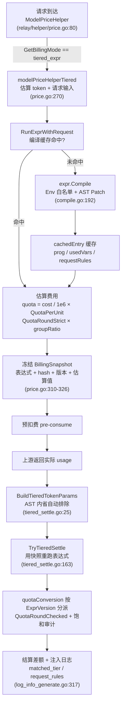
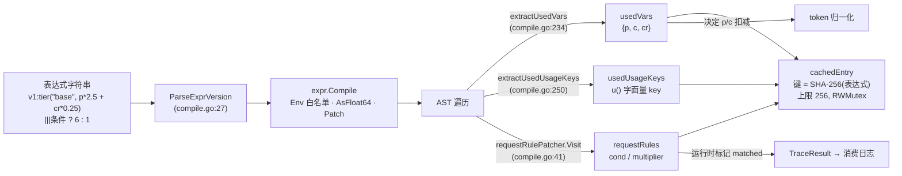

# 表达式计费:一行表达式如何表达全部定价逻辑(pkg/billingexpr)

> 一句话定位:本篇讲 new-api 的「阶梯/动态计费」子系统——为什么倍率体系不够用、如何用 `expr-lang/expr` 把整份定价规则压成一行可安全求值的表达式、token 如何归一化、费用如何换算成配额,以及表达式为什么要带版本号。读完你将能独立读懂 `pkg/billingexpr/` 全部源码,并能回答「如果把这套方案搬到 Java 项目该怎么设计」。

## 🎯 本篇你将学到

- 倍率体系(乘法模型)表达不了哪些定价场景,表达式计费补的是哪块拼图
- `expr-lang/expr` 为什么是安全的:白名单环境、编译期类型检查、AST 改写
- `p`/`c` 的「自动排除」token 归一化:同一个表达式适配 OpenAI 与 Claude 两种上游语义
- `billingexpr.QuotaRound` → `common.QuotaRound` 的委托关系与计费饱和安全
- `v1:` 版本前缀如何让定价规则演进不破坏存量请求的复现能力
- 表达式在预扣费(pre-consume)与结算(settle)两条链路上的确切挂接点

## 🧠 核心概念

### 🤔 为什么倍率体系不够用

06 篇讲过,默认计费是纯乘法模型:`配额 = (输入 token × 输入倍率 + 输出 token × 输出倍率 × 输出倍率系数 + 缓存 token × 缓存倍率 + …) × 分组倍率`。每类 token 一个固定系数,全程线性、无分支。三种真实定价场景它表达不了:

- **阶梯价**:Claude Sonnet 输入超过 20 万 token 后单价翻倍——这是「按上下文长度分支」,乘法模型没有 `if`。
- **按请求属性动态定价**:同一个模型,带 `anthropic-beta: fast-mode` 请求头就 6 倍、非工作时段打折、请求体里 `service_tier` 为 `fast` 就加价——倍率体系没有任何「读请求内容」的钩子。
- **加法组合定价**:视频任务 `0.1 + 秒数 × 0.4 + 片段数 × 0.05`——底价加多个变量乘单价,乘法模型写不出「常数项 + 多项」的结构。

项目里两种模式并存的开关就在 `setting/billing_setting/tiered_billing.go:18-19`:

```go
const (
	BillingModeRatio      = "ratio"        // 传统倍率体系(默认)
	BillingModeTieredExpr = "tiered_expr"  // 表达式计费
)
```

### 💡 「一个表达式,一个真相」

设计文档 `pkg/billingexpr/expr.md:5` 开宗明义:**One expression, one truth**。一行表达式字符串完整定义一个模型的计费逻辑——单价、阶梯条件、缓存/图片/音频差异、时段折扣、请求感知倍率,全在里面。没有散落的配置项、没有隐藏的换算约定、没有魔法数字。系统的职责是「忠实求值」,而不是「替管理员解释」。

四个衍生原则(expr.md:9-19):表达式自包含;变量按需开启(`p`/`c` 是基础,缓存/图片/音频变量可选);系数就是真实价格(单位 `$ / 1M tokens`,不做倍率折算);上游无关(表达式作者不用关心上游是 OpenAI 语义还是 Claude 语义)。

用 Java 生态类比:这 ≈ 把原本散落在数据库多张配置表里的「定价规则 DSL」收敛成一个受控表达式,由表达式引擎(≈ 受白名单约束的 SpEL,但安全得多)在请求线程里求值。区别在于 `expr` 不具备调用任意类的能力,天然没有 SpEL 注入(`T(java.lang.Runtime)…`)那类风险。

## 🔍 源码剖析

### 1️⃣ 引擎全貌:五个文件,一个包

`pkg/billingexpr/` 只有两个源码维度:`compile.go` 负责「表达式字符串 → 可执行程序 + 元信息」,`run.go`/`settle.go` 负责「程序 + 运行时参数 → 费用」;`types.go` 定义跨层传输结构,`round.go` 是配额舍入的薄委托层。整个包不依赖任何 Gin/GORM,是纯粹的计算内核(≈ 一个可单测的 domain 模块)。

### 2️⃣ 编译:白名单环境 + 编译缓存 + AST 改写

编译入口在 `pkg/billingexpr/compile.go:192`:

```go
version, body := ParseExprVersion(exprStr)          // "v1:tier(...)" → (1, "tier(...)")
patcher := &requestRulePatcher{}
prog, err := expr.Compile(body,
	expr.Env(getCompileEnv(version)),   // 编译期类型检查的原型环境
	expr.Patch(patcher),                // AST 改写:注入请求规则追踪
	expr.AsFloat64(),                   // 强制结果类型为 float64
)
```

`compileEnvPrototypeV1`(`compile.go:125-153`)就是全部可用符号的**白名单**:10 个 token 变量(`p`、`c`、`len`、`cr`、`cc`、`cc1h`、`img`、`img_o`、`ai`、`ao`)加 14 个函数(`tier`、`param`、`header`、`has`、`hour`/`minute`/`weekday`/`month`/`day`、`max`/`min`/`abs`/`ceil`/`floor`)。因为 `expr.Env` 传入了带类型的原型,任何未声明标识符、任何类型不匹配的表达式在**编译期**就报错,根本到不了运行时——这 ≈ Java 里用 `SimpleEvaluationContext` 锁死 SpEL 可访问的属性与方法,只是更彻底。

安全性还有三道闸:

- **保留标识符检查**(`compile.go:193-195`):`_trace`/`_trace_int` 是引擎内部注入的追踪回调名,用户存储的表达式若引用它们直接拒绝编译,防止伪造命中记录。
- **结果类型强制**(`run.go:133-137`):`expr.Run` 的返回值若不是 `float64` 直接报错,杜绝表达式返回字符串再被隐式当数字用。
- **探针只读**:`param()` 走 `gjson.GetBytes` 只读请求体 JSON 路径(`run.go:94-104`),`header()` 只读小写归一化后的请求头(`run.go:91-93`),时区无效时回退 UTC(`run.go:140-150`)。整个求值过程没有 IO、没有网络、没有反射。

编译结果缓存在包级 `map[string]*cachedEntry`(`compile.go:119-122`),键是表达式的 SHA-256(`ExprHashString`,`types.go:82-85`),上限 `maxCacheSize = 256`。`cachedEntry`(`compile.go:111-117`)除了编译产物 `*vm.Program`,还预计算了三份元信息——这是后面归一化和日志能零成本工作的关键:

```go
type cachedEntry struct {
	prog          *vm.Program
	usedVars      map[string]bool   // 表达式引用了哪些标识符(AST 内省结果)
	usedUsageKeys map[string]bool   // u("...") 的字面量 key
	requestRules  []RequestRuleTrace // 编译期探测到的请求倍率规则
	version       int
}
```

读多写少,所以用 `RWMutex` 保护;缓存满了不做 LRU,直接整体重建(`compile.go:208-210`)——表达式总量就等于「配了表达式计费的模型数」,256 足够,简单胜过精巧。

### 3️⃣ token 归一化:AST 内省驱动的自动排除

这是本系统最巧妙的一处。不同上游对「输入 token」的口径不同:OpenAI 的 `prompt_tokens` 是总包(含缓存、图片、音频),Claude 的 `input_tokens` 是纯文本、缓存单独报。表达式作者不该关心这个差异,于是系统让 `p` 的语义变成「**所有没被表达式单独定价的 token**」。

判定依据是表达式自己:编译时 `extractUsedVars`(`compile.go:234-248`)遍历 AST 收集所有 `IdentifierNode`,得到 `usedVars`;结算时 `BuildTieredTokenParams`(`service/tiered_settle.go:50-72`)据此决定减不减:

```go
if !isClaudeUsageSemantic {        // GPT 语义:prompt_tokens 是总包
	if usedVars["cr"]  { p -= cr }   // 表达式单独给缓存读定价 → 从 p 里扣掉
	if usedVars["cc"]  { p -= cc5m }
	if usedVars["cc1h"]{ p -= cc1h }
	if usedVars["img"] { p -= img }
	if usedVars["ai"]  { p -= ai }
	if usedVars["img_o"]{ c -= imgO }
	if usedVars["ao"]  { c -= ao }
}
```

对比 expr.md:57-63 的例子:表达式 `p * 3 + c * 15` 时 `p` 保持原始 1000(缓存和图片都按 3 美元计);一旦写了 `+ cr * 0.3`,`p` 自动变 800。**表达式内容决定归一化行为**,不需要任何额外配置开关。OpenAI 语义下 `cr + cc` 可能超过 `prompt`,所以减完还要钳制非负(`tiered_settle.go:74-81`)。

⚠️ 阶梯条件必须用 `len` 而不是 `p`:`len` 永远不参与自动排除(`tiered_settle.go:44-48`),非 Claude 等于原始 `prompt_tokens`,Claude 等于文本 + 缓存读 + 缓存创建。否则一个 30 万上下文但 25 万命中缓存的请求,`p` 只剩 5 万,会被误判进低价档。

### 4️⃣ 请求规则:`|||` 与无损 AST 改写

请求条件倍率用 `|||` 追加在主表达式后面,例如 `tier("base", p * 5 + c * 25)|||when(header("anthropic-beta") has "fast-mode") * 6`。存储时它会被拼成普通乘法 `(tier(...)) * (条件 ? 6 : 1)`。

为了在日志里回答「这条规则这次到底命中没有」,`requestRulePatcher.Visit`(`compile.go:41-83`)在编译期把形如 `条件 ? 数字字面量 : 1` 的三元节点改写成 `_trace(规则序号, 条件, 倍率)` 调用。改写前后**数值结果完全一致**(`_trace` 命中返回倍率、未命中返回 1,`run.go:73-90`),但运行时把命中状态记进了 `TraceResult`。两个精打细算的细节:整数倍率走 `_trace_int` 并保留原 `IntegerNode`(`compile.go:66-73`),避免 `%` 这类需要整数操作数的表达式被浮点化;条件必须引用至少一个探针函数(`usesRequestProbe`,`compile.go:96-109`),否则不注入。

这 ≈ Java 字节码插桩(如 JaCoCo 的 on-the-fly instrumentation):不改变程序语义,只植入探针收集覆盖率。

### 5️⃣ 配额换算与饱和安全:QuotaRound 的委托关系

表达式输出是「美元 / 每百万 token」口径的费用,换算成内部配额 int 的唯一入口是版本分派的 `quotaConversion`(`pkg/billingexpr/settle.go:8-16`):

```go
func quotaConversion(exprOutput float64, snap *BillingSnapshot) float64 {
	if snap.TaskUsageBilling {
		return exprOutput * snap.QuotaPerUnit      // 任务表达式已直接输出美元
	}
	switch snap.ExprVersion {
	default: // v1:系数是 $/1M tokens 价格
		return exprOutput / 1_000_000 * snap.QuotaPerUnit
	}
}
```

随后 `ComputeTieredQuotaWithRequest`(`settle.go:31`)用 `common.QuotaRoundChecked(quotaBeforeGroup * snap.GroupRatio)` 取整。而 `pkg/billingexpr/round.go:12-19` 只是薄薄一层委托:

```go
func QuotaRound(f float64) int { return common.QuotaRound(f) }
func QuotaRoundStrict(f float64) (int, error) { return common.QuotaRoundStrict(f) }
```

为什么包内还要包一层?因为**所有阶梯计费路径(预扣费、结算、明细校验、日志字段)必须用同一个函数**,避免 ±1 的口径漂移;把名字留在 `billingexpr` 包内,调用方不需要跨包 import `common` 就能拿到统一语义,而真正的饱和策略仍集中在 `common/quota_math.go` 一处。

那套策略在 `common/quota_math.go:82-100`:`MaxQuota = math.MaxInt32` 为单请求上界,NaN 归零、溢出钳制,并且每次钳制都发 `SysError` 告警并返回 `*QuotaClamp` 审计标记;结算侧把 clamp 经 `noteQuotaClamp`(`service/tiered_settle.go:186`)挂到 `RelayInfo`,最终写进消费日志的 `admin_info.quota_saturation`(详见 06 篇计费安全不变量)。预扣费则用 `Strict` 变体:宁可拒绝请求,也不让一个被钳制的天文数字 silently 通过。

### 6️⃣ 版本化:`v1:` 前缀冻结语义

`ParseExprVersion`(`compile.go:27-32`)解析前缀,无前缀默认 v1。版本号控制三件事:编译环境白名单(`getCompileEnv`,`compile.go:155-160`)、token 归一化逻辑、quota 换算公式。关键在于**版本号随请求冻结**:`modelPriceHelperTiered` 在预扣费时把 `ExprVersion` 写进 `BillingSnapshot`(`relay/helper/price.go:323`),结算时从快照读回(`settle.go:12`)。于是半年后管理员把表达式升级成 `v2:` 语义,那些「请求进行中 / 快照已落库」的存量请求仍按 v1 公式结算——定价规则演进不会让在途请求算错钱。这就是版本化的动机:**表达式是数据,不是代码;数据的语义必须和数据一起被版本化**。

### 7️⃣ 与主计费链路的挂接点

**预扣费侧**:`ModelPriceHelper`(`relay/helper/price.go:73`)在 `price.go:80-82` 检查 `GetBillingMode`,命中 `tiered_expr` 就转入 `modelPriceHelperTiered`(`price.go:270-338`)。它用估算 token(`MaxTokens`,缺省 8192,`price.go:42`)跑一次表达式,`QuotaRoundStrict` 取整后作为预扣额,并把 `BillingSnapshot` + 请求输入(`ResolveIncomingBillingExprRequestInput`,`relay/helper/billing_expr_request.go:13-35`,含请求头与 JSON 请求体)冻结到 `RelayInfo`。auto 分组重试时,`refreshTieredBillingGroup`(`tiered_settle.go:97-119`)按新分组倍率上调预扣额,`PrepareTieredBillingForSelectedGroup`(`tiered_settle.go:125-157`)补差额;免费分组则跳过预扣并置 `FreeModel`。

**结算侧**:实际用量回来后,`service/text_quota.go:413-417` 调 `BuildTieredTokenParams(usage, isClaudeUsageSemantic, billingexpr.UsedVars(snap.ExprString))` 构造真实参数,交给 `TryTieredSettle`(`service/tiered_settle.go:163-189`)→ `ComputeTieredQuotaWithRequest` 重跑表达式。表达式执行失败时降级为按预扣额计费(`tiered_settle.go:175-180`)——宁可按估值收,也不免费放行。同时比较本次命中档位与预估档位,得到 `CrossedTier`(`settle.go:32`),供日志标注「请求中途跨档」。

**日志侧**:`InjectTieredBillingInfo`(`service/log_info_generate.go:317-333`)把 `billing_mode`、base64 的表达式、`matched_tier`、结构化 `request_rules` 写进消费日志的 `other` 字段,前端据此渲染明细。

## 📐 图解

### 图 1:一次请求中表达式计费的完整数据流



### 图 2:编译管线的三份衍生元信息



## 🎓 设计精妙之处与可借鉴点

**🔑 白名单环境即安全边界。** 为什么这么设计:表达式的作者是有定价权限的运营/管理员,但仍不可信到能执行任意代码;`expr.Env` 的类型化原型让「可用符号集合」成为编译期事实。可借鉴到 Java 项目:凡是要让用户写规则(SpEL、Groovy、MVEL),先画一条「环境即能力」的线——用 `SimpleEvaluationContext`、显式函数注册表、拒绝保留名、强制返回类型,四件套缺一不可。

**🔑 表达式内容驱动归一化,而不是配置驱动。** 为什么:如果用「管理员勾选是否单独定价缓存」的开关,表达式和配置就可能矛盾;让 AST 内省从表达式本身推导,消灭了一整类状态不一致。可借鉴:当一个 DSL 的行为依赖配套开关时,优先考虑从 DSL 自身派生那些开关(编译期静态分析),把「两份真相」合并成一份。

**🔑 无损插桩收集可观测性。** 为什么:`_trace` 改写在 AST 层保持数值等价,换来「每条动态倍率规则是否命中」的完整审计,且不需要在运行时重新解析表达式。可借鉴:Java 里用字节码增强或装饰器给关键分支打点时,守住「插桩不改变语义」这条红线;整数/浮点两条 trace 路径的细节提醒我们,类型语义也是语义的一部分。

**🔑 统一的配额换算漏斗 + 严格/宽松双模式。** 为什么:`QuotaRound` 家族把舍入口径、int32 饱和、告警、审计标记收敛到一个文件;预扣费用 `Strict`(fail-fast),结算用 `Checked`(钳制 + 审计)——同一策略按阶段选择不同容错姿态。可借鉴:金额/配额类换算在 Java 里应集中到一个 `MoneyMath` 工具类,禁止各处手写 `intValue()`;`*Checked` 返回审计对象的做法 ≈ 把异常路径变成一等公民数据。

**🔑 快照冻结 + 版本分派,让规则演进不伤害在途请求。** 为什么:定价数据是易变的,而结算发生在请求生命周期末尾甚至异步任务里;把表达式、版本、分组倍率、估算值一起冻结进可序列化的 `BillingSnapshot`(`types.go:50-65`),结算时才有「当时的语境」。可借鉴:Java 里任何「规则后置执行」的场景(风控规则、优惠券核销)都应该在受理时落一张不可变快照,而不是结算时重新读最新配置。

## ⚠️ 常见坑与注意事项

- **阶梯条件写 `p` 会误判档位**:缓存命中会把 `p` 拉低,必须用 `len`(expr.md:55 明确要求)。
- **自动排除只发生在 GPT 语义上游**:Claude 语义的 `input_tokens` 本来就是纯文本,`BuildTieredTokenParams` 的排除分支整体跳过;给 Claude 模型写表达式时不要再「手动扣一遍」。
- **预扣费估的是 `len` 维度的档位**:`modelPriceHelperTiered` 只传了 `P`/`C`/`Len`(`price.go:286-290`),子类变量为 0,所以预估档位可能与实际档位不同,结算时靠 `CrossedTier` 揭示。
- **表达式必须有限且非负**:保存前 `SmokeTestExpr`(`setting/billing_setting/tiered_billing.go:84-117`)用 4 组 token 向量 × 2 组请求向量验证,结果为 NaN/Inf/负数直接拒绝保存;自己改保存逻辑时不能绕过。
- **`u()` 的 key 必须被任务插件 `usageSchema` 声明**,且动态(非字面量)参数因无法静态校验而刻意不被 `UsedUsageKeys` 收集(`compile.go:250-269`)。
- **不要自己写 `int(...)` 强转配额**:AGENTS.md 计费安全不变量规定所有换算必须走 `common/quota_math.go` 助手,裸强转在溢出时可能产生负数费用(变相返现)。
- **编译缓存上限 256 且满则整体清空**:高并发下若表达式数量极多,清空瞬间会有一次集中重编译;这是已知取舍,不要在无必要时往表达式里拼请求相关内容(那会让缓存命中率归零)。
- **改表达式计费代码前必读 `pkg/billingexpr/expr.md`**:这是 AGENTS.md 的硬性要求,文档与实现是对齐的。

## 🏋️ 刻意练习:缺陷预演

> 先自己想 2 分钟,再看参考思路。

### 练习 1|`p`/`c` 的自动排除归一化

- 🔴 **反模式预演**:如果不搞 AST 内省,改成让管理员在配置面板上手动勾选「缓存单独定价」「图片单独定价」开关来决定 `p` 要不要扣减(`tiered_settle.go:50-72` 的分支)。推演两种错配:①管理员把表达式从 `p * 3 + c * 15` 升级成 `p * 3 + c * 15 + cr * 0.3`,却忘了勾「缓存单独定价」;②管理员勾了开关,后来又把表达式里的 `cr` 项删掉。哪一种是用户多付钱,哪一种是平台漏收钱?都是静默的吗?
- 🟡 **陷阱预判**:管理员的意图是「在现价基础上给缓存命中额外加收 0.3 美元/1M」,于是把 `p * 3` 改写成 `p * 3 + cr * 0.3`,预期账单上升。用 expr.md:57-62 的数字(prompt_tokens=1000,其中 200 是缓存读)算一下:改写后总价是升了还是降了?差多少?
- 💡 **参考思路**:①漏勾开关 → `p` 保持 1000 → 缓存 token 被按 3 美元再收一遍(用户多付 540);反向错配 → `p` 被扣到 800,却没有任何价格覆盖这 200 token(平台漏收)——两种都没有任何报错,只有对账才暴露。②`p` 自动降到 800:总价从 3000 变成 2460,反而少收——追加一个子类变量不是「叠加一项」,而是重新定义了 `p` 的口径。本质:归一化依据只允许一个真相,让表达式自己声明口径(编译期 `extractUsedVars`,`compile.go:234-248`)才不会与配置漂移。

### 练习 2|编译缓存的键与淘汰

- 🔴 **反模式预演**:缓存键若不用表达式字符串的 SHA-256(`compile.go:164-166`),改用「模型名」(看起来更直观)。结算走的是快照里冻结的 `ExprString` + `ExprHash`(`settle.go:25`)。现在推演:管理员发现价目表少打一个零,把表达式从 `p * 0.3` 改成 `p * 3` 并保存——此刻一批在途请求(流式长输出、视频任务)正在等结算,它们会按哪个价格算?快照里的历史表达式字符串去哪了?
- 🟡 **陷阱预判**:`maxCacheSize = 256`(`compile.go:14`)满了不做 LRU,而是写锁内整体清空重建(`compile.go:208-210`)。什么样的配置习惯会让这个「简单胜过精巧」退化成周期性的集中重编译?提示:想一想哪些内容混进表达式字符串,会让同一套定价每请求产生一个新键。
- 💡 **参考思路**:①按模型名查缓存,缓存里永远只有「该模型当前配置」的程序,快照冻结的历史字符串无处命中,在途请求全部按 `p * 3` 结算——一次手滑被放大 10 倍,而且无法复现旧账;hash 键保证同一字符串永远得到同一程序,这是「结算可复现」的物理前提。②把请求相关内容(参数、日期、用户标识)拼进表达式字符串 → 命中率归零,每请求一次完整 `expr.Compile`(AST 构建 + 类型检查 + Patch);上限 256 反而限制了垃圾堆积的速度。键的纪律:键必须与定价真相一一对应。

### 练习 3|结算失败的降级目标

- 🔴 **反模式预演**:`TryTieredSettle` 里表达式求值失败时,降级目标是预扣额 `FinalPreConsumedQuota`(不足再退到 `EstimatedQuotaAfterGroup`,`tiered_settle.go:175-180`)。如果作者图省事写成「结算失败 → 按 0 收(免费放行)」,谁会受益?注意此刻上游 token 已经真实产生,成本已经发生;再想想运营侧:「表达式越容易失败越免费」会催生什么配置行为?
- 🟡 **陷阱预判**:降级返回的 `result` 是 `nil`,`InjectTieredBillingInfo` 里哪些字段会随之从消费日志消失(`log_info_generate.go:327-332`)?排障的人靠什么指纹认出「这笔是降级结算」?另外,这个「下限」本身可以被客户端怎么压低?(看 `price.go:276-279` 什么时候才用 8192 兜底。)
- 💡 **参考思路**:①按 0 收 = 把求值/配置故障直接变成平台兜底的资损,且不产生任何信号;按预扣额收把资损下限钉死在「已冻结的估值」上,宁可按估值收也不免费放行。②`matched_tier` 与 `request_rules` 整体消失,但 `expr_b64` 仍在——「有表达式、无命中明细」就是降级的指纹。③下限的形状:客户端显式传 `max_tokens: 1` 时,预扣几乎不含输出成本(8192 只在客户端没传时兜底,`price.go:42`),所以降级一旦发生,少收敞口 = 真实输出成本 − 预扣额。

## 🎯 决策复盘:复现作者的取舍

### 决策 1|结算依据:冻结快照 vs 现场读最新配置(岔路口:在途请求按受理时的价,还是结算时的价)

**场景**:预扣在请求开头,结算在请求末尾(流式可长达几十秒,视频任务更久),而定价配置随时可能被管理员改写。结算那一刻,去哪里拿「应该用的价格」?(注意岔路口不是灵魂篇的「敢不敢先用后付」,而是「用哪个时点的价格」。)

- 方案 A:预扣时把 `ExprString`/`ExprHash`/`ExprVersion`/`QuotaPerUnit`/`GroupRatio` 全部冻结进可序列化的 `BillingSnapshot`(`types.go:50-65`、`price.go:311-326`),结算用快照重跑(`settle.go:24-42`)。
- 方案 B:不存快照,结算时现场 `GetBillingExpr(model)` + 当前版本 + 当前分组倍率重算。

**你来权衡**:B 省掉快照的构造、传递与序列化,换来什么风险?A 冻结了分组倍率,但 auto 分组重试又必须更新它(`refreshTieredBillingGroup`,`tiered_settle.go:97-119`)——这个「半冻结」状态埋了什么复杂度?

- 💡 **参考思路**:①作者选 A。换来的是可复现:半年后语义升级成 `v2:`(`ParseExprVersion`,`compile.go:27-32`),在途与已落库请求仍按 `v1` 公式结算,改表达式、删表达式都不会让结算凭空失败(失败只能来自求值本身)。②代价:快照要跨阶段传递、任务场景还要能持久化(`types.go:48` 明确要求可序列化、无指针);分组倍率被冻结后又必须随重试刷新,于是出现「表达式冻结、分组可变」的半冻结语义——每个读快照的人都要想清楚哪些字段还可信。③边界:若业务要求「调价立即生效」(紧急止血一个错误低价),快照反而成了负债,错误价格会作用于所有已受理的在途请求,只能等它们自然结束或引入主动失效机制;内部可信环境里 B 的简单性也有吸引力。

### 决策 2|饱和容错:预扣拒绝 vs 结算钳制(岔路口:溢出发生时,该拒绝还是钳制后继续)

**场景**:表达式输出 × 分组倍率换算成 int 配额时,理论上可能撞上 int32 上界(`MaxQuota = math.MaxInt32`,`common/quota_math.go:14`)——单价写错、上游报回天文数字 token 都可能触发。同一个换算,预扣和结算该用同一姿态吗?

- 方案 A:两处都严格(`QuotaRoundStrict`)——不可表示就直接报错,请求失败。
- 方案 B:两处都钳制(`QuotaRoundChecked`)——钳到 `MaxQuota` 继续走,打告警(`common/quota_math.go:82-100`)。
- 方案 C(分阶段):预扣用 Strict(`price.go:297-300`,报错即 4xx),结算用 Checked + 审计(`settle.go:31`,clamp 经 `noteQuotaClamp` 写进 `admin_info.quota_saturation`,`tiered_settle.go:186`)。

**你来权衡**:结算阶段报错意味着什么(上游成本已发生)?预扣阶段钳制又意味着什么?C 的两种姿态各自依赖什么前提才成立?

- 💡 **参考思路**:①作者选 C。预扣阶段一分钱成本都没发生,拒绝是最便宜的止血,还能挡住「被钳制的天文数字 silently 通过预扣」;结算阶段成本已真实产生,报错只会把系统逼进「免费放行或按估值」的两难,钳制 + 审计是唯一不扩大损失的选项。②代价:两套姿态意味着两条测试路径,以及「为什么这里拒绝、那里继续」的持续解释成本;`Checked` 的安全性完全依赖审计有人看——clamp 只发一条 `SysError` 并写进管理员日志,用户侧毫无感知,没人看日志就等于静默少收。③反转条件:如果产品要求「绝不因定价配置拒绝请求」(内部高优任务通道),预扣的 Strict 会变成可用性瓶颈,得退到钳制 + 强告警;反之若审计无人值守,不如回到 Strict + 人工介入。

## 🔗 与其他模块的关系

- 06-billing-overview.md:表达式计费是倍率体系之外的第二种 `billing_mode`,共用 `PriceData`、`QuotaPerUnit`、分组倍率与配额换算漏斗。
- 00-soul.md:预扣费(pre-consume)与结算(settle)在请求生命周期中的位置。
- 03-adaptor-system.md / 05-streaming.md:上游适配器决定了 usage 的口径(OpenAI 语义 vs Claude 语义),正是这个差异催生了 token 归一化。
- 08-channel-ability.md:auto 分组重试时 `PrepareTieredBillingForSelectedGroup` 会按新分组上调预扣额。
- 11-gorm-compat.md:配置存于 `options` 表的两个 map(`BillingMode`/`BillingExpr`),消费日志的 `other` 字段承载 `request_rules`。
- 12-logging-dashboard.md:`InjectTieredBillingInfo` 注入的字段如何被前端渲染。
- 13-settings.md:`billing_setting` 通过 `config.GlobalConfig.Register` 纳入动态配置体系,表达式更新后调用 `InvalidateCache`(`compile.go:327-331`)。

## 📚 小结

表达式计费的精髓不在于「用了 expr 这个库」,而在于四个架构决策:用**白名单编译环境**把不可信的表达式关进沙箱;用 **AST 内省**让一行表达式自己决定 token 归一化,消灭配置与语义的双真相;用**快照 + 版本号**把易变的定价规则变成可复现的历史事实;用**集中式饱和换算**守住「计费永不产生负数」的底线。对 Java 工程师而言,这套方案是一份完整的参考实现——当你下次要把散落的 if-else 定价规则重构为可配置引擎时,这五层(编译缓存、类型化环境、无损插桩、语义版本、饱和审计)就是你的检查清单。
