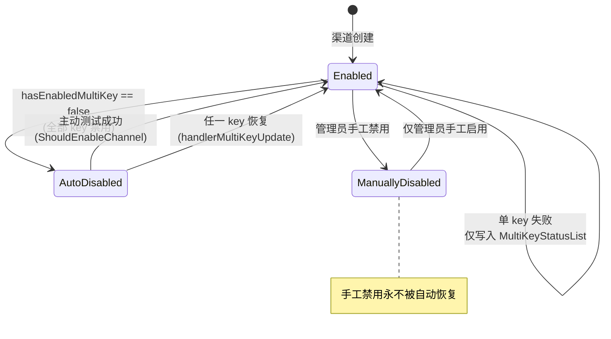

# 渠道与能力表:渠道路由与负载均衡

> 一句话定位:本篇讲 new-api 如何把「40+ 上游提供商 × 多分组 × 多模型」组织成一张可路由的能力表(`Ability`),以及在毫秒级请求里如何从成百上千个渠道中挑出一个——优先级分档、加权随机、渠道 pin/亲和、多 key 状态机、失败转移与自动禁用。读完你应能独立画出 new-api 的渠道路由决策树,并把这些设计迁移到 Java 网关项目。

## 🎯 本篇你将学到

- `Channel`(上游配置)与 `Ability`(group×model×channel_id 路由索引)两表如何分工,为什么路由索引要反范式成独立表;
- 内存缓存的全量快照 + 定时刷新模式,以及缓存关闭时如何降级直查数据库;
- 选择算法的完整细节:`priority` 分档(重试次数决定降到第几档)→ 同档加权随机,以及零权重渠道的「保底」;
- 渠道 pin(任务锁定)、渠道亲和(affinity)、令牌模型白名单三种手段如何干预选择;
- 多 key 渠道的状态机:单 key 禁用不停渠道,全 key 禁用才禁渠道;
- 失败转移循环与 `processChannelError` 的自动禁用(auto_ban)链路。

## 🧠 核心概念

**🔑 Channel 与 Ability。** `Channel` 是一条上游配置:类型、密钥、BaseURL、模型列表、分组列表、优先级、权重(见 `model/channel.go:23`)。注意 `Models` 和 `Group` 都是逗号分隔的字符串,一个渠道天然是「多分组 × 多模型」的**笛卡尔积**。`Ability` 则把这张积展开成行:以 `(group, model, channel_id)` 为**三列联合主键**,附带 `enabled/priority/weight/tag`(`model/ability.go:18`)。用 Java 的话说,`Ability` ≈ 服务注册中心(Eureka/Nacos)里的注册表条目:服务名是 `(group, model)`,实例列表是 `channelId` 集合;`Channel` ≈ 实例的元数据配置。

**🔑 为什么反范式成独立表而不是查询时 join?** 若只存 `channels` 表,选渠道就得对 `Models`、`Group` 两个逗号串做 `LIKE '%model%'` 匹配——既走不了索引,还会误匹配(`gpt-4` 命中 `gpt-4o`)。把笛卡尔积物化成 `abilities` 行后,「分组 g 下模型 m 有哪些可用渠道」变成一次普通索引等值查询。这正是 MySQL 里经典的**冗余索引表**(≈ 读写分离的物化视图):写时多花一点维护成本(`AddAbilities`),读时换来 O(1) 定位。

**🔑 内存缓存。** 每个请求都要选渠道,若每次都打库,数据库会成为网关瓶颈。new-api 在进程内维护两张 map:`group2model2channels`(group → model → 有序 channelId 列表)与 `channelsIDM`(id → `*Channel` 全量对象),用一把 `sync.RWMutex` 保护(`model/channel_cache.go:23-25`)≈ Java 的 `ReadWriteLock` + 不可变快照。缓存关闭时,同签名函数直接降级为查 `abilities` 表。

## 🔍 源码剖析

### 1️⃣ 两表分工:写时展开,读时命中

渠道增改时,`AddAbilities` 把逗号串展开成能力行(`model/ability.go:216-255`),按 50 条一批 `OnConflict DoNothing` 写入;`UpdateAbilities` 则在事务里「先删后插」重建(`model/ability.go:263-331`)≈ Java 里典型的「delete-then-batch-insert」幂等重建。渠道被禁用时只改 `abilities.enabled` 一列(`UpdateAbilityStatus`,`model/ability.go:333`),不必动 `channels`。

```go
// model/ability.go:228-236  一个渠道 → N 行能力
ability := Ability{
    Group: group, Model: model, ChannelId: channel.Id,
    Enabled:  channel.Status == common.ChannelStatusEnabled,
    Priority: channel.Priority, Weight: uint(channel.GetWeight()), Tag: channel.Tag,
}
```

能力表被手工/自动改坏时有自愈接口:`FixAbility` 清空后按渠道全量重建,最后顺手 `InitChannelCache()`(`model/ability.go:357-411`)。

### 2️⃣ 内存缓存:全量快照 + 定时刷新 + 写穿

启动时若 `RedisEnabled` 或 `MEMORY_CACHE_ENABLED=true` 则开启缓存,先 `InitChannelCache()` 再起 goroutine 定时刷新(`main.go:84-105`)≈ Spring 的 `@PostConstruct` 预热 + `@Scheduled` 定时刷新。

```go
// model/channel_cache.go:55-68  从 Channel 行重新展开路由索引(注意:不是查 abilities 表)
for _, channel := range channels {
    if channel.Status != common.ChannelStatusEnabled { continue } // 跳过禁用渠道
    for _, group := range strings.Split(channel.Group, ",") {
        for _, model := range strings.Split(channel.Models, ",") {
            newGroup2model2channels[group][model] = append(..., channel.Id)
        }
    }
}
// :72-79  每个候选列表按 priority 降序排序
```

两个值得注意的细节:其一,缓存索引**直接由 `channels` 表展开**,`abilities` 表只用来枚举分组——DB 路径才真正查 `abilities`;其二,重建完后在锁内做「新旧渠道指针交换」,并**保留多 key 轮询游标** `MultiKeyPollingIndex`,避免定时刷新把轮询进度清零(`model/channel_cache.go:84-97`)。

缓存不是「只读快照」:运行期状态变更会**写穿**回缓存。禁用渠道时 `CacheUpdateChannelStatus` 先改 `channelsIDM` 里的状态,再把该渠道从所有候选列表里摘除,让下一请求立刻选不到它(`model/channel_cache.go:251-274`)。而 `CacheGetChannel` 在缓存关闭时降级为 `GetChannelById(id, true)` 直查库(`model/channel_cache.go:219-231`)。

### 3️⃣ 选择算法:priority 分档 + 加权随机

选择入口统一是 `service.CacheGetRandomSatisfiedChannel`(`service/channel_select.go:108`),它处理 `auto` 跨分组循环后,落到 `model.GetRandomSatisfiedChannel`(缓存路径,`model/channel_cache.go:117`)或 `model.GetChannel`(DB 路径,`model/ability.go:108`)。两条路径算法同构:

```go
// model/ability.go:115-158  DB 路径(缓存路径逻辑相同,只是候选来自内存)
abilities, _ := DB.Where("group = ? and model = ? and enabled = ?", ...).
    Order("priority DESC, weight DESC").Find(&abilities)     // ① 候选集
abilities = filterAbilitiesByConstraints(abilities, ...)      // ② 约束过滤
priorities = 去重降序排序                                       // ③ 优先级分档
if retry >= len(priorities) { retry = len(priorities) - 1 }   //    重试次数封底到最低档
targetPriority := priorities[retry]                           // ④ 第 retry 次重试 → 第 retry 档
weightSum += ability.Weight + 10                              // ⑤ +10 保底
weight := common.GetRandomInt(int(weightSum))
for _, a := range abilities {
    weight -= int(a.Weight) + 10
    if weight <= 0 { channel.Id = a.ChannelId; break }        // ⑥ 加权随机落点
}
```

**为什么 retry 决定档位?** 第一次尝试(retry=0)只在最高优先级档里选;失败重试一次,就降到次高档;重试用尽时封底到最低档。这是「分级故障转移」:优先用贵的/快的,失败了才退而求其次 ≈ 网关的多机房分层路由(zone → region → any)。

**为什么 `+10`?** 若权重直接是 `Weight`,配置了 0 权重的渠道概率为 0,永远选不中——等于被静默下线。`+10` 给每个渠道一个 10 的基础权重,零权重渠道也能分到 `10/Σ(Weight+10)` 的流量,既保证「权重决定倾斜」,又保证「无人饿死」。缓存路径则用另一种方式处理:`sumWeight == 0`(全部零权重)时给每渠道虚拟权重 100 均分;平均权重小于 10 时把 `smoothingFactor` 设为 100 放大粒度,避免 `rand.Intn` 在小整数上丢精度(`model/channel_cache.go:189-214`)。

### 4️⃣ 选择的三种干预:pin、亲和、令牌白名单

真正的选渠发生在 `Distribute()` Gin 中间件(`middleware/distributor.go:34`)≈ Servlet `Filter`/Spring `HandlerInterceptor`,它按优先级依次尝试:

- **令牌模型白名单**(`middleware/distributor.go:82-100`):令牌若开启模型限制,先校验 `ContextKeyTokenModelLimit` 里是否有该模型(含 `FormatMatchingModelName` 归一化),没有直接 403。
- **渠道 pin**(`dto/channel_constraints.go:6-13, 72`):来源有二——`PinSourceToken`(Rank 0,最高)与 `PinSourceOriginTask`(Rank 10,异步任务后续对话锁定原渠道,由 `middleware/task_plugin.go:1097` 写入)。`ResolvedPin()` 按 Rank 取最小者胜出,若多个 pin 落在不同渠道则记录告警。命中 pin 后**跳过随机**,直接 `CacheGetChannel(pin.ChannelId)` 取渠道并要求其处于启用态(`middleware/distributor.go:48-78`)。`PinRetrySingleAttempt` 模式还会通过 `SuppressesRetry()`(`dto/channel_constraints.go:112`)在 `shouldRetry`(`controller/relay.go:381`)里禁止换渠道重试——任务类请求换渠道会导致任务查不到。
- **渠道亲和 affinity**(`middleware/distributor.go:127-158`):命中缓存的亲和渠道,且该渠道启用、满足过滤器、确实在该 `(group, model)` 候选集内(`IsChannelEnabledForGroupModel`,`model/channel_satisfy.go:8`)才使用;请求成功(响应码 < 400)后回写亲和缓存(`middleware/distributor.go:201-203`)。亲和规则还可配置「失败后跳过重试」:`ShouldSkipRetryAfterChannelAffinityFailure`(`service/channel_affinity.go:627`)读取规则里的 `SkipRetry` 标记,在 `controller/relay.go:369` 被优先检查——亲和渠道挂了就尽快失败,而不是在同一档里反复撞同一台。

三者都不命中时才走 `CacheGetRandomSatisfiedChannel` 随机选择(`middleware/distributor.go:160-186`)。

### 5️⃣ 多 key 渠道:渠道内再负载均衡

一个渠道可存多个 key(换行分隔,或以 `[` 开头的 JSON 数组,`model/channel.go:180-202`),`ChannelInfo`(`model/channel.go:62-70`)记录多 key 元数据:`MultiKeyStatusList`(key 下标 → 状态)、禁用原因/时间表、轮询游标 `MultiKeyPollingIndex`、模式 `MultiKeyMode`。请求时 `GetNextEnabledKey` 在启用 key 中按随机/轮询挑一个(`model/channel.go:204-288`),轮询模式用**渠道级锁**保证游标线程安全,并在缓存关闭时把游标持久化回库。

失败后的状态回写走 `handlerMultiKeyUpdate`(`model/channel.go:671-721`),这是本模块最精巧的状态机:

```go
// model/channel.go:698-719
if status == common.ChannelStatusEnabled {
    delete(channel.ChannelInfo.MultiKeyStatusList, keyIndex)   // key 恢复 → 移出禁用表
} else {
    channel.ChannelInfo.MultiKeyStatusList[keyIndex] = status  // key 禁用 → 记录状态+原因+时间
    ...
}
if !hasEnabledMultiKey(keys, channel.ChannelInfo.MultiKeyStatusList) {
    channel.Status = common.ChannelStatusAutoDisabled          // 全 key 禁用才禁渠道
    info["status_reason"] = "All keys are disabled"
} else if status == common.ChannelStatusEnabled {
    channel.Status = common.ChannelStatusEnabled               // 任一 key 恢复 → 渠道恢复
}
```

即:单 key 挂掉只影响该 key,渠道仍在服务;只有所有 key 都不可用时渠道整体转为 `ChannelStatusAutoDisabled`(状态常量见 `common/constants.go:259-261`)。`UpdateChannelStatus`(`model/channel.go:736-810`)同时维护缓存与 DB,并持有同一个渠道级轮询锁覆盖「读 ChannelInfo → 持久化」全程,防止两个写者互相覆盖对方的 JSON 快照(见 742-744 行注释);最终用 `saveStatusState`(`model/channel.go:357`)**只保存状态流转相关的列**,避免把过期快照里的密钥、配额计数写回库——相当于 JPA 里精心设计的 `@DynamicUpdate` 白名单。

### 6️⃣ 失败转移与自动禁用

中继外层是一个以 `retryParam.GetRetry()` 驱动的循环(`controller/relay.go:196-246`):

```go
for ; retryParam.GetRetry() <= common.RetryTimes; retryParam.IncreaseRetry() {
    channel, channelErr := getChannel(c, relayInfo, retryParam)   // 首次复用中间件已选渠道
    ...
    newAPIError = relayHandler(c, relayInfo)                      // 走适配器、计费、流式
    if newAPIError == nil { return }
    processChannelError(c, *types.NewChannelError(channel.Id, ..., channel.GetAutoBan()),
                        newAPIError, relayInfo)                   // 记日志 + 触发自动禁用
    if !shouldRetry(c, newAPIError, common.RetryTimes-retryParam.GetRetry()) { break }
}
```

一个微妙设计:首次尝试时 `info.ChannelMeta == nil`,`getChannel` 并不重新选渠道,而是从 gin context 里拼一个「桩 `Channel`」(`controller/relay.go:334-347`)——因为 `Distribute()` 中间件已经选好并写入了上下文;从第二次尝试起,`ChannelMeta` 已被 `InitChannelMeta` 填充,`getChannel` 才真正以递增的 retry 调 `CacheGetRandomSatisfiedChannel` 换档重选,再经 `SetupContextForSelectedChannel`(`middleware/distributor.go:594`)重设上下文,其中第 658 行会再次调 `GetNextEnabledKey` 取 key。

`shouldRetry`(`controller/relay.go:365-395`)决定是否继续:渠道级错误(`IsChannelError`)必重试、带 `SkipRetry` 标记的错误不重试、2xx 不重试、其余按状态码配置表 `ShouldRetryByStatusCode` 决定。

自动禁用链路在 `processChannelError`(`controller/relay.go:397-431`):

```go
if service.ShouldDisableChannel(err) && channelError.AutoBan {
    gopool.Go(func() { service.DisableChannel(channelError, err.ErrorWithStatusCode()) })
}
```

`ShouldDisableChannel`(`service/channel.go:45-65`)要求全局开关 `AutomaticDisableChannelEnabled` 开启,且命中其一:渠道级错误、状态码黑名单、错误信息命中关键词(Aho-Corasick 匹配 `AcSearch`);`SkipRetry` 类错误明确排除。`DisableChannel`(`service/channel.go:19-34`)再校验渠道自身的 `AutoBan` 开关,调 `UpdateChannelStatus` 落库并同步缓存,最后 `NotifyRootUser` 通知管理员。反向的自动恢复由主动测试驱动:`ShouldEnableChannel`(`service/channel.go:67-78`)要求测试成功且当前状态是 `ChannelStatusAutoDisabled`(而非手工禁用)——**手工禁用永远不被自动恢复**,这是重要的语义区分。

## 📐 图解

**图 1:两表分工与内存缓存(写时展开、读时命中)**

```mermaid
flowchart LR
    subgraph 写路径["写入路径(管理操作)"]
        A["Channel<br/>(Models='gpt-4,gpt-4o'<br/>Group='default,vip')"] -->|"AddAbilities<br/>笛卡尔积展开"| B["abilities 表<br/>PK: (group, model, channel_id)<br/>enabled/priority/weight"]
    end
    subgraph 读路径["读路径(每个请求)"]
        C{"MemoryCacheEnabled?"} -->|是| D["group2model2channels<br/>group→model→[]channelId<br/>(priority 降序)"]
        C -->|是| E["channelsIDM<br/>id→*Channel 全量"]
        C -->|否(降级)| F["DB 查 abilities 表<br/>GetChannel"]
    end
    B -.->|"InitChannelCache 全量加载<br/>SyncChannelCache 定时刷新"| D
    A -.->|"DB.Find(&channels)"| E
    D --> G["加权随机选一个 channelId"]
    E --> G
    F --> G
```

**图 2:请求级渠道路由与失败转移时序**

```mermaid
sequenceDiagram
    participant MW as Distribute 中间件
    participant SEL as CacheGetRandomSatisfiedChannel
    participant LOOP as relay 循环(relay.go:196)
    participant UP as 上游提供商
    participant PE as processChannelError
    participant ST as UpdateChannelStatus

    MW->>MW: 令牌模型白名单校验
    MW->>MW: pin? 亲和? (命中则锁定渠道)
    MW->>SEL: 未命中→ priority[0] 档加权随机
    SEL-->>MW: Channel
    MW->>LOOP: SetupContextForSelectedChannel(key/BaseUrl/AutoBan)
    LOOP->>UP: 第 1 次尝试(桩 Channel,复用中间件选择)
    UP-->>LOOP: 失败
    LOOP->>PE: 记日志 + 判断自动禁用
    PE->>PE: ShouldDisableChannel && AutoBan?
    PE->>ST: 命中→异步禁用(多 key 只禁该 key)
    ST->>ST: 缓存摘除 + abilities.enabled=false
    LOOP->>SEL: retry+1 → 降到次档重新选择
    SEL-->>LOOP: 新 Channel
    LOOP->>UP: 第 2 次尝试
```

**图 3:多 key 渠道状态机(渠道级)**



## 🎓 设计精妙之处与可借鉴点

**🔑 1. 路由索引反范式成独立表。** 为什么:逗号串字段无法索引且会误匹配,物化成 `(group, model, channel_id)` 后查询从「全表 LIKE」变成「索引等值」,还能携带 `priority/weight/enabled` 这类只对路由有意义的字段,不必污染主表。可借鉴:Java 项目里凡是「多值字段要参与高频查询」的场景(标签匹配、灰度分组),都可以建一张冗余展开表 + 定时重建(`FixAbility` ≈ 对账任务),写路径复杂一点换读路径数量级提升。

**🔑 2. 全量快照 + 定时刷新 + 写穿缓存。** 为什么:路由是「读极多、写极少、可容忍秒级陈旧」的典型场景,全量重建比增量失效简单得多,且不易出错;但运行期的状态变更(禁用)必须立即生效,所以补一条写穿路径(`CacheUpdateChannelStatus`)。可借鉴:这相当于 Guava `LoadingCache` + 手动 `invalidate` 的组合,比纯 TTL 缓存响应快、比纯查库压力小;重建时保留运行期状态(轮询游标)这一点尤其值得学——**重建快照 ≠ 重置运行时**。

**🔑 3. retry 计数与优先级分档天然耦合。** 为什么:不用引入额外的「故障转移策略」配置,`retry` 这个已有变量就同时表达了「换实例」和「降档」两层语义,算法只有一个循环。可借鉴:把重试深度映射到候选分层,是实现「失败降级」最省状态的做法,适合放进自研网关的负载均衡器。

**🔑 4. 零权重保底 + 精度放大。** 为什么:`+10` 基础权重解决「权重 0 = 永不选中」的静默故障;`smoothingFactor=100` 解决小整数随机精度。可借鉴:任何加权随机都要回答「权重为 0 意味着什么」,在算法里显式给出答案,而不是让配置者踩坑。

**🔑 5. 渠道内多 key 的「实例隔离」。** 为什么:把「部分凭证失效」与「渠道整体不可用」解耦,单 key 禁用不损失整个上游的容量,且 key 级状态(原因+时间)完整留痕便于排查。可借鉴:连接池/HTTP 客户端里对单个端点的熔断可以照搬这套「局部隔离 + 全体兜底 + 恢复时整体复位」的三段式。

**🔑 6. 状态回写只保存自己的列。** 为什么:`saveStatusState` 用列白名单防止「拿着旧快照把密钥/配额写回库」的并发事故;同时持有渠道级锁覆盖「读 ChannelInfo → 持久化」。可借鉴:JPA 项目里对高频状态流转用 `@DynamicUpdate` 或显式 `update` 列白名单,远比 `save(entity)` 安全。

## ⚠️ 常见坑与注意事项

- **两条选择路径行为不完全一致**:DB 路径 `GetChannel` 对每个渠道 `Weight+10` 保底(`model/ability.go:147`),缓存路径 `GetRandomSatisfiedChannel` 只在「全部零权重」时均分,一旦有渠道配置了正权重,零权重渠道概率为 0(`model/channel_cache.go:192-214`)。混用缓存开关做对比测试时会看到差异。
- **缓存与 DB 是两份索引**:缓存路径的候选来自 `channels` 表展开,`abilities` 表只提供分组枚举;改了 `abilities` 而没触发 `InitChannelCache` 时,缓存路径感知不到。这也是 `FixAbility` 结尾必须调 `InitChannelCache()` 的原因。
- **锁顺序敏感**:`InitChannelCache`/`CacheUpdateChannel` 里都有明确注释——不能在持有 `channelSyncLock` 时调 `InvalidatePricingCache`,否则与 `GetPricing` 的加锁顺序相反,构成 AB-BA 死锁(`model/channel_cache.go:100-104, 303-307`)。
- **状态值不能为 0**:`ChannelStatusEnabled = 1` 等常量特意避开 0,因为 Go 零值会被 GORM 默认值与「未设置」语义混淆(`common/constants.go:259-261`)。
- **auto_ban 需两级开关**:全局 `AutomaticDisableChannelEnabled` 与渠道级 `AutoBan` 字段(`GetAutoBan`,`model/channel.go:343`)都要开启,且 `ShouldDisableChannel` 会放行 `SkipRetry` 类错误——并非所有失败都会禁渠道。
- **手工禁用不会被自动启用**:`ShouldEnableChannel` 只对 `ChannelStatusAutoDisabled` 生效;想恢复手工禁用的渠道必须人工操作。
- **数据库兼容是硬约束**:本模块大量使用 `commonGroupCol`/`commonKeyCol` 等 `model/main.go` 提供的保留字列名包装(`group`、`key` 是三库保留字),任何涉及 `abilities` 的 SQL 改动都要过 SQLite/MySQL/PostgreSQL 三库验证(见 `AGENTS.md`)。

## 🏋️ 刻意练习:缺陷预演

> 先自己想 2 分钟,再看参考思路。

### 练习 1|权重 0:同一个数字,两条路径两种命运

- 🔴 **反模式预演**:运营想把某渠道「暂时别接单但不删配置」,把权重改成 0——没有走禁用。请分两种部署形态推演这笔配置的结局:① 开启内存缓存的节点(同档候选里有任一渠道权重为正);② 关闭内存缓存、走 `GetChannel` 直查库的节点。哪一边会继续把请求送过去?若该渠道上游已欠费停服、又是高价渠道,这些请求的账单算谁的、用户看到什么报错?为什么同一个问题「只在部分节点复现」,排障的人会先怀疑什么?
- 🟡 **陷阱预判**:运营觉得「权重 0 不够狠,那把这一档全部渠道权重都设成 0,是不是就彻底没流量了?」缓存路径会发生什么**相反**的事?
- 💡 **参考思路**:① 缓存路径里零权重渠道减去的权重是 0,被选中概率为 0(`model/channel_cache.go:209-213`);DB 路径每个候选 `+10` 保底(`model/ability.go:147`),仍分到 `10/Σ(Weight+10)` 的流量——「部分节点才复现」的随机失败,根因是同一配置在两条选择路径下语义不同。② 全零权重时缓存路径反而给每渠道虚拟权重 100 均分(`model/channel_cache.go:192-200`),流量一点不少。权重是「倾斜系数」不是开关,下线必须走 `UpdateChannelStatus`(它同时改 abilities 与缓存)。

### 练习 2|三份路由副本:直改库绕过写穿链路

- 🔴 **反模式预演**:风控要求立刻切断某渠道。运维图快,直接在库里执行 `UPDATE channels SET status=2` 和 `UPDATE abilities SET enabled=false`,绕过后台 API。推演一个开启内存缓存的多节点集群在下一个同步周期里会发生什么:请求被路由到哪、上游还扣不扣费?再推演反方向:管理员只把 `abilities` 表里某 `(group, model)` 的 `priority` 手动调高(没动 `channels` 表),为什么线上选渠道的结果纹丝不动?他会在哪里浪费时间?
- 🟡 **陷阱预判**:`CacheUpdateChannelStatus` 只把渠道从候选列表摘除,并不删除 `channelsIDM` 里的对象(`model/channel_cache.go:251-274`);而 pin 命中路径是先 `CacheGetChannel` 再检查 status(`middleware/distributor.go:55-71`)。如果将来新增一条消费 pin 的代码路径、漏掉了 status 判断,会发生什么?
- 💡 **参考思路**:真源只有一份——`channels` 表;缓存候选直接由它展开(`model/channel_cache.go:55-68`),`abilities` 只贡献分组枚举(`model/channel_cache.go:45-50`)。所以只改 `abilities` 不触发重建就是无效操作,只改 `channels` 不触发重建则是把「切断窗口」拉长到整个同步周期(`model/channel_cache.go:109-115`);任何绕过标准写路径的直改,唯一安全的收尾是显式调 `InitChannelCache()`——这正是 `FixAbility` 结尾要调它的原因。

### 练习 3|两档 pin 重试模式:互相调换,两种事故

- 🔴 **反模式预演**:pin 的 `RetryMode` 有两档——管理员在令牌后拼渠道 id 得到 `PinRetrySingleAttempt`(`middleware/auth.go:525-530`),origin_task 得到 `PinRetrySameChannel`(`middleware/task_plugin.go:1095-1099`)。请推演两笔调换事故:① 把调试用 pin 换成 `SameChannel`——管理员拼了 `sk-xxx-7` 想验证渠道 #7,首次失败后重试选择只看 filters、不看 pin(`service/channel_select.go:113`),他看到的第二个报错来自哪?诊断结论会被什么污染?② 把 origin_task 的 pin 换成 `SingleAttempt`——某任务被 pin 在 #7,#7 突发 429 而 #7 还有 9 个健康 key,用户侧直接得到什么?
- 🟡 **陷阱预判**:任务路径真正锁渠道的是 `info.LockedChannel`(任务重试循环每次复用同一渠道、只轮换 key,`controller/relay.go:630-641`),而 `SuppressesRetry` 只在 `shouldRetry` 里生效(`controller/relay.go:381`)。若有人以为「加了 pin 就万事大吉」、漏掉 `LockedChannel` 分支,重试会在哪一步偏离 pin?
- 💡 **参考思路**:两档对应两种本质不同的诉求:调试要**观测隔离**——只试一次,报错必须属于被点名的渠道,宁可少试;任务要**可用性**——上游会话态绑定在渠道凭证上,换渠道等于换数据库,所以只能同渠道轮换 key。分界线是「有没有上游侧会话态」:有,锁定渠道轮 key;没有,放开换渠道重试。

## 🎯 决策复盘:复现作者的取舍

### 决策 1|多 key 失败的禁用粒度:key 级隔离 vs 渠道级禁用(岔路口:失败通知打给谁)

**场景**:自动禁用触发时,渠道里配了 10 个 key,其中 1 个持续返回 401。禁用动作落到哪个粒度?

- 方案 A:key 级隔离——失败 key 写入 `MultiKeyStatusList`,渠道保持 `Enabled`;`hasEnabledMultiKey` 为假才整体转 `AutoDisabled`(`model/channel.go:698-719`)。
- 方案 B:渠道级禁用——任一 key 失败就 `UpdateChannelStatus(AutoDisabled)`,状态机最简,监控只有「渠道」一个粒度。

**你来权衡**:A 的隐性代价在哪(监控口径、失败放大)?B 的容量损失怎么估?什么前提下 A 反而是错的?

- 💡 **参考思路**:① 作者选 A:单 key 挂只记该 key 的状态+原因+时间,全部 key 死透才置 `ChannelStatusAutoDisabled`(`model/channel.go:711-714`)。② 换来的是「一张 10 key 的渠道不会因 1 张过期凭证损失 90% 容量」,且 key 级留痕能直接回答「哪个 key、为什么、何时挂」。③ 边界:渠道状态长期 `Enabled`,基于渠道状态的告警对「半死渠道」失明,必须额外看 `MultiKeyStatusList`;而且 A 的前提是「key 之间失败独立」——上游做账号级风控(封 IP/封主体)时所有 key 一起死,流量会反复撞墙、靠逐个 key 失败累计才收敛,这段窗口里每笔请求都多付一次失败延迟。

### 决策 2|状态回写:列白名单 + 进程级锁 vs 整行 save(岔路口:异步 goroutine 敢不敢写整行)

**场景**:自动禁用跑在异步 goroutine(`controller/relay.go:401-404`),同一时刻管理员可能正在后台编辑该渠道(换 key、改模型);`ChannelInfo` 又是一个 JSON 列,同时装着 key 状态与轮询游标。状态落库这一步怎么写?

- 方案 A:`saveStatusState()` 列白名单只更新 `status`/`other_info`/`channel_info`(`model/channel.go:354-369`),并让 `UpdateChannelStatus` 从首次读 `ChannelInfo` 到持久化全程持有渠道级轮询锁(`model/channel.go:742-747`)。
- 方案 B:`DB.Save(channel)` 整行覆盖——快照里有什么就写什么,一行代码。
- 方案 C:加版本列(version)做乐观锁,冲突时重读重试。

**你来权衡**:B 在什么并发交错下会写出什么数据?C 比 A 多了什么、又少了什么?A 的锁在多节点部署下还剩多少保护?

- 💡 **参考思路**:① 作者选 A。② B 的事故可复现:goroutine 手里的快照是几秒前读的,整行写回会把旧密钥、旧配额计数、旧模型列表一并落库,管理员的修改被静默回滚;而 `channel_info` 是 JSON 列、没法只改一个字段,所以 A 用「进程级锁保证读改写原子」+「列白名单保证只写自己拥有的列」双层防御。③ 边界:这套锁是进程内的(`GetChannelPollingLock`,`model/channel.go:640-649`),多节点同时写同一渠道的 `channel_info` 时仍是数据库层「后写覆盖先写」,可能丢 key 级状态——真正高冲突的跨节点场景才值得引入 C;反之,若状态流转不涉及 `channel_info`,白名单可以退化成一条 `Update("status", ...)`。

## 🔗 与其他模块的关系

- 一次请求从进入 `Distribute` 中间件到最终响应的全景,见 00-soul.md 与 02-routing-middleware.md;
- 选中渠道后如何按 `Type` 分发到具体适配器,见 03-adaptor-system.md;请求/响应格式转换见 04-relaykit-conversion.md;上游流式回包处理见 05-streaming.md;
- 渠道失败后记录的错误日志与消耗日志,见 12-logging-dashboard.md;`used_quota` 累计与预扣费/退款链路,见 06-billing-overview.md 与 07-billingexpr.md;
- 内存缓存的通用设施(Redis + 本地混合缓存 `cachex`)在 10-cache-system.md 展开;`ChannelInfo` 等 JSON 列与三库兼容细节见 11-gorm-compat.md;
- 渠道 pin 的来源之一(origin task)与异步任务如何锁定渠道,见 14-task-system.md;JS 插件自定义渠道与 `FilterTaskPluginIdentity` 过滤器见 15-plugins.md;管理后台渠道页交互见 16-frontend.md;`AutoBan`、重试次数、禁用关键词等运行时配置的加载方式见 13-settings.md。

## 📚 小结

new-api 的渠道路由是一条「配置层 → 索引层 → 缓存层 → 决策层」的四级流水线:`Channel` 存配置,`Ability` 把 group×model 笛卡尔积物化成可索引的路由行,内存缓存用全量快照 + 定时刷新 + 写穿回写把选择成本压到内存操作,决策层再按「pin → 亲和 → 优先级分档 → 加权随机」的顺序收窄候选。失败转移通过 retry 与优先级分档耦合实现降级,自动禁用则在渠道级(auto_ban)与 key 级(多 key 状态机)两个粒度上做精细化隔离。对 Java 学习者而言,最值得带走的是三件事:冗余索引表换读性能、快照重建不重置运行时状态、以及状态回写用列白名单防并发覆盖。
