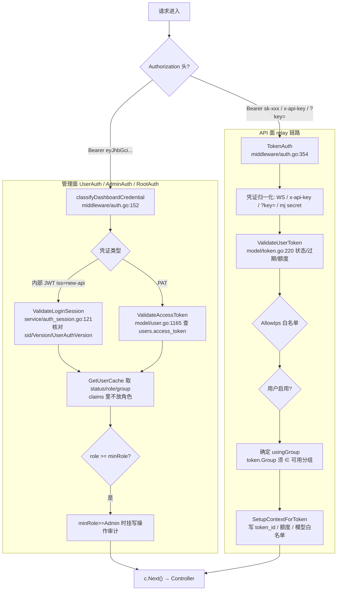
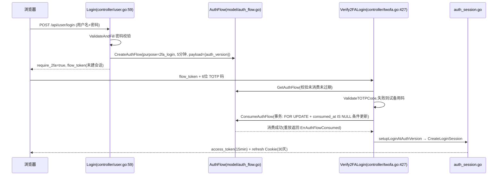
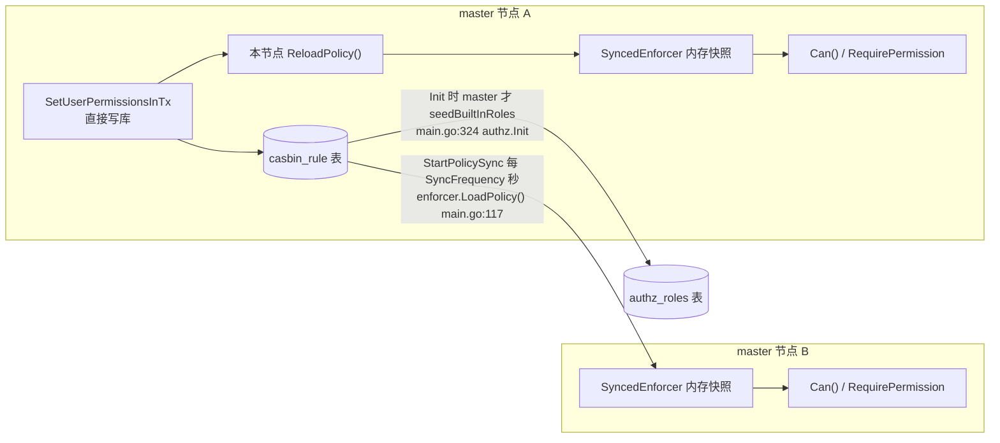

# 认证与用户体系:双凭证、多登录方式与 casbin 授权

> 一句话定位:本篇讲 new-api 如何用两套互不相干的凭证(管理面登录态与 API 面 `sk-xxx` 令牌)承载两类完全不同的流量,多种登录方式如何汇合到统一入口,以及 casbin 授权如何在多节点部署下保持一致。读完你能独立画出鉴权中间件链、说清 Token 字段在中继链路中的生效点。

## 🎯 本篇你将学到

- 管理面(会话/JWT/PAT/2FA)与 API 面(token `sk-xxx`)双凭证体系的设计分野:各自的中间件、过期策略与存储位置
- `Token` 模型的额度上限、模型限制、分组字段如何在 `TokenAuth` → `Distribute` 链路中逐步生效
- OAuth 各 provider 统一到的 `Provider` 接口,以及自定义 provider 从数据库热加载的机制
- `AuthFlow` 一次性凭证如何串起 TOTP 2FA、WebAuthn Passkey 与第三方绑定等"多步认证仪式"
- casbin 授权模型、`StartPolicySync` 周期重载解决多 master 权限传播
- 用户分组 → 可用分组 → `auto` 组的解析时机

## 🧠 核心概念

一个 AI 网关天然有两类流量,安全诉求完全相反:

| | 管理面(dashboard) | API 面(relay) |
|---|---|---|
| 谁在用 | 浏览器里的管理员/用户 | 程序、脚本、SDK |
| 凭证 | 短期 JWT + 刷新 Cookie + PAT | `sk-xxx` 令牌 |
| 时效 | 短(15 分钟)且可撤销 | 长期(默认永不过期) |
| 额外要求 | 2FA、Passkey、会话管理 | 无交互可能,必须单请求完成 |
| 泄露后果 | 账号被接管 | 额度被盗刷,但可秒级禁用 |

用 Java 生态类比:管理面 ≈ Spring Security 的 `UsernamePasswordAuthenticationFilter` + `SecurityContext` 过滤器链;API 面 ≈ 网关产品里的 API Key 校验过滤器。两者**不共用**过滤器、不共用凭证表、不共用过期策略——这是理解本篇的第一把钥匙。

关键角色对应:

- `middleware/auth.go` 的 `UserAuth()/AdminAuth()/RootAuth()` ≈ 一组不同 `access()` 级别的 `HandlerInterceptor`
- `model.Token` ≈ 一张"授权码表",`model.User` ≈ 账号主体表
- `service/authz` 的 casbin `Enforcer` ≈ Spring Security 的 `AccessDecisionManager`,但策略存数据库
- `AuthFlow` ≈ 一次性防重放票据,类似 OAuth 的 `state` + 一次性 `code` 合体

## 🔍 源码剖析

### 1️⃣ 管理面:一条链、三种角色、两类凭证

入口是同一个 `authHelper`,三个公开中间件只是最低角色不同:

```go
// middleware/auth.go:47
func authHelper(c *gin.Context, minRole int) {
    user, identity, useAccessToken, err := authenticateDashboardRequest(c)
    ...
    if user.Status != common.UserStatusEnabled { ... }   // 封禁优先于角色
    if user.Role < minRole { ... }                       // 403 权限不足
    setDashboardAuthContext(c, user, identity, useAccessToken)
    // 管理/root 写操作审计兜底:挂在鉴权链路里,路由上无需单独挂审计中间件
    if minRole >= common.RoleAdminUser { auditWriter = beginAdminAudit(c) }
    c.Next()
    finishAdminAudit(c, auditWriter)
}
// middleware/auth.go:94/100/106  UserAuth→RoleCommonUser, AdminAuth→RoleAdminUser, RootAuth→RoleRootUser
```

`classifyDashboardCredential`(`middleware/auth.go:152`)负责分辨凭证类型:先用 `ParseDashboardAccessToken` 尝试按**内部 JWT** 解析(带 `iss=new-api`、`aud=new-api-dashboard`、`token_use` 三重标识,`service/auth_token.go:107`);解析不出来就退回按 **PAT** 处理,直接查 `users.access_token` 列(`model/user.go:1165` 的 `ValidateAccessToken`,精确匹配、无哈希)。

JWT 校验通过后并非直接信任 claims,而是回服务端核对会话:

```go
// service/auth_session.go:121
func ValidateLoginSession(identity AuthIdentity) (*model.UserSession, *model.UserBase, error) {
    session, err := model.GetUserSessionCached(identity.SessionID)
    ...
    if session.UserID != identity.UserID || session.Status != active ||
       session.RevokedAt != 0 || session.ExpiresAt <= now ||
       session.Version != identity.SessionVersion ||
       session.UserAuthVersion != identity.UserAuthVersion {
        return nil, nil, ErrLoginSessionRevoked
    }
    user, err := model.GetUserCache(identity.UserID)
    if user.Status != enabled || user.AuthVersion != identity.UserAuthVersion { → revoked }
}
```

**为什么这么设计**:JWT claims 里刻意不放 `role/status/group`(`service/auth_token.go:30` 注释写明"Role, status and group are deliberately loaded from the user cache instead of JWT claims")。否则封禁、降权后旧 token 依然有效,只能等它过期。服务端会话表 `user_sessions`(`model/user_session.go:42`)持有 `Version` 与 `UserAuthVersion` 两个单调递增版本号,任何一个对不上即判 revoked——这就是"可撤销的 JWT"。

错误响应也分层:`AUTH_TOKEN_EXPIRED` / `AUTH_SESSION_REVOKED` / `AUTH_UNAUTHORIZED`(`middleware/auth.go:211-226`),前端据此决定是静默刷新还是踢回登录页。

### 2️⃣ API 面:`TokenAuth` 的归一化与校验链

API 面只有一条中间件 `TokenAuth`(`middleware/auth.go:354`),它做的第一件事是**凭证归一化**——把各协议五花八门的密钥位置统一改写成 `Authorization: Bearer sk-xxx`:

- WebSocket:`Sec-WebSocket-Protocol: openai-insecure-api-key.sk-xxx`(`auth.go:357-370`)
- Anthropic:`x-api-key`(`auth.go:372-377`)
- Gemini:`?key=` 查询参数或 `x-goog-api-key`(`auth.go:379-392`)
- Midjourney:`mj-api-secret`(`auth.go:398-405`)

随后进入核心校验 `ValidateUserToken`(`model/token.go:220`):依次检查令牌状态(耗尽/过期/禁用)、`ExpiredTime != -1 && ExpiredTime < now`、`!UnlimitedQuota && RemainQuota <= 0`。注意它只在**未启用 Redis** 时才顺手把状态写回库(`model/token.go:232`),启用缓存后状态推进交由预扣费链路处理,避免每次请求都写库。

`Token` 模型(`model/token.go:14-33`)的字段与生效点一一对应:

| 字段 | 含义 | 生效位置 |
|---|---|---|
| `RemainQuota` / `UnlimitedQuota` | 令牌级额度上限 | `TokenAuth` 拒绝 + 计费预扣 |
| `ExpiredTime`(默认 `-1`) | 永不过期哨兵值 | `ValidateUserToken` |
| `ModelLimitsEnabled` / `ModelLimits`(逗号分隔) | 令牌可调用的模型白名单 | `SetupContextForToken` 写入 `token_model_limit` |
| `AllowIps` | IP/CIDR 白名单 | `auth.go:430-444` 的 `IsIpInCIDRList` |
| `Group` / `CrossGroupRetry` / `AutoGroups` | 分组绑定与跨组重试 | `auth.go:461-507` → `Distribute` |

校验通过后 `SetupContextForToken`(`middleware/auth.go:488`)把这些字段铺进 gin Context。其中有个彩蛋:`sk-xxx-<渠道ID>` 语法允许管理员**钉住**指定渠道,普通用户则直接 403(`auth.go:518-536`),钉住动作通过 `ChannelPin` 进入后续选路约束。

### 3️⃣ OAuth 汇合点:一个接口 + 一个注册表 + 数据库热加载

所有第三方登录都实现同一个九方法接口(`oauth/provider.go:11-42`):

```go
type Provider interface {
    GetName() string
    IsEnabled() bool
    ExchangeToken(ctx, code, c) (*OAuthToken, error)   // 授权码换 token
    GetUserInfo(ctx, token) (*OAuthUser, error)        // 拉 userinfo
    IsUserIDTaken(providerUserID string) bool
    FillUserByProviderID(user *model.User, id string) error
    SetProviderUserID(user *model.User, id string)
    GetProviderPrefix() string                         // 自动用户名前缀,如 "github_"
    ProviderUserIDColumn() string                      // 绑定信息落在 users 表哪一列
}
```

用 Java 类比 ≈ Spring Security OAuth2 的 `OAuth2UserService` + `GrantedAuthoritiesMapper` 合体,但更薄:每个 provider 只负责"协议方言",账号落地逻辑由 `controller/oauth.go` 统一编排。

注册方式分两层:

1. **编译期自注册**:各 provider 在 `init()` 里调 `Register("oidc", &OIDCProvider{})`(`oauth/oidc.go:19-21`),GitHub/Discord/LinuxDO 同理;
2. **运行期数据库加载**:自定义 OAuth 站点在启动时从 `custom_oauth_providers` 表读出配置,包装成 `GenericOAuthProvider` 注册(`oauth/registry.go:90-115` 的 `LoadCustomProviders`),入口在 `main.go:377`。管理员在后台增删改自定义站点时,通过 `RegisterOrUpdateCustomProvider` / `UnregisterCustomProvider`(`registry.go:123-133`)热更新注册表,不用重启。

注册表本身是一个带 `sync.RWMutex` 的 map(`registry.go:11-16`),并额外用 `customProviderSlugs` 记录"哪些是可注销的自定义项",避免全局 `Unregister` 误伤内置 provider。

绑定写入走白名单防御:`userBindColumns`(`model/user.go:195-201`)限定只允许 `github_id/discord_id/oidc_id/linux_do_id/wechat_id` 五列,且注释明确指出**为什么必须只写绑定列**——若走"读全量用户 → 改一个字段 → 整体更新",读快照期间并发发生的封禁、降权会被旧快照覆盖回去。

### 4️⃣ `AuthFlow`:多步认证仪式的一次性票据

2FA、Passkey、Telegram 绑定这些"跨多个 HTTP 请求才能完成"的认证流程,统一落在一张表上(`model/auth_flow.go:17-29` 的 purpose 常量):`oauth / 2fa_login / passkey_login / passkey_register / passkey_step_up / telegram_bind / telegram_assertion`。

```go
// model/auth_flow.go:39
type AuthFlow struct {
    TokenHash  string     // HMAC 摘要,明文 token 绝不落库
    Purpose    string     // 防止票据跨用途复用
    UserId     int
    SessionId  string
    Payload    string     // 如 {auth_version: 7}
    ExpiresAt  time.Time
    ConsumedAt *time.Time
}
```

消费是原子的:`ConsumeAuthFlowWithAction`(`model/auth_flow.go:189`)在事务里 `lockForUpdate` 锁行、二次检查 `ConsumedAt`、带条件的 `UPDATE ... WHERE consumed_at IS NULL AND expires_at > ?` 并校验 `RowsAffected == 1`,再执行业务动作——票据无法被重放。外部 provider 的断言防重放则用 `ClaimExternalAuthAssertionWithTx`(`model/auth_flow.go:133`):靠 `token_hash` 唯一索引 + `ON CONFLICT DO NOTHING`,在 SQLite/MySQL/PostgreSQL 上都能原子拒绝重复断言。

**密码登录 + 2FA 的接力**(`controller/user.go:106-144` → `controller/twofa.go:427`):

```text
Login: 密码校验通过 → IsTwoFAEnabled? 是 → CreateAuthFlow(2fa_login, 5 分钟, payload={auth_version})
       → 返回 require_2fa=true + flow_token(此刻不建立会话)
Verify2FALogin: GetAuthFlow(flow_token) → 核对 payload.AuthVersion == user.AuthVersion
       → TOTP 六位码(先)或备用码(后) → ConsumeAuthFlow → setupLoginAtAuthVersion 建会话
```

TOTP 实现(`common/totp.go:25` 的 `GenerateTOTPSecret`,SHA1/30 秒/6 位)配套防爆破参数:最多 5 次失败、锁定 300 秒(`common/totp.go:20-21`)。

Passkey(WebAuthn)则体现了"登记"与"断言"的分离:`UpdatePasskeyAssertionState`(`model/passkey.go:164`)只更新 `SignCount/CloneWarning` 等断言产物;任何**登记变更**(换钥匙、删钥匙)都走 `UpsertPasskeyCredentialWithAuthVersion`(`model/passkey.go:203`),在同一事务里 `IncrementUserAuthVersionWithTx` 递增用户认证版本并刷新缓存。`AuthVersion` 一变,该用户所有已签发会话立即失效——这就是全局"踢下线"开关。

### 5️⃣ casbin 授权与多节点策略同步

角色表 `authz_roles`(`model/authz_role.go:3`)只存角色元数据,真正的授权矩阵在 casbin 策略里。模型是极简的 `sub, obj, act, eft` 四元组(`service/authz/enforcer.go:19-31`),策略存 `casbin_rule` 表,由项目自写的 `gormAdapter`(`service/authz/adapter.go:15`)读写,而非官方 gorm-adapter。

判定顺序(`service/authz/resolver.go:8` 的 `Can`)值得细读:

```go
func Can(userID int, systemRole int, permission Permission) bool {
    roles := resolveSubjectRoles(userID, systemRole)
    for _, role := range roles { if isSuperuserRole(role) { return true } }  // 超管短路
    if !isKnownPermission(permission) { return false }                       // 未知权限一律拒绝
    if effect, ok := explicitSubjectEffect(e, UserSubject(userID), p); ok {  // ① 用户级显式策略
        return effect == EffectAllow                                          //   deny 优先于 allow
    }
    for _, role := range roles { if roleBaselineAllows(e, role, p) { return true } }  // ② 角色基线
    return false
}
```

主体字符串是 `user:<id>` / `role:<key>`(`service/authz/permission.go:20-26`),中间件形态是 `RequirePermission(authz.TaskPluginBind)`(`middleware/auth.go:228`),在 `router/api-router.go:252` 等处叠加在 `AdminAuth()` 之后——先过粗粒度角色门槛,再过细粒度资源授权。

多节点一致性靠**笨但有效的轮询**:

```go
// service/authz/enforcer.go:84
func StartPolicySync(frequency int) {
    for {
        time.Sleep(time.Duration(frequency) * time.Second)
        if err := ReloadPolicy(); err != nil { common.SysError(...) }
    }
}
// main.go:117  go authz.StartPolicySync(common.SyncFrequency)
```

权限变更只写数据库(见 `SetUserPermissionsInTx`),只刷新本节点的内存快照;其他实例靠周期 `LoadPolicy` 追平,否则撤销的授权在别的节点上会一直生效到重启。代码注释明确说它镜像了 `model.SyncOptions` 的轮询模式——整个项目对"多 master 下的配置/权限传播"统一选择了这条低成本路线。

### 6️⃣ 分组:`usingGroup` 的确定时机

分组解析分两步,而不是在鉴权时一步到位:

1. **鉴权时**(`middleware/auth.go:461-478`):默认 `usingGroup = user.Group`;若令牌显式绑定了 `token.Group`,必须同时满足"在 `GetUserUsableGroups(userGroup)` 返回的可用集合内"(`service/group.go:14`,支持 `+:`/`-:` 前缀的加减规则)且"在 `GroupRatio` 倍率表中存在",`auto` 组对后者豁免(`auth.go:471-474`)。
2. **选路时**(`Distribute`,`middleware/distributor.go:108-183`):`usingGroup == "auto"` 时才展开成具体分组——先取渠道亲和缓存,再按 `service.GetRequestAutoGroups`(`service/group.go:97`)给出的候选序列逐个用 `IsChannelEnabledForGroupModel` 试探;令牌级 `AutoGroups` 优先,否则退回用户级 `GetUserAutoGroup`(`service/group.go:56`,取系统 `auto` 组列表与该用户可选组的交集)。最终写入 `ContextKeyAutoGroup`。

**为什么延迟到 Distribute**:auto 的正确展开依赖"当前模型在哪个分组有可用渠道",这只有拿到请求模型名之后才能回答,提前解析只会得到过期答案。

## 📐 图解

### 图 1:双凭证体系的中间件分野



### 图 2:密码 + 2FA 登录与 AuthFlow 原子消费



### 图 3:casbin 策略的多节点最终一致



## 🎓 设计精妙之处与可借鉴点

**1. 双凭证彻底分离,而不是一张表加个 type 字段。** 管理面凭证有会话表、有轮换、有版本号、可远程吊销;API 面凭证是简单 `sk-xxx`、靠状态位禁用。为什么:两者的威胁模型、生命周期、审计需求完全不同,硬塞进一套模型只会互相拖累。→ 借鉴到 Java 项目:Spring Security 里不要把"浏览器登录态"和"对外开放 API Key"塞进同一个 `AuthenticationProvider`,拆成两条 `SecurityFilterChain`(`securityMatcher` 区分)各自配过期与登出策略。

**2. JWT 里不放授权数据,只放"指针"。** claims 只有 `UserID/sid/uv/sv` 四个字段(`service/auth_token.go:30`),角色与分组每次从缓存读。代价是每请求一次缓存查询,换来的是封禁/降权即时生效。→ 借鉴:JWT 中只放不可变标识,可变授权数据放服务端,并用版本号做失效;这是"可撤销 JWT"的标准做法。

**3. `AuthVersion` 单调递增作为全局失效开关。** Passkey 换绑、密码修改、2FA 变更都在同一事务里递增它。为什么:把"找出该用户所有会话并逐一吊销"的 O(N) 操作变成 O(1) 的比较。→ 借鉴:用户表加 `auth_version`/`token_epoch` 列,与密码修改同事务递增。

**4. 一次性票据只存 HMAC 摘要,且消费是条件更新。** `AuthFlow.TokenHash`、`UserSession.RefreshHash` 都是"明文不落库"(`model/auth_flow.go:38`、`model/user_session.go:41`);消费靠 `WHERE consumed_at IS NULL` + `RowsAffected == 1` 判定,天然防并发重放,且兼容三种数据库。→ 借鉴:任何一次性凭证(重置链接、邮箱验证码、防重放 nonce)都应存哈希并用条件更新而非"查了再改"。

**5. 多节点传播用轮询而非消息总线。** `StartPolicySync` 与 `SyncOptions` 同款模式,代码量十几行,无新增依赖,容忍最长一个 `SyncFrequency` 的一致性延迟。→ 借鉴:中小规模多实例部署里,"数据库为唯一事实源 + 周期重载"往往比引入 MQ/Redis Pub/Sub 更划算,前提是业务能接受最终一致。

**6. 绑定列白名单 + 专用更新方法。** `UpdateUserBindColumn` 的注释(`model/user.go:203-206`)是教科书级的并发注释:整行更新会把并发发生的封禁/降权"回滚"掉。→ 借鉴:JPA/MyBatis-Plus 项目里,状态机字段(状态、角色、分组)永远用带条件的选择性 `UPDATE`,禁止 `save(全量实体)` 回写。

## ⚠️ 常见坑与注意事项

- **三库兼容**:行锁必须走 `lockForUpdate(tx)`(GORM v2 会静默忽略旧式 `gorm:query_option` 写法),且 SQLite 不支持 `FOR UPDATE` 会自动跳过——`ConsumeAuthFlow` 因此额外叠加了条件更新兜底;防重放唯一索引 + `ON CONFLICT DO NOTHING` 也是为了三库语义一致(见 `model/auth_flow.go:146`)。
- **`TokenAuthReadOnly` 与 `TokenAuth` 语义不同**(`middleware/auth.go:277-281`):只读接口刻意放行已过期/已耗尽令牌以便查用量,只挡 `TokenStatusDisabled`。给只读端点换中间件时会悄悄放开语义,别混用。
- **令牌 key 会被 `parts[0]` 截断**:`sk-xxx-<渠道ID>` 的"钉渠道"语法依赖按 `-` 切分,普通用户带后缀会直接 403(`middleware/auth.go:518-536`)。自定义 key 时不要假设整个 `Authorization` 值就是 key。
- **令牌缓存初始化不能覆盖已预扣余额**:`GetTokenByKey` 冷缓存回填时,已存在的 Redis 哈希只刷新 TTL(`model/token.go:293-299`),否则原子预扣的额度会被数据库旧快照冲掉,造成超卖。
- **JSON 一律走 `common.Marshal/Unmarshal` 封装**(AGENTS.md 强制),`token.AutoGroups` 的存取(`model/token.go:35-57`)就是按此约定实现的。
- **OAuth 绑定只写白名单列**(`model/user.go:195`),传入非法列名会直接报错;新增第三方 provider 时记得同步扩白名单并实现 `ProviderUserIDColumn()`(落在 `user_oauth_bindings` 表的 provider 返回空串)。
- **JWT/PAT 的判定顺序**:`ParseDashboardAccessToken` 用 `ParseUnverified` 先看 issuer/audience/token_use 三标识再决定是否当 JWT 验签(`service/auth_token.go:107-130`),不符合就当 PAT 查库。自造非标 token 会被当成 PAT 落到一次无谓的数据库查询上。
- **权限未知即拒绝**:`Can` 对不在注册表里的 permission 直接返回 false(`service/authz/resolver.go:18`),新增资源/动作必须先注册,否则永远 403。

## 🏋️ 刻意练习:缺陷预演

> 先自己想 2 分钟,再看参考思路。

### 练习 1|JWT 只当指针 + AuthVersion 版本号失效

- 🔴 **反模式预演**:把 `role`/`status`/`group` 塞回 JWT 的 `claims`,顺手把 `AccessTokenTTL` 从 15 分钟(`service/auth_token.go:18`)拉长到 24 小时,理由是「省掉每请求那一次会话回查」。现在管理员 09:00 发现一个最高角色账号口令已泄露,点下封禁并降权——攻击者手里那串 `eyJhbGci...` 还能以原权限跑多久?期间他创建新 `sk-xxx` 令牌、把自己的令牌改成无限额度、导出其他用户的 `access_token`,你靠什么拦?
- 🟡 **陷阱预判**:既然 JWT 每请求都要回服务端查,有人提议「管理面干脆全用永不过期的 PAT」:按 `users.access_token` 精确匹配查库(`model/user.go:1165`),连会话表都省了。哪些功能会因此直接失效?凭证泄露后的止血手段还剩什么?
- 💡 **参考思路**:①封禁与降权只能作用于服务端可查的状态,塞进 `claims` 的授权数据在 TTL 内物理上无法撤回;版本号核对(`service/auth_session.go:130`)把「找出并吊销所有会话」压成一次 `!=` 比较。②PAT 的身份只有 `UserID + UserAuthVersion`、没有 `SessionID`(`middleware/auth.go:179`),`GetSessionAuthIdentity` 会刻意拒绝它(`middleware/auth.go:123-124`),passkey 登记、Telegram 绑定全部拿不到身份;且它是无过期静态密钥,止血只剩「重置那一列」——凭证生命周期必须匹配用途。

### 练习 2|AuthFlow:明文不落库 + 条件更新原子消费

- 🔴 **反模式预演**:两个「简化」同时上——`TokenHash` 改成明文落库(省一次 HMAC),`ConsumeAuthFlowWithAction` 的条件更新改成「先 SELECT 看 `ConsumedAt` 为空再 UPDATE」。攻击面:Telegram 登录/绑定靠 `ClaimExternalAuthAssertionWithTx` 防上游断言重放(`controller/telegram.go:146`),其权威性来自唯一索引 + `ON CONFLICT DO NOTHING` + `RowsAffected != 1`(`model/auth_flow.go:146-155`)。换成「查了再改」后,同一份被 webhook 日志、网关访问日志或中间链路留痕过一次的断言,能被重放几次?再想一步:一张被导出排查问题的 `auth_flows` 表,在明文版本里等于什么?
- 🟡 **陷阱预判**:SQLite 上 `lockForUpdate` 不产生行锁,此时「查了再改」还有没有任何兜底?`ErrAuthFlowConsumed` 到底由哪一行判定?
- 💡 **参考思路**:两个并发请求都可能 SELECT 到「未消费」,重放是竞态级必然而非偶发;唯一索引把判重下沉到存储层,`RowsAffected != 1`(`model/auth_flow.go:215-217`)才是权威结论——这也是 SQLite 无行锁时的最后一道防线。明文票据遇上数据库泄露(备份、导表、注入)等于把未消费凭证直接送出去,存 HMAC 的意义是「整库泄露也造不出可用凭证」。

### 练习 3|令牌缓存:冷回填不许覆盖预扣余额

- 🔴 **反模式预演**:教科书直觉是「缓存未命中,就拿数据库快照把 Redis 哈希填上,不管哈希是否已存在」。开启 Redis + 批量落库的多节点部署:某令牌余量 10 亿,节点 A 的请求刚用 Lua 脚本原子预扣 9.9 亿(`model/quota_reserve.go:42-55`),落库要等批量窗口(默认 5 秒,`common/init.go:113`);此刻该哈希恰好被 Redis 按内存策略驱逐,预扣链路走「水合后重试」重新从库回填(`model/quota_reserve.go:217-222`)。用户此刻的真实可用额度是多少?写一个循环脚本怎么把这个套利滚大?
- 💡 **参考思路**:开启 Redis 后,令牌哈希不是读加速副本,而是预扣费的记账主体,数据库才是异步追平的一方——所以回填必须「冷才写、热只续 TTL」(`model/token_cache.go:64-71` 两个 `EXISTS` 分支的语义)。另一个 `EXISTS` 查的是防改库护栏键(fence,`model/token_cache.go:33`),挡的是写库窗口内的旧读者把旧快照写回;两个分支对应「旧值」的两种来源,漏掉任何一个都是给套利开门。

## 🔗 与其他模块的关系

- 中间件在链中的挂载位置与路由分组,详见 02-routing-middleware.md
- `TokenAuth` 产出的 `usingGroup` 如何驱动选路与负载均衡,详见 08-channel-ability.md
- `RemainQuota` 的预扣费(pre-consume)与结算,详见 06-billing-overview.md
- `GetTokenByKey` 背后的 Redis/内存两级缓存与失效策略,详见 10-cache-system.md
- `user_sessions`、`auth_flows` 等表的三库迁移与锁语义,详见 11-gorm-compat.md
- `SyncFrequency`、`SessionSecret`、OIDC/GitHub 等站点级配置的热更新,详见 13-settings.md
- 一次带令牌的聊天请求从 `TokenAuth` 到上游的完整旅程,详见 00-soul.md

## 📚 小结

new-api 的认证体系可以压缩成三句话:

1. **两个世界、两套凭证**:管理面用"短期 JWT + 服务端会话 + 版本号"换取即时可撤销性,API 面用"无状态 `sk-xxx` + 状态位 + 缓存预扣"换取高吞吐低延迟,二者在 `classifyDashboardCredential` / `TokenOrUserAuth` 这类判定点才短暂相遇。
2. **多登录方式靠"接口 + 注册表 + 一次性票据"汇合**:`Provider` 九方法抹平各 OAuth 方言,自定义站点从数据库热加载;所有跨请求的认证仪式(2FA、Passkey、第三方绑定)都收敛到 `AuthFlow` 的 HMAC 摘要 + 原子消费上,防重放逻辑只写一遍。
3. **授权 = 角色门槛 + casbin 细粒度策略 + 周期重载**:`authHelper` 先按 `Role` 卡粗粒度门槛,`RequirePermission` 再查 casbin 策略矩阵;多 master 部署下放弃消息总线,用 `StartPolicySync` 轮询数据库换取十几行代码的最终一致——这是"简单方案够用时不引入复杂度"的典型示范。

把这三个结论带回 Java 世界:拆分凭证体系、JWT 只当指针用、一次性凭证存哈希并用条件更新消费、授权数据放服务端配版本号失效——这四条几乎可以原样搬进任何 Spring Boot 项目。
