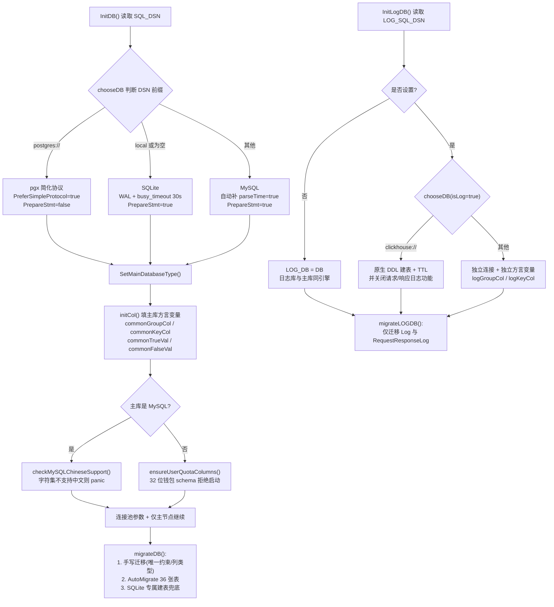

# 数据模型与三库兼容:一套 GORM 代码如何同时伺候 SQLite、MySQL、PostgreSQL

> 一句话定位:本篇拆解 new-api 数据层的跨数据库兼容工程——方言抽象点、行锁封装、主库/日志库分离与迁移纪律。读完你能掌握「一套模型代码跑在三种数据库上」的全部手法,以及每一个不可踩的坑。

---

## 🎯 本篇你将学到

1. `AGENTS.md` 里那句「所有数据库代码必须同时兼容 SQLite、MySQL ≥ 5.7.8、PostgreSQL ≥ 9.6」(第 82 行)是如何在代码里落地的——五个具体的抽象点;
2. `lockForUpdate`(`model/locking.go`)为什么是行锁的唯一入口,以及旧写法 `Set("gorm:query_option", "FOR UPDATE")` 静默失效的隐患;
3. 主库(`DB`)与日志库(`LOG_DB`)分离后,方言变量为什么必须成对准备两份;
4. 迁移纪律:「先手写修补 → 再 `AutoMigrate` → 启动期快速失败(fail-fast)」的顺序为什么不能颠倒;
5. `gorm:"default:true"` 这个看似无害的标签如何导致每次重启都发一遍 `ALTER TABLE`;
6. GORM 核心与驱动是「兼容版本集合」,升级一个必须整组验证——这与 Spring Boot BOM 的依赖对齐思路一致。

---

## 🧠 核心概念

**🔎 为什么非要三库兼容?** new-api 的部署形态两极分化:个人玩家一条 Docker 命令拉起,零外部依赖,此时用内嵌 SQLite;企业生产环境要高并发、要主从,用 MySQL 或 PostgreSQL;日志量特别大时,还能把日志库单独指向 ClickHouse。作为开源网关,作者不可能替用户选数据库,于是「同一份 `model/` 代码,四种存储引擎」成了硬约束。

**🎓 Java 生态对照表**(类比只助理解,均非等同):

| new-api 中的事物 | Java 生态近似物 |
|---|---|
| GORM v2 | JPA / Hibernate(≈),API 风格更像 MyBatis-Plus |
| `Dialector`(mysql/postgres/sqlite) | Hibernate `Dialect`(≈) |
| `AutoMigrate` | `hbm2ddl.auto=update`(≈),但跨库幂等要求更高 |
| `driver.Valuer` / `sql.Scanner` | JPA `AttributeConverter`(≈)+ `@Convert` |
| `lockForUpdate` | JPA `@Lock(PESSIMISTIC_WRITE)`(≈) |
| `DB` 与 `LOG_DB` 两个全局句柄 | 双 `DataSource` + 手动路由(≈) |
| `UsingMainDatabase(x)` 运行期分支 | MyBatis `databaseIdProvider`(≈),按库切换 SQL 片段 |

**🔑 核心设计思想只有一句话**:方言差异要么在**启动期一次性收敛成全局变量**(`initCol()`),要么收敛成**全项目唯一的 helper 函数**(`lockForUpdate`),让业务代码永远不写 `if 数据库是某某`。散落在业务里的方言分支是维护灾难,集中收口才是出路。

---

## 🔍 源码剖析

### 3.1 方言探测:DSN 前缀就是路由

`model/main.go:141-185` 的 `chooseDB` 用 DSN 前缀决定驱动:`postgres://` 走 PostgreSQL、`local` 或空走 SQLite、其余当 MySQL,`clickhouse://` 等前缀仅允许出现在日志库(主库直接报错,见 144-147 行)。这里有两个容易被忽略的细节:

```go
// model/main.go:155-160  PostgreSQL 分支
// 同时关闭 pgx 隐式与 GORM 显式预处理语句:命名 prepared statement 与
// 事务池代理(PgBouncer/Neon/Supabase)不兼容,会触发 FATAL 08P01/42P05。
db, err := gorm.Open(postgres.New(postgres.Config{
    DSN:                  dsn,
    PreferSimpleProtocol: true,       // 简化协议:不发命名预处理语句
}), newGormConfig(false))             // 注意第二参 false:关闭 PrepareStmt
```

对比 MySQL/SQLite 分支传的是 `newGormConfig(true)`(开启预处理语句缓存)。**同一份 `gorm.Config` 在三种库上的正确取值不同**——这正是「兼容层」的真实形态:差异不是没有,而是被收在连接建立这一处。配套的慢日志与脱敏逻辑在 `model/gorm_logger.go:25-47`,驱动错误会收敛成错误码以防内联数据泄露(68-91 行)。

类比:这相当于 Spring Boot 根据 `jdbc:` URL 自动挑选驱动与方言(≈),但这里把「连接参数因库而异」的决策也显式写进了代码,而不是藏在配置里。

### 3.2 `initCol`:两个变量挡掉保留字与布尔字面量

`model/main.go:23-29` 声明了四个方言变量,`initCol()`(44-65 行)在启动时填好:

```go
if common.UsingMainDatabase(common.DatabaseTypePostgreSQL) {
    commonGroupCol = `"group"`   // PG 用双引号包保留字
    commonKeyCol    = `"key"`
    commonTrueVal   = "true"     // PG 布尔字面量
    commonFalseVal  = "false"
} else {
    commonGroupCol = "`group`"   // MySQL/SQLite 用反引号
    commonKeyCol    = "`key`"
    commonTrueVal   = "1"        // 布尔退化为 1/0
    commonFalseVal  = "0"
}
```

为什么要这套变量?`group` 和 `key` 恰好是 SQL 保留字——而它们又是本项目的核心业务词(用户分组、令牌密钥),躲不开。于是凡拼接原生 SQL 的地方都引用变量而非硬编码,例如 `model/ability.go:46`:

```go
DB.Table("abilities").Where(commonGroupCol+" = ? and enabled = ?", group, true)
    .Distinct("model").Pluck("model", &models)
```

💡 一个值得注意的演进:历史上布尔值是通过 `commonTrueVal` 绑定进占位符的(提交 `a9ec62eea`),如今 `model/ability.go` 已改为直接绑定 Go 的 `bool` `true`,由驱动完成类型转换;`commonTrueVal`/`commonFalseVal` 至今保留在 `model/main.go:25-26`,作为 `AGENTS.md:95` 规定的原生 SQL 拼接兜底手段。**抽象点可以暂时没有调用方,但必须存在且文档化**——否则下一次有人手写原生 SQL 时就会硬编码 `= 1`,在 PostgreSQL 上静默查不出任何行。

另外还有个更细的坑:`group` 过滤在 MySQL 与其他库上的字符串拼接函数也不同,`model/channel.go:140-147` 用 `CONCAT` 与 `||` 区分。类比:相当于 MyBatis 的 `databaseId` 分支(≈)。

### 3.3 JSON 列:`Valuer`/`Scanner` + `jsonScanBytes` 兜底

`model/channel.go:54` 里 `ChannelInfo` 声明为 `gorm:"type:json"`,靠两个接口实现对象与列值互转(167-181 行):

```go
// 必须返回 string 而非 []byte:PG simple protocol 下 []byte 参数按 bytea
// 编码,写 json 列会触发 SQLSTATE 22P02。
func (c ChannelInfo) Value() (driver.Value, error) {
    b, err := common.Marshal(&c)
    ...
    return string(b), nil
}
func (c *ChannelInfo) Scan(value interface{}) error {
    return common.Unmarshal(jsonScanBytes(value), c)
}
```

读取侧的 `jsonScanBytes`(`model/main.go:33-42`)把驱动可能返回的 `[]byte` 或 `string` 归一化成 `[]byte`——注释说得很直白:静默丢弃 `string` 会导致字段被清零**而不报错**,这类「不炸但数据没了」的缺陷最难排查。而 `Token.ModelLimits`(`model/token.go:23`)、`Token.AutoGroups`(`model/token.go:28`)与 `Channel.Setting` 等不参与检索的 JSON 数据,则干脆声明为 `gorm:"type:text"`,用纯文本存储——**这就是 JSON 列的 TEXT 兜底**:需要数据库 JSON 函数时才用 `json` 类型,否则 TEXT 最通用。

类比:相当于 JPA 的 `AttributeConverter`(≈),但多了「驱动返回类型因协议而异」这一层现实约束。

### 3.4 `lockForUpdate`:行锁的唯一入口

`model/locking.go:20-25`,全篇 25 行,却是计费正确性的基石:

```go
func lockForUpdate(tx *gorm.DB) *gorm.DB {
    if common.UsingMainDatabase(common.DatabaseTypeSQLite) {
        return tx // SQLite 没有 FOR UPDATE 语法,加了就是语法错误
    }
    return tx.Clauses(clause.Locking{Strength: "UPDATE"})
}
```

三个要点:

- **为什么 SQLite 要跳过**:SQLite 根本没有 `SELECT ... FOR UPDATE`,拼进去只会得到语法错误。SQLite 的并发模型是「单写者」,靠 WAL 模式 + 30 秒 `busy_timeout` 排队(`common/database.go:44-64`),两个冲突事务的结局是「一个失败」而不是「两个都成功」——所以跳过锁并不损失正确性。
- **为什么必须封装**:GORM v1 的写法 `tx.Set("gorm:query_option", "FOR UPDATE")` 在 GORM v2 里**静默失效**——不报错、不加锁,业务照常跑,直到两个请求并发把同一行余额改坏。`AGENTS.md:91` 明令禁止旧写法、禁止调用点自行拼 `clause.Locking{}`,统一走 `lockForUpdate`。全项目 20 余处调用(`model/topup.go:158`、`model/subscription.go:434` 等)全部收口于此。
- **类比**:JPA 的 `@Lock(PESSIMISTIC_WRITE)`(≈)由方言决定生成什么锁语句;区别在于 JPA 遇到不支持的方言会抛异常,而这里**显式选择降级**,因为 SQLite 的单写者模型已经替你串行化了。

### 3.5 主库与日志库分离

`InitDB`(`model/main.go:187-229`)与 `InitLogDB`(231-270 行)是两条平行链:未设置 `LOG_SQL_DSN` 时 `LOG_DB = DB`(233 行),两库合一;设置了则独立建连、独立迁移。日志库可以是与主库**不同**的引擎(比如主库 MySQL + 日志库 ClickHouse)。

这里有个精妙到容易被漏掉的细节:方言变量准备了**两份**。`initCol()` 既填 `commonGroupCol/commonKeyCol`(主库),也填 `logGroupCol/logKeyCol`(日志库,57-64 行),而 `model/log.go:507` 用的是 `logs."+logGroupCol+"`。如果图省事复用主库变量,当主库是 MySQL、日志库是 PostgreSQL 时,SQL 就会带错引号直接报错。**多数据源场景下,方言状态必须随数据源成对出现**——这与 Spring 双 `DataSource` 时要为每个库各配一套方言(≈)同理。

日志库的特殊性也体现在迁移上:`migrateLOGDB`(`model/main.go:391-419`)只迁移 `Log` 与 `RequestResponseLog` 两张表;若日志库是 ClickHouse,则跳过 GORM 迁移改用原生建表 SQL,并且**主动关闭**不支持的请求/响应日志功能(393-397 行)——「降级而不是报错」是网关类软件对可选功能的一致态度。

### 3.6 迁移纪律:先手写修补、再 AutoMigrate、启动期快速失败

`migrateDB`(`model/main.go:318-389`)的顺序刻意如此:

1. **先跑手写迁移**:`migrateTokenKeyUniqueness`(`model/token_migration.go:129-217`,PostgreSQL 专用,把历史遗留的唯一约束换成 GORM 期望的独立唯一索引,全程 `LOCK TABLE ... IN ACCESS EXCLUSIVE MODE` 保护)、列类型迁移等;
2. **再 `AutoMigrate`**(332-369 行,36 张表一次注册,另有 `SubscriptionPlan` 按库单独处理);
3. **最后按库收尾**:SQLite 分支走 `ensureSubscriptionPlanTableSQLite`(379-387 行)。

顺序为什么不能颠倒?`AutoMigrate` 是按「模型标签 ↔ 当前表结构」的比对结果生成 DDL 的,如果历史遗留结构与标签定义存在它无法消化的冲突(比如一个命名不同的唯一约束),先让它跑就会撞墙或产生错误动作。手写迁移先把库「修整到模型期望的形态」,`AutoMigrate` 才能安静地幂等通过。

**SQLite 不能 `ALTER COLUMN`,只能 `ADD COLUMN`**。两个真实模式值得背下来:

- `migrateTokenModelLimitsToText`(`model/main.go:596-645`):PostgreSQL 走 `ALTER TABLE ... ALTER COLUMN ... TYPE text`(623 行),MySQL 走 `MODIFY COLUMN`(633 行),SQLite 直接 `return`(598-600 行)——因为 SQLite 的类型亲和性(type affinity)让 `varchar` 与 `text` 实际等价,无需迁移。**每个分支都先查 `information_schema` 判断当前类型,已达标就跳过**,这就是幂等。
- `ensureSubscriptionPlanTableSQLite`(`model/main.go:515-592`):整表手写建表 SQL,再用 `PRAGMA table_info` 逐列比对、缺失才 `ALTER TABLE ... ADD COLUMN`(587 行)。

第三层纪律是**启动期快速失败**:`ensureUserQuotaColumns`(`model/main.go:277-316`)在执行任何迁移前检查 `users` 表的钱包列是不是 64 位,发现遗留的 32 位 schema 直接拒绝启动——项目故意不自动升级钱包数据,逼运维显式迁移。`checkMySQLChineseSupport`(729-816 行)同理,字符集不支持中文就在启动时 panic,而不是等到写入乱码。类比:相当于 Flyway 的 `validate` 阶段(≈)——迁移不只「往上加」,还要「拒绝危险旧态」。

### 3.7 `default:true` 的跨库陷阱(真实提交复盘)

`AGENTS.md:99` 专门警告:`gorm:"default:true"` 这类布尔默认值标签要避免。这不是理论担忧,仓库里有两次真实修复:`fae39cd90`(修复 `allow_balance_pay` 每次重启重复迁移)与 `dfcb74b52`(修复 `allow_wallet_overflow`),后者 diff 极小却很说明问题:

```diff
- AllowWalletOverflow *bool `json:"allow_wallet_overflow" gorm:"default:true"`
+ AllowWalletOverflow *bool `json:"allow_wallet_overflow"`
```

机制:同一个布尔默认值,MySQL 落成 `tinyint(1)` 的 `b'1'`、PostgreSQL 落成 `true`、SQLite 落成 `1`,各驱动的回读表示与 GORM 的比对规则组合起来,`AutoMigrate` 每次启动都认定「列定义与模型不一致」,于是反复发 `ALTER TABLE`——迁移永远不收敛。修复思路不是换成 `default:1`(那是另一种跨库不确定性),而是**把默认值从 schema 层下沉到代码层**:构造函数、Hook、请求归一化逻辑里赋初值。类比:相当于把「业务默认值」从 DDL 挪到 Java 对象的无参构造器(≈)。

⚠️ 注意当前代码 `model/subscription.go:160` 的 `Enabled bool gorm:"default:true"` 仍是存量残留(对应的 SQLite 建表语句里是 `numeric DEFAULT 1`,见 `model/main.go:530`),说明这类坑在实践中确实容易漏改,新增布尔字段时应主动避开。

### 3.8 GORM 版本集合 ≈ Spring Boot BOM

`go.mod` 中:核心 `gorm.io/gorm v1.25.12`、`gorm.io/driver/mysql v1.5.7`、`gorm.io/driver/postgres v1.5.9`、`github.com/glebarez/sqlite v1.9.0`、`gorm.io/driver/clickhouse v0.6.0`。`AGENTS.md:86` 把它们定义为「兼容版本集合」:升级核心而推断驱动仍然兼容是禁止的,必须整组核对上游兼容性并跑完整的三库验证矩阵。这与「Spring Boot 升级要连着 BOM 一起对齐,单独升某个 starter 大概率踩坑」是同一条工程经验(≈)。

---

## 📐 图解

**图 1:启动时的双库初始化与方言收敛**(对照 `InitDB` / `InitLogDB`)



**图 2:一条原生 SQL 如何穿过方言抽象层落到三种数据库**(以「锁定用户行并读分组」为例,对照 `model/subscription.go:434`)

```mermaid
flowchart TB
    Q["业务代码:<br/>lockForUpdate(tx).Model(&User{}).<br/>Where(\"id = ?\", userId).Select(commonGroupCol)"]
    Q --> R["方言层 1:列名<br/>commonGroupCol"]
    Q --> S["方言层 2:行锁<br/>lockForUpdate()"]
    R --> T{"主库类型?"}
    S --> T
    T -->|PostgreSQL| U1["PG 双引号 + FOR UPDATE"]
    T -->|MySQL| U2["MySQL 反引号 + FOR UPDATE"]
    T -->|SQLite| U3["SQLite 跳过锁子句<br/>依赖 WAL + busy_timeout 串行化写入"]
    U1 --> V[(PostgreSQL)]
    U2 --> W[(MySQL)]
    U3 --> X[(SQLite)]
    V -.->|"Scan 返回 []byte 或 string"| Y["jsonScanBytes() 归一化<br/>json/text 列反序列化"]
    W -.-> Y
    X -.-> Y
```

---

## 🎓 设计精妙之处与可借鉴点

1. **方言状态启动期一次定型**(`initCol`)。为什么:避免每次查询都做引擎判断,且杜绝「运行中引擎不可能变」的分支扩散。**可借鉴**:Java 项目里用 MyBatis 多数据库支持时,把 `databaseId` 相关片段集中到启动期装配,而不是在 SQL 里铺满 `<if>`。

2. **危险 API 收口成唯一 helper**(`lockForUpdate`)。为什么:旧写法静默失效、新写法有方言分支,任何散落调用点都可能写错。**可借鉴**:把易错的三方 API(如 JPA 锁、事务传播、时区转换)封装成项目内唯一入口,并用 `AGENTS.md` 这类团队规约强制走入口——规约只有配上唯一入口才可执行。

3. **迁移的「修补在前、自动在后」分层**。为什么:`AutoMigrate` 只认模型标签,无法表达「换约束名」「改列类型」这类历史包袱。**可借鉴**:Flyway/Liquibase 项目同理——`ALTER COLUMN` 这类方言敏感操作写成按库分派的迁移脚本,并在脚本内先查元数据再执行,保证可重复执行。

4. **启动期快速失败(fail-fast)**。为什么:32 位钱包列、不支持中文的字符集,越晚发现损失越大。**可借鉴**:应用启动时加一层 schema 体检(校验关键列类型、字符集、索引存在性),用「拒绝启动」换「线上数据损坏」。

5. **多数据源的方言状态必须成对**(`commonGroupCol` 与 `logGroupCol`)。为什么:主库与日志库可以是不同引擎。**可借鉴**:Spring 双数据源场景中,方言相关配置要绑定到各自的 `JpaProperties`(≈),严禁全局单例复用。

6. **字节级细节也要写进注释**(`Value()` 返回 `string` 而非 `[]byte`)。为什么:PG 简化协议下 `[]byte` 会被编码为 `bytea`,触发 `SQLSTATE 22P02`。**可借鉴**:这类问题无法靠读类型签名发现,踩坑后必须把原因固化在代码注释里,否则下一个改代码的人会「顺手优化」回去。

---

## ⚠️ 常见坑与注意事项

- **🕳️ 旧版行锁写法静默失效**:`tx.Set("gorm:query_option", "FOR UPDATE")` 在 GORM v2 中被忽略,不报错也不加锁(`model/locking.go:13-15` 注释、`AGENTS.md:91`)。症状是偶发的余额错乱,而非报错。
- **🕳️ SQLite 不支持 `ALTER COLUMN`**:改列类型只能「新建表 + 搬数据」或 `ADD COLUMN`(`AGENTS.md:98`);不过 SQLite 的类型亲和性常让 `varchar`/`text` 无需迁移(见 `model/main.go:597-600`)。
- **🕳️ 布尔 `default:true` 导致迁移不收敛**:MySQL/PG 归一化不同,`AutoMigrate` 每次重启重复 `ALTER TABLE`(`AGENTS.md:99`、提交 `fae39cd90`、`dfcb74b52`)。
- **🕳️ PostgreSQL + 事务池代理**:命名预处理语句与 PgBouncer/Neon/Supabase 冲突,报 `08P01`/`42P05`;连接必须用简化协议(`model/main.go:155-160`),错误信息在 `model/gorm_logger.go:75-79` 有针对性提示。
- **🕳️ JSON 列读写类型不一致**:写入时 `[]byte` 在 PG 上被当 `bytea`;读取时驱动可能返回 `string` 被静默丢弃(`model/main.go:31-42`、`model/channel.go:167-181`)。
- **🕳️ SQLite 连接参数形态**:必须是 `_pragma=busy_timeout(30000)` 这种 DSN 写法,旧的 `_busy_timeout=` 形式会被纯 Go 驱动静默忽略,并发写入时报「database is locked」(`common/database.go:48-54`)。
- **🕳️ 验证纪律不可打折**(`AGENTS.md:87`):任何影响数据库行为的改动,必须在**真实**的 SQLite、MySQL、PostgreSQL 实例上验证;单元测试、mock、只测一种方言都不算数;schema 变更要同时走「全新空库」与「从最近发布版升级」两条路径,并把启动/迁移跑两遍以证明幂等。

---

## 🏋️ 刻意练习:缺陷预演

> 先自己想 2 分钟,再看参考思路。

### 练习 1|行锁唯一入口:`lockForUpdate`

- 🔴 **反模式预演**:支付回调的幂等完全押在数据库行锁上——`model/topup.go:173-176` 的注释写明「同一订单的并发/重复回调(包括多实例部署下)最多充值一次」,正确性由 `model/topup.go:190` 事务里的 `lockForUpdate(tx)` 兜底。现在假设新同事从老项目抄来 GORM v1 写法 `tx.Set("gorm:query_option", "FOR UPDATE")` 替换它,推演同一笔 100 元订单、支付网关并发重发两条回调的时序:两个事务各自读到什么订单状态?用户余额最终多加多少?这个错误会以报错、对账差异还是用户投诉的形式暴露?为什么只跑单请求的测试永远全绿?
- 🟡 **陷阱预判**:SQLite 部署的用户看到 `lockForUpdate` 在 `model/locking.go:21-23` 直接 `return tx`,认定「我的库根本没有行锁」,于是给关键事务手动补上 `clause.Locking{Strength: "UPDATE"}`。会发生什么?真正替 SQLite 串行化写入的是哪三个机制?
- 💡 **参考思路**:两个事务都看不到对方未提交的写入、都判定订单仍是 `pending`,于是同一笔订单入账两次——全程没有任何报错,只能靠对账差异或用户投诉发现;「静默失效」正是它比崩溃可怕的地方,也是行锁必须收口成唯一入口的原因。SQLite 上手动补锁子句会直接得到语法错误(`FOR UPDATE` 不存在);真正的兜底是 WAL + `busy_timeout(30000)` + `_txlock=immediate`(`common/database.go:64`)——两个冲突事务的结局是「一个失败」,而不是「两个都成功」。

### 练习 2|方言变量:两套变量 + 启动期一次定型

- 🔴 **反模式预演**:`model/log.go:507` 的日志分组筛选拼的是日志库变量 `logGroupCol`。假设有人嫌「两套变量太啰嗦」,删掉 `model/main.go:57-64` 的日志库分支、统一复用主库的 `commonGroupCol`:①在「未设置 `LOG_SQL_DSN`」的默认部署里,为什么一切照旧?②切到「主库 MySQL + 日志库 PostgreSQL」的客户环境,第一条按分组筛选的日志查询会发生什么?为什么 Go 编译器拦不住、只跑 MySQL 单库的验证矩阵也拦不住?
- 🟡 **陷阱预判**:`model/channel.go:142-144` 为 MySQL 用 `CONCAT(',', col, ',')`、为其他库用 `(',' || col || ',')`。有人以「统一写法」为由合并成 `||` 一种,MySQL 默认 `sql_mode` 下会发生什么?提示:`||` 在 MySQL 默认不是字符串拼接,而是逻辑或——推演 `(',' || col || ',')` 在分组列取值 `vip` 时的求值结果,以及随后那条 `LIKE` 能命中多少行。
- 💡 **参考思路**:①默认部署主库与日志库同引擎,两套变量内容恰好相同,缺陷完全不可见——所以「多数据源方言状态必须成对」要写进代码与规约,不能靠自觉;②反引号形态拼进 PostgreSQL 就是语法错误,而这是运行期字符串拼接,编译期不检查、单库验证不覆盖,只有三库矩阵加跨引擎部署才能暴露。陷阱:MySQL 把 `||` 求值为逻辑或,字符串逐段转数字得 `0`,最终拿 `0` 去 `LIKE`,分组筛选**静默返回空**——渠道列表凭空少一片,却没有任何报错。

### 练习 3|迁移纪律:启动期快速失败 vs 自动升级

- 🔴 **反模式预演**:`ensureUserQuotaColumns`(`model/main.go:277`)在任何迁移执行前检查 `users` 表的钱包四列(`quota`/`used_quota`/`aff_quota`/`aff_history`,见 `model/main.go:272`)是不是 64 位,发现 32 位旧 schema 直接拒绝启动,注释明说故意不自动升级钱包(`model/main.go:274-276`)。有人嫌这不友好,改成「启动时自动把四列升成 64 位」。推演:①对一张几百万行、每秒都有扣费写入的 `users` 表,这条改列类型的 DDL 在 MySQL 上意味着什么?升级中途失败(锁等待超时、连接断开)之后应用处于什么状态?②反过来,保留 32 位列硬跑,`quota` 与 `used_quota` 这种余额和累计消耗值撞上 int32 上限(约 21 亿)之后会发生什么?
- 🟡 **陷阱预判**:`model/subscription.go:160` 的 `Enabled bool gorm:"default:true"` 是正文承认的存量残留。如果你认为「它只是每次重启多发一条 `ALTER TABLE`,顶多日志难看」,再想两层:多副本滚动发布时,N 个节点同时启动迁移会叠加出什么?这些反复出现的 DDL 日志,又如何影响你对**真正新迁移**成败的判断?
- 💡 **参考思路**:①自动升级把「一次普通重启」变成一次大表 DDL(整表重建加锁等待),失败后没有回滚点,启动行为从此不可预测——快速失败(fail-fast)的本质是拿「拒绝启动」换「线上数据损坏」;②溢出后数值变负,而在计费系统里负数意味着给用户退钱、给推广者返佣,这种静默错误比迁移慢十倍严重得多。陷阱:迁移永不收敛等于每个副本每次重启都发一遍 DDL,MySQL 上 DDL 要拿元数据锁,一个长事务就能让 `ALTER` 排队、并拖住排在它后面的所有查询;同时重复 DDL 把启动日志变成噪音,真正的迁移失败会被淹没。

---

## 🔗 与其他模块的关系

- 启动序列中 `InitDB`/`InitLogDB` 的位置与主从节点判断,详见 01-startup-lifecycle.md;
- `abilities` 表的保留字查询与负载均衡(本篇 3.2 的最大调用方),详见 08-channel-ability.md;
- 行锁保护下的预扣费与结算事务,详见 06-billing-overview.md;表达式计费的落库,详见 07-billingexpr.md;
- 日志库分离与 ClickHouse 日志查询的完整闭环,详见 12-logging-dashboard.md;
- 用户、令牌(`tokens.key` 唯一索引迁移)与鉴权数据,详见 09-auth-user.md;
- 渠道表 `ChannelInfo` JSON 列的消费方,详见 03-adaptor-system.md;
- 缓存与数据库的一致性校验(`user_cache.go` 回源查询),详见 10-cache-system.md;
- 异步任务表与 `jsonScanBytes` 在任务元数据上的应用,详见 14-task-system.md。

---

## 📚 小结

三库兼容不是「写点 `if-else`」这么轻巧,而是一套**分层收口**的工程:引擎选择与连接参数收口在 `chooseDB`;保留字列名与布尔字面量收口在 `initCol` 的两组变量;行锁收口在 `lockForUpdate`;JSON 序列化收口在 `Valuer`/`Scanner` 加 `jsonScanBytes`;迁移收口在「手写修补 → `AutoMigrate` → 启动期体检」的固定顺序。业务层因此得以只面对 `DB`/`LOG_DB` 两个句柄和普通的结构体。它给 Java 工程师的启示是:**跨数据库支持的成本不在写兼容代码,而在于验证矩阵的纪律**——三个真实数据库、fresh 与升级双路径、重复执行两遍,一步都不能省;以及:**所有容易写错的方言细节,都要变成团队里唯一的那个函数**。
