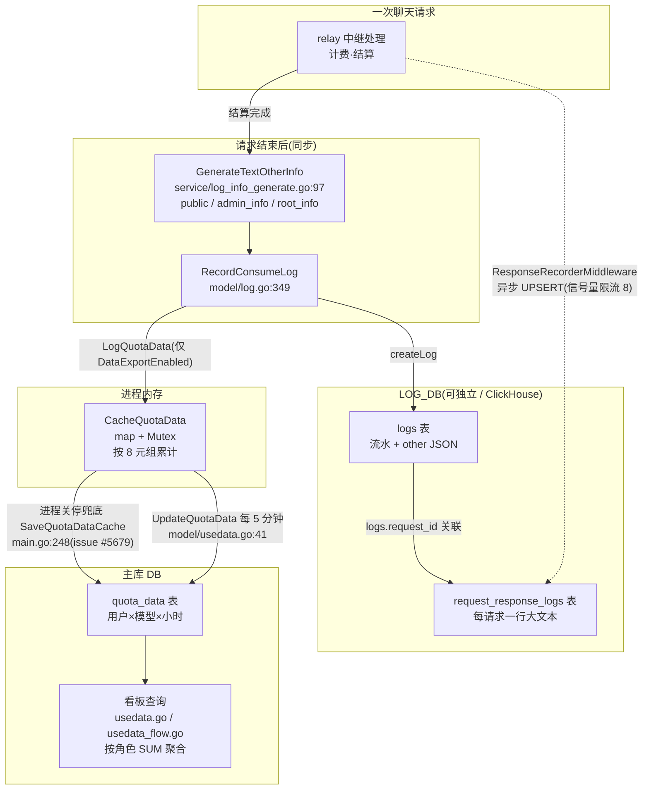
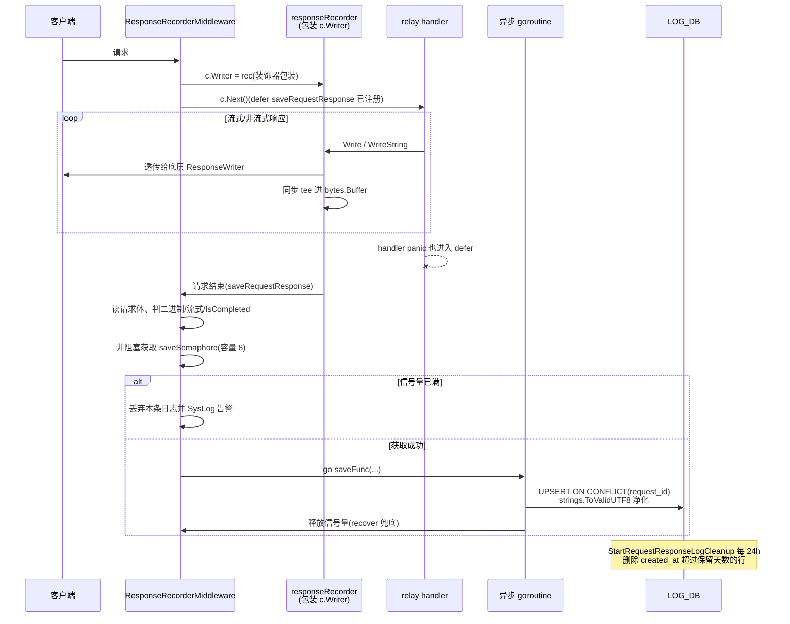

# 12 — 日志与数据看板:一个网关的三套「账本」

> 一句话定位:本篇拆解 new-api 的日志体系——消费流水 `logs`、预聚合看板 `quota_data`、请求/响应全量报文 `request_response_logs`,以及独立日志库与 ClickHouse 支持;读完你能说清「一条请求到底留下几种痕迹、各自写到哪里、谁来清理」。

## 🎯 本篇你将学到

- 消费日志 `Log` 的字段设计,以及 `LogType` 为什么不用 `iota` 而用显式常量
- `other` 字段的「受众分层」设计:同一行 JSON,普通用户、管理员、`root` 看到的内容不一样
- 看板聚合链路:内存累计 → 定时落库 → 关停兜底(`issue #5679`)
- 请求/响应全量日志:Gin 中间件包装 `ResponseWriter` 的装饰器手法 + 信号量背压
- 日志库分离与 ClickHouse:哪些表、哪些查询走 `LOG_DB`
- `logger` 包与 `requestId` 关联,以及「什么日志不落数据库」

## 🧠 核心概念

Java 后端同学对「日志」的第一反应通常是 Logback 输出文件。但一个计费网关里的「日志」其实是**三套独立的账本**,职责完全不同:

| 账本 | 表 | 粒度 | 类比 |
|---|---|---|---|
| 消费/审计流水 | `logs` | 每次请求一行 | 交易流水表 + 审计日志(≈ Java 里的 `t_order_log`) |
| 看板预聚合 | `quota_data` | 用户×模型×小时一行 | 物化视图/预聚合表(≈ 定时任务跑的 Rollup) |
| 请求/响应报文 | `request_response_logs` | 每次请求一行大文本 | 链路追踪的载荷存档(≈ SkyWalking 的 span 记录) |

三者的写入口径也不一样:`logs` 与 `request_response_logs` 写入 `LOG_DB`(可配置成独立数据库甚至 ClickHouse),而 `quota_data` 写入主库 `DB`。这就像 Java 微服务里把「append 密集的流水」挪到独立数据源(≈ 多数据源 `@DS("log")`),避免大表写入拖累业务查询。

为什么要把报文单独存一张表?因为 `logs` 表是给「对账、排查」用的窄表,而完整请求/响应体可能是几百 KB 甚至几 MB 的大文本。混在一张表里,任何一次 `SELECT *` 都是灾难——这是典型的**冷热分离**思想。

## 🔍 源码剖析

### 1️⃣ 消费日志的骨架:`Log` 与 `LogType`

`model/log.go:59-81` 定义了这条流水的全部字段,可以按职能分四组:

```go
type Log struct {
    Id        int    `gorm:"index:idx_created_at_id,priority:2;..."` // 联合索引服务游标分页
    UserId    int    `gorm:"index;index:idx_user_id_id,priority:1"`
    CreatedAt int64  `gorm:"bigint;index:idx_created_at_id,priority:1;index:idx_created_at_type"`
    Type      int    // 1 充值 2 消费 3 管理 4 系统 5 错误 6 退款 7 登录
    ...
    ChannelName string `json:"channel_name" gorm:"->"` // 只读字段,不建列
    RequestId         string `gorm:"type:varchar(64);index:idx_logs_request_id"`
    UpstreamRequestId string `gorm:"type:varchar(128);index:..."`
    Other       string // 扩展信息,JSON 字符串
}
```

两个细节值得停一停:

- **`ChannelName` 打了 `gorm:"->"` 标签**(`model/log.go:74`),意思是「只读、不建列」。真实列在 `channels` 表里,`model/log.go:525-563` 在查询后按 `ChannelId` 批量回填(开启内存缓存时直接走 `CacheGetChannel`,否则一条 `IN` 批量查询)。这是 GORM 版的「计算字段」,Java 里相当于 MyBatis-Plus 的 `@TableField(exist = false)`。
- **`LogType` 不用 `iota`**(`model/log.go:83-93`),注释写得很直白:`don't use iota, avoid change log type value`。枚举值一旦进了数据库就成了「持久化契约」,中途往中间插一个新类型,后面所有值整体漂移,历史数据语义全错。Java 同学可以理解为:这里故意不用 `enum` 的 `ordinal()` 落库,而是每个常量写死数字——非常朴素但极其正确的选择。

写入入口是 `RecordConsumeLog`(`model/log.go:349-410`):`LogConsumeEnabled` 关闭时直接短路(不落库);从 `gin.Context` 取 `username`、`requestId`、`upstreamRequestId`;**IP 是否记录取决于用户自己的设置**(`GetUserSetting` 里的 `RecordIpLog`,`model/log.go:359-365`)——隐私开关交给用户,这是不少系统会忽略的点。函数末尾还有一步「顺带」的看板聚合(见下节)。

### 2️⃣ `other` 字段:一份 JSON,三种视角

`other` 是一个 JSON 字符串列,但 new-api 没有让调用方随手塞 `map`,而是封装了 `LogOther`(`model/log_other.go:37-42`):

```go
type LogOther struct {
    public    map[string]any // 日志归属者可见:倍率、缓存命中、首响应耗时等
    adminInfo map[string]any // 管理员可见:use_channel、billing_model、转换诊断
    rootInfo  map[string]any // 仅 root 可见
    auditInfo map[string]any // 中间件兜底的审计信息
}
```

四个 `map` 全是私有的,只能通过 `SetPublic` / `SetAdmin` / `SetRoot` / `SetAudit` 写入。其中 `SetPublic` 会**拒绝保留键**(`model/log_other.go:60-69`):

```go
var legacySensitiveLogOtherKeys = []string{
    "channel_id", "channel_name", "channel_type", "reject_reason",
}
```

这四把「黑名单钥匙」是历史上真实泄露过的字段——把上游渠道身份写进了普通用户可见的顶层,于是修复时不仅读取端要剥离,写入端还加了一道门禁,让后来的开发者**无法再写出同样的 bug**。这相当于 Java 里用一个受控的 `Builder` 替代裸 `Map<String,Object>`,把不变量固化进类型。

读取端按角色投影(`model/log.go:116-138`):

- `formatUserLogs`:剥掉 `admin_info` / `root_info` / `audit_info` 与四个遗留键,还会清空 `ChannelName`
- `FormatAdminLogs`:保留 `admin_info`,剥 `root_info`
- `FormatRootLogs`:全量

调用点在 `controller/log.go:31-34`:`role < RoleRootUser` 走 `FormatAdminLogs`,否则走 `FormatRootLogs`;普通用户接口 `GetUserLogs` 一律走 `formatUserLogs`。**写全量、读裁剪**,存储不用迁移、权限随时可调——这是「单行多视角」的经典实现。

管理员视角里都放了什么?`service/log_info_generate.go:70-95` 的 `AppendRelayLogAdminInfo` 会写入 `use_channel`(实际用过的渠道)、`billing_model`(计费模型与原始模型不一致时)、`conversion_diagnostics`(格式转换诊断)、`multi_key_index` 等。而计费溢出截断的审计标记则通过 `attachQuotaSaturation`(`service/log_info_generate.go:36-47`)挂到 `other.admin_info.quota_saturation` 并同步打一条 `logger.LogWarn`——**嵌套在 `admin_info` 下意味着「仅管理员可见」这件事是自动获得的,不需要每处重复写权限判断**。

### 3️⃣ 看板聚合:内存累计 → 定时落库 → 关停兜底

每次写完消费日志,`RecordConsumeLog` 末尾会调用 `LogQuotaData`(`model/log.go:396-409`,开关 `common.DataExportEnabled`)。它的全部工作只是往内存里加一把数(`model/usedata.go:78-98`):

```go
func LogQuotaData(params QuotaDataLogParams) {
    createdAt := params.CreatedAt - (params.CreatedAt % 3600) // 精确到小时
    ...
    CacheQuotaDataLock.Lock()
    defer CacheQuotaDataLock.Unlock()
    logQuotaDataCache(quotaData)
}
```

聚合维度是八元组:`user_id、username、model_name、小时、use_group、token_id、channel_id、node_name`,用 `\x00` 拼成 `map` 的 key(`model/usedata.go:54-76`)。**注意 `node_name` 参与了 key**:多节点部署时每个实例各自累计互不覆盖,最终落库的是「节点维度」的行,看板侧再用 `SUM` 合并。

真正落库的是常驻 goroutine `UpdateQuotaData`(`main.go:120` 启动,函数体在 `model/usedata.go:41-49`):每 `DataExportInterval`(默认 5 分钟,`common/constants.go:29`)调用一次 `SaveQuotaDataCache`(`model/usedata.go:100-125`)。对每条缓存:先 `First` 查是否已有同维度行,有则 `gorm.Expr("count + ?")` **让数据库做原子自增**,没有则 `Create`——避免「读到旧值再写回」的丢失更新(lost update),这与 Java 里 `UPDATE ... SET cnt = cnt + ?` 优于「先查后改」是同一个道理。

但内存里的数据终究会随进程消失,所以关停路径还有一道兜底(`main.go:246-249`,对应 `issue #5679`):

```go
// 内存中的看板数据保存入库，避免重启丢失未落库数据 (issue #5679)
if common.DataExportEnabled {
    model.SaveQuotaDataCache()
}
```

它被放在 `srv.Shutdown(ctx)`(优雅关闭,默认给 SSE 留 120 秒)之后、进程退出前。**「定时 flush + 关停兜底」**是写合并(micro-batching)模式的最小完备实现:高频写只碰内存,5 分钟一次批量写,重启也不丢数据。

### 4️⃣ 请求/响应全量日志:一个中间件 + 一个信号量

这是最近重新实现的模块,设计相当克制。表结构在 `model/request_response_log.go:15-31`:

```go
type RequestResponseLog struct {
    Id        int64  `gorm:"primaryKey;autoIncrement;index"`
    RequestId string `gorm:"type:varchar(64);uniqueIndex;not null"` // 与 logs.request_id 关联
    // 大文本列不加 type 标签：MySQL 映射 LONGTEXT，PostgreSQL/SQLite 映射 TEXT
    RequestBody  string
    ResponseBody string
    IsStream     bool // 响应是否为 SSE
    IsCompleted  bool // 客户端中断或二进制响应 = false
    ...
}
```

**「每请求一行」**靠两层保证:流式分片只在内存累积,请求结束后一次 UPSERT(`clause.OnConflict` 按 `request_id` 覆盖,`model/request_response_log.go:63-69`);唯一索引兜底。

捕获本身是一个纯中间件 `middleware/response_recorder.go:173-193`,挂在四组 relay 路由上(`router/relay-router.go:67、88、192、203`)——注意它不是全局中间件,Playground、Gemini 原生格式、Midjourney 各自挂载。手法是**装饰器模式**,Java 里就是 `HttpServletRequestWrapper`:

```go
type responseRecorder struct {
    gin.ResponseWriter // 内嵌接口,Flush/Hijack 等方法自动透传
    body *bytes.Buffer
}
func (r *responseRecorder) Write(b []byte) (int, error) {
    r.body.Write(b)                  // tee 进内存
    return r.ResponseWriter.Write(b) // 照常写给客户端
}
```

一个容易被忽略的细节是 `Unwrap()`(`middleware/response_recorder.go:37-39`):让 `http.ResponseController` 能穿透包装,否则 relay 流式链路对底层连接的 `SetWriteDeadline`(慢客户端 30 秒写超时保护)会失效——**包装响应对象时,记得把「逃生通道」也留给后来者**。

落库走 `defer saveRequestResponse`(`middleware/response_recorder.go:189`),因此 handler 链 panic 也能留下记录。请求体此刻同步读取(multipart 只存占位符),二进制响应体(`image/`、`audio/`、`video/`、`application/octet-stream`)不落库。真正写入是异步的,但加了背压:

```go
var saveSemaphore = make(chan struct{}, 8) // 限制并发落库 goroutine 数
select {
case saveSemaphore <- struct{}{}:
default:
    common.SysLog("request/response log save queue is full, dropped log ...")
    return // 非阻塞获取,满了直接丢弃并告警
}
```

(`middleware/response_recorder.go:150-155`)日志库变慢时(SQLite 锁、MySQL 慢查询)不会让保存 goroutine 无界堆积打爆内存——**日志永远不能反过来压垮主业务**,这个优先级要刻进骨子里。

清理任务在 `main.go:172-178` 用 `gopool.Go` 常驻启动:`StartRequestResponseLogCleanup`(`model/request_response_log.go:102-119`)启动时先清一次,之后每 24 小时一轮;**每轮执行前都会重新检查功能开关**,所以运行时改配置无需重启。保留天数 `RequestResponseLogRetentionDays` 默认 7 天(`common/constants.go:97`)。

### 5️⃣ 日志库分离与 ClickHouse

`model/main.go:231-270` 的 `InitLogDB` 是分离点:没设 `LOG_SQL_DSN` 时 `LOG_DB = DB`;设了就走 `chooseDB(..., isLog=true)`。ClickHouse 通过 DSN 前缀识别(`clickhouse://`、`tcp://`、`http(s)://`,`model/main.go:121-126`),且**只允许当日志库**——主库用 ClickHouse 会在启动时直接报错(`model/main.go:144-147`)。迁移范围也严格划分:`migrateLOGDB`(`model/main.go:391`)只迁移 `Log` 与 `RequestResponseLog`,而 `quota_data` 留在主库 `migrateDB`(`model/main.go:318`)的清单里。

走向日志库的查询都在 `model/log.go` 与 `model/request_response_log.go`。ClickHouse 不是「能跑就行」,而是逐条适配:

```go
if common.UsingLogDatabase(common.DatabaseTypeClickHouse) {
    order = clickHouseLogOrder("logs.") // created_at desc, request_id desc(无自增 Id 可排序)
    ...
    assignDisplayLogIds(logs, startIdx) // 给前端造一个展示用的假 Id
}
```

(`model/log.go:513-523`)删除也一样:`DeleteOldLogBatch` 对 ClickHouse 放弃逐批删除,改用一条同步 `ALTER TABLE logs DELETE WHERE ... SETTINGS mutations_sync = 1`(`model/log.go:723-742`),因为它的删除是重写数据分片(data part)的重操作。三库兼容的细节还包括:日志库的 `` `group` `` 保留字列名按方言用 `logGroupCol`(`model/main.go:57-64`)。

### 6️⃣ `logger` 包:stdout 日志与 `requestId`

`logger/logger.go` 只有 190 行,职责是进程内诊断日志(≈ SLF4J + Logback)。核心是 `logHelper`(`logger/logger.go:100-123`):从 `ctx` 取出 `RequestIdKey` 拼进每一行——**任何业务代码只要传了 `gin.Context`,日志行就自动带上请求 ID**,这和 Java 里 MDC 的 `%X{requestId}` 是同一个思想。`LogWarn` 还支持格式化参数(`logger/logger.go:80-85`)。

轮转的实现很「够用就好」:`logCount` 无锁自增(注释:`we don't need accurate count, so no lock here`),超过 100 万条就异步 `SetupLogger` 换一个按时间戳命名的新文件(`logger/logger.go:115-122`),并用 `TryLock` 防止并发轮转。**计数器这种「允许不精确」的场景,不加锁是正确的性能决策。**

至于「什么时候不落数据库」:`LogConsumeEnabled=false` 时消费日志直接短路;`LogDebug` 只在 `DebugEnabled` 时输出;SQL 层面由 `model/gorm_logger.go:33` 起的自定义 GORM logger 接管,只有超过 `SQL_SLOW_THRESHOLD_MS`(默认 200 毫秒)的慢查询才打印——**诊断日志和业务流水分离,前者可以丢,后者不能丢**。

### 7️⃣ 日志的副作用:配额告警

结算完成时 `postConsumeQuotaWithResult`(`service/quota.go:463-467`)会触发 `checkAndSendQuotaNotify`(`service/quota.go:472-518`):异步 goroutine 里判断「扣完这笔后余额是否低于阈值」(阈值用户可自定义),按用户选择的渠道(邮件/Bark/Gotify/Webhook)拼模板发送。注意两点:它由 `(quota + preConsumedQuota) != 0` 守卫(纯退费不打扰);失败只记 `common.SysError`,绝不影响主链路。结算 → 消费流水 → 看板聚合 → 阈值告警,这条链上每一环都是异步或旁路的。

## 📐 图解

图 1:一次请求产生的三份痕迹与各自去向(注意 `LOG_DB` 与主库 `DB` 是两条通道)。



图 2:请求/响应日志中间件的完整时序(含背压与 panic 兜底)。



## 🎓 设计精妙之处与可借鉴点

**1. 受众分层写进类型,而不是靠调用方自觉。**
为什么:`other` 是自由 JSON,最容易变成「什么都往里塞」的垃圾场;`LogOther` 用私有 `map` + 角色化 `Set` 方法,让「普通用户不该看到渠道信息」成为编译期约定,遗留泄露字段还进了写入黑名单。
可借鉴:Java 里凡是「对外 JSON 附加字段」,用受控 Builder 而非裸 `Map`;把历史事故字段固化进拒绝列表,新人想犯错都难。

**2. 写全量、读裁剪。**
为什么:同一行数据三种视角,若存储时按角色各写一份,空间与一致性都是灾难;读时按角色投影,一行数据服务所有视图。
可借鉴:Java 接口层的「脱敏序列化」(如 Jackson 的 `@JsonView`)同理——持久层保留全量,展示层按权限裁剪,而不是写三张表。

**3. 看板聚合 = 内存累计 + 定时 flush + 关停兜底。**
为什么:高频计费如果每次都 `INSERT`,看板表膨胀且写放大严重;先在内存按维度合并成「用户×模型×小时」一行,5 分钟批量落库,写入量下降几个数量级,重启也有兜底。
可借鉴:Java 里任何「计数/统计」场景都可以套这个最小闭环,不必上消息队列;配合数据库侧 `count = count + ?` 的原子自增防丢失更新。

**4. 日志是「可以被牺牲」的那一方。**
为什么:请求/响应日志的落库用容量为 8 的信号量做非阻塞背压,队列满直接丢弃并告警;而消费流水不做这种取舍(必须落库)。系统对两类日志的可靠性要求不同,保护策略就不同。
可借鉴:Java 里给异步日志线程池设 `ThreadPoolExecutor.DiscardPolicy` + 告警,而不是无界队列或阻塞主流程——先想清楚「这条日志丢了会怎样」。

**5. 装饰器包装响应对象时,别断掉逃生通道。**
为什么:`responseRecorder` 实现 `Unwrap()` 让 `http.ResponseController` 穿透,否则下游设置写超时的代码静默失效——这类 bug 不报错、只让超时保护消失。
可借鉴:`Servlet` 里写 `HttpServletRequestWrapper` 同理,凡是包装 `getOutputStream`/`getWriter`,都要确认下游依赖的底层能力(异步、flush、连接接管)仍然可达。

**6. 跨数据库方言差异要收口成「分支点」,不要散落。**
为什么:ClickHouse 的排序键、假 Id、删除语法,PostgreSQL 的保留字引号,全部集中在 `model/log.go` 与 `model/main.go` 的 `initCol`/`chooseDB` 中,其余代码只感知 `LOG_DB`。
可借鉴:Java 多数据库项目里,把方言差异封装进 Dialect 策略对象(或 MyBatis 的 `databaseId`),而不是在业务 SQL 里到处 `if (isClickHouse)`。

## ⚠️ 常见坑与注意事项

- **`SaveQuotaDataCache` 的「先查后插」不是原子操作**(`model/usedata.go:108-121`):多节点同时 flush、或 `First` 与 `Create` 之间有并发插入时,理论上可能产生同维度的重复行,`SUM` 查询会把重复行也计入。单节点使用无碍,多节点部署需留意。
- **ClickHouse 日志库不支持请求/响应日志**:`migrateLOGDB` 会在启动时把 `RequestResponseLogEnabled` 强制置回 `false` 并打日志(`model/main.go:392-400`),不要指望它静默工作。
- **用户视角的日志 `Id` 可能是假的**:ClickHouse 场景下 `assignDisplayLogIds` 用分页偏移造展示 Id(`model/log.go:110-114`),不要拿它当真实主键回查。
- **普通用户日志的 `count` 有 1 万条上限**:`logSearchCountLimit`(`model/log.go:568`)限制 count 查询,超过后总数不再精确。
- **`Ip` 字段默认为空**:只有用户在自己的设置里开启 `RecordIpLog` 才记录(`model/log.go:359-365`),排查问题时别以为是 bug。
- **三库兼容是硬约束**(AGENTS.md):任何涉及 `logs` / `request_response_logs` 的 schema 或 SQL 改动,必须在 SQLite、MySQL、PostgreSQL(含独立日志库路径)上实测,不能只跑通一个方言。
- **多节点下看板数据按节点分片落库**:`node_name` 参与聚合 key,查总量必须走 `SUM` 聚合的看板接口,别直接按行读 `quota_data`。

## 🏋️ 刻意练习:缺陷预演

> 先自己想 2 分钟,再看参考思路。

### 练习 1|看板聚合的写合并:内存累计 + 定时落库

- 🔴 **反模式预演**:如果不用内存累计,改成在 `RecordConsumeLog` 里每请求直接对 `quota_data` 做一条 `count = count + 1` 的原子自增(顺带还消灭了先查后插的重复行问题,看似更简单也更正确)。高峰期同一个用户集中打同一个模型时,主库会发生什么?再结合「`quota_data` 与 `users`/`channels` 同在主库」(`model/main.go:348`)推演爆炸半径:被拖垮的只是看板吗?
- 🟡 **陷阱预判**:`SaveQuotaDataCache` 的 `Create` 分支不检查错误,循环结束后还无条件清空缓存(`model/usedata.go:108-123`)。如果某次 5 分钟窗口落库时主库抖动 30 秒,看板会发生什么?管理员能从哪里发现这件事?
- 💡 **参考思路**:内存累计把「每请求 1 次主库写」合并成「每维度每 5 分钟 1 次」;直写版会把热点行(同用户×模型×小时)的行锁竞争直接压到主库上,而这张表和业务表同实例——日志写变慢拖累的是登录、计费查询这些主链路。陷阱是落库失败 = 数据静默丢失:只有 `increaseQuotaData` 有一行 `common.SysLog`(`model/usedata.go:136-138`),没有告警、没有重试,下个窗口照样清空,看板从此少一截且无人知晓。

### 练习 2|信号量背压:日志可以丢,但怎么个丢法

- 🔴 **反模式预演**:把「非阻塞 `select` + 容量 8 的信号量」(`middleware/response_recorder.go:150-155`)换成两个朴素方案并分别推演:①去掉信号量,`saveFunc` 直接 `go` 出去并发落库;②保留信号量但把 `default` 分支改成阻塞等待。假设日志库因 SQLite 锁或慢查询卡住 10 分钟,期间来了 200 个长 SSE 响应(单个 2MB),两种方案下网关各自先出现什么症状?
- 🟡 **陷阱预判**:丢弃是无差别的——信号量满时,错误请求(4xx/5xx)与正常请求同样可能被丢,判断依据只有「队列满没满」。日志库抖动期间恰好批量出现上游故障,排障时你会撞见什么「灵异现象」?
- 💡 **参考思路**:①的每个堆积 goroutine 都攥着一份完整请求/响应体字符串拷贝,无界堆积把「日志库慢」放大成网关内存耗尽(OOM);②把日志库慢直接传导成请求收尾卡住、连接堆积,日志故障摇身变成主业务故障。另外无差别丢弃的代价是「最需要证据的故障请求恰好没有报文」——但用日志可丢换主业务存活这个优先级本身是对的,缺的只是丢弃事件的可见性(目前仅一条 `common.SysLog`)。

### 练习 3|`other` 受众分层:两道防线少一道

- 🔴 **反模式预演**:假设作者只做读取端裁剪(`formatUserLogs` 剥键,`model/log.go:116-122`),不做写入端 `SetPublic` 的拒绝保留键(`model/log_other.go:60-69`)。半年后某个新功能想帮用户排查「这次命中了哪个渠道」,开发者顺手写了 `other.SetPublic("channel_name", name)`,普通用户在自己的日志页面能看到什么?拿到渠道名之后能做什么?
- 🟡 **陷阱预判**:`SetPublic` 被拒绝时返回 `false`,但 `MergePublic` 循环里直接忽略返回值(`model/log_other.go:71-75`)。这给后来的开发者留了什么隐患?
- 💡 **参考思路**:用户能看到渠道名与渠道 ID,等于把网关的上游供货商名单交给了客户——可以比价套利、绕开网关直连、定向构造只有该渠道才有的格式缺陷;黑名单键(`model/log_other.go:19-24`)的价值就在于把历史事故固化成写入门禁,读取端剥离只是第二道防线。`MergePublic` 静默吞掉拒绝结果,字段没写进去也不报错——「为什么日志里没有这个字段」从此变成只有读源码才能解开的谜。

## 🔗 与其他模块的关系

- 消费日志的触发时机与金额计算,详见 06-billing-overview.md;分层/阶梯计费的截断标记如何进入 `admin_info.quota_saturation`,详见 07-billingexpr.md
- `ResponseRecorderMiddleware` 挂在 relay 路由组上,捕获的是适配器输出,链路详见 03-adaptor-system.md;SSE 分片为何能「内存累积、结束一次落库」,详见 05-streaming.md
- `quota_data` 的多库表结构与三库兼容细节,详见 11-gorm-compat.md;`CacheGetChannel` 回填渠道名的缓存机制,详见 10-cache-system.md
- `requestId` 由请求中间件生成并贯穿全链路,详见 02-routing-middleware.md;`LogConsumeEnabled` 等开关的热更新机制,详见 13-settings.md
- 消费日志写入所在的整体请求生命周期,详见 00-soul.md

## 📚 小结

new-api 的日志体系回答了三个不同的问题:`logs` 表回答「谁在什么时候花了多少钱」(带角色分层的 `other` 字段让同一行数据服务三种权限视角);`quota_data` 回答「趋势如何」(内存预聚合 + 定时落库 + 关停兜底,把写压力压缩了几个数量级);`request_response_logs` 回答「这次请求到底发了什么」(中间件装饰器捕获 + 信号量背压 + 保留期清理)。贯穿其中的是两条工程直觉:**日志永远不能压垮主业务**(背压、异步、旁路),以及**权限差异应该在类型层解决**(写全量、读裁剪、黑名单键)。再加上 `LOG_DB` 与 ClickHouse 的可插拔分离——把 append 密集的流水从主库独立出去——这套设计对任何 Java 计费/交易系统都有直接的参考价值。
