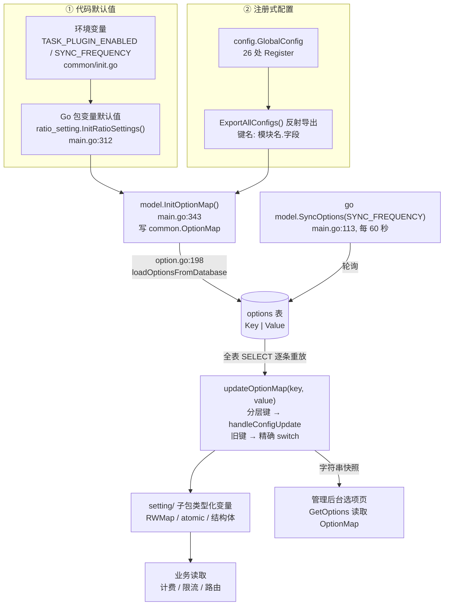
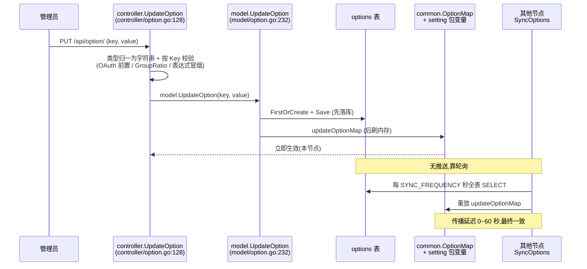

# 动态配置体系:option 表驱动的热更新架构

> 一句话定位:本篇讲 new-api 如何用一张只有两列的数据库表(`options`)驱动 40+ 上游、几百项配置的运行时热更新——读完你将掌握「配置即数据」的注册机制、三层来源的装配顺序、并发安全的三种形态,以及它与 Spring Cloud Config 的取舍差异。

## 🎯 本篇你将学到

- 三层配置来源(代码默认值 → `options` 表 → 环境变量)如何在启动时装配、谁覆盖谁
- `InitOptionMap` / `updateOptionMap` / `SyncOptions` 三件套如何构成热更新闭环
- `setting/` 各子系统暴露可热更变量的三种并发安全形态(裸变量、`RWMap`、`atomic`/注册结构体)
- 倍率配置族为什么存成 JSON 字符串、`FormatMatchingModelName` 如何用前缀归一化实现一配多
- 退役选项(`theme.frontend` 等)如何通过启动期数据迁移优雅下线
- 多节点部署下配置变更的传播路径与延迟量级

## 🧠 核心概念

### 配置即数据

传统 Java 项目把配置写在 `application.yml` 里,改一个字段要重启。new-api 的做法激进得多:**所有运营侧配置都是数据库里的一行字符串**。

```go
// model/option.go:20-23
type Option struct {
    Key   string `json:"key" gorm:"primaryKey"`
    Value string `json:"value"`
}
```

一张两列表,几百行,`Key` 是主键。它同时承担三重角色:持久化存储、管理后台的表单数据源、以及各子系统的配置载体。

Java 类比:这 ≈ 把 `@ConfigurationProperties` 的每个字段拍平成 `Environment` 里的一条 property,再把整个 `Environment` 落库。Spring Cloud Config 需要一个独立配置中心(new-api 里数据库本身就是配置中心),`@RefreshScope` 需要总线推送(new-api 里靠轮询),所以可以说这是一套**无中心版 Spring Cloud Config**。

### 两级内存结构

配置从数据库加载后落到两级内存:

1. **`common.OptionMap`**(`common/constants.go:56-57`,`map[string]string` + `sync.RWMutex`):全部配置项的字符串快照,管理后台「选项」页面直接读它渲染表单。
2. **各 `setting/` 子包的类型化变量**:`ratio_setting.ModelRatio` 这类强类型 map/结构体,业务代码(计费、限流)真正读的地方。

`updateOptionMap` 是连接两级的关键:它把字符串值**解析并分发**到正确的类型化变量。

## 🔍 源码剖析

### 1. 启动装配:三层来源的优先级

启动链在 `main.go:296` 的 `InitResources` 里:

```go
// main.go:312, 337-343
ratio_setting.InitRatioSettings()   // ① 代码默认值填充倍率表
...
if common.IsMasterNode {            // 只有主节点做数据迁移
    if err := model.MigrateRetiredFrontendOptions(); err != nil { ... }
}
model.InitOptionMap()               // ② 装配 OptionMap + 读库覆盖
```

```go
// main.go:113
go model.SyncOptions(common.SyncFrequency)  // ③ 后台 goroutine 周期热更
```

`InitOptionMap`(`model/option.go:32-199`)是启动装配的核心,顺序非常讲究:

- **第一层:代码默认值**。逐项把 Go 包变量写入 `OptionMap`,如 `common.OptionMap["ModelRatio"] = ratio_setting.ModelRatio2JSONString()`(`model/option.go:154`)。敏感项(`SMTPToken`、`GitHubClientSecret` 等)显式写空串(`option.go:70-74`),意味着「未配置」也是显式状态,而不是从 DB 意外带入。
- **第二层:注册式配置自动合并**。`model/option.go:191-195` 用 `config.GlobalConfig.ExportAllConfigs()` 反射导出所有已注册配置,键名是 `模块名.字段`(如 `claude.default_max_tokens`),无需手写。
- **第三层:数据库覆盖**。`option.go:198` 收尾调用 `loadOptionsFromDatabase()`,全表读出后逐条走 `updateOptionMap`,**后写者赢**。

**🔑 环境变量藏在第一层里**。`common/init.go:194` 的 `constant.TaskPluginEnabled = GetEnvOrDefaultBool("TASK_PLUGIN_ENABLED", true)` 在进程启动时执行,结果作为包变量成为 `InitOptionMap` 的默认值(`option.go:58`)。所以真实优先级是:**DB > 环境变量种子 > 代码硬编码默认**;而 `SESSION_SECRET`、`SYNC_FREQUENCY`、`NODE_TYPE` 这类不进 option 表的键则永远是 env-only(`common/init.go:50-64, 89, 112`)。

### 2. 周期热更:SyncOptions 的极简实现

```go
// model/option.go:211-217
func SyncOptions(frequency int) {
    for {
        time.Sleep(time.Duration(frequency) * time.Second)
        common.SysLog("syncing options from database")
        loadOptionsFromDatabase()   // 全表 SELECT 后逐条重放 updateOptionMap
    }
}
```

十行代码,没有增量、没有版本号、没有消息推送。`SyncFrequency` 来自 `SYNC_FREQUENCY`,默认 60 秒(`common/init.go:112`)。重放是幂等的(赋值 + 整表替换都是幂等操作),所以全量拉取没有副作用。

### 3. 写路径:先落库,再刷内存

管理员在后台改配置走 `controller/option.go:128` 的 `UpdateOption`:

- `controller/option.go:138-147` 把 JSON 里的 `bool`/`float64`/`int` 统一归一成字符串(与 `Option.Value string` 对齐);
- `controller/option.go:148-405` 是一个巨大的按 `Key` 分发校验 `switch`:启用 OAuth 前检查 `ClientId` 已填(`controller/option.go:166-198`)、`GroupRatio` 调 `ratio_setting.CheckGroupRatio` 拒绝负数(`controller/option.go:240-248`)、`billing_setting.billing_expr` 对每个表达式做冒烟编译(`controller/option.go:339-368`);
- `controller/option.go:406` 调 `model.UpdateOption`,随后 `controller/option.go:411-414` 写审计日志——**只记 Key 不记 Value**,防止密钥进日志。

```go
// model/option.go:232-249
func UpdateOption(key string, value string) error {
    if err := validateOptionValue(key, value); err != nil { return err }
    option := Option{Key: key}
    DB.FirstOrCreate(&option, Option{Key: key})
    option.Value = value
    DB.Save(&option)            // ① 先持久化
    return updateOptionMap(key, value)  // ② 再刷内存
}
```

**为什么先库后内存**:持久化失败就不碰内存,保证「内存里有的,DB 里一定有」——重启后状态可复现。配套的 `UpdateOptionsBulk`(`model/option.go:256-287`)进一步强化:单事务批量落库,任一失败整体回滚且内存完全不动,适合支付网关绑定这类需要原子提交的一组键。

### 4. 分发中枢:updateOptionMap 与 handleConfigUpdate

`updateOptionMap`(`model/option.go:289-631`)先加写锁更新 `OptionMap`(`296-298`),然后按键名形态分三路:

- `handleConfigUpdate`(`option.go:634-669`):键含 `.` 视为分层配置,拆成 `configName.configKey`,从注册表拿结构体指针反射赋值;特定模块再做后处理——`performance_setting` 调 `UpdateAndSync()`,`billing_setting` 调 `InvalidatePricingCache()` + `ratio_setting.InvalidateExposedDataCache()`(`option.go:661-666`);
- 后缀分支:`*Permission`(`306`)、`*Enabled`(`319-415`)按命名约定批量转 `int`/`bool`;
- 精确匹配 `switch`(`419-629`):每个旧式键一行赋值,倍率类则转调 `ratio_setting.UpdateXxxByJSONString`。

这里还有一个优雅的退役处理:`option.go:290-295` 遇到 `theme.frontend` 直接从 `OptionMap` 删除,`352-361` 的 `DisplayInCurrencyEnabled` 则是**旧键值同步到新分层键** `general_setting.quota_display_type` 的桥接——老配置不失效,新配置渐进接管。

### 5. 注册机制:反射版的 @ConfigurationProperties

`setting/config/config.go` 是新式配置的枢纽:

```go
// setting/config/config.go:14-19, 28-32
type ConfigManager struct {
    configs map[string]interface{}
    mutex   sync.RWMutex
}
var GlobalConfig = NewConfigManager()

func (cm *ConfigManager) Register(name string, config interface{}) {
    cm.mutex.Lock(); defer cm.mutex.Unlock()
    cm.configs[name] = config
}
```

每个子系统在自己的 `init()` 里注册一个**结构体指针**,全仓 26 处:

```go
// setting/model_setting/claude.go:37-42
var claudeSettings = defaultClaudeSettings
func init() {
    config.GlobalConfig.Register("claude", &claudeSettings)
}
```

两个反射函数是核心:

- `ExportAllConfigs`(`config.go:286-305`):遍历字段,按 `json` tag 生成 `模块名.字段 → 字符串` 的扁平 map,供 `InitOptionMap` 注入默认值;
- `updateConfigFromMap`(`config.go:165-273`):按 json tag 匹配字段,`SetString`/`ParseBool`/`ParseInt`/`ParseFloat`,复杂类型走 JSON。`config.go:255-263` 有个细节值得注意:**Map 字段用全新 map 替换而非合并**,注释明确说 `json.Unmarshal` 会保留旧键导致删除项失效——这是踩过坑的修复。

Java 类比:`Register("claude", &claudeSettings)` ≈ `@ConfigurationProperties(prefix="claude")` 的 bean 注册到容器;`updateConfigFromMap` ≈ Spring `Binder` 的手写极简版。

### 6. 并发安全的三种形态

这是本篇最有含金量的观察。`setting/` 包里可热更变量按「新旧程度」呈现三种形态:

| 形态 | 代表 | 保护方式 |
|---|---|---|
| 裸包变量 | `operation_setting.DemoSiteEnabled`(`setting/operation_setting/operation_setting.go:3-4`)、`system_setting.ServerAddress` | 无额外锁,仅靠 `updateOptionMap` 单 goroutine 顺序写 |
| 泛型并发 map | `ratio_setting` 全族 | `types.RWMap`(`types/rw_map.go:9-12`),读锁 `Get`、写锁 `LoadFromJsonString`、`ReadAll` 返回拷贝(`60-68`) |
| 原子标量 | `ratio_setting.exposeRatioEnabled`(`expose_ratio.go:5` 的 `atomic.Bool`) | `atomic.Store/Load` |

`RWMap` 的整表替换写法值得细看:

```go
// types/rw_map.go:83-92
func LoadFromJsonStringWithCallback[K comparable, V any](m *RWMap[K, V], jsonStr string, onSuccess func()) error {
    m.mutex.Lock(); defer m.mutex.Unlock()
    m.data = make(map[K, V])              // 先清空
    err := common.Unmarshal([]byte(jsonStr), &m.data)
    if err == nil && onSuccess != nil { onSuccess() }  // 成功后才回调
    return err
}
```

**成功后回调**构成一条缓存失效链:倍率 map 更新 → `InvalidateExposedDataCache()`(`model_ratio.go:354, 372, 414` 等传入)→ `exposed_cache.go:23` 用 `atomic.Value` 清空 30 秒 TTL 的对外倍率快照(`exposed_cache.go:11, 19-25`,`GetExposedData` 在 `35-43` 用双检 + `rebuildMu` 防击穿)。≈ Java 里手动版的 `@CacheEvict`。

### 7. 倍率配置族:JSON 字符串 + 前缀归一化

倍率在 DB 里是一项一个大 JSON 串,如 `ModelRatio = '{"gpt-4o":1.25,"gpt-4-gizmo-*":15,...}'`。取出时先归一化模型名:

```go
// setting/ratio_setting/model_ratio.go:697-714
func FormatMatchingModelName(name string) string {
    ...
    if strings.HasPrefix(name, "gemini-2.5-flash-lite") {
        name = handleThinkingBudgetModel(name, "gemini-2.5-flash-lite", "gemini-2.5-flash-lite-thinking-*")
    }
    if strings.HasPrefix(name, "gpt-4-gizmo") { name = "gpt-4-gizmo-*" }
    return name
}
```

管理员只需在 JSON 键里写一个 `gpt-4-gizmo-*`,所有带参数的变体模型都能命中——**匹配是前缀归一化,不是通配符引擎**,所以实现只有几行且无回溯风险。

取值回退链在 `GetModelRatioOrPrice`(`model_ratio.go:717-727`):先查按次价格 `GetModelPrice`(`358-369`,存在即 `usePrice=true`),再查 `GetModelRatio`(`383-391`)。后者未命中时返回固定兜底值 `37.5`,且第二个返回值是 `operation_setting.SelfUseModeEnabled`——**自用模式放宽为直接放行,商用模式则视为致命错误**,这是计费安全的一道闸门。组倍率的 `GetGroupRatio` 未命中返回 `1` 并打日志(`group_ratio.go:79-86`),双层 `GroupGroupRatio`(用户组 → 使用组)未命中返回 `-1, false` 由调用方处理(`88-98`)。

### 8. 退役选项的启动期迁移

`theme.frontend`(Classic 前端)被移除后,老用户 DB 里残留的配置值必须处理,`model/frontend_option_migration.go` 用启动迁移解决:

- `:17-19` 注释点明设计:**每项迁移各在自己的事务里,一个畸形值不能阻塞其他设置**;
- `normalizeRetiredThemeOption`(`:50-65`)把 `theme.frontend` 强制改写为 `"default"`(该键现在只允许这个值,见 `controller/option.go:232-239`);
- `migrateLegacyOption`(`:67-103`)把 `ApiInfo`/`Announcements`/`FAQ` 转换后写入 `console_setting.*` 再删除旧键;转换失败只 `SysError` 并 `return nil`(`:88-89`),**跳过而非回滚整个迁移**;
- `migrateLegacyUptimeOptions`(`:174-239`)把两个零散键合并成一个分组数组,并做「目标已存在则只删源」的幂等处理(`:195-205`)。

调用点 `main.go:338-342` 用 `common.IsMasterNode`(`common/init.go:89`,`NODE_TYPE != "slave"`)保证只在主节点执行一次,失败只记日志不阻断启动。

## 📐 图解

### 图一:配置三层来源与热更闭环



### 图二:一次配置修改的传播时序



## 🎓 设计精妙之处与可借鉴点

**🔑 1. 数据库当配置中心,省掉一整个组件**
为什么:new-api 本就强依赖数据库,`options` 表让它天然具备配置持久化与多节点共享能力;轮询 + 幂等重放换来零基础设施成本。
可借鉴:Java 项目若已有共享数据库且配置量小、容忍分钟级延迟,可用「配置表 + `@Scheduled` 全量重放」替代 Nacos/Spring Cloud Config;把重放逻辑写成幂等赋值,是这套方案能如此简单的关键。

**🔑 2. 先落库、后刷内存,保证状态可复现**
为什么:内存是 DB 的派生缓存而非真相源,持久化失败绝不污染内存;`UpdateOptionsBulk` 把「一组相关配置」的原子性也补齐了。
可借鉴:任何「DB + 本地缓存」的 Java 写路径都应遵循同一顺序,并在事务边界内批量提交——这与「先更缓存再落库」的反模式形成对照。

**🔑 3. 注册机制消灭巨型 switch 的增熵**
为什么:26 个子系统各自 `Register`,新增配置不再需要改 `InitOptionMap` 的几百行赋值;反射按 json tag 自动绑定,键名天然有命名空间(`模块名.字段`)。
可借鉴:Spring 用户可直接用 `@ConfigurationProperties` + 把 bean 收进一个 `Map<String, Object>` 注册表,实现同样的「导出/导入对称」;关键是**序列化与反序列化共用同一套字段映射**,避免两边漂移。

**🔑 4. 更新回调链显式声明派生状态**
为什么:配置值被复制/缓存到多处时(如 `performance_setting` 同步到 `common` 包、倍率导出快照),靠 `UpdateAndSync` 和 `InvalidateXxxCache` 把派生状态的失效变成可见代码,而不是祈祷 TTL 到期。
可借鉴:Java 里用 Spring 的 `EnvironmentChangeEvent`/`ApplicationListener` 或手写「更新后回调」列表,把缓存失效从隐式(等 TTL)变为显式(写路径触发)。

**🔑 5. 配置退役 = 数据迁移,而非删除代码**
为什么:直接删旧键会让老部署的 DB 残留脏数据,每次启动重放都会报错;逐项独立事务 + 失败跳过,让迁移永不阻塞启动。
可借鉴:把「配置改名/合并」当作 Flyway 的 data migration 来写,并在运行时保留旧键的兼容分支(如 `DisplayInCurrencyEnabled` → `general_setting.quota_display_type`)过渡一个版本周期。

## ⚠️ 常见坑与注意事项

- **环境变量赢不了数据库**。env 只在进程启动时读一次并作为默认值(`common/init.go:194` 等),`options` 表里已有的行必然覆盖它。想用 env 强制覆盖某项配置是不成立的;反之,不进 option 表的键(`SESSION_SECRET`、`NODE_TYPE`)才是 env-only。
- **配置解析失败是静默的**。`updateConfigFromMap` 里所有 `ParseBool`/`ParseInt`/`Unmarshal` 失败都是 `continue`(`setting/config/config.go:208-209, 217-219, 236-238`),字段保持默认值且无日志。所以项目把校验前移到 `controller/option.go` 的写前 `switch`——**如果你新增配置类型,必须同时补写校验**,否则坏值会悄悄变成默认行为。
- **敏感键靠后缀黑名单脱敏**。`GetOptions` 只隐藏以 `Token`/`Secret`/`Key`/`secret`/`api_key` 结尾的键(`controller/option.go:92-96`)。新增含密钥的配置项,命名不符合后缀约定就会在选项页接口里泄漏明文。
- **裸变量形态有数据竞争风险**。`updateOptionMap` 直接对 `setting.CheckSensitiveEnabled` 这类普通 `bool` 赋值,没有额外锁,而读方在任意请求 goroutine 中。严格用 `-race` 检测会命中;这也是代码正在向 `RWMap`/`atomic`/注册结构体三种安全形态逐步迁移的原因。新代码不要沿用裸变量风格。
- **通配匹配只认前缀**。`FormatMatchingModelName` 只处理 `gpt-*-gizmo` 与 `gemini-2.5-*` 的固定归一化规则,不支持自定义通配符模式;在倍率 JSON 里写 `*` 以外的通配写法不会生效。
- **修改 DB 兼容性约束同样适用于 options 迁移**。`MigrateRetiredFrontendOptions` 用 GORM `Transaction`/`Save`/`Delete`,未写裸 SQL,符合 AGENTS.md 的三库兼容要求;若你写新的配置迁移,同样必须覆盖 SQLite、MySQL、PostgreSQL 并验证幂等(启动至少两次)。

## 🏋️ 刻意练习:缺陷预演

> 先自己想 2 分钟,再看参考思路。

### 练习 1|`SyncOptions` 的轮询窗口

- 🔴 **反模式预演**:多节点部署、`SYNC_FREQUENCY` 保持默认 60 秒。凌晨你发现某热门模型被套利,在后台把 `ModelRatio` 里它的倍率从 1.5 紧急调到 15 止损:写入口节点立即生效,其余节点要等各自下一轮 `loadOptionsFromDatabase`(`model/option.go:211-217`)。请推演:①窗口内打向未同步节点的请求按哪个价结算,敞口怎么估?②如果调价方向反过来(15 → 1.5 促销),窗口内会发生哪件比少收更麻烦的事?③攻击者想全程吃旧价,怎么挑出「还没同步」的节点?
- 🟡 **陷阱预判**:有人想「配置秒级生效」,把 `SYNC_FREQUENCY` 设成 0(或负数)。`common/init.go:112` 的取值没有任何下限保护,而 `SyncOptions` 的循环体只有「先 `time.Sleep`、再全表重放」两步——接下来会发生什么?
- 💡 **参考思路**:①按旧价 1.5 结算,每笔少收九成;各节点轮询相位取决于各自进程的启动时刻,敞口 ≈ 新旧倍率差 × 窗口内该模型流水,攻击者对每个节点发一笔小请求比对扣费就能定位旧价节点。②反向调价变成多收十倍,客诉、退款与定价公信力的代价远高于少收。③`SYNC_FREQUENCY <= 0` 时 `time.Sleep` 立即返回,循环退化成不眠不休的全表 `SELECT` 风暴,直接把主库打挂——这就是「极简轮询」把安全余量押在一个无下限环境变量上的代价。

### 练习 2|先库后内存与被吞掉的写错误

- 🔴 **反模式预演**:`model/option.go:241` 的 `DB.FirstOrCreate` 与 `model/option.go:246` 的 `DB.Save` 都不检查 `.Error`,函数随后直接 `return updateOptionMap(key, value)`。请推演这个剧本:凌晨数据库主从切换 30 秒不可写,运维恰好此刻在后台把某亏损模型的倍率调高止损。①后台页面会显示什么?②60 秒之前、60 秒之后,本节点与其他节点的内存配置分别处于什么状态?③资金方向上的后果是什么?
- 🟡 **陷阱预判**:同一文件里的 `UpdateOptionsBulk`(`model/option.go:265-277`)每个写都检查 `.Error` 且失败绝不碰内存。为什么同一条「先库后内存」纪律,在单键路径上退化成了「只管顺序、不管成败」?
- 💡 **参考思路**:①`updateOptionMap` 返回 `nil`,controller(`controller/option.go:406-410`)报「保存成功」,内存已按新值运行——但库里还是旧值。②60 秒后本节点被 `SyncOptions` 重放回旧值,其他节点从头到尾没见过新值:「内存里有的,库里一定有」这条不变量被打破,内存成了唯一真相源,随后又被数据库反杀。③若是止损调价,等于止损从未生效,亏损按旧倍率继续计;修复只要一行——检查 `DB.Save` 的 `.Error`,失败就不刷内存。

### 练习 3|`ModelRatio` 的无校验写入与先清空后解析

- 🔴 **反模式预演**:对照 `controller/option.go` 的写前校验 `switch`:有 `case "GroupRatio"`(`controller/option.go:240`,拒绝负数),却没有 `case "ModelRatio"`;`model.UpdateOption` 里的 `validateOptionValue`(`model/option.go:219-230`)也只覆盖三个键。管理员手抖把 `ModelRatio` 改成非法 JSON 并点保存。请逐环推演:①后台提示什么、数据库里留下什么?②下一轮 `SyncOptions` 重放时,`types/rw_map.go:83-92` 的「先 `make` 清空再 `Unmarshal`」会让 `modelRatioMap` 变成什么?每一笔请求在 `relay/helper/price.go:103-109` 处遭遇什么?③为什么重启救不了?
- 🟡 **陷阱预判**:自用模式(`SelfUseModeEnabled`)下,`GetModelRatio` 未命中返回兜底值 `37.5` 并放行(`setting/ratio_setting/model_ratio.go:383-391`)。这份「宽容」在倍率表被清空时,账单后果是什么?对便宜模型和贵模型,方向一样吗?
- 💡 **参考思路**:①先落库后刷内存,毒值已入库,而后台只看到解析报错——管理员以为「没改成」,雷已经埋下。②`modelRatioMap` 被清空且无恢复:请求在预扣费阶段按「模型倍率未配置」被拒,商用集群整站不可用;每 60 秒重放一次,重启也要走 `loadOptionsFromDatabase`(`model/option.go:198`)重放同一个毒值。③自用模式的宽容等于「按一个与真实价格无关的常数计费」:对 37.5 以下价位的模型是多收,对真实倍率高于 37.5 的模型是持续少收,而且表已空、事后无法追溯真实倍率。根治办法是把「先清空后解析」改成「先解析到临时 map,成功后再整体替换」,失败保留旧表。

## 🔗 与其他模块的关系

- **00-soul.md**:一次请求的计费阶段会实时读 `GetModelRatioOrPrice`/`GetGroupRatio`,本篇的倍率回退链是其数据来源。
- **01-startup-lifecycle.md**:`InitResources` 中 `InitRatioSettings` → `MigrateRetiredFrontendOptions` → `InitOptionMap` 的装配次序,是启动流程的一条支线。
- **06-billing-overview.md** 与 **07-billingexpr.md**:倍率族与 `billing_setting.billing_expr`(写前冒烟测试)直接决定计费结果;`InvalidatePricingCache` 让定价页立即反映新倍率。
- **08-channel-ability.md**:`SyncChannelCache` 与 `SyncOptions` 共用同一个 `SYNC_FREQUENCY` 周期,是同一套轮询范式在渠道缓存上的复用。
- **10-cache-system.md**:`InvalidateExposedDataCache`/`InvalidatePricingCache` 是「配置变更触发缓存失效」的实例。
- **16-frontend.md**:管理后台的选项表单由 `GetOptions` 渲染、经 `UpdateOption` 提交,是配置体系的唯一写入口。

## 📚 小结

new-api 的动态配置体系可以压缩成一句话:**一张两列表 + 一个全局字符串快照 + 一个分发函数 + 一个注册表**。`InitOptionMap` 在启动时按「代码默认 → 注册导出 → DB 覆盖」的顺序装配;`SyncOptions` 每 60 秒全量重放保证多节点最终一致;`handleConfigUpdate` 用反射把 `模块名.字段` 写进注册结构体;倍率族存 JSON 字符串、靠 `FormatMatchingModelName` 前缀归一化实现一配多。它没有 Spring Cloud Config 的推送能力,也没有 Binder 的完备校验,但用极少的代码换来了可持久化、可多节点、可后台编辑的完整热更新闭环——其中「先库后内存」「更新回调链」「配置退役走数据迁移」三条纪律,是可以直接搬进任何 Java 项目的工程经验。
