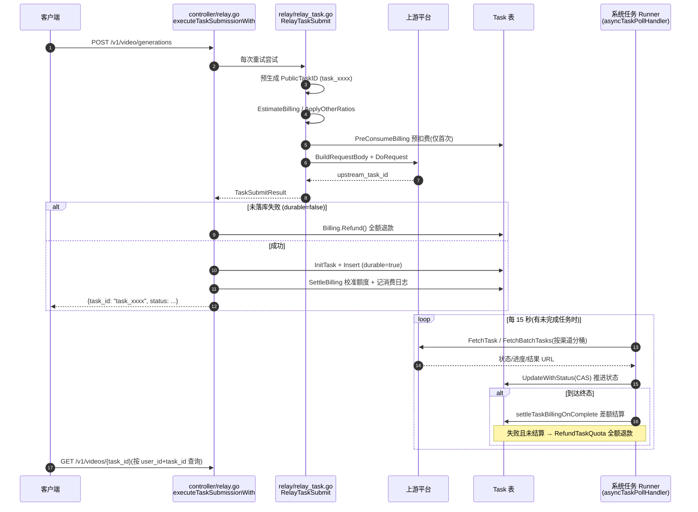
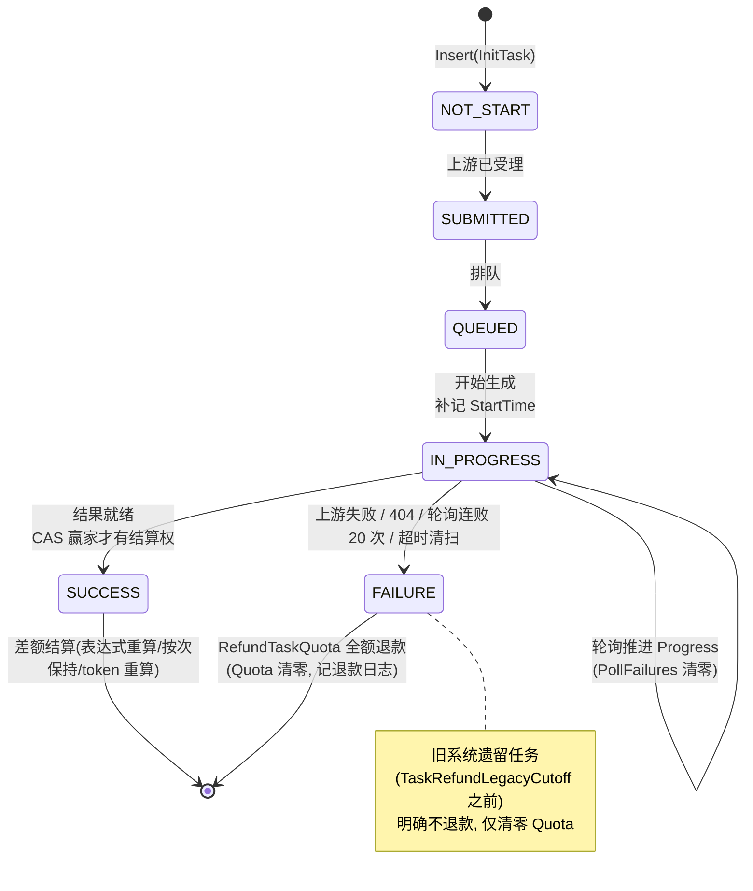
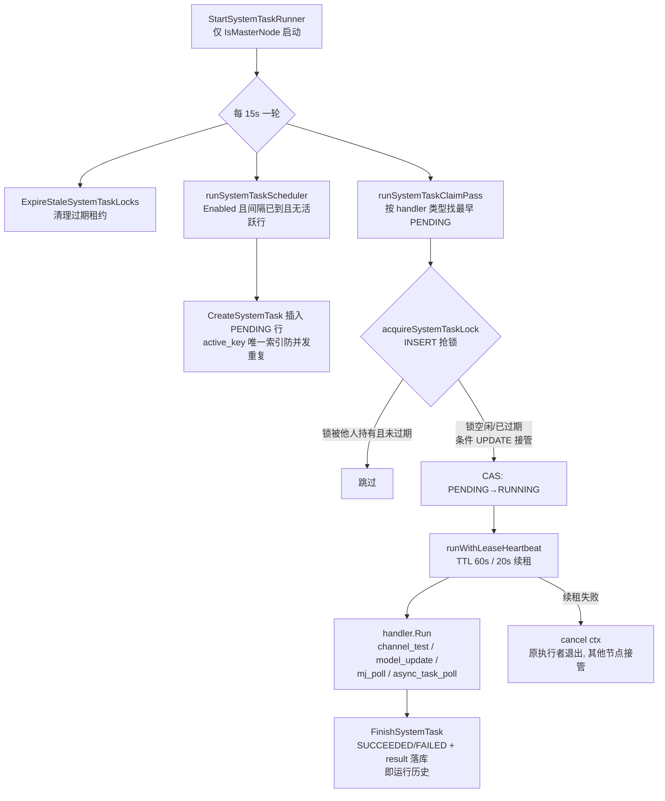

# 异步任务系统:提交、轮询、结算的三段式生命周期

> 一句话定位:本篇讲 new-api 如何把「文生视频、音乐、绘画」这类秒级提交、分钟级出结果的异步任务,抽象成统一的「提交(预扣费)→ 轮询(状态落库)→ 结算(多退少补)」模型;读完你将掌握 `TaskPlatform` 平台抽象、公开 ID 隔离、CAS 状态机、DB 租约去重与退款路径。

## 🎯 本篇你将学到

- 异步任务与同步聊天的本质差异:响应先返回、账单后算清,如何靠「预扣费 + 差额结算」保证不亏钱。
- `task_xxxx` 公开 ID 与上游真实 ID 的双轨设计,以及为什么必须隔离。
- `channel.TaskAdaptor` 平台抽象:Go 适配器如何演进为 JS 插件,`GetTaskAdaptorFunc` 函数注入如何打破 `service → relay` 循环依赖。
- 定时系统任务框架:多节点部署下用数据库租约(lease)保证「只跑一份」。
- origin task 渠道固定(pin):remix / 续写为什么必须回到原渠道。
- Midjourney 代理为何自成一体,与通用任务平台的差别。

## 🧠 核心概念

🔎 **同步聊天 vs 异步任务**。聊天请求是同步的:上游返回即计费落库,一个 HTTP 请求内闭环。而生成一段视频要跑几十秒到几分钟,连接不可能一直挂着。于是任务被拆成三段:①提交(立即返回一个 `task_id`);②网关后台轮询上游拿进度;③任务到终态(SUCCESS/FAILURE)后结算费用。类比 Java 世界:同步聊天 ≈ 一次 `RestTemplate` 调用;异步任务 ≈ 提交一个 Job 到消息队列,再由定时轮询消费者推进状态机(≈ Spring Batch 的 Job + JobExecution 状态落库)。

💰 **预扣费(pre-consume)与差额结算**。提交时用户可能选了「10 秒 1080p」,但上游可能实际跑 8 秒。网关提交时按预估参数全额预扣,落库存下计费快照(`TaskBillingContext`),任务到终态后再按真实用量「多退少补」。这是「先冻结、后清算」的两阶段记账,≈ 支付系统的预授权(pre-auth)+ 请款(capture)。

🧩 **平台抽象**。40+ 上游里可提交异步任务的(可灵、即梦、豆包、Suno、Vidu、海螺、Sora、Gemini/Vertex…)各有自己的提交/查询协议。`channel.TaskAdaptor` 接口定义了这一族平台的最小公约,每个平台一份实现——正是策略模式 + 工厂,≈ Java 里 `TaskService` 接口 + 各平台 `@Component` 实现 + `Map<String,TaskService>` 注入。

## 🔍 源码剖析

### 4.1 数据模型:一张 `Task` 表,公开 ID 与上游 ID 分离

`model/task.go:50-72` 的 `Task` 是所有异步任务的统一载体,关键字段分三层:

- **对外层**:`TaskID`(`task_` 前缀公开 ID)、`Status`、`Progress`、`Data`(透传给客户端的结果)。
- **对内层** `PrivateData`(`model/task.go:111-134`,JSON 列,`json:"-"` 永不出现在 API 响应):`UpstreamTaskID`(上游真实 ID)、`ResultURL`、`Key`(Gemini/Vertex 需按任务粘住同一把 key)、`BillingContext`(计费快照)、`PollFailures`(连续轮询失败计数)。
- **记账层**:`Quota`(预扣额度,退款凭据)、`ChannelId`、`Group`、`TokenId`。

公开 ID 由 `GenerateTaskID()`(`model/task.go:187-191`)生成 `"task_" + 32 位随机串`,在提交早期就预生成并挂到 `RelayInfo.TaskRelayInfo.PublicTaskID`(`relay/common/relay_info.go:919-936`),供适配器在构建上游请求前就拿到——这样响应里永远只有 `task_xxxx`,上游真实 ID 藏在 `PrivateData`。取上游 ID 时用 `GetUpstreamTaskID()`(`model/task.go:171-176`)做兼容回退(旧数据 `TaskID` 本身就是上游 ID)。

```go
// model/task.go:170-176 —— 双轨 ID 的唯一出口
func (t *Task) GetUpstreamTaskID() string {
    if t.PrivateData.UpstreamTaskID != "" {
        return t.PrivateData.UpstreamTaskID
    }
    return t.TaskID   // 旧数据兼容
}
```

**为什么**:真实 ID 可能泄露渠道特征、可被拿去直连上游绕过计费,且格式随平台各异。隔离后 `GET /v1/videos/{task_id}` 只认自家公开 ID,配合 `GetByTaskId(userId, taskId)`(`model/task.go:421-434`)按 `user_id + task_id` 查询,天然防止越权读他人任务。

### 4.2 提交:`RelayTaskSubmit` 的十一步流水线

`relay/relay_task.go:197` 的 `RelayTaskSubmit` 是每次重试尝试执行一次的核心,顺序严格:确定平台 → 取适配器 → **预生成公开 ID**(`relay/relay_task.go:212-214`)→ 校验请求 → 价格计算 → 预扣费 → 构建请求体 → 发上游 → 解析响应 → 提交后计费调整。

**🔑 预扣费只在首次尝试发生**(`relay/relay_task.go:328-333`):

```go
// 7. 预扣费(仅首次 — 重试时 info.Billing 已存在,跳过)
if info.Billing == nil && !info.PriceData.FreeModel {
    info.ForcePreConsume = true
    if apiErr := service.PreConsumeBilling(c, info.PriceData.Quota, info); apiErr != nil {
        return nil, service.TaskErrorFromAPIError(apiErr)
    }
}
```

重试换渠道时不能重复扣钱,`info.Billing` 非 `nil` 即跳过——这个「幂等哨兵」字段就是账本句柄,≈ Java 里一次事务只允许一次 `deduct()`。

计费有三条互斥支路(`relay/relay_task.go:251-325`):①表达式计费(tiered expr,按 `ExtractUsageFacts` 抽取用量代入表达式);②按次计费(`ModelPriceHelperPerCall` + `OtherRatios` 乘子,如 `seconds`、`size`);③remix 时从原任务快照继承乘子。所有乘子经 `AddOtherRatio` 校验、额度换算走 `common.QuotaFromFloatChecked` 饱和转换(`relay/relay_task.go:320-325`),杜绝溢出成负数(负数即「倒给钱」)。

### 4.3 落库屏障:未落库必退款,落库后才结算

控制器侧 `executeTaskSubmissionWith`(`controller/relay.go:590-788`)拥有重试、计费与持久化的完整生命周期,关键是一条 **durable 屏障**:

```go
// controller/relay.go:601-606 —— 只要任务还没落库,预扣的钱必须原路退回
durable := false
defer func() {
    if !durable && relayInfo.Billing != nil {
        relayInfo.Billing.Refund(c)
    }
}()
```

随后在 `controller/relay.go:729-773` 组装 `Task` 写入 `PrivateData`(上游 ID、计费快照、节点名),`task.InsertWithContext` 成功后才置 `durable = true`,再执行 `service.SettleBilling(c, relayInfo, result.Quota)` 把预扣额度校准到提交时最终额度。顺序很讲究:**先 Reserve(预留上调差额)→ 再 Insert → 后 Settle**,保证「插入失败必可全额退款,落库后的结算差额趋近于零」(`controller/relay.go:709-722` 注释原意)。这里没有任何客户端响应写出——JSON 与协议桥接两种展示层共用同一道屏障。

### 4.4 平台抽象:从 Go 适配器到 JS 插件,以及打破循环依赖的函数注入

`channel.TaskAdaptor` 接口约定了 `ValidateRequestAndSetAction / BuildRequestBody / DoRequest / ParseResponse / FetchTask / ParseTaskResult / EstimateBilling / AdjustBillingOnComplete` 一族方法。历史上有十个 Go 实现目录(`relay/channel/task/` 下 ali、kling、jimeng…),现已整体迁移为 **JS 插件**:`plugins/tasks/{kling,doubao,google,hailuo,jimeng,sora,sunoapi,vidu,vertex-ai,alibaba}/plugin.js`,由 `relay/channel/task/jsplugin/adaptor.go:81-90` 的 `TaskAdaptor` 包住一个 `LoadedPlugin` 运行。`GetTaskAdaptor`(`relay/relay_adaptor.go:188-194`)通过 `ResolveTaskPluginForPlatform` 把 `TaskPlatform`(渠道类型数字或插件 key)映射到插件,`taskPluginKeys` 表(`relay/relay_adaptor.go:141-154`)处理「多个渠道类型共用一个插件」(如 `VolcEngine` 与 `DoubaoVideo` 都映射到 `doubao`)。

轮询跑在 `service` 包,但适配器实现在 `relay` 包,Go 禁止 import 成环。解法是**最小接口 + 函数注入**:

```go
// service/task_polling.go:26-34, 63-65
type TaskPollingAdaptor interface {          // 只声明轮询真正需要的 3 个方法
    Init(info *relaycommon.RelayInfo)
    FetchTask(...) (*http.Response, error)
    ParseTaskResult(...) (*relaycommon.TaskInfo, error)
    AdjustBillingOnComplete(task *model.Task, taskResult *relaycommon.TaskInfo) int
}
var GetTaskAdaptorFunc func(platform constant.TaskPlatform) TaskPollingAdaptor

// main.go:143-149 —— 启动时由 main 包把 relay 的实现注入进来
service.GetTaskAdaptorFunc = func(platform constant.TaskPlatform) service.TaskPollingAdaptor {
    a := relay.GetTaskAdaptor(platform)
    if a == nil { return nil }
    return a
}
```

`main` 包是唯一的「知道所有人」的角色,由它完成装配。≈ Spring 的 `ObjectProvider<T>` 延迟解析,或把实现以 `Function<Platform, TaskService>` 形式注册进 `@Configuration`——接口收窄到消费者真正需要的方法,依赖方向就不再成环。

### 4.5 轮询:CAS 状态机 + 差额结算 + 退款

轮询入口 `RunTaskPollingOnce`(`service/task_polling.go:134-202`):先 `sweepTimedOutTasks` 清理超时任务,再把未完成任务按 `Platform → ChannelId` 分桶,批处理适配器走一次批量查询,其余逐任务查询并在任务间 sleep 1 秒限速。

**🔑 一切终态变更都走 CAS**。`UpdateWithStatus(fromStatus)`(`model/task.go:533-539`)生成 `UPDATE ... WHERE status = ?` 条件更新,返回是否「赢」:

```go
// service/task_polling.go:598-607 —— 赢了状态机才有资格动钱
isDone := task.Status == model.TaskStatusSuccess || task.Status == model.TaskStatusFailure
if isDone && snap.Status != task.Status {
    won, err := task.UpdateWithStatus(snap.Status)   // 乐观锁
    ...
    } else if !won {
        logger.LogWarn(ctx, fmt.Sprintf("Task %s CAS lost or no-op update, skip billing", task.TaskID))
        shouldFinalizeBilling = false
    }
```

只有把状态从「进行中」推进到「终态」的那个进程才能结算,多节点并发轮询天然幂等,≈ 数据库乐观锁版本号,或 `compareAndSet` 状态机。

结算优先级在 `settleTaskBillingOnComplete`(`service/task_polling.go:666-711`):①表达式计费快照 → 用真实 usage 重算;②按次计费直接保持预扣;③适配器 `AdjustBillingOnComplete` 返回正数则按其差额结算;④回退到按 token 重算。失败任务若未被结算路径接管,则 `RefundTaskQuota`(`service/task_billing.go:213-255`)全额退款:退资金源(钱包/订阅)→ 退令牌额度 → 回减用户与渠道用量统计 → 记退款日志 → **最后**才把 `task.Quota` 清零(先退钱后销账,回写失败要告警防重复退款)。

异常路径同样完整:上游 404 判任务失踪直接终态(`pollClassNotFound`),鉴权/限流/5xx 记 `PollFailures`,连续失败达 `TaskPollMaxFailures`(默认 20)也终态退款(`service/task_polling.go:773-790`);超时清扫 `sweepTimedOutTasks`(`service/task_polling.go:70-119`)对 `TaskRefundLegacyCutoff`(`model/task.go:48`,2026-02-22)之前的旧任务**明确不退款**并清零 `Quota`,避免历史脏数据被再次退款。

### 4.6 定时系统任务框架:DB 租约去重 + 运行历史

多 master 部署下「每个节点都起定时器」会重复轮询。new-api 的答案是 `SystemTask` + `SystemTaskLock` 两张表:调度器生成任务行,竞争者用租约认领。

```go
// service/system_task.go:123-130 —— 只有 master 节点启动 runner
func StartSystemTaskRunner() {
    systemTaskRunnerOnce.Do(func() {
        if !common.IsMasterNode { return }
        runnerID := fmt.Sprintf("%s-%s", common.NodeName, common.GetRandomString(8))
```

- **调度**(`runSystemTaskScheduler`,`service/system_task.go:263-303`):对每个 `ScheduledSystemTaskHandler` 检查「已启用 + 间隔已到 + 无活跃行」才 `CreateSystemTask`;`active_key` 唯一索引兜底并发建行。
- **认领**(`ClaimSystemTask`,`model/system_task.go:225-266`):先 `acquireSystemTaskLock`(`model/system_task.go:268-307`)——靠 `INSERT` 抢锁,冲突则读已有锁,`LockedUntil` 过期才允许条件 `UPDATE` 接管(顺带把旧任务标记为租约过期失败);拿到锁再 CAS 把任务行 `PENDING → RUNNING`。
- **续租**(`runWithLeaseHeartbeat`,`service/system_task.go:308-336`):TTL 60 秒、每 20 秒心跳续期;**续租失败即 `cancel()` handler 的 context**,任务被别的节点接管,原执行者必须尽快退出。TTL 是「崩溃探测窗口」而非「任务时限」。
- **历史**:每次运行就是一行 `SystemTask`,带 `payload/state/result`,前端可看进度(进度上报节流 2 秒,`NewSystemTaskProgressReporter`)。

注册四个周期任务(`controller/system_task_handlers.go:20-25`):渠道测试、上游模型更新、Midjourney 轮询、异步任务轮询。**任务轮询的开关不在 runner 层,而在 `Enabled()` 里**:

```go
// controller/system_task_handlers.go:142-146
func (asyncTaskPollHandler) Enabled() bool {
    return constant.UpdateTask && model.HasUnfinishedSyncTasks()
}
// Interval() = 15 * time.Second
```

`constant.UpdateTask` 来自环境变量 `UPDATE_TASK`(`common/init.go:193`);`HasUnfinishedSyncTasks()`(`model/task.go:378`)把「有没有活儿」折叠进启用条件——系统空闲时连任务行都不产生,不制造噪音数据。MJ 轮询同构(`controller/system_task_handlers.go:122-128`)。

### 4.7 Midjourney:自成体系的「老派」实现

MJ 走完全独立的一条链:`relay/mjproxy_handler.go:399` 的 `RelayMidjourneySubmit` + 独立表 `model.Midjourney` + 独立轮询 `runMidjourneyTaskUpdateOnce`(`controller/midjourney.go:34`)。差别在于:

- **任务 ID 直接用上游 `MjId`**,没有公开 ID 隔离(生态兼容:`/mj/task/{id}/fetch` 是社区约定接口)。
- **计费是「提交即全额扣」**,不预扣不差额:`PrepareMidjourneyTaskBilling`(`service/midjourney.go:35-61`)只在任务行上盖章(quota/token_id/billing_channel_id),`SettleMidjourneyTaskBilling`(`service/midjourney.go:64-94`)在**插入之后**才 `postConsumeQuota` 真扣——同样是「先落库后扣钱」的屏障思想,只是没有异步差额环节。失败退款靠轮询 `RefundMidjourneyQuota`(`service/midjourney.go:97`)。
- **origin 渠道 pin 也有,但实现更裸**:放大/变换类动作直接 `model.GetChannelById(originTask.ChannelId)` 并把 `base_url/channel_id/Authorization` 硬塞进 context(`relay/mjproxy_handler.go:482-492`)。
- 额外能力:图片代理(带 SSRF 防护,`RelayMidjourneyImage`,`relay/mjproxy_handler.go:29-98`)与回调通知 `/mj/notify`。
- 有趣细节:上游返回 `code:21`(任务已存在且已成功)时,直接把响应体里的 `"code":21` 字符串替换成 `"code":1` 再回给客户端(`relay/mjproxy_handler.go:607-610`)——极其实用主义。

## 📐 图解

### 图 1:异步任务完整生命周期(提交 → 轮询 → 结算)



### 图 2:任务状态机与结算资格(CAS 守卫)



### 图 3:系统任务 DB 租约(多 master 只跑一份)



## 🎓 设计精妙之处与可借鉴点

✅ **公开 ID / 内部 ID 双轨**(`relay/common/relay_info.go:919-936`)。为什么:防止上游 ID 泄露渠道指纹、阻断客户端绕过网关直连上游,同时屏蔽各平台 ID 格式差异。**借鉴 Java**:对外一律发自家 UUID/雪花 ID,上游单号进内部字段;≈ 数据脱敏 + 防腐层(ACL)二合一。

✅ **durable 屏障统一退款语义**(`controller/relay.go:601-606`)。为什么:把「任务到底成没成立」收敛成一个布尔值,失败路径(渠道重试耗尽、请求取消、插入失败)无需各自记得退款,一个 `defer` 兜底。**借鉴 Java**:≈ 事务模板 `TransactionTemplate` 的 commit/rollback 收敛——把「未成功即回滚」写成框架行为而非调用方纪律。

✅ **CAS 状态机守卫资金操作**(`model/task.go:533-539` + `service/task_polling.go:598-607`)。为什么:轮询是多节点并发跑的,「谁把状态推进到终态,谁才有权动钱」这一条规则消灭了重复结算与重复退款。**借鉴 Java**:任何「状态变更 + 副作用」都要 `UPDATE ... WHERE status = ?` 检查 `RowsAffected`,不要 `SELECT` 后直接 `UPDATE`(≈ MyBatis-Plus 乐观锁 `@Version` 的手工版)。

✅ **最小接口 + 函数注入打破循环依赖**(`service/task_polling.go:26-34`、`main.go:143-149`)。为什么:轮询只需要的 3 个方法被提炼成 `TaskPollingAdaptor`,装配点放在唯一知道全局的 `main`。**借鉴 Java**:≈ Spring `ObjectProvider` 延迟解析;更朴素的版本是把「接口 + setter 注入」用在分层被编译依赖卡住的地方,而不是引入事件总线之类的重武器。

✅ **DB 租约而非分布式锁中间件**(`model/system_task.go:268-307`)。为什么:网关必须同时支持 SQLite/MySQL/PG,租约就是两行普通表 + 条件 UPDATE,零外部依赖、自带运行历史与进度,还能靠「接管过期租约」自愈崩溃节点。**借鉴 Java**:多实例 Spring `@Scheduled` 的经典痛点,用「任务表 + 抢锁表 + 心跳续租」即可,不必强上 ShedLock/Redis 之外的东西——尤其当你的运行历史本身就有管理价值时。

✅ **把「有没有活儿」折叠进调度启用条件**(`controller/system_task_handlers.go:142-146`)。为什么:空闲系统连任务行都不生成,历史表不被空轮询污染,监控信噪比高。**借鉴 Java**:`@Scheduled` 任务先查一次业务表再决定是否做事,成本极低但让运维面板干净得多。

## ⚠️ 常见坑与注意事项

- ⚠️ **`Task.PrivateData` 带 `json:"-"`,永远不要手工序列化整张 `Task` 给客户端**。`tasksToDto`(`controller/task.go:397-471`)专门按角色裁剪:管理员可见 `admin_info`,root 才能看到 `upstream_task_id`。直接 `c.JSON(task)` 会泄露上游 ID 与 key。
- ⚠️ **任务轮询的开关是 `UPDATE_TASK` 环境变量 + `Enabled()` 里的未完成任务检查**,不在 runner 层强制;runner 层强制的是 `IsMasterNode`(non-master 根本不起 runner,`service/system_task.go:125-127`)。两层机制别搞混。
- ⚠️ **`TaskBulkUpdateByID` 没有 CAS 守卫**(`model/task.go:541-542` 注释明确 WARNING),只用于「上游 ID 为空」这类修复性失败,不要拿它推进正常状态机,否则会覆盖别的进程已推进的状态。
- ⚠️ **GORM `Save` 会绕过 CAS**:`UpdateWithStatus` 特意用 `Model().Select("*").Updates()` 而非 `Save`,因为后者在 WHERE 未命中时会退化为 `INSERT ON CONFLICT`(`model/task.go:530-532`)。三库兼容下 MySQL 的 `RowsAffected` 语义是「changed rows」,同值更新也返回 0,代码里已有二次确认逻辑(`model/system_task.go:328-337`),别把它误判成锁丢失。
- ⚠️ **remix 必须回原渠道**:`ResolveOriginTask` 锁定 `info.LockedChannel`(`relay/relay_task.go:96`),重试时复用同渠道只轮换 key(`controller/relay.go:630-637`);渠道被禁用时直接拒绝。若放开渠道选择,上游可能找不到原视频上下文。
- ⚠️ **计费乘子必须钳制**:remix 从历史任务数据解析的 `seconds` 要过 `relaycommon.MaxTaskDurationSeconds` 上限(`relay/relay_task.go:130-133`);这是 AGENTS.md 计费安全不变量的一部分——超界值直接 400,而非放任进额度计算。
- ⚠️ **MJ 是历史遗留路径**:不支持订阅计费(`service/midjourney.go:51-53` 直接报错),`Data`/`FailReason` 存在上游 URL 的旧数据靠 `GetResultURL()` 回退兼容,排查问题别套用通用任务链的假设。
- ⚠️ **改任务相关表结构必须跑三库验证**(SQLite/MySQL>=5.7.8/PostgreSQL>=9.6),`Properties`/`PrivateData` 的 `Value()` 必须返回 `string` 而非 `[]byte`(PG simple protocol 下 `[]byte` 按 bytea 编码会报 SQLSTATE 22P02,见 `model/task.go:102-108` 注释)。

## 🏋️ 刻意练习:缺陷预演

> 先自己想 2 分钟,再看参考思路。

### 练习 1|CAS 守卫的结算资格

- 🔴 **反模式预演**:如果轮询侧不用 `UpdateWithStatus` 的 CAS(`service/task_polling.go:598-607`),而是「读状态 → 是终态就直接 UPDATE → 结算」,多 master 部署下两个节点在同一秒都捞到这条任务:①成功任务预扣 100、表达式重算实扣 900,两个节点都按各自内存里的 `task.Quota=100` 算 delta,用户最终被扣多少?库里 `task.Quota` 显示多少?②失败任务两个节点都走 `RefundTaskQuota`(`service/task_billing.go:213-220`),平台亏多少?上游查询接口的调用量变成了几倍?
- 🟡 **陷阱预判**:有人觉得「CAS 输了就重试到赢为止」更稳,把 `!won` 分支改成循环重试 `UpdateWithStatus`。这个循环会转成什么样?它抢回来的到底是什么?
- 💡 **参考思路**:①两个节点各补 delta 800,用户实扣 1700(正确 900),而 `task.Quota` 最终都被写成 900——库面看着完全正常,只有结算日志里两笔 consume 能暴露多扣(`service/task_billing.go:291-298`);②白退一份 100,平台资损。CAS 的本质是把「动钱资格」收敛到「唯一一次状态跃迁」,用数据库行级原子性充当分布式锁;所以代码里 `!won` 的正确动作是 `skip billing`(`service/task_polling.go:604-606`),重试到赢等于把已被否决的动钱权抢回来,恰好重新打开重复结算与重复退款两个洞。

### 练习 2|durable 屏障:先落库,后结算

- 🔴 **反模式预演**:假设把 `controller/relay.go:767-783` 的顺序倒过来——先 `SettleBilling` 扣准额度,再 `Insert` 任务行,并删掉 `durable` 的 defer 退款(`controller/relay.go:599-606`),理由是「能结算说明提交成功了」。此刻 DB 抖动让 `InsertWithContext` 失败:用户看到什么?上游任务还在跑,谁来退这笔钱?退款凭据(`task.Quota` 与 `BillingContext`)现在存在哪里?
- 🟡 **陷阱预判**:`durable = true` 之后 `SettleBilling` 失败,函数返回 500,但任务行已落库、上游正在生成——为什么此时 defer 不退款反而是对的?后续靠什么把这笔账纠正回来?
- 💡 **参考思路**:倒序之后插入失败 = 钱已出账而凭据不存在:用户拿到 500 但余额被扣,上游继续烧钱,账面上甚至找不到这笔预扣,只能人工对账。屏障的本质是让任务行成为唯一记账凭据——没落库等于什么都没发生,预扣必须原路退回;`Reserve` 放在 `Insert` 之前(`controller/relay.go:709-722`)也是同一逻辑:先锁死上调差额,保证插入失败仍可全额退。陷阱的答案是「落库后的结算差额趋近于零,且轮询到终态时 `settleTaskBillingOnComplete` 会按快照重算兜底」(`service/task_polling.go:666-711`)——落库后的结算失败可自愈,落库前的资金泄漏不可自愈。

### 练习 3|公开 ID:让「别人的任务」查不出来

- 🔴 **反模式预演**:为了方便排障,把 `GetByTaskId(userId, taskId)`(`model/task.go:421-434`)里的 `user_id` 条件去掉,并在响应里透出 `UpstreamTaskID`。推演两条攻击线:①攻击者枚举 `task_xxxx` 的可行性有多高?(提示:`GenerateTaskID` 的随机长度,`model/task.go:187-191`)②拿到上游真实 ID 后,除了直连上游绕过网关计费,还能拿它对原渠道做什么?
- 🟡 **陷阱预判**:`PrivateData` 有 `json:"-"` 兜底(`model/task.go:70`),但如果你新写一个「任务导出/对账」接口,把 `Task` 拷进一个没带该标签的结构体再序列化,泄露面具体是哪几样?
- 💡 **参考思路**:公开 ID + `user_id` 双条件把「对象是否存在」与「是否属于你」合并成一次不可区分的失败,这是对象级授权的标准做法;`GetUniqueByOnlyTaskId`(`model/task.go:403-419`)的注释还留着历史伤疤——task_id 曾不保证全局唯一,去掉归属条件连「查到别人的同名任务」都可能发生。上游 ID 是渠道指纹:既可直连上游烧渠道的 key,又绕开了网关的审计与限流;导出接口一旦丢掉 `json:"-"`,泄露的就是粘连的渠道 `Key`、`BillingContext` 价格快照与 `NodeName` 内部拓扑。

## 🔗 与其他模块的关系

- 提交与结算的资金动作全部走统一账本会话,预扣/结算/退款语义详见 06-billing-overview.md;表达式计费在任务上的用法(usage facts → 表达式)详见 07-billingexpr.md。
- `GetTaskPlatform` 依赖分发中间件写入的 `channel_type` 上下文,渠道选择与重试详见 02-routing-middleware.md 与 08-channel-ability.md。
- 任务适配器与聊天适配器同属 `channel.Adaptor` / `channel.TaskAdaptor` 双接口体系,工厂模式详见 03-adaptor-system.md;JS 插件运行时(引擎、generation、pinned plugin)详见 15-plugins.md。
- `Task`/`SystemTask`/`Midjourney` 三张表的 GORM 细节(JSON 列、Scan/Value、三库兼容)详见 11-gorm-compat.md。
- 任务消费日志与看板展示(admin_info / root_info 裁剪)详见 12-logging-dashboard.md;动态开关如 `UPDATE_TASK`、计费模式的运行时热更详见 13-settings.md。
- 一次同步聊天请求的对照生命周期见 00-soul.md;启动时序(`main.go` 注入与 runner 启动顺序)见 01-startup-lifecycle.md。

## 📚 小结

✅ new-api 的异步任务系统本质上是一台**用数据库做持久化的状态机 + 一套先冻结后清算的两阶段账本**。三个值得带走的设计:①公开 ID 与上游 ID 分离,把「网关是唯一入口」落到数据层;②CAS 状态机决定「谁有资格动钱」,让多节点轮询无需分布式协调也能正确结算;③DB 租约让定时任务框架在零外部依赖下获得去重、自愈与运行历史。JS 插件化的任务适配器则展示了平台抽象的最终形态——协议差异下沉到数据(`plugins/tasks/*/plugin.js`),Go 侧只剩一个通用执行器 `relay/channel/task/jsplugin/adaptor.go`。对 Java 工程师而言,这套「任务表 + 租约 + 乐观锁 + 差额结算」组合,几乎可以原样映射到任何需要异步作业与计费一致性的 Spring Boot 项目。
