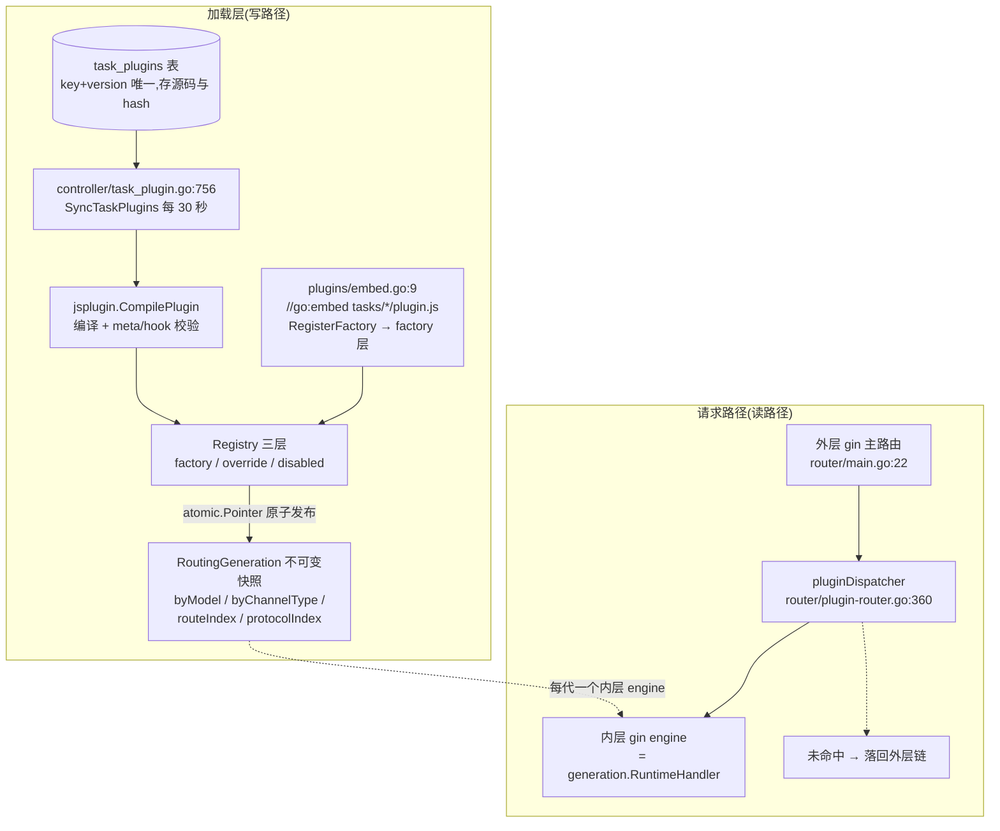
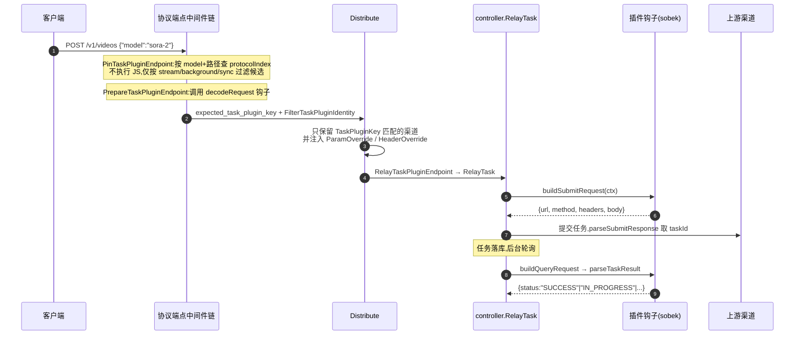

# 插件与高级自定义渠道:不写一行 Go 代码扩展网关

> 一句话定位:本篇讲 new-api 在 40+ 个 Go 适配器之外,留给「不改主程序」的三条扩展通道——嵌入式 JS 插件(`pkg/jsplugin`)、纯配置的高级自定义渠道(`advancedcustom`)、渠道级参数/请求头覆盖(`ParamOverride`/`HeaderOverride`);读完你能判断「一个新上游该走哪条路」,并看懂插件从上传到路由生效的完整链路。

## 🎯 本篇你将学到

- 🔌 插件如何在 Go 进程内跑一段不可信的 JS(grafana/sobek 沙箱的四大防线)
- 🗂️ 插件如何用一份 `meta` 清单声明模型、渠道类型、路由与协议,主机如何据此校验
- 🔀 双层 Gin 架构:插件路由热更换为何不会打断在途请求(门控响应写手)
- 🔗 插件「认领」模型后,如何通过 `expected_task_plugin_key` 与 `Distribute` 联动锁定渠道
- ⚙️ `advancedcustom` 用一条 JSON 路由声明完成协议转换,何时该用它而不是写 Go 适配器
- 💉 `ParamOverride` 注入的确切时机:在请求格式转换之后、发往上游之前

## 🧠 核心概念

🧩 **三条扩展路径,按「侵入度」递增**。new-api 默认靠 `relay/channel/` 下的 Go 适配器对接上游(详见 03-adaptor-system.md),但每加一个上游都要重新编译发布。于是项目开了三个「不改 Go 代码」的口子:

1. **JS 任务插件**:渠道类型 `61`(`constant/channel.go:61` 的 `ChannelTypeTaskPlugin`),一段 JS 源码存进数据库,负责「提交任务 + 解析响应 + 轮询状态」的私有协议;
2. **高级自定义渠道**:渠道类型 `58`(`constant/channel.go:58` 的 `ChannelTypeAdvancedCustom`),零代码,纯 JSON 配置路由;
3. **参数/头覆盖**:挂在任意渠道上的两个 `text` 字段(`model/channel.go:50-51`),对即将发出的请求体做最后一次注入。

对 Java 背景的读者,最贴切的类比是:JS 插件 ≈ 在 JVM 里嵌一个 GraalJS(或早年 Nashorn)引擎跑业务脚本;`meta` 清单 ≈ Spring 的 `BeanDefinition`(先声明、后校验、再装配);不可变路由代(`RoutingGeneration`)≈ 配置热刷新时的「整体替换快照」;门控写手 ≈ Servlet 的 `HttpServletResponseWrapper`(先缓冲、确认命中再放行)。

🔑 **一个关键认知**。这三条路不是并列的三套系统,而是同一条请求流水线上的三个不同「截面」:JS 插件改写「路由与协议入口」,`advancedcustom` 改写「URL 与格式映射」,`ParamOverride` 改写「最终请求体」。理解截面位置,就能判断一个新需求该改哪里。

## 🔍 源码剖析

### 1️⃣ 嵌入 JS 引擎:sobek 沙箱的四道防线

`pkg/jsplugin/engine.go` 用 grafana/sobek(Go 实现的 ES 引擎)执行插件。`Compile`(`engine.go:135`)在**上传时**就把危险语法拒之门外:

```go
// engine.go:101  禁 async/await/import(先剥掉注释与字符串再匹配)
var forbiddenSyntax = regexp.MustCompile(
    `(?m)(^|[^A-Za-z0-9_$])(async|await|import)([^A-Za-z0-9_$]|$)`)

// engine.go:140-145  ① import 一律拒绝  ② 关闭 SourceMap
resolve := func(_ interface{}, specifier string) (sobek.ModuleRecord, error) {
    return nil, fmt.Errorf("plugin imports are disabled: %s", specifier)
}
module, err := sobek.ParseModule(options.Key+".js", source, resolve,
    parser.WithDisableSourceMaps)
```

第二处注释值得抄进笔记:*插件源码不可信,不关 `sourceMappingURL` 的话,解析器会通过 `os.ReadFile` 读任意服务器文件*。运行期还有两道防线:`newRuntime`(`engine.go:476`)给每个实例注入固定工具集 `utils`(`utils.go:31`,含 `jwtSignHS256`、`hmacSHA256`、`volcSignV4` 等,插件不能碰网络与文件系统),并在每次调用时用 `time.AfterFunc + runtime.Interrupt` 强制 5 秒超时(`engine.go:357-359`,默认值见 `engine.go:17-20`)。第四道在错误出口:`HookError` 把异常消息里的控制字符替换为空格、截断到 512 字符(`engine.go:49-68`),且读取消息前再套一层 `recover` 防止二次 panic 打崩进程(`engine.go:70-78`)。

📐 **并发模型**:`Engine` 内是一个 `sync.Pool` 池化 runtime 实例 + 容量为 8 的 `semaphore`(`engine.go:112-121`)——即「编译一次、多实例复用、限流准入」,对应 Java 里「预编译模板 + 对象池 + 信号量限流」的组合。

### 2️⃣ `meta` 清单即契约

插件顶层导出一个 `meta` 对象(`registry.go:77-94`):`key`/`version`/`models`/`channelTypes`/`routes`/`protocols`/`usageSchema`。`CompilePlugin`(`registry.go:243`)逐项核对:必导出 `buildSubmitRequest`、`parseSubmitResponse`、`parseTaskResult`,批量模式还要 `buildBatchQueryRequest`/`parseBatchResult`,否则要 `buildQueryRequest`(`registry.go:261-266`);`listArtifacts` 与 `buildContentRequest` 必须成对出现(`registry.go:294-296`);声明了 `protocols` 就必须实现该协议要求的钩子,实现了却未声明也直接报错(`registry.go:422-426`)。校验发生在**装载期**而非请求期——和 Java 里「启动时校验 Bean 依赖」是同一个思路:把失败提前到最便宜的时点。

### 3️⃣ 三层注册表与不可变路由代

`Registry`(`registry.go:165-178`)分三层:`factory`(内置)、`override`(数据库上传,可覆盖同名 factory)、`disabledFactory`,外加总开关。内置插件来自 `plugins/embed.go:11-31` 的 `//go:embed tasks/*/plugin.js`,共 10 个(kling、sora、vidu、jimeng、google、alibaba、doubao、hailuo、sunoapi、vertex-ai)。数据库侧的 `TaskPlugin` 表以 `(key, version)` 唯一索引存源码与 `SourceHash`(`model/task_plugin.go:37-47`)。

同步由后台协程完成:`controller/task_plugin.go:756-760` 每 30 秒拉一次快照,源码哈希未变的直接复用已加载实例,变了才重新 `CompilePlugin`;编译失败则**保留旧实例继续服务**,最后通过 `ReplaceOverrides` 一次性原子发布。发布的产物是不可变的 `RoutingGeneration`(`routing.go:325-339`):内含 `byModel`、`byChannelType`、`routeIndex`、`protocolIndex` 等索引,构建期就报出模型冲突、路由冲突(`routing.go:855-947`)。读者读请求永远通过 `atomic.Pointer` 拿到某一代快照,不存在「读到半套新配置」的中间态——这正是 Java 里「Copy-on-Write 配置快照 + `AtomicReference` 发布」的写法。

### 4️⃣ 双层 Gin 与门控响应写手

插件路由没有注册进主 Gin,而是给**每一代快照单独 build 一个内层 Gin engine**(`router/plugin-router.go:259-300`)。主路由末尾挂一个 `pluginDispatcher`(`router/main.go:22`),其 `dispatch`(`plugin-router.go:360-395`)的流程是:取当前代 → 把 `pluginDispatchState` 塞进 `request.Context()` → 用 `gatedResponseWriter` 包住真实 Writer → 调内层 engine 的 `ServeHTTP`。命中则 `Abort` 返回;未命中则把请求恢复原样、继续走外层链。`gatedResponseWriter`(`plugin-router.go:397-482`)未激活时把 `Write`/`WriteHeader` 吞进私有缓冲,激活时一次性搬运——保证「试路由」绝不产生副作用。

内层路由的中间件链写死为:`pinRoute → TokenAuth → SystemPerformanceCheck → ModelRequestRateLimit → PrepareTaskPluginRoute → Distribute → controller.RelayTask`(`plugin-router.go:117-125`)。注意它复用了与主中继完全相同的认证与限流组件——插件路由不是旁门,而是同一套门禁的另一个入口。

### 5️⃣ 协议端点与 `Distribute` 的联动

除了插件自声明路由,主机还内置两个「共享协议」:`openai_responses`(`/v1/responses`)与 `openai_video`(`/v1/videos`、`/v1/videos/:task_id`、`/v1/videos/:task_id/content`,`routing.go:81-91`)。`SetTaskPluginProtocolRouter`(`task-plugin-protocol-router.go:13-25`)遍历协议表注册端点,每条操作硬编码中间件链(`task-plugin-protocol-router.go:27-52`)。

关键分工在两个中间件:`PinTaskPluginEndpoint`(`middleware/task_plugin.go:318`)**不执行任何插件代码**,只按「模型 + 路径」查 `protocolIndex`,并按 `stream`/`background`/`sync` 三种形态过滤候选实现(`task_plugin.go:382-417`);`PrepareTaskPluginEndpoint` 才调用插件的 `decodeRequest` 钩子解析请求,随后写下四个上下文键并追加身份过滤器(`task_plugin.go:703-706`):

```go
c.Set("expected_task_plugin_key", pinned.Plugin.Meta.Key)
c.Set("task_plugin_key", pinned.Plugin.Meta.Key)
service.AppendTaskPluginIdentityFilter(c, pinned.Plugin.Meta.Key)
```

`AppendTaskPluginIdentityFilter`(`service/channel_select.go:27-35`)往渠道约束里放一个 `FilterTaskPluginIdentity`;`Distribute` 会再补一次同样的过滤器(`middleware/distributor.go:42`),能力表筛选据此剔除不匹配的渠道(`model/ability.go:207-215`)。选定渠道后 `SetupContextForSelectedChannel` 还要**再验一次**身份,不符即拒绝并留下 `identity_mismatch` 决策日志(`distributor.go:596-607`);若选中的是类型 61 渠道,则从渠道 `Setting` 里的 `TaskPluginKey` 反推插件键(`distributor.go:641`)。最终 `GetTaskPlatform` 直接把插件 key 当作任务平台名(`relay/relay_adaptor.go:130`)——这解释了插件系统与 14 篇任务系统如何咬合:**插件 key 就是平台标识,任务表、轮询、结算全部复用**。

### 6️⃣ `advancedcustom`:把适配器降维成配置

`relay/channel/advancedcustom/adaptor.go` 是一个「元适配器」:内部组合了 openai、claude、gemini 三个真适配器。`resolve`(`adaptor.go:367-395`)用 `incomingRequestPath`(`adaptor.go:397`)加 `MatchPathForModel`(`relaykit/dto/channel_settings.go:191`)在 `Routes` 里挑一条路由;`buildRouteURL`(`adaptor.go:407-433`)做四件事:`applyUpstreamPathTemplate` 把 `{model}` 换成上游模型名(`adaptor.go:482-487`)、相对路径拼 `base_url` 并强制 `http/https`(`adaptor.go:435-457`)、`query` 型鉴权注入 URL、实时流时 `http→ws`。响应侧按 `Converter` 字段分派给对应真适配器(`adaptor.go:304-334`),转换器名单见 `channel_settings.go:117-124`。

🎓 **选型判据**:上游若兼容 OpenAI/Claude/Gemini 三种格式之一,只是 URL、鉴权方式、模型名不同——用 `advancedcustom`,零代码;上游是私有请求/响应结构或异步任务语义——要么写 Go 适配器(要动协议骨架),要么写 JS 插件(只动平台适配)。还有一条硬约束:配置了转换器的路由**拒绝透传请求体**(`adaptor.go:289-291`),否则未转换的 body 打到不匹配的上游会直接报错。

### 7️⃣ `ParamOverride`:转换之后的最后一针

时机很讲究。以文本中继为例,执行顺序是:`adaptor.Convert*Request` 转换格式 → `RemoveDisabledFields` 删除禁用字段 → **`ApplyParamOverrideWithRelayInfo`**(`relay/compatible_handler.go:165-173`),之后才打包发出。也就是说 `ParamOverride` 操作的是**上游格式**的请求体,路径名要按目标协议写(比如 OpenAI 格式写 `messages`,Claude 格式写 `system`)。

实现(`relay/common/override.go`)支持两种写法:旧式「顶层 key 直接 `set`」,以及新式 `operations` 数组(`override.go:63-72`),含 `set`/`delete`/`move`/`copy`/`regex_replace`/`prune_objects`/`set_header`/`return_error` 等 20 余种模式,可带条件与 `AND`/`OR` 逻辑,上下文变量由 `BuildParamOverrideContext` 提供(`override.go:2174-2235`:`user_group`、`upstream_model`、`retry`、`last_error`、`request_headers` 等)。安全边界有三处:敏感路径前缀(`model`、`messages`、`input`、`contents` 等,`override.go:30-49`)触发审计;`return_error` 允许管理员主动拦截请求(`override.go:1003-1009`);头类操作通过上下文里的 `header_override` 映射修改,最终由 `GetEffectiveHeaderOverride` 在 `SetupRequestHeader` 时生效(`override.go:553-561`)。另外注释里明确记载了一次性能重构:旧实现把整包 `unmarshal` 成 `map` 再 `marshal` 回去,大 base64 字段会放大数倍内存,现改为全程在 `[]byte` 上用 `sjson.SetBytes`(`override.go:791-819`)——这对处理图片/音频请求的网关是实打实的收益。

### 8️⃣ `RunCLI`:插件也走「先测再上」

`main.go:50-52` 拦截了 `plugin` 子命令:`new-api plugin lint <plugin.js>` 做编译期校验,还会对 `parseTaskResult` 里 `|| "IN_PROGRESS"` 这种「未知状态兜底成进行中」的反模式给出告警(`cli.go:62-67`);`new-api plugin test ... --fixture ...` 用 `ReplayFixture`(`pkg/jsplugin/fixture.go:39`)回放黄金用例,并允许固定 `unixNow` 让签名类钩子可复现(`fixture.go:49-52`)。注意插件并非作为独立进程运行——子命令只是把**同一套编译与校验逻辑**搬到 CI/终端里,生产期插件仍在网关进程内的引擎里跑。

## 📐 图解





## 🎓 设计精妙之处与可借鉴点

1. **校验前移到装载期,运行期只剩快查**。所有路由冲突、钩子缺失、协议误实现都在 `CompilePlugin` 与 generation 构建期报错,请求路径上只剩 `map` 查找。→ 借鉴:Java 项目里把「配置合法性」做成启动期断言,而不是每次请求 `if` 校验。
2. **不可变快照 + 原子指针实现无锁热更新**。插件换版、禁用都产出新 `RoutingGeneration`,读路径零锁;失败编译保留旧实例,服务不中断。→ 借鉴:用 `AtomicReference<List<Rule>>` 整体替换规则集,天然线程安全且可回滚。
3. **门控写手让「试路由」零副作用**。双层 Gin + `gatedResponseWriter` 使插件路由可以挂载在主路由之后参与匹配,失败即退回原链路,不污染响应头。→ 借鉴:Servlet 场景做「动态路由试验」时,用 `HttpServletResponseWrapper` 缓冲后再决定是否提交。
4. **把平台适配外置成数据**。插件源码存数据库、key 即平台名,任务系统的轮询/结算/日志零改动复用。→ 借鉴:策略类逻辑(签名、状态映射)若频繁变化,考虑「脚本 + 白名单工具函数 + 声明式清单」,而不是发版。
5. **对不可信代码的纵深防御成体系**。禁 `import`、禁 `async`、禁 SourceMap、5 秒超时 `Interrupt`、并发闸、错误消息清洗、协议输出的字节数与深度上限(`relay/plugin_protocol.go:27-55`)、插件产出的 `id`/`status`/`metadata` 一律由主机覆写(`plugin_protocol.go:562-601`)。→ 借鉴:凡是执行外部脚本或解析外部 JSON 的服务,都要同时做「资源上限 + 输出形状收窄 + 身份字段主机持有」三层。
6. **性能注释留下来**。`override.go:791-801` 把「为什么改成 `[]byte` 直写」的内存放大原因写成注释,后人不会改回去。→ 借鉴:关键性能决策写进代码注释而非只有提交记录。

## ⚠️ 常见坑与注意事项

- 🚫 **插件里不能用 `async/await`,不能 `import`**——上传即被 `forbiddenSyntax` 拒绝;所有钩子必须同步。
- 💉 **`ParamOverride` 作用在转换后的上游格式上**,不是客户端原始格式;路径写错层(如在 OpenAI 格式上写 `system`)不会报错,只是无效。涉及敏感路径(`model`、`messages`、`input` 等)会进入审计。
- 🔀 **`advancedcustom` 的转换器与透传请求体互斥**(`adaptor.go:289-291`),配置转换器后必须让它自己转换 body。
- 🧩 **模型冲突即装载失败**:两个插件声明同名模型(ASCII 折叠后相同)会被 `buildRoutingGenerationFromPlugins` 拒绝;类型 61 渠道的模型若只被某插件认领而该插件无可用渠道,`Distribute` 会返回 503 并说明真实原因。
- 🗄️ **插件源码是 `text` 列**,改动涉及表结构时必须按 `AGENTS.md` 跑齐 SQLite、MySQL、PostgreSQL 三库验证。
- 📦 **`relaykit/` 必须保持独立可构建**:`advancedcustom` 的转换器来自 relaykit,改它之后要 `cd relaykit && GOWORK=off go build ./...`。
- 🧪 **别在 `parseTaskResult` 里 `|| "IN_PROGRESS"` 兜底**——`lint` 会告警,未知状态应返回 `UNKNOWN`,否则失败任务会被当作进行中,轮询永不结束。

## 🏋️ 刻意练习:缺陷预演

> 先自己想 2 分钟,再看参考思路。

### 练习 1|沙箱的 5 秒超时与容量 8 的并发闸

- 🔴 **反模式预演**:`call()` 用 `time.AfterFunc + runtime.Interrupt` 强制打断插件钩子(`pkg/jsplugin/engine.go:358`),配合容量 8 的 `semaphore` 准入(`pkg/jsplugin/engine.go:173`)。假如你做代码评审时认为「插件源码是我们自己团队写的,不可能死循环」,把超时与并发闸一并删掉:某个 `buildSubmitRequest` 里藏着一句 `while (true) {}`(纯计算、没有任何 IO),管理员上传并发布后网关会发生什么?这个插件只服务 5% 的流量,为什么整个任务系统都瘫了?
- 🟡 **陷阱预判**:并发闸打满之后,普通任务钩子走的 `Call`(`pkg/jsplugin/engine.go:301`,准入超时传 0)与协议端点走的 `CallPathWithAdmissionTimeout`(`middleware/task_plugin.go:611`)的失败方式一样吗?哪个会堆积,哪个会明确报错?
- 💡 **参考思路**:sobek 是纯解释执行,死循环没有任何阻塞点可以让 Go 运行时「超时接管」,而 `goroutine` 又不能被强杀——`Interrupt` 是唯一能打断它的手段,所以超时必须在引擎层注入,任何外层 HTTP 超时都救不了。闸打满后,前者会在队列里阻塞到请求 `context` 取消为止(`goroutine` 持续堆积、内存上涨),后者在排队超过准入上限时得到 `ErrCallAdmissionTimeout`(`pkg/jsplugin/engine.go:436`)明确失败;容量 8 的意义就是把爆炸半径锁死在插件子系统,而不是拖垮全进程。

### 练习 2|门控响应写手:如果直接把 `c.Writer` 交出去

- 🔴 **反模式预演**:`pluginDispatcher.dispatch`(`router/plugin-router.go:360`)先用 `gatedResponseWriter`(`router/plugin-router.go:397`)包住真实 Writer,才调内层 engine 的 `ServeHTTP`。假设你觉得「多一层包装纯属浪费」,改成直接 `generation.RuntimeHandler().ServeHTTP(c.Writer, c.Request)`:一个未命中任何插件路由的 `POST /v1/videos`,内层 gin 没注册 `NoRoute` 处理器,默认 404 已把状态码和响应体写进真 Writer,而外层照常 `c.Next()` 走 `Distribute → RelayTask` 并成功。客户端收到什么?钱怎么算?
- 💡 **参考思路**:内层一写状态码,响应头就已提交,外层成功后的 200 再也写不进去——客户端拿到「HTTP 404 + 任务创建成功 JSON」的缝合响应,客户端重试逻辑判定失败而再次提交,任务却已创建、预扣费已发生,结果是重复任务与重复扣费。`activate()`(`router/plugin-router.go:412`)只在确认命中时才把缓冲一次性放行,连 `Hijack` 都在未激活时直接拒绝(`router/plugin-router.go:458`),否则实时流场景的连接会被内层抢走;本质是「试路由必须零副作用,提交响应之前必须先知道命中与否」。

### 练习 3|不可变路由代:如果换成一把读写锁 + 就地改 map

- 🔴 **反模式预演**:`Registry` 用 `atomic.Pointer[RoutingGeneration]` 发布快照(`pkg/jsplugin/registry.go:173`),读侧 `Generation()` 只做一次 `Load()`(`pkg/jsplugin/registry.go:591`)。假如你觉得「每换一版就重建全部索引太浪费」,改成一把 `sync.RWMutex` 保护同一个 `byModel`/`routeIndex`,同步协程每 30 秒就地增删条目、请求路径加读锁。会埋什么雷?提示:Go 对 map 并发读写的处置不是可恢复的 panic。
- 💡 **参考思路**:任何一处漏持读锁的访问都会触发运行时致命错误(不可 `recover`)——整个网关进程直接退出,所有渠道全灭,而不是某个插件请求报 5xx;而「私有副本上构建 + 冲突校验(`pkg/jsplugin/routing.go:888`、`pkg/jsplugin/routing.go:912`)→ 校验失败丢弃副本保留旧代(`pkg/jsplugin/registry.go:583`)→ 成功才原子 `Store`(`pkg/jsplugin/registry.go:734`)」把并发安全收敛成「一个指针有没有换对」一件事:读路径零锁,任何时刻要么完整旧代、要么完整新代,不存在读到半套新配置的中间态。

## 🔗 与其他模块的关系

- 14-task-system.md:插件是任务系统「平台」来源,`parseTaskResult` 映射的状态就是任务表状态机;轮询与结算链路详见该篇。
- 03-adaptor-system.md:`advancedcustom` 是适配器接口的「配置化实现」,对比 Go 适配器的完整生命周期。
- 04-relaykit-conversion.md:`Converter` 字段引用的正是 relaykit 的转换器注册表。
- 02-routing-middleware.md:插件路由复用 `TokenAuth`、`ModelRequestRateLimit`、`Distribute` 的细节。
- 08-channel-ability.md:`FilterTaskPluginIdentity` 如何参与能力表筛选与负载均衡。
- 06-billing-overview.md 与 07-billingexpr.md:`meta.usageSchema` 声明的用量字段(如 `seconds`、`size`)是插件计费的取数依据。

## 📚 小结

🧭 new-api 的扩展体系遵循一条清晰原则:**能配置的不写代码,能声明的不写逻辑,必须写逻辑的放进沙箱**。`advancedcustom` 用一条 JSON 路由覆盖「URL + 鉴权 + 格式映射」的多数场景;JS 插件把私有任务协议抽象成 7 个钩子 + 一份 `meta` 清单,由主机负责校验、调度、计费与对外协议;`ParamOverride` 则作为转换后的最后一针,满足运营侧的灵活注入。支撑这一切的工程骨架——装载期校验、不可变路由代、双层 Gin 门控、纵深沙箱——才是本篇真正值得搬回 Java 项目的部分:它们不依赖 Go,只依赖「把变化隔离在数据里、把不可信挡在边界外」的思路。
