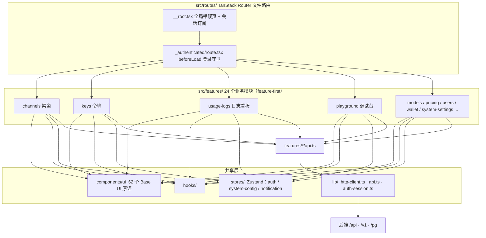
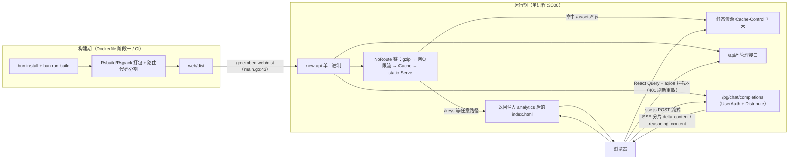

# 前端架构：React 19 管理台、i18n 工程化与单二进制交付

> 一句话定位：本篇拆解 `web/` 这套 React 19 管理台的目录组织、i18n 工程化、与后端的 REST/SSE 集成，以及「前端打进 Go 二进制」的交付模式。读完你应能独立看懂任何一个 `features/*` 模块，并能说清 `bun run build` 之后产物去了哪里。

## 🎯 本篇你将学到

- 技术栈选型：React 19 + Rsbuild（字节系构建器）+ Base UI + Tailwind，为什么不用 Vite/Webpack
- 「特性优先（feature-first）」目录组织：24 个 `features/*` 模块与 62 个 `components/ui` 原语的分层
- i18n 工程化：英文源串即 key（键）、7 语言各 5547 条、`bun run i18n:sync` 如何自动对齐
- API 层封装：axios 拦截器承担鉴权刷新/去重/统一报错，业务组件零感知
- 管理台核心页面各自消费哪些 `/api` 端点，playground 如何用 SSE 做流式渲染
- `go:embed web/dist` 单二进制交付：构建链路、缓存策略与对前端路由的约束

## 🧠 核心概念

new-api 是「一个进程提供两种服务」：`/v1/*` 是给程序调的 AI 中继接口，`/*` 则是一整套管理台单页应用（SPA）。前端不是独立部署的站点，而是**被嵌入后端**的静态资源——这是理解整个前端设计的钥匙。

用 Java 生态类比建立第一印象：

| new-api 前端概念 | ≈ Java 生态对应物 |
| --- | --- |
| Rsbuild / Rspack | ≈ Vite 的「开箱即用」+ Webpack 的打包语义，但由 Rust 引擎驱动（≈用 C2 编译器替代解释器） |
| TanStack Router 文件路由 | ≈ Spring MVC 的 `@RequestMapping`，但以目录结构声明，构建期生成类型安全路由表 |
| axios 拦截器 | ≈ Servlet Filter / `RestTemplate` 拦截器，横切关注点集中处理 |
| React Query 缓存 | ≈ 服务层加了一层带过期时间的本地读缓存 + 失效通知 |
| Zustand store | ≈ 应用级单例 Bean 里的可变状态（比 Redux 轻，比 Context 精确订阅） |
| i18next 平铺 JSON | ≈ Spring 的 `MessageSource` 属性文件，但 key 直接就是英文原文 |
| `go:embed` | ≈ fat jar 把 `static/` 资源打进包里，只是 Go 把这一步做成了编译期指令 |

## 🔍 源码剖析

### 1️⃣ 技术栈与构建配置

`web/package.json:26-87` 里依赖分三组：UI 原语 `@base-ui/react`、数据层 TanStack 四件套（query / router / table / virtual）、以及流式渲染所需的 `sse.js`、`stream-markdown-parser`、`shiki`。构建器是 `@rsbuild/core`（`web/package.json:89`），lint/format 用字节系的 `oxlint`/`oxfmt`，类型检查用 `tsgo`（TypeScript 原生预览版编译器），脚本一律走 Bun（`web/package.json:6-24`）。

`web/rsbuild.config.ts:29-54` 显式把 React、Base UI、TanStack 拆成三个 vendor 包（vendor chunk）：

```ts
// web/rsbuild.config.ts:31-45
splitChunks: {
  cacheGroups: {
    'vendor-react': { test: /node_modules[\\/](react|react-dom)[\\/]/, ... },
    'vendor-ui-primitives': { test: /node_modules[\\/](@base-ui|@radix-ui)[\\/]/, ... },
    'vendor-tanstack': { test: /node_modules[\\/]@tanstack[\\/]/, ... },
  },
},
```

**为什么选 Rsbuild 而非 Vite/Webpack？** 看 `web/rsbuild.config.ts:89-99` 就明白了——它暴露的是 rspack 插件接口，项目直接把 `tanstackRouter` 插件挂进去做路由代码分割；同时 `splitChunks` 用的是 Webpack 语义。也就是说它「兼容 Webpack 生态、接近 Vite 的速度」，对一个需要精细控制分包的中大型管理台来说迁移成本最低。开发期代理（`web/rsbuild.config.ts:19-24`）只转发四个前缀 `/api`、`/v1`、`/mj`、`/pg` 到后端，这与后端路由分组一一对应，是前后端契约的前半段。

### 2️⃣ 特性优先的目录组织

`web/src/features/` 下有 24 个业务模块（channels、keys、users、usage-logs、playground、wallet、pricing、system-settings……），每个模块内部结构高度一致，以渠道管理为例：

```
web/src/features/models/
├── api.ts          # 该模块所有后端调用
├── constants.ts    # 枚举、端点、消息 key
├── types.ts        # DTO 类型
├── hooks/ lib/     # 模块私有逻辑
├── section-registry.tsx
└── components/     # 表格列、对话框、抽屉……
```

这≈按限界上下文（bounded context）打包，而不是传统按技术分层（`controller/`、`service/` 各一堆）。跨模块共享的只有两处：`web/src/components/ui/`（62 个 Base UI 封装原语，由 `web/components.json:1-19` 的 shadcn 配置生成，样式是 `base-nova`）和 `web/src/lib/`（`http-client.ts`、`auth-session.ts`、`legacy-route.ts` 等约 40 个工具）。

**为什么这么设计？** 管理台的功能彼此独立、增删频繁。特性化结构让「删掉一个功能」变成删一个目录，「找一个功能的全部代码」不用跨五个目录翻。Java 项目里对应的是**按业务能力分包**（`com.x.billing`、`com.x.channel`），而非按层分包。

### 3️⃣ i18n 工程化：英文源串即 key

`web/src/i18n/config.ts:42-62` 是初始化核心：

```ts
// web/src/i18n/config.ts:42-53
i18n.use(LanguageDetector).use(initReactI18next).init({
  resources,                       // 7 个语言包全部静态 import，随主包一次加载
  fallbackLng: 'en',
  supportedLngs: ['en', 'zhCN', 'fr', 'ru', 'ja', 'vi', 'zhTW'],
  load: 'currentOnly',
  nsSeparator: false,              // key 里允许出现冒号（如 URL）
  ...
})
```

约定是 `t('English key')`——key 就是英文原文本身，`web/src/i18n/locales/zh.json` 里形如 `"? This action cannot be undone."`。**好处**是组件里不存在「key 与文案两张皮」：写代码时顺手写英文，缺翻译时自动回退英文，永远不会在界面上露出一个裸 key。代价是 7 个语言包都是 5547 条的大文件，且 key 一旦改文案就等于换 key（旧翻译失效）。

真正的工程化在同步脚本 `web/scripts/sync-i18n.mjs`：

- `web/scripts/sync-i18n.mjs:255-263` 自动选「叶子 key 最多」的语言做基线；
- `reorderLikeBase`（`web/scripts/sync-i18n.mjs:143-200`）按基线顺序重排每个语言包、缺失项用英文回填、多余项搬进 `locales/_extras/{lang}.extras.json`；
- `isLikelyUntranslated`（`web/scripts/sync-i18n.mjs:202-238`）识别「值与英文完全相同」的可疑未翻译项，输出到 `locales/_reports/`，并用一个品牌词白名单（`BRAND_AND_LITERAL_KEYS`，`web/scripts/sync-i18n.mjs:32-117`）排除 `OpenAI`、`Claude` 这类本就不该翻译的字符串。

这正是 7 个语言包能保持 5547 条键集合完全一致的原因。另有一个 `web/src/i18n/static-keys.ts` 手工登记「扫描不到的字面量」（常量里存的 key、拼接出来的 key），弥补 `t('...')` 正则提取的盲区。

### 4️⃣ API 层：一个 axios 实例扛下所有横切关注点

`web/src/lib/http-client.ts:44-50` 创建实例，`baseURL` 为空（同源部署）、`withCredentials: true`（带会话 Cookie）。三层增强：

- **GET 去重**（`web/src/lib/http-client.ts:52-69`）：用 `Map<key, Promise>` 按 `会话ID:URL?参数` 合并在途请求，≈对幂等读做请求级缓存合并；
- **响应拦截**（`web/src/lib/http-client.ts:80-142`）：`success === false` 的业务错误统一 `toast`；遇到 401 先尝试 `refreshAuthentication()`（打 `/api/user/auth/refresh`，见 `router/api-router.go:71`）并**重放原请求**，刷新失败才跳登录页；
- **请求拦截**（`web/src/lib/http-client.ts:144-150`）：自动附加 `Authorization: Bearer <accessToken>`。

`web/src/lib/api.ts:19-131` 再按领域封装出 `getSelf()`、`getStatus()`、`enable2FA()` 等具名函数，各 feature 自己的 `api.ts` 只依赖这一个实例。**可借鉴点**：把「令牌刷新 + 重放 + 统一错误提示」收敛在一个客户端拦截器里，业务代码完全不感知会话生命周期——Java 里等价于用 `Filter` + `RestTemplate` 拦截器做无感续签，而不是让每个 Controller 处理 401。

跨标签页的会话同步也有真实实现：`web/src/lib/auth-session-sync.ts:27` 用 `BroadcastChannel('new-api:auth-session')` 广播登录/登出事件，`web/src/routes/__root.tsx:61-69` 订阅到 `sid` 变化就 `queryClient.clear()` 清空缓存，避免 A 标签页登出后 B 标签页还带着旧数据。

### 5️⃣ 流式渲染：playground 的 SSE 消费

调试台不走 `/v1`（那里是令牌鉴权），而是走 `/pg/chat/completions`——`router/relay-router.go:63-70` 挂的是 `middleware.UserAuth()` + `Distribute()`，即**用网页登录态直接中继**，无需创建 API 令牌。

前端用 `sse.js` 而非原生 `EventSource`，因为原生只支持 GET 且不能带 body/自定义头：

```ts
// web/src/features/playground/hooks/use-stream-request.ts:194-199
createSource: (payload, headers) =>
  new SSE(API_ENDPOINTS.CHAT_COMPLETIONS, {   // '/pg/chat/completions'
    headers, method: 'POST',
    payload: JSON.stringify(payload),
  }) as StreamEventSource,
```

`createStreamRequestController`（`web/src/features/playground/hooks/use-stream-request.ts:59-181`）用一个 `generation` 计数器做竞态防护：每次 `send` 递增编号，旧的监听回调通过 `isCurrent()` 判断自己已过期就丢弃——这正是流式 UI 最容易出 bug 的地方（连续两次提问，第一次的迟到分片污染第二次的回答）。分片解析在 `web/src/features/playground/lib/streaming/stream-utils.ts:67-86`：拆出 `delta.reasoning_content`（推理）与 `delta.content`（正文）两类增量，`[DONE]` 结束（`stream-utils.ts:88`）。

需要说清的一点：**前端没有 WebSocket 消费**。`/v1/realtime` 的 WebSocket 是面向外部客户端的中继能力（`router/relay-router.go` 下有 `wsRouter`），管理台自身对任务进度等动态数据用的是 React Query 轮询，例如 `web/src/features/models/components/dialogs/view-logs-dialog.tsx:129` 的 `refetchInterval: open && autoRefresh ? 5000 : false`。

### 6️⃣ 管理台核心页面与端点对应

| 页面（feature） | 主要端点 | 说明 |
| --- | --- | --- |
| 渠道管理 `channels` | `/api/channel`、`/api/channel/search`、`/api/channel/batch` | `web/src/features/channels/api.ts` |
| 令牌管理 `keys` | `/api/token/`、`/api/token/batch`、`/api/token/{id}/key` | `web/src/features/keys/api.ts` |
| 日志看板 `usage-logs` | `/api/log`、`/api/log/stat`（管理端），`/api/log/self`（普通用户） | `web/src/features/usage-logs/api.ts:35-58` 的 `buildApiPath` 用 `isAdmin` 决定是否加 `/self` |
| 数据看板 `dashboard` | `/api/data` vs `/api/data/self`、`/api/data/flow`、`/api/uptime/status` | 图表用 `@visactor/react-vchart` |
| 模型广场 `pricing` | `/api/pricing` | `web/src/features/pricing/api.ts` |
| 系统设置 `system-settings` | `/api/option/`（GET/PUT） | 对应后端动态配置体系 |
| 插件 `task-plugins` | `/api/plugin/task`、`/api/plugin/task/marketplace/sources` | 与插件篇呼应 |

`usage-logs` 的 `buildApiPath` 是个好范式：**同一个页面组件，管理端与自助端只差一个 URL 后缀**，后端用两套路由 + 权限中间件区分，前端则用一个布尔参数收敛。

### 7️⃣ `go:embed` 单二进制交付

构建链路（`Dockerfile:1-27`）分两个阶段：`oven/bun` 阶段 `bun run build` 产出 `web/dist`；`golang:1.26-alpine` 阶段 `COPY --from=builder /build/web/dist ./web/dist` 后 `go build`。嵌入发生在 `main.go:43-47`：

```go
// main.go:43-47
//go:embed web/dist
var buildFS embed.FS

//go:embed web/dist/index.html
var indexPage []byte
```

装配在 `router/web-router.go:22-41` 的 `NoRoute` 兜底链里：

```go
// router/web-router.go:25-39
router.NoRoute(
    pluginDispatcher,
    middleware.RouteTag("web"),
    gzip.Gzip(gzip.DefaultCompression),
    middleware.GlobalWebRateLimit(),
    middleware.Cache(),               // "/" no-cache，静态资源 7 天
    static.Serve("/", frontendFS),
    func(c *gin.Context) {
        if strings.HasPrefix(c.Request.RequestURI, "/v1") ||
            strings.HasPrefix(c.Request.RequestURI, "/api") ||
            strings.HasPrefix(c.Request.RequestURI, "/assets") {
            controller.RelayNotFound(c)   // API 404 返回 JSON
            return
        }
        c.Header("Cache-Control", "no-cache")
        c.Data(http.StatusOK, "text/html; charset=utf-8", assets.IndexPage)
    },
)
```

两个细节很见功力：

1. `common/embed-file-system.go:26-33` 故意让 `Open("/")` 返回 `os.ErrNotExist`，使根路径「漏」到最后的兜底函数——因为 `indexPage` 在启动时已被 `InjectUmamiAnalytics()`/`InjectGoogleAnalytics()`（`main.go:253-296`）按环境变量注入了统计脚本占位符，直接命中 `static.Serve` 会拿到**未注入**的原始 HTML。
2. `middleware/cache.go:7-17` 对根路径发 `no-cache`（每次协商缓存，保证发版立即生效），对其余资源发 `max-age=604800`（强缓存一周）——配合 Rsbuild 产出的带哈希文件名，这正是「HTML 不缓存、资产长缓存」的标准策略。

**对前端路由的要求**由此而来：前端必须用 History 模式的 SPA 路由（任意路径都回退到 `index.html`），且**所有数据接口必须落在 `/api`、`/v1`、`/assets` 等受保护前缀下**，否则刷新一个 `/keys` 页面会拿到 HTML 而不是 404。老版本路径的兼容也做在前端：`web/src/lib/legacy-route.ts:21-36` 把 `/console/token` → `/keys`、`/console/log` → `/usage-logs` 逐一映射，避免升级后书签失效。

## 📐 图解

**图 1：前端代码分层（真实目录结构）**



**图 2：构建期与运行期——从 `bun run build` 到单二进制**



## 🎓 设计精妙之处与可借鉴点

**🔑 特性优先优于分层优先。** `features/<name>/` 把 API、类型、常量、组件、hooks 收进一个目录，24 个模块互不渗透；共享的只有 `components/ui` 与 `lib/`。*可借鉴*：Java 后端按业务能力分包（`billing/`、`channel/`）而非按层分包（全是 `service/`、`dao/`），删除或评审一个功能时只看一个包。

**🔑 英文源串即 key，用工具而不是纪律来保证一致性。** 省掉了 key 命名与文案两套维护，缺翻译自动回退英文；键集合一致性由 `sync-i18n.mjs` 机械保证，不靠人肉。*可借鉴*：凡是「多份文件必须保持同步」的场景（如多环境配置、多语言资源、枚举与文案），先写一个幂等同步脚本再谈规范。

**🔑 横切关注点全部下沉到客户端拦截器。** GET 去重、401 刷新重放、业务码统一报错、`BroadcastChannel` 跨标签页会话同步，业务组件一个都不用写。*可借鉴*：Java 里等价于把续签、限流重试、错误翻译放进 `Filter`/`ClientHttpRequestInterceptor`，让 Controller 只关心业务。

**🔑 单二进制消灭「前端版本漂移」。** `go:embed` 让 HTML/JS 与后端 API 在同一个编译产物里，天然不可能出现「前端调用了后端还没有的接口」。*可借鉴*：Spring Boot 同样可以把构建好的前端拷进 `src/main/resources/static` 打进 jar，效果等同；关键是**放弃前后端独立发版**换取运维简单与版本强一致。

**🔑 用 `NoRoute` 兜底而不是为每个路径注册路由。** SPA 回退、API 404 区分、gzip、限流、缓存头都挂在一条兜底链上，新增前端页面后端零改动。*可借鉴*：把「未知路径 → 静态资源 → index.html」做成显式兜底链，并让 API 前缀走 JSON 404，避免调试时拿到 HTML 造成误判。

## ⚠️ 常见坑与注意事项

- **全新克隆无法直接 `go build`**：`web/.gitignore` 与根 `.gitignore:14` 都忽略 `web/dist`，但 `//go:embed web/dist` 要求目录存在。必须先 `cd web && bun install && bun run build`（`makefile:15-18` 的 `build-web` 目标），否则嵌入指令直接报错。
- **`t('English key')` 的盲区**：动态拼接的 key、存在常量里的 key 扫描不到。`web/AGENTS.md:67-71` 明确要求：常量值只是 i18n key，展示必须经 `t(SUCCESS_MESSAGES.xxx)`（见 `web/src/features/channels/constants.ts:275-281`），并同步登记到 `web/src/i18n/static-keys.ts`。
- **语言码是非标准的 `zhCN`/`zhTW`**：浏览器上报的是 BCP-47 的 `zh-CN`，必须经 `convertDetectedLanguage` 映射（`web/src/i18n/languages.ts`、`web/src/i18n/config.ts:55-60`），否则中文浏览器会回退英文。
- **`i18n:sync` 会重排并回收孤儿键**：手工在某个语言包里加的、基线里没有的 key 会被搬进 `locales/_extras/`，不要手工编辑语言包。
- **开发代理前缀是白名单**：`/api`、`/v1`、`/mj`、`/pg`（`web/rsbuild.config.ts:19-24`）。后端新增对外前缀时若不同步，本地联调会 404 到前端路由。
- **生产构建会移除 `console.log`**（`web/rsbuild.config.ts:85-87`），且不可关闭第三方版权注释输出（`web/rsbuild.config.ts:80-83` 有专门注释警告开源合规风险）。
- **改动 TS/TSX 后必须跑 `bun run typecheck` 与涉及文件的 lint**（`web/AGENTS.md:78-79`）；新增测试必须放在模块的 `__tests__/` 目录，禁止与源码平铺（`web/AGENTS.md:150`）。
- **不要假设前端有长连接**：任务进度、实例状态都是 React Query 轮询，新增需要实时推送的页面时要么轮询，要么显式引入 WebSocket，并注意 `router/web-router.go:28` 的 gzip 中间件只作用于网页链路。

## 🏋️ 刻意练习:缺陷预演

> 先自己想 2 分钟,再看参考思路。

### 练习 1|401 无感续签的三层单飞

- 🔴 **反模式预演**:把 `refreshAuthentication` 的单飞(单飞,single-flight)拆掉——不留 `refreshPromise` 模块级单例(`web/src/lib/auth-session.ts:79`),也不要 `navigator.locks` 独占锁(`web/src/lib/auth-session.ts:316-332`),让每个 401 各自打一次刷新。一个看板页挂载时并发打出 20 个不同端点的 GET,而 access token 有效期只有 15 分钟(`service/auth_token.go:18`)——过期那一刻 20 个并发 `POST /api/user/auth/refresh` 同时打向挂着 `CriticalRateLimit()` 的路由(`router/api-router.go:71`)。服务端轮转是条件更新,只有一个赢家(`model/user_session.go:473-487`),其余 19 个撞 409 `AUTH_REFRESH_RACE`(`model/user_session.go:509-510` → `service/auth_session.go:449`);前端对 409 按 80/200/500 毫秒退避重试(`web/src/lib/auth-session.ts:78`、`web/src/lib/auth-session.ts:233-241`),三次用尽就 `runtime.clear(false)` → `out_of_sync` → 弹「Session expired」并跳登录页(`web/src/lib/http-client.ts:120-123`)。推演:用户明明在线,是谁把他踢下线的?被 429 拦下的那批为什么只是报错、不清登录态(`web/src/lib/auth-session.ts:257-263`)?
- 🟡 **陷阱预判**:刷新请求走的是独立的 `authClient` 实例(`web/src/lib/auth-session.ts:70-76`、`web/src/lib/auth-session.ts:279-285`),不是共享的 `api`。如果有人为了「统一客户端」把它换成 `api`,刷新接口自己返回 401 时会发生什么?哪一层拦截器会接手,这个循环最后靠什么才停下来?
- 💡 **参考思路**:踢下线的不是服务端,是前端自己——并发刷新把「1 次轮转」放大成「1 个赢家 + 19 个退避重试」,重试窗用尽就无差别清算登录态;被 429 拦下的那批归为 `transient_error`,原始请求直接抛错,但会话其实有效。单飞的本质不是省一次请求,而是把 N 个 401 收敛成 1 次轮转;服务端 30 秒重放宽限(`service/auth_token.go:21`)是给「标签页之间无法互斥」兜底的,不是给同标签页 20 连发兜底的(重试能成功,靠的是赢家响应重写了刷新 Cookie,`controller/auth_session.go:33`)。陷阱:换成 `api` 后,刷新接口自己的 401 会再次触发刷新,形成「401 → 刷新 → 401」死循环,最后只能靠 `CriticalRateLimit` 掐死——独立实例的意义就是把续签从「会失败的业务请求」里隔离出来。

### 练习 2|playground 流式的 generation 竞态防护

- 🔴 **反模式预演**:只保留「新请求关掉旧连接」(`previousSource?.close()`,`web/src/features/playground/hooks/use-stream-request.ts:81`),删掉所有 `generation !== requestGeneration` 检查(`web/src/features/playground/hooks/use-stream-request.ts:88`、`use-stream-request.ts:96`、`use-stream-request.ts:159`)。场景:token 剩不到 60 秒,`getFreshAuthHeaders` 要先去续签(`web/src/lib/auth-session.ts:421-431`),第一次 `send` 挂在 `await runtime.getHeaders()`(`web/src/features/playground/hooks/use-stream-request.ts:86`)上,用户这时连点第二次发送。推演两条 SSE 连接各自的命运:谁被 close、谁被覆盖、谁成了没人管的孤儿?后端为此多算了多少钱?用户按「停止」停掉的是哪一条?
- 🟡 **陷阱预判**:组件卸载时的清理只有 `useEffect` 里的 `dispose()`(`web/src/features/playground/hooks/use-stream-request.ts:222-228`)。如果有人觉得「React 会自己收拾」把它删掉,用户在流式输出中途点侧边栏跳走,这条连接会发生什么?前端还有任何手段关掉它吗?
- 💡 **参考思路**:挂起的那次 `send` 醒来后不再检查,直接 `createSource` 并把 `source` 覆盖成自己的连接(`web/src/features/playground/hooks/use-stream-request.ts:98-100`)——第二条流被孤儿化:监听器全部失效但连接还开着,而 `/pg/chat/completions` 是挂 `UserAuth()+Distribute()` 的真实计费中继(`router/relay-router.go:63-69`),整段 completion 照常扣费;`stop()` 只能关到 `source` 指向的那条。检查点必须放在每个 `await` 之后:丢弃旧事件只解决 UI 污染,「不再创建资源」才解决重复计费。删掉卸载清理则更隐蔽:流继续跑完并计费,回调还在往已卸载组件的 state 里写。

### 练习 3|SPA 兜底链的缓存策略与「修复」`Open("/")`

- 🔴 **反模式预演**:兜底函数里的那句 `c.Header("Cache-Control", "no-cache")`(`router/web-router.go:37`)看似重复——前面 `middleware.Cache()` 不是已经发过缓存头了吗(`middleware/cache.go:9-13`)?把它删掉,`/keys`、`/usage-logs` 这类 SPA 路由的 HTML 会带着 `max-age=604800` 进磁盘。推演一次发版后的 7 天:老用户磁盘里的旧 `index.html` 引用的 `/assets/index-<旧hash>.js` 在新二进制里还在吗?强缓存会回源协商吗?用户最后看到什么,有没有自愈手段?
- 🟡 **陷阱预判**:`common/embed-file-system.go:26-33` 故意让 `Open("/")` 返回 `os.ErrNotExist`,注释写明是为了让 index 走 NoRoute 兜底。新人把它当 bug「修复」,`/` 从此命中 `static.Serve`——拿到的 HTML 和兜底函数给的 `assets.IndexPage`(`router/web-router.go:38`)差在哪?`main.go` 启动时(`main.go:206-207`)替换的到底是哪个变量?
- 💡 **参考思路**:删掉那句 no-cache 后,旧 HTML 变成 7 天强缓存,它引用的旧哈希资产随旧产物一起从单二进制里消失 → 静态 404 → 白屏,强缓存不协商、无自愈,受害者是 7 天内回访的全部老用户——「HTML 不缓存、资产长缓存」这对策略缺一半就整体失效。陷阱:`main.go` 的注入只改写了 `indexPage` 变量(`main.go:270`、`main.go:293`),嵌入文件系统里的原始 `web/dist/index.html` 一个字节没动,直接命中 `static.Serve` 拿到的是未注入统计脚本的原稿,统计静默归零且没有任何报错。

## 🔗 与其他模块的关系

- 后端如何承接这些请求、中间件链的完整顺序，见 02-routing-middleware.md
- `/pg` 与 `/v1` 中继链路、适配器分发，见 03-adaptor-system.md 与 00-soul.md
- SSE 分片格式（`delta.content`、`[DONE]`）在后端如何生成，见 05-streaming.md
- `Authorization: Bearer` 与 `/api/user/auth/refresh` 的会话体系，见 09-auth-user.md
- 日志看板消费的 `/api/log`、`/api/log/stat` 与数据落库，见 12-logging-dashboard.md
- 系统设置页读写的 `/api/option/` 背后的动态配置，见 13-settings.md
- 渠道管理页操作的能力表与负载均衡，见 08-channel-ability.md
- 插件页对应的 `/api/plugin/task`，见 15-plugins.md

## 📚 小结

这套前端的三个关键决策：**Rsbuild 换取「Webpack 生态 + Vite 速度」**、**特性化目录换取可增删性**、**`go:embed` 换取部署极简与版本强一致**。i18n 则展示了「用工具保证一致性」的思路——英文源串即 key 降低维护成本，`i18n:sync` 脚本把 7 个语言包机械对齐。对 Java 学习者最有迁移价值的两件事：一是把横切关注点（鉴权刷新、去重、错误翻译）收敛进拦截器层而非散落在业务里；二是认识到「前后端同进程交付」在自部署场景下是比「前后端分离部署」更省心的选择。
