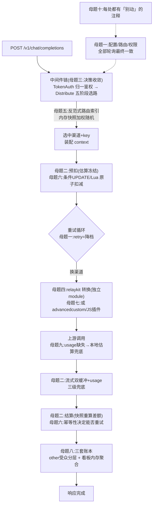

# 综合升华篇:new-api 的设计哲学与可迁移模式

> 一句话定位:这是整套文档的收束篇——不再按模块讲「它是什么」,而是横过来回答「这个项目反复出现的思考方式是什么」。十条设计母题、一张全景图、三个跨模块终极决策复盘。读完你应能把 new-api 当成一本「反向教材」:遇到同类问题,先翻它怎么选的。

## 🎯 本篇你将学到

- 十条贯穿 17 篇文档的设计母题,每条都标出它在各篇中的证据位置
- 这些设计**共同反对**的东西(反面模式清单)
- 三个跨模块的终极决策复盘(并发控制全景、扩展三级火箭、协调组件的「不引入」)
- 一条从「表层」走到「深层」的推荐阅读路径

## 🧠 十条设计母题

### 母题一|数据库是唯一事实源,轮询是唯一同步——并接受它的代价

new-api 对「多节点一致性」的统一回答朴素到令人不安:每个节点周期性全量拉库。配置(`SyncOptions`,13-settings.md)、渠道路由(`SyncChannelCache`,08/10)、casbin 策略(`StartPolicySync`,09)全部如此;连定时任务的分布式去重都是「任务行 + 条件更新抢锁 + TTL/3 心跳续租」(01/14 的 DB 租约)。全项目**没有**消息总线、没有配置中心、没有服务注册表。

**为什么**:私有化部署场景往往只有一个 MySQL 可用,引入 etcd/MQ 抬高的是每个用户的部署门槛;而「最终一致窗口 = `SYNC_FREQUENCY`(默认 60 秒)」对 AI 网关几乎无害——渠道路由本来就是分钟级语义。

**边界在哪**:资金与授权**不能等**。于是同一个人写了另一套东西:令牌缓存的写前栅栏(fence)、用户缓存的版本地板、任务的 CAS 状态机、预扣费的条件 UPDATE(10/09/14/06)。这条分界线值得刻在脑子里——**「配置类状态」接受轮询窗口,「资金类状态」用数据库原子性把窗口压到零**,中间不存在第三种态度。Java 迁移时同理:不要给「管理员改个限流阈值」上分布式事务,也不要给「扣费」用定时刷新的本地缓存。

### 母题二|先冻结,后清算——一切「事前不可知」的成本都用快照对冲

这是全项目最一致的资金纪律。计费:预扣(估算)→ 结算(快照重算差额)→ 退款(幂等)(06);表达式计费把表达式、版本号、分组倍率冻结进 `BillingSnapshot`,半年后升级 `v2:` 也不伤在途请求(07);异步任务在落库前预扣、`durable` 屏障保证「未落库必退款」(14);渠道 pin 让 remix 回到原渠道(14/08)。

反面是同样清醒的:「快照冻结」在紧急止血调价时是负债(错误价格作用于全部在途请求,07 的决策 1);预扣按 `max_tokens` 上限算,用户会看到「余额先降后回」(06 的决策 2)。**可迁移**:任何「受理时便宜、结算时昂贵且规则会变」的场景(风控规则、优惠券、营销价),都该在受理时落一张不可变快照——这是模式,不是技巧。

### 母题三|决策收敛一次,执行层零查询

一次请求的渠道路由决策只发生在一个地方(`Distribute`),决策产物(渠道、key、模型映射、参数覆盖、状态码映射……二十余项)由 `SetupContextForSelectedChannel` 一次性注入 context(`middleware/distributor.go:594`);此后 `TextHelper` → `Adaptor` 的整条执行链**一次数据库都不碰**(00/02/03)。重试是唯一的例外,而重试换渠道时也走同一套选择函数、只改 `retry` 参数(08)。

**为什么**:重试循环会把每请求的 DB 查询放大 N 倍;更重要的是,执行层纯函数化之后,「选路」可以被 pin/亲和/白名单任意改写而不触碰执行代码。**可迁移**:网关类系统的「路由决策点收敛」——决策与装配绑在中间件,执行层拿到的是一份完整语境,而不是一堆「待查询的 ID」。

### 母题四|把最纯的一层拆出去,并用测试守住边界

`relaykit` 只吃 DTO、吐 DTO,于是拆成独立 Go module,依赖只有 5 个第三方包;边界不是口头约定,而是 `TestRelaykitBoundary` 用 `go/parser` 逐文件检查 import,白名单为空且「只能缩小」(04)。宿主庞大的 `RelayInfo`(700+ 引用)通过 `convmeta.Meta` 窄接口向转换器暴露视图,注释钉死「只暴露协议状态,绝不暴露计费字段」。

**为什么**:协议转换是全项目最稳定、最少被业务污染的一层;让主模块的任何重构都编译不进它,比任何 code review 都可靠。**可迁移**:≈ Java 的 ArchUnit——「domain 不依赖 web」这类规则,写进 CI 的测试比写进 wiki 的架构图可靠一个数量级。代价也要认:`kitutil/json.go` 复制了一份 JSON 包装(04 的决策 1),公共工具要么复制、要么下沉第三个 module,没有免费午餐。

### 母题五|反范式展开物化「查询热路径」,重建时保留运行时

`Channel` 的逗号串(多模型 × 多分组)被展开成 `Ability` 三主键路由表——写时多花钱,读时从「全表 LIKE」变「索引等值」(08)。内存缓存不是简单 TTL,而是「全量重建 + 锁内整体替换 + 定时刷新」,且重建时**保留多 key 轮询游标**(08/10)——重建快照 ≠ 重置运行时。

**可迁移**:凡是「多值字段参与高频查询」的场景(标签、灰度分组、多租户路由),先建冗余展开表;凡是「重建型缓存」,必须列一份「哪些字段是运行时状态、不能被重建冲掉」的清单——`model/channel_cache.go` 的注释就是这么做的。

### 母题六|并发控制的工具箱按「成本」分层,而不是一把锤子

数一遍全项目的并发原语:Redis Lua 原子扣减(10/06)、数据库条件 UPDATE + `RowsAffected`(06/09/14)、`FOR UPDATE` 行锁(`lockForUpdate`,11)、CAS 状态机(14)、进程内读写锁 + 不可变快照(08/10)、版本号 + 栅栏(09/10)、乐观锁列(未采用但讨论过,08 决策 2)。每一处都按「冲突频率 × 临界区长度 × 三库兼容」选型,并把选型理由写进注释。

**两条具体纪律**:①「能不能重试」由底层操作的幂等性决定——钱包退款(`IncreaseUserQuota` 非幂等)绝不重试,订阅退款(有 `requestId` 幂等)才走 `refundWithRetry`(06);②状态回写用**列白名单**,禁止拿着旧快照 `Save` 整行(08/09 的绑定列白名单同理)。

### 母题七|扩展性三级火箭:写代码 → 改配置 → 跑脚本

同一个「接入新上游」的问题,项目给了三个层次:`Adaptor` 接口(写 Go,能力上限最高)、`advancedcustom`(纯 JSON 声明路由/协议转换,零代码)、JS 插件(sobek 沙箱跑用户脚本,负责任务协议)(03/15)。判据是「上游兼容三大协议之一吗」——是,走配置;私有协议,看是传输差异还是任务语义,分别落配置或脚本。配套工程骨架:装载期校验(`CompilePlugin`)、不可变路由代(`RoutingGeneration` + `atomic.Pointer`)、门控响应写手保证「试路由零副作用」(15)。

**可迁移**:「能配置的不写代码,能声明的不写逻辑,必须写逻辑的放进沙箱」——但每一级都要配沙箱四件套(白名单环境、超时中断、错误清洗、资源上限),07 的表达式计费(`expr.Env` 白名单 + AST 探针 + 冒烟测试)是同一哲学在定价域的翻版。

### 母题八|日志是三套账本,权限差异做进类型而不是散落判断

消费流水(`logs`)、看板预聚合(`quota_data`)、全量报文(`request_response_logs`)三张表三种命运;`other` 字段用私有 map + 角色化 `Set` 方法实现「写全量、读裁剪」,历史泄露字段进写入黑名单——「新代码想犯错都难」(12)。饱和审计(`admin_info.quota_saturation`)嵌进 `admin_info` 就自动获得「仅管理员可见」,零权限代码(06/12)。

**可迁移**:审计与权限的耦合点应该在**数据结构**(分层投影)而不是在每个接口手写字段过滤;以及「日志永远不能压垮主业务」——报文日志用容量 8 的信号量做非阻塞背压,满了就丢并告警(12)。

### 母题九|失败分级 + 降级而非报错

启动期:核心数据面 fail-fast(`FatalLog`),外围展示层 `SysError` 继续(01)。运行期:ClickHouse 日志库不支持请求/响应日志,就**主动关闭该功能**而不是报错(11/12);Redis 限流器失效选 fail-closed(拒绝服务优于失去保护,02);上游 usage 缺失就本地估算兜底并打标留痕(05)。每处降级都回答了同一个问题:**这个依赖坏了,核心职责还能不能履行**。

### 母题十|注释是给「未来踩坑的人」立的碑

全项目最有价值的注释不是解释「做什么」,而是警告「别动」:`// This will cause SSE not to work!!!`(main.go:200)、锁序约定「先放 `channelSyncLock` 再取 `updatePricingLock`,反序死锁」(10)、「TTL 是崩溃探测窗口,不是任务时限」(01)、「`Value()` 必须返回 string 否则 PG 下 22P02」(11)、「`||` 在 MySQL 默认是逻辑或」(11 的练习)、「单飞不是省一次请求,是把 N 个 401 收敛成 1 次轮转」(16)。踩过的坑固化成文字,是这个项目技术债控制得好的直接原因。

## 📐 图解:十条母题挂在一次请求上

## 🎓 反面模式清单:这些设计共同反对什么

| 反面模式 | new-api 的替代品 | 证据 |
|---|---|---|
| 每请求查库做路由决策 | 内存快照 + 决策收敛一次 | 08/02 |
| 拿旧快照 `save()` 整行回写 | 列白名单 + 条件 UPDATE | 08/09 |
| 「查了再改」的一次性凭证 | HMAC 落库 + 条件更新原子消费 | 09 |
| 把可变授权数据塞进 JWT | JWT 只当指针 + 版本号失效 | 09 |
| 权限过滤散落在每个接口 | 数据结构分层(写全量读裁剪) | 12 |
| 为多节点引入 MQ/配置中心 | 轮询 + 数据库原子性,分场景选边 | 01/10/13 |
| 组合爆炸的 if-else 协议转换 | 注册表 + 中间表示 + 枢纽多跳 | 04 |
| 架构约束写在 wiki | 约束写成 CI 测试 | 04 |
| 静默吞掉异常输入(NaN/溢出) | Strict/Checked 双变体 + 审计管道 | 06/07 |
| 加权随机的「权重 0 = 永不选中」 | +10 保底权重,显式回答零权重语义 | 08 |

## 🎯 终极决策复盘(跨模块,超出单篇视角)

### 决策一|并发控制全景:同一个「防超扣」,为什么用四种手段(岔路口:原子性放在哪一层)

**场景**:「用户余额不能被并发扣穿」这一个不变式,出现在令牌额度(Redis 哈希)、用户钱包(数据库行)、任务状态(多节点轮询)、看板计数(多节点 flush)四个地方,项目分别用了 Lua 原子扣减、条件 UPDATE、CAS 状态机、「数据库侧 `count = count + ?`」四种手段。

- 方案 A:全部用 `SELECT ... FOR UPDATE` 行锁,最直观。
- 方案 B:全部用乐观锁(版本列),无长事务。
- 方案 C:按数据所在层与冲突半径就地选型:缓存层的扣减用 Lua(单线程天然原子)、DB 行用条件 UPDATE、多节点状态推进用 CAS、聚合计数把加法下推到数据库。

**你来权衡**:A 在「扣减在缓存、真相在库」的混合架构里锁得住谁?B 的重试风暴在什么负载下出现?C 的四种手段各自的「失效模式」是什么,谁需要降级路径?

- 💡 **参考思路**:①作者选 C。四种手段共同点是「检查与变更一步完成」,差异在承载者:Lua 靠 Redis 单线程、条件 UPDATE 靠行级排他锁 + `RowsAffected`、CAS 靠唯一一次状态跃迁、聚合下推靠数据库原子自增。②A 的行锁在 Redis 主导预扣的架构里根本锁不到缓存,还得为 SQLite 特判(11 的 `lockForUpdate` 就是这个特判的产物);B 的版本列在高冲突余额行上会制造读-改-写风暴,且三库兼容要自己维护。③C 的代价是**失效模式不统一**:Lua 出错要降级到条件 UPDATE(`TryReserveUserQuota` 的完整降级链,10)、CAS 输了只能跳过不能重试(14 的练习 1)、聚合 flush 失败会静默丢一个窗口(12 的练习 1)——每种手段都要单独写降级与告警,这是「就地选型」税。反转条件:如果全项目只有一种存储(SQLite 单机),A 的直观性压倒一切;C 只在「多存储 × 多节点 × 三库兼容」三重约束下才值得。

### 决策二|扩展能力分布:为什么 40+ 适配器之后还要造配置层和脚本层(岔路口:开放封闭原则的工程化边界)

**场景**:接入新上游是高频需求。纯代码路线(每渠道一个 Go 适配器)已经把新增成本压到「实现 15 个方法」,但每次接入仍要发版、过三库验证、走发布流程;而运营侧的诉求是「今天下午就要接上某家 OpenAI 兼容站」。

- 方案 A:只有代码适配器,运营提需求、开发排期。
- 方案 B:只有配置(把所有上游差异都做成 JSON 字段)——`Channel` 表会膨胀出上百个开关列。
- 方案 C:三级并存:代码(私有协议/深度定制)、`advancedcustom` 配置(标准协议 + URL/鉴权/映射差异)、JS 插件(任务语义,主机沙箱内跑)。

**你来权衡**:C 的三级之间如何判界?JS 沙箱的「四大防线」(禁 import/async、5 秒中断、错误清洗、白名单工具集)挡住了哪类风险、挡不住哪类?什么信号出现时某一级应该退役(如 MJ 的裸实现)?

- 💡 **参考思路**:①作者选 C。判界落在「差异的维度」:传输与映射差异(URL、header、模型名)→ 配置;请求/响应结构差异 → 代码;异步任务语义差异 → 脚本(因为要频繁改协议但量小)。②沙箱挡住的是**资源与越权**(任意 IO、无限循环、进程逃逸),挡不住**业务作恶**(插件声明收 10 倍价、返回伪造 usage)——所以主机会覆写插件产出的身份字段、计费走主机侧 `usageSchema` 校验(15),信任边界放在「钱与身份主机持有」。③退役信号:`advancedcustom` 出现大量「配置 + 少量硬编码补丁」时,该写真正的适配器;MJ 那种绕开通用链的裸实现,在新任务平台全部插件化后已成孤岛——扩展层每长一级,就要为它的「迁移路径」负责。

### 决策三|「简单方案优先」的边界:什么时候轮询该升级成推送(岔路口:为一致性付多少钱)

**场景**:全项目用轮询解决了配置、路由、权限、任务调度四类同步,一致性窗口 60 秒。什么时候这个方案会失效,失效前有什么征兆?

- 方案 A:永远轮询——改不动就不改,靠文档告知用户「配置生效有延迟」。
- 方案 B:引入 Redis Pub/Sub 广播失效,保持零新组件。
- 方案 C:引入配置中心 + 服务注册,工业级方案。

**你来权衡**:A 的 60 秒窗口在「紧急封禁泄露令牌」场景意味着什么?现有代码用什么机制把这一类窗口单独压掉了?B 比 A 多了什么、丢什么?给出「从 A 升级」的触发清单。

- 💡 **参考思路**:①紧急封禁在令牌侧不靠轮询——写前栅栏 + 删除缓存让**写节点立即生效**,其余节点靠 60 秒轮询追平,真正的敞口是「其他节点的缓存 TTL 内」;而资金侧(预扣)因 Redis 是共享的,天然无窗口。这说明 A 并非「一刀切的慢」,而是**分数据的**:读多写少且可容忍延迟的走轮询,资金与授权走原子操作。②B 多了失效实时性,丢了「全量重建」的自愈能力(广播丢了就是丢了,没有下一个周期兜底),还要处理 Pub/Sub 与三库部署(没 Redis 的用户)的兼容——注意项目里 `RedisEnabled` 本就是可选的。③升级触发清单:一致性窗口造成过真实资损或安全事故、节点数大到全量轮询拖垮主库(几十节点 × 每 60 秒全表 SELECT)、出现「多节点写同一配置行」的冲突——三者都出现前,A 加上分数据分层的纪律是全局最优;这也解释了为什么这个 19 万行的项目始终没有引入配置中心。

## 🔗 推荐阅读路径

- **快速鸟瞰(1 小时)**:00-soul.md → 17-synthesis.md(本篇)→ 各篇「📐 图解」
- **走后端主线(1 天)**:00 → 02 → 08 → 03 → 04 → 05 → 06 → 07 → 14
- **走「资金安全」专题**:06 → 07 → 14 → 10(缓存预扣)→ 00 的决策 2
- **走「高可用与并发」专题**:08 → 10 → 11 → 01 → 14
- **走「扩展性」专题**:03 → 15 → 04 → 16
- 每篇末尾的「🏋️ 刻意练习」请**先自己想 2 分钟再看参考思路**——练习才是这套文档真正交付的东西,参考思路只是对照答案。

## 📚 小结

new-api 没有用任何「高级」架构:没有微服务、没有消息总线、没有配置中心、没有领域驱动设计的战术模式全套。它只有一条主线——**把 19 万行代码里每一类「不确定性」(费用未知、多节点不一致、上游协议漂移、并发竞态)都翻译成一个显式的数据结构或一次数据库原子操作**,然后用最少的组件(一个 Go 进程 + 一个数据库 + 可选 Redis)把它们串起来。对 Java 工程师,最值得带走的不是某个具体写法,而是这种「先回答代价、再决定复杂度」的朴素纪律:每引入一个组件、一层抽象、一次快照,都要能回答「它换来了什么、放弃了什么、什么时候会后悔」——这正是刻意练习层反复让你自己推演的原因。
