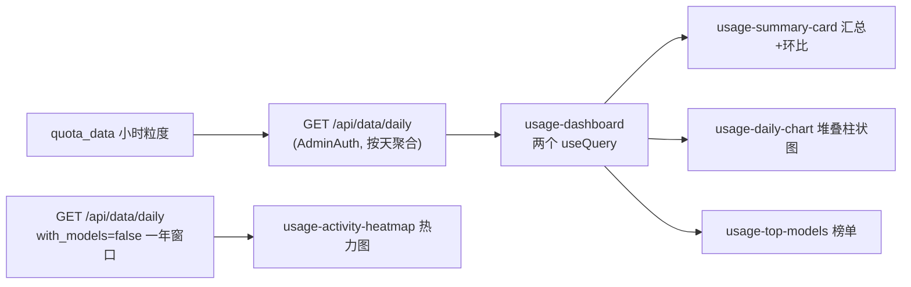

# TECH.md — 用量统计看板（管理员全站视角）

配套产品规格：`specs/02-用量统计看板/PRODUCT.md`（行为编号 B1–B31 在本文中以 B# 引用）。

## 上下文

**现状**
- 数据看板是 `/dashboard/$section` 单路由多 section（`web/src/routes/_authenticated/dashboard/$section.tsx:28` 的 `beforeLoad` 只校验 section 是否注册，不校验角色），section 定义在 `web/src/features/dashboard/section-registry.tsx`（`users` 已有 `adminOnly: true` 先例 + `ADMIN_ONLY_SECTIONS` 集合），页面壳在 `web/src/features/dashboard/index.tsx`（`SECTION_META` 于 179 行；`visibleSections` 于 248 行硬编码过滤 `users`）。
- 侧边栏菜单硬编码在 `web/src/hooks/use-sidebar-data.ts`（「数据看板」即 `t('Dashboard')` → `/dashboard/models`），菜单项支持 `requiredRole`（`System Info` 用 `ROLE.SUPER_ADMIN` 先例）；角色常量 `ROLE.ADMIN = 10`（`web/src/lib/roles.ts:24`）。
- 数据源 `quota_data` 表（`model/usedata.go:13`）：小时粒度聚合（`created_at` 对齐到小时），维度 `model_name` 等，指标 `count`（请求数）/`quota`（消费）/`token_used`（token）。无清理任务，数据长期保留。
- 现有查询 `model/usedata.go:173` `GetAllQuotaDates`（模型×小时粒度，无跨度限制）配合 `/api/data`（`router/api-router.go:320`，`AdminAuth`）。一年窗口按模型×小时返回过大，**不适合热力图**，需要新的按天聚合接口。
- 图表用 `@visactor/vchart`；`web/src/features/dashboard/lib/charts.ts:42` `getDashboardChartColors(domainLength)` 返回与 vchart 默认色板一致的颜色数组——柱状图与 Top models 共用即可保证同模型同色（B18）。
- 时间工具 `web/src/lib/time.ts`（dayjs 本地时区）；数字/金额格式化 `web/src/lib/format.ts`（`formatQuota`/`formatCompactNumber`/`formatNumber`）；金额显示遵循 `getCurrencyDisplay()`（`web/src/lib/currency`）。

**数据流（新增部分）**

## 建议的更改

### 1. 后端：按天聚合接口

**`model/usedata.go`** — 新增 `GetQuotaDataDaily(startTime, endTime, tzOffsetSec int64, groupByModel bool)`：
- SQL 核心表达式：`(created_at + ?) - ((created_at + ?) % 86400)` 作为 `created_at` 别名（本地日 0 点伪时间戳），`sum(count)/sum(quota)/sum(token_used)`，`groupByModel` 时追加 `model_name` 维度。
- 跨库兼容依据：`%` 取模与整数 `+` 在 SQLite / MySQL / PostgreSQL 均为标准整数运算，无方言函数；`GROUP BY` 使用完整表达式（不依赖别名），三库皆支持。参数一律走 GORM 占位符防注入；`tzOffsetSec` 在 controller 层钳制到 `±50400`（±14 小时）。
- 复用 `QuotaData` 结构返回（`created_at` 字段承载日起点伪时间戳），无 schema 变更、无迁移。

**`controller/usedata.go`** — 新增 `GetDailyQuotaDates(c *gin.Context)`：
- 参数：`start_timestamp`/`end_timestamp`（必填、合法范围校验，参照 `parseFlowQuotaTimeRange` 风格）、`tz_offset`（秒，缺省 0）、`with_models`（`true`/`false`，缺省 `false`）。
- 跨度上限：`with_models=true` 时 ≤ 190 天（柱状图 90 天 + 环比 90 天窗口）；`with_models=false` 时 ≤ 400 天（热力图一年）。超限返回错误（沿用现有中文报错惯例）。

**`router/api-router.go:320`** — `dataRoute.GET("/daily", middleware.AdminAuth(), controller.GetDailyQuotaDates)`。

> 环比（B8）不新增接口：前端把请求窗口向前扩一倍（`[start - span, end]`），一次请求后按 `created_at` 拆分当前/上一周期。

### 2. 前端：section 注册与入口

**`web/src/features/dashboard/section-registry.tsx`** — `DASHBOARD_SECTIONS` 追加 `{ id: 'usage', titleKey: 'Usage Analytics', adminOnly: true, build: () => null }`。`ADMIN_ONLY_SECTIONS` 集合与 `isDashboardSectionAdminOnly()` 放在新文件 `section-visibility.ts`（`.tsx` 中新增函数导出会触发 `react(only-export-components)` lint error，规则建议移到共享文件）。

**`web/src/routes/_authenticated/dashboard/$section.tsx`** — `beforeLoad` 增加角色守卫：`isDashboardSectionAdminOnly(params.section)` 且 `useAuthStore.getState().auth.user?.role < ROLE.ADMIN` 时重定向到默认 section（父布局 `_authenticated/route.tsx` 已保证 user 存在，此处理安全；无闪烁、不发多余请求）。

**`web/src/features/dashboard/index.tsx`**：
- `SECTION_META` 加 `usage: { titleKey: 'Usage Analytics' }`。
- `visibleSections` 过滤从硬编码 `users` 泛化为 `isDashboardSectionAdminOnly()`（对 `users` 行为不变）。
- 组件内 `useEffect` 保留同样的非管理员重定向（路由守卫之外的双保险）。
- 新增 `LazyUsageDashboard = lazy(...)` 与 `activeSection === 'usage'` 渲染分支（走现有 `FadeIn + Suspense` 模式）。

**`web/src/hooks/use-sidebar-data.ts`** — 「数据看板」项后插入 `{ title: t('Usage Analytics'), url: '/dashboard/usage', activeUrls: ['/dashboard/usage'], icon: ChartColumnBig（lucide）, requiredRole: ROLE.ADMIN }`（B1，B2 高亮由 `activeUrls` 保证）。

### 3. 前端：usage 模块（`web/src/features/dashboard/`）

**`types.ts`** — 新增 `UsageMetric = 'tokens' | 'spend' | 'requests'`、`USAGE_TIME_RANGE_DAYS = [7, 30, 90]`、`DailyUsageRow`（接口返回行）。

**`api.ts`** — 新增 `getDailyQuotaDates(params: { start_timestamp; end_timestamp; tz_offset; with_models })`。

**`components/usage/usage-dashboard.tsx`**（入口组件）：
- 状态：`rangeDays`（7 默认 / 30 / 90，B5）、`metric`（tokens 默认，B5）。
- 两个数据请求（独立加载、独立错误重试，B25/B26；`retry: 1` 补偿认证轮换的偶发竞态）：
  - 主查询：窗口 `[start - span, end]`，`with_models=true`，供汇总/柱状图/榜单/环比。
  - 热力图查询：近一年窗口，`with_models=false`。
- 布局：桌面双栏（左汇总+柱状图，右 Top models）、热力图整宽在下；窄屏单列（B9）。
- **时区口径（重要）**：后端返回的 `created_at` 是「本地日 0 点伪时间戳 = 真实时刻 + tz_offset」，
  在 `normalizeDailyRows`（queryFn 出口）统一减去 `tz_offset` 归一化为**真实本地日 0 点**，
  与页面内 `todayStart`/`rangeStart` 同口径；`lib/usage.ts` 的天序列/热力图/星期/月份
  全部基于该真实口径用 dayjs 本地方法取值。归一化后经 SQLite 实数据验证：
  伪时间戳 `1788566400`（北京 09-05 08:00）→ `1788537600` = 北京 09-05 00:00，逐日对齐。

**`lib/usage.ts`**（纯函数，全部可单测）：
- `splitPeriods(rows, spanSec)` → 拆分当前/上一周期。
- `summarize(rows, metric)` → 总量；`computeChange(current, previous)` → B8 的百分比/「新增」/`0%` 三态。
- `buildDailyModelSeries(rows, metric, topN=12)` → 天×模型矩阵，超出 topN 的模型合并为「其他」（B12）；返回模型列表、颜色下标（对齐 `getDashboardChartColors`）与 vchart values。
- `computeTopModels(rows, metric, limit=10)` → 榜单行（B15–B18）。
- `computeHeatmapStats(rows, metric)` → { total, avgDay=total/365, avgWeek=total/52, longestStreak }（B21 口径）。
- `computeHeatmapLevels(dailyValues)` → 按「有用量天数的四分位数」划 4 档（B20）。
- `buildHeatmapCells(rows, tzOffset)` → 53 周×7 格子数组（含空周补齐、今天对齐最后一列，B19）。

**组件**：
- `usage-summary-card.tsx`：时间范围 Select + 指标 Tabs + 大数字（`formatCompactNumber`，完整值 tooltip，B7）+ 环比徽标（B8）；消费用 `getCurrencyDisplay()`/`formatQuota` 口径（B6）。
- `usage-daily-chart.tsx`：vchart 堆叠柱状图（参照 `lib/charts.ts` 既有 `type:'bar' + stack:true + seriesField:'Model'` 写法与 `specified` 颜色 map），tooltip 按现有 `renderQuotaCompat` 风格定制（B10/B11）；空数据空状态（B14）。
- `usage-top-models.tsx`：纯 DOM 榜单 + 进度条（颜色取 `getDashboardChartColors` 与柱状图同色，B18）。
- `usage-activity-heatmap.tsx`：`grid grid-rows-7 grid-flow-col` 的 CSS grid 格子（371 个 div，GitHub 风格），月份/星期标签 + 「少…多」图例（B20）；悬浮 tooltip 复用 `components/ui/tooltip`；窄屏 `overflow-x-auto`（B23）；格子 `aria-label="日期 数值"`（B30）。

**i18n** — en/zh 手工补齐所有新 key（`Usage Analytics`、`Daily by model`、`Top models`、`vs prev period`、`Longest streak` 等），其余语言 `cd web && bun run i18n:sync`。⚠️ 不跑 `bun run format`（已知会重写全仓无关文件）；lint 仅对任务文件执行。

### 4. 并行化

后端（接口）与前端纯函数（`lib/usage.ts` + 测试）无依赖可并行；组件层依赖两者契约（`DailyUsageRow` 类型先行约定即可解耦）。适合两个代理并行，组件与入口由同一代理收尾。

## 测试和验证

**验证状态（2026-09-06）**

| 验证项 | 结果 |
| --- | --- |
| 1. model 层聚合测试（SQLite 内存库） | ✅ `go test ./model/ -run TestGetQuotaDataDaily` 4 个用例通过 |
| 2. controller 层参数校验测试 | ✅ `controller/usedata_test.go`：缺失参数/逆序区间/非法 tz_offset/双上限跨度/成功链路 |
| 2b. 后端构建 + vet | ✅ `go build ./...`、`go vet` 通过 |
| 3. 前端 lib 纯函数测试 | ✅ 20 个用例（环比/榜单/长尾合并/streak/四分位档位/热力图网格） |
| 4. 前端组件测试（热力图/榜单） | ✅ 8 个用例（骨架/错误重试/aria-label/空数据/进度条比值） |
| 5. `bun run typecheck` | ✅ 0 错误 |
| 6. 任务文件 oxlint | ✅ 0 error |
| 7. `bun run build` 生产构建 | ✅ 成功 |
| 8. 三库矩阵（MySQL / PostgreSQL） | ⚠️ **阻塞**：本机无 Docker daemon、无本地 MySQL/PostgreSQL 实例 |
| 9. dev server 人工走查 | ⚠️ 待有登录态与数据的部署环境执行 |

**三库验证说明**：SQLite 已用真实实例验证。MySQL 与 PostgreSQL 无法在本机运行（无 Docker、无本地安装），按 AGENTS.md 要求**不声称完整三库兼容**。兼容性依据（代码审查级，待实机复核）：天边界仅用整数 `+`/`%` 运算（三库通用，无日期函数/方言语法）；`GROUP BY` 为完整表达式（不依赖别名）；`sum(count) as count` 别名模式与现有已在三库运行的 `GetAllQuotaDates` 完全一致；无 schema 变更、无迁移。

**后端（Go，testify）**
1. `model` 层测试（SQLite 内存库，参照 `model/task_cas_test.go:84` 的 `quota_data` 造数方式）：`model/usedata_test.go` 覆盖按天×模型聚合、`tzOffset` 天边界偏移、`groupByModel=false` 合并、空表与时间范围过滤。
2. **三库矩阵（AGENTS.md 强制）**：见上表第 8 项阻塞说明。

**静态检查与构建**
7. `cd web && bun run typecheck`；对涉及文件跑 lint 并清零 error。
8. `bun run dev` 手动走查 B1–B31 清单并截图（含非管理员重定向、指标切换联动、窄屏布局）。

## 风险和缓解措施

- **`%`/`GROUP BY` 表达式的三库差异**：仅用整数四则与取模，不用任何日期函数/方言语法；三库矩阵验证兜底（验证项 3）。
- **一年×模型数行数过大**：`with_models=false` 通道返回 ≤ ~400 行；`with_models=true` 由后端强制 ≤ 190 天。
- **热力图远期空白**：`quota_data` 无清理任务，历史数据完整；但老部署若中途才开启 `DataExportEnabled`，开启前的格子如实为空，不视为缺陷（B28 快照语义）。
- **相邻行为回归**：`visibleSections` 泛化与非管理员重定向会波及 `users` section——由验证项 8 显式走查 `users` 旧行为（管理员可见、非管理员重定向而非 403 渲染）。
